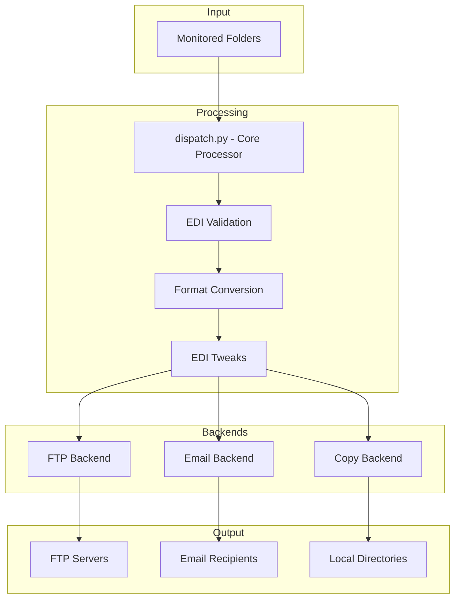
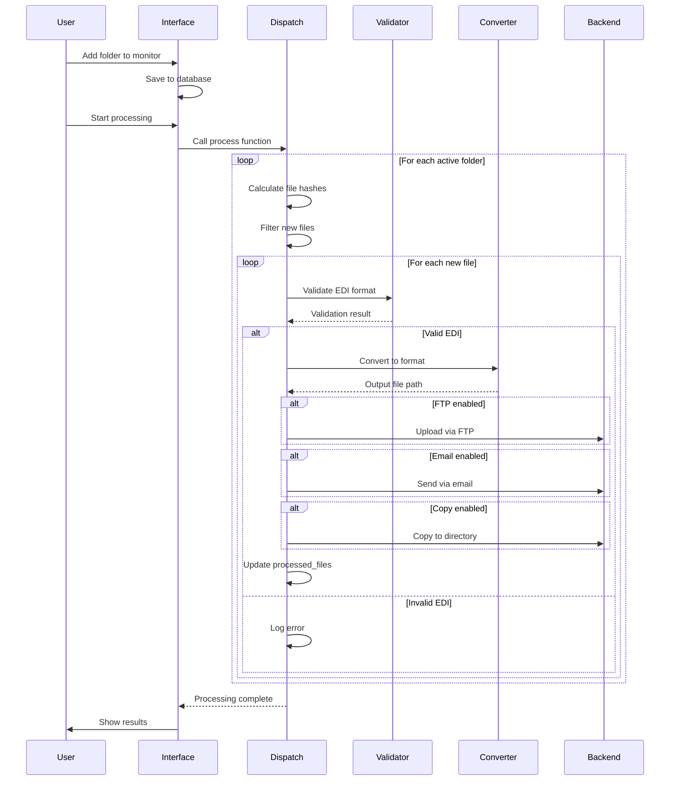

# Batch File Processor Documentation

Welcome to the Batch File Processor documentation. This is the main entry point for all project documentation.

## Quick Links

- **New to the project?** Start with the [Project Overview](#project-overview)
- **Need to configure EDI formats?** See the [EDI Format Guide](docs/user-guide/EDI_FORMAT_GUIDE.md)
- **Running tests?** Check the [Testing Guide](docs/testing/TESTING.md)
- **Database migration?** Read the [Migration Guide](docs/migrations/AUTOMATIC_MIGRATION_GUIDE.md)
- **Troubleshooting?** See [Launch Troubleshooting](docs/user-guide/LAUNCH_TROUBLESHOOTING.md)

## Documentation Structure

### User Guides (`docs/user-guide/`)
- [EDI Format Guide](docs/user-guide/EDI_FORMAT_GUIDE.md) - Understanding and configuring EDI formats
- [Quick Reference](docs/user-guide/QUICK_REFERENCE.md) - Fast lookup for common tasks
- [Launch Troubleshooting](docs/user-guide/LAUNCH_TROUBLESHOOTING.md) - Common startup issues

### Testing Documentation (`docs/testing/`)
- [Testing Guide](docs/testing/TESTING.md) - Comprehensive testing documentation
- [Testing Best Practices](docs/testing/TESTING_BEST_PRACTICES.md) - Guidelines for writing tests
- [Qt Testing Guide](docs/testing/QT_TESTING_GUIDE.md) - PyQt6/Qt widget testing
- [Corpus Testing Guide](docs/testing/CORPUS_TESTING_GUIDE.md) - Production EDI corpus testing
- [Convert Testing Quick Reference](docs/testing/CONVERT_TESTING_QUICK_REFERENCE.md) - Converter testing
- [Tests Documentation](docs/testing/TESTS_DOCUMENTATION.md) - Test suite overview
- [Testing Quick Reference](docs/testing/TESTING_QUICK_REFERENCE.md) - Quick testing commands

### Migration Guides (`docs/migrations/`)
- [Automatic Migration Guide](docs/migrations/AUTOMATIC_MIGRATION_GUIDE.md) - Database auto-upgrade system
- [Database Migration Guide](docs/migrations/DATABASE_MIGRATION_GUIDE.md) - Manual migration procedures
- [Migration Testing System](docs/migrations/MIGRATION_TESTING_SYSTEM.md) - Migration testing
- [Refactoring Backup Guide](docs/migrations/REFACTORING_BACKUP_GUIDE.md) - Backup strategies

### Architecture Documentation (`docs/architecture/`)
- [Backward Compatibility Report](docs/architecture/BACKWARD_COMPATIBILITY_REPORT.md) - Compatibility analysis
- [Database Column Read Map](docs/architecture/DATABASE_COLUMN_READ_MAP.md) - Database schema mapping

### API Documentation (`docs/api/`)
- [API Contract Review](docs/api/API_CONTRACT_REVIEW.md) - API specifications

### Design Documentation (`docs/`)
- [Architecture](docs/ARCHITECTURE.md) - System architecture
- [Data Flow](docs/DATA_FLOW.md) - Data flow diagrams
- [Processing Pipeline](docs/PROCESSING_PIPELINE.md) - Pipeline design
- [Plugin Architecture](docs/PLUGIN_ARCHITECTURE.md) - Plugin system
- [Database Design](docs/DATABASE_DESIGN.md) - Database schema and design
- [API Summary](docs/API_SUMMARY.md) - API overview

### Archive (`docs/archive/`)
Historical documents, session summaries, and implementation reports are archived here for reference.

---

## Table of Contents
- [Project Overview](#project-overview)
- [Architecture](#architecture)
- [Main Entry Points](#main-entry-points)
- [Supported Conversion Formats](#supported-conversion-formats)
- [Backend Systems](#backend-systems)
- [Database Operations](#database-operations)
- [EDI Processing](#edi-processing)
- [Utility Functions](#utility-functions)
- [Dependencies](#dependencies)
- [Configuration](#configuration)

---

## Project Overview

The **Batch File Processor** (also known as "Batch File Sender") is a Python-based desktop application designed to monitor folders, process EDI (Electronic Data Interchange) files, convert them to various formats, and deliver them through multiple backend channels.

### Primary Goals

1. **Folder Monitoring**: Watch configured directories for new EDI files
2. **File Processing**: Parse and validate EDI format files (A/B/C record structure)
3. **Format Conversion**: Transform EDI files into various business-specific formats
4. **Multi-Channel Delivery**: Send processed files via FTP, email, or local file copy
5. **Tracking & Logging**: Maintain database of processed files and generate run logs
6. **Error Handling**: Validate EDI files and report issues

### Key Features

- **GUI Interface**: Tkinter-based desktop application for configuration management
- **Multi-threading**: Parallel file processing using ThreadPoolExecutor and ProcessPoolExecutor
- **Database Storage**: SQLite database for configuration and processed file tracking
- **AS400 Integration**: ODBC connectivity for fetching additional invoice/customer data
- **EDI Splitting**: Split multi-invoice EDI files into individual invoices
- **Category Filtering**: Filter EDI records by item category

---

## Architecture



### Data Flow

1. **File Discovery**: Scanner monitors configured folders for new files
2. **Hash Comparison**: MD5 checksums determine if files are new or already processed
3. **EDI Validation**: Files validated against EDI format specifications
4. **Processing Pipeline**: Files may be split, tweaked, or converted based on configuration
5. **Backend Delivery**: Processed files sent via configured backend(s)
6. **Database Update**: Processed file records stored with checksums and destinations

---

## Main Entry Points

### interface.py

The primary GUI application providing:

- **Folder Management**: Add, edit, disable, and batch-add monitored folders
- **Configuration UI**: Set conversion formats, backend settings, and processing options
- **Database Management**: Create, migrate, and import configuration databases
- **Manual Processing**: Trigger single-folder or batch processing runs
- **Settings Configuration**: Global settings for email, AS400 connection, etc.

**Key Classes:**
- [`DatabaseObj`](interface.py:63) - Database connection wrapper with table accessors

**Key Functions:**
- [`add_folder()`](interface.py:261) - Add new folder with default settings
- [`batch_add_folders()`](interface.py:335) - Bulk add multiple directories
- [`send_single()`](interface.py:387) - Process a single folder

### dispatch.py

The core processing engine containing:

- **File Hashing**: Parallel MD5 checksum generation for change detection
- **Processing Pipeline**: Orchestrates validation, conversion, and delivery
- **Backend Dispatch**: Routes files to appropriate backend modules

**Key Functions:**
- [`process()`](dispatch.py:81) - Main processing loop for all active folders
- [`generate_file_hash()`](dispatch.py:37) - Calculate MD5 checksum with retry logic
- [`generate_match_lists()`](dispatch.py:23) - Build lookup structures for processed files

---

## Supported Conversion Formats

The processor supports converting EDI files to the following formats:

### Standard CSV (`convert_to_csv.py`)

Converts EDI to a standard CSV format with columns:
- UPC, Qty. Shipped, Cost, Suggested Retail, Description, Case Pack, Item Number

**Features:**
- Optional A record (header) and C record (charges) inclusion
- UPC check digit calculation
- Ampersand filtering in descriptions
- UPC override from AS400 lookup

### E-Store E-Invoice Generic (`convert_to_estore_einvoice_generic.py`)

Generates e-invoice CSV files for e-store integration with columns:
- Store #, Vendor OID, Invoice #, PO #, Invoice Date, Total Cost
- Detail lines with GTIN/PLU, Quantity, Unit Cost, Extended Cost

**Features:**
- Shipper/parent item handling
- Automatic PO number lookup from AS400
- Support for service charges (C records)

### E-Store E-Invoice (`convert_to_estore_einvoice.py`)

Similar to generic version with additional e-store specific customizations.

### Fintech (`convert_to_fintech.py`)

Generates CSV for fintech payment processing with columns:
- Division ID, Invoice Number, Invoice Date, Vendor Store ID
- Quantity, UOM, Item Number, UPC Pack/Case, Description, Unit Price

**Features:**
- Customer number lookup from AS400
- UOM description based on pack size

### Jolley Custom (`convert_to_jolley_custom.py`)

Generates custom invoice CSV with customer details:
- Full customer information (name, address, phone, email)
- Corporate customer handling
- Item details with UOM codes
- Formatted dates and totals

**Features:**
- Extensive AS400 customer data lookup
- Bill To / Ship To address formatting
- UOM code lookup from order history

### Scannerware (`convert_to_scannerware.py`)

Converts to fixed-width scannerware format preserving EDI structure:
- A records with padded vendor codes
- B records with fixed field positions
- C records for charges

**Features:**
- Configurable A record padding and append text
- Invoice date offset adjustment
- Optional .txt file extension forcing

### Scansheet Type A (`convert_to_scansheet_type_a.py`)

Generates Excel spreadsheets with embedded barcode images:
- UPC-A barcodes rendered as images
- Item details from AS400 order history
- Auto-sized columns

**Features:**
- Barcode generation using python-barcode
- Excel output with openpyxl
- Batch barcode processing with memory management

### Simplified CSV (`convert_to_simplified_csv.py`)

Minimal CSV output with configurable column order:
- UPC, Quantity, Cost, Description, Item Number

**Features:**
- Configurable column sort order
- Optional header row
- Optional item numbers and descriptions
- Retail UOM conversion

### Stewarts Custom (`convert_to_stewarts_custom.py`)

Custom invoice format for Stewarts with:
- Customer and corporate customer details
- Store number inclusion
- Invoice/Store/Item grid format

**Features:**
- Full customer lookup from AS400
- UOM code resolution
- Corporate customer fallback handling

### Yellowdog CSV (`convert_to_yellowdog_csv.py`)

Comprehensive CSV with customer context:
- Invoice Total, Description, Item Number, Cost, Quantity
- UOM Description, Invoice Date, Invoice Number
- Customer Name, PO Number, UPC

**Features:**
- Buffered writing with flush-to-CSV pattern
- Customer name and PO lookup
- UOM description from AS400

---

## Backend Systems

### Copy Backend (`copy_backend.py`)

Simple local file copy operations for testing or local delivery.

```python
def do(process_parameters, settings_dict, filename):
    # Copies file to process_parameters['copy_to_directory']
```

**Configuration:**
- `copy_to_directory` - Destination path for copied files

### Email Backend (`email_backend.py`)

Sends files as email attachments via SMTP.

```python
def do(process_parameters, settings, filename):
    # Sends file to process_parameters['email_to']
```

**Features:**
- MIME type detection
- TLS/STARTTLS support
- Configurable subject line with placeholders (%datetime%, %filename%)
- Multiple recipients (comma-separated)
- Retry logic (up to 10 attempts)

**Configuration:**
- `email_to` - Recipient address(es)
- `email_subject_line` - Custom subject template
- Global settings: `email_address`, `email_smtp_server`, `smtp_port`, `email_username`, `email_password`

### FTP Backend (`ftp_backend.py`)

Uploads files to FTP/FTPS servers.

```python
def do(process_parameters, settings_dict, filename):
    # Uploads to ftp_server/ftp_folder/filename
```

**Features:**
- Automatic TLS fallback (tries FTP_TLS first, then plain FTP)
- Configurable port
- Retry logic (up to 10 attempts)

**Configuration:**
- `ftp_server` - FTP server hostname
- `ftp_port` - FTP port (default: 21)
- `ftp_folder` - Remote directory path
- `ftp_username` - Authentication username
- `ftp_password` - Authentication password

---

## Database Operations

### Database Schema

The application uses SQLite with the following main tables:

#### `folders` Table
Stores per-folder configuration including:
- Folder path and alias
- Active status
- Conversion format selection
- Backend settings (copy, FTP, email)
- Processing options (EDI tweaks, splitting, filtering)

#### `processed_files` Table
Tracks all processed files:
- `file_name` - Original file path
- `file_checksum` - MD5 hash for deduplication
- `folder_id` - Reference to folder configuration
- `sent_date_time` - Processing timestamp
- `copy_destination`, `ftp_destination`, `email_destination` - Delivery targets
- `resend_flag` - Force reprocessing flag

#### `settings` Table
Global application settings:
- Email configuration
- AS400/ODBC connection settings
- Backup configuration

#### `administrative` Table
Default values and oversight settings:
- Default folder configuration template
- Prior directory selections

### create_database.py

Creates new database files with default schema:

```python
def do(database_version, database_path, config_folder, running_platform):
    # Creates fresh database with default settings
```

### database_import.py

GUI utility for importing folder configurations from another database:

```python
def import_interface(master_window, original_database_path, running_platform, backup_path, current_db_version):
    # Merges folder configurations from external database
```

---

## EDI Processing

### EDI File Format

The processor handles a custom EDI format with three record types:

#### A Record (Header)
```
Position 0:      "A" (record type)
Position 1-6:    Customer/Vendor code
Position 7-17:   Invoice number
Position 17-23:  Invoice date (MMDDYY)
Position 23-33:  Invoice total
```

#### B Record (Line Item)
```
Position 0:      "B" (record type)
Position 1-12:   UPC number
Position 12-37:  Description
Position 37-43:  Vendor item number
Position 43-49:  Unit cost
Position 49-51:  Combo code
Position 51-57:  Unit multiplier (pack size)
Position 57-62:  Quantity of units
Position 62-67:  Suggested retail price
Position 67-70:  Price multi pack
Position 70-76:  Parent item number
```

#### C Record (Charges)
```
Position 0:      "C" (record type)
Position 1-4:    Charge type
Position 4-29:   Description
Position 29-38:  Amount
```

### mtc_edi_validator.py

Validates EDI files for format compliance:

```python
def check(input_file) -> tuple[bool, int]:
    # Returns (is_valid, line_number_of_error)

def report_edi_issues(input_file) -> tuple[StringIO, bool, bool]:
    # Returns (error_log, has_errors, has_minor_errors)
```

**Validation Checks:**
- File starts with "A" record
- All lines are A, B, C, or empty
- B records have correct length (71 or 77 characters)
- UPC field contains valid data
- Detects suppressed/truncated UPCs
- Identifies missing pricing information

### edi_tweaks.py

Applies modifications to EDI files:

```python
def edi_tweak(edi_process, output_filename, settings_dict, parameters_dict, upc_dict):
    # Applies configured modifications and returns output path
```

**Available Tweaks:**
- **A Record Padding**: Pad customer/vendor field to specified length
- **A Record Append**: Add custom text (including PO number via %po_str%)
- **Invoice Date Offset**: Add/subtract days from invoice date
- **Custom Date Format**: Apply custom date formatting
- **UPC Check Digit**: Calculate and append check digits
- **UPC Override**: Replace UPCs from AS400 lookup
- **Retail UOM Conversion**: Convert costs to each-unit pricing
- **Split Prepaid Tax**: Separate prepaid and non-prepaid sales tax C records

---

## Utility Functions

### utils.py

Core utility functions used throughout the application:

#### EDI Parsing
```python
def capture_records(line) -> dict:
    # Parses EDI line into dictionary based on record type
```

#### Price Conversion
```python
def convert_to_price(value: str) -> str:
    # Converts "0012345" to "123.45"

def dac_str_int_to_int(dacstr: str) -> int:
    # Handles negative numbers in DAC format
```

#### Date Handling
```python
def datetime_from_invtime(invtime: str) -> datetime:
    # Parse MMDDYY format

def dactime_from_datetime(date_time: datetime) -> str:
    # Convert to DAC date format
```

#### UPC Processing
```python
def calc_check_digit(value) -> int:
    # Calculate UPC check digit

def convert_UPCE_to_UPCA(upce_value) -> str:
    # Convert UPC-E to UPC-A format
```

#### Category Filtering
```python
def filter_b_records_by_category(b_records, upc_dict, filter_categories, filter_mode):
    # Filter B records by item category

def filter_edi_file_by_category(input_file, output_file, upc_dict, filter_categories, filter_mode):
    # Filter entire EDI file by category
```

#### Invoice Detection
```python
def detect_invoice_is_credit(edi_process) -> bool:
    # Detect if invoice is a credit memo
```

#### Invoice Data Fetcher
```python
class invFetcher:
    def fetch_po(invoice_number) -> str
    def fetch_cust_name(invoice_number) -> str
    def fetch_cust_no(invoice_number) -> int
    def fetch_uom_desc(itemno, uommult, lineno, invno) -> str
```

---

## Dependencies

### Core Dependencies (from requirements.txt)

| Package | Purpose |
|---------|---------|
| `dataset` | Database abstraction layer |
| `SQLAlchemy` | ORM for database operations |
| `pyodbc` | ODBC connectivity for AS400 |
| `openpyxl` | Excel file generation |
| `python-barcode` | Barcode image generation |
| `Pillow` | Image processing for barcodes |
| `lxml` | XML processing |
| `thefuzz` | Fuzzy string matching for folder search |
| `Levenshtein` | String similarity calculations |
| `appdirs` | Cross-platform application directories |
| `python-dateutil` | Date parsing utilities |
| `requests` | HTTP requests |
| `premailer` | Email HTML processing |

### Standard Library Dependencies

- `tkinter` - GUI framework
- `sqlite3` (via dataset) - Database
- `ftplib` - FTP operations
- `smtplib` - Email sending
- `hashlib` - MD5 checksums
- `multiprocessing` - Parallel processing
- `concurrent.futures` - Thread/process pools
- `tempfile` - Temporary file handling
- `csv` - CSV file generation
- `decimal` - Precise decimal arithmetic

---

## Configuration

### Global Settings

Configured via the GUI and stored in the `settings` table:

| Setting | Description |
|---------|-------------|
| `enable_email` | Enable email backend globally |
| `email_address` | Sender email address |
| `email_username` | SMTP username |
| `email_password` | SMTP password |
| `email_smtp_server` | SMTP server hostname |
| `smtp_port` | SMTP port (default: 587) |
| `odbc_driver` | ODBC driver name for AS400 |
| `as400_address` | AS400 server address |
| `as400_username` | AS400 username |
| `as400_password` | AS400 password |

### Per-Folder Settings

Each monitored folder has individual settings:

| Setting | Description |
|---------|-------------|
| `folder_name` | Path to monitored folder |
| `alias` | Display name |
| `folder_is_active` | Enable/disable monitoring |
| `convert_to_format` | Output format selection |
| `process_edi` | Enable EDI conversion |
| `tweak_edi` | Apply EDI tweaks |
| `split_edi` | Split multi-invoice files |
| `process_backend_copy` | Enable copy backend |
| `process_backend_ftp` | Enable FTP backend |
| `process_backend_email` | Enable email backend |

### Database Location

The configuration database is stored in:
- **Linux/macOS**: `~/.local/share/Batch File Sender/folders.db`
- **Windows**: `%APPDATA%\Batch File Sender\folders.db`

---

## Error Handling

### Retry Logic

Most I/O operations implement exponential backoff retry:
- File reading: Up to 5 retries
- Backend operations: Up to 10 retries
- Database operations: Single attempt with error logging

### Error Logging

- **Critical errors**: Written to `critical_error.log`
- **Processing errors**: Stored in per-folder error logs in errors folder
- **Run logs**: Complete processing history in logs directory

### EDI Validation Errors

The validator distinguishes between:
- **Major errors**: Invalid file structure, prevents processing
- **Minor errors**: Blank/truncated UPCs, missing pricing (warnings)

---

## Workflow Example



---

## Version Information

- **Application Name**: Batch File Sender
- **Current Database Version**: 33
- **Primary Branch**: Master
