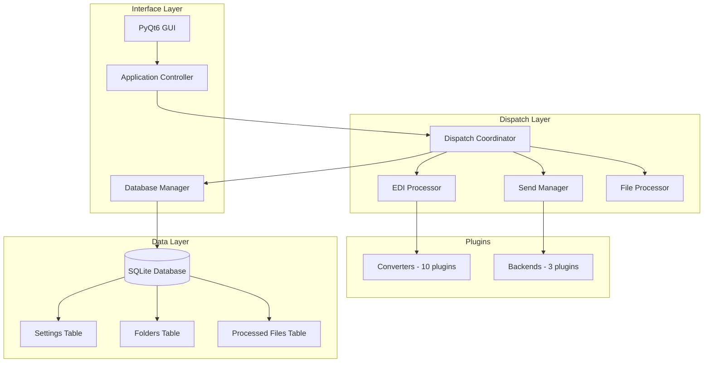

# Architecture Overview

**Generated:** 2026-01-30  
**Commit:** c2898be44  
**Branch:** cleanup-refactoring

## 1. System Overview

Batch File Processor is a PyQt6-based GUI application for processing EDI/batch files through a pluggable converter and send backend architecture. The system handles the complete pipeline from file discovery through EDI parsing, format conversion, and delivery.

### 1.1 Primary Goals

- **Batch Processing**: Process multiple folders containing EDI files automatically
- **Format Conversion**: Convert EDI files to various output formats via plugins
- **Multi-Destination Delivery**: Send processed files via FTP, Email, or local copy
- **Plugin Extensibility**: Add new converters and backends without modifying core code
- **Data Persistence**: Track processed files, folder configurations, and settings

### 1.2 Core Processing Pipeline

```
Input Files → Discovery → Validation → EDI Processing → Conversion → Send → Tracking
```

## 2. High-Level Architecture



## 3. Technology Stack

| Component | Technology | Purpose |
|-----------|------------|---------|
| GUI Framework | PyQt6 | Desktop application interface |
| Database | SQLite | Local data persistence |
| Database Access | sqlite3 + custom wrapper | ORM-like API |
| EDI Parsing | Custom utilities | EDI format handling |
| Testing | pytest + pytest-qt | 1600+ tests |
| Build | setup.py + pyproject.toml | Package management |

### Python Version Requirements

- **Minimum:** 3.11
- **Maximum:** 3.13

## 4. Directory Structure

```
batch-file-processor/
├── interface/          # PyQt6 GUI implementation
│   ├── ui/            # UI components (dialogs, widgets, windows)
│   ├── database/      # Database access layer
│   ├── models/        # Data models
│   ├── operations/    # Business operations
│   └── utils/         # UI utilities (validators, styling)
│
├── dispatch/          # Core processing logic
│   ├── coordinator.py # Main orchestration
│   ├── edi_processor.py # EDI parsing and conversion
│   ├── send_manager.py # Backend file sending
│   ├── file_processor.py # File discovery and filtering
│   ├── edi_validator.py # EDI validation
│   ├── error_handler.py # Error logging
│   └── db_manager.py  # Database operations for dispatch
│
├── core/database/     # Framework-agnostic database layer
│   ├── connection.py  # Database connection wrapper
│   ├── manager.py     # Database manager with migrations
│   └── schema.py      # Schema creation
│
├── convert_to_*.py    # Converter plugins (10 at root)
├── *_backend.py       # Send backend plugins (3 at root)
├── utils.py           # Cross-cutting EDI utilities
├── edi_format_parser.py # EDI format definitions
├── create_database.py # Initial schema creation
├── folders_database_migrator.py # Sequential migrations v5-v40
│
└── tests/             # 1600+ tests
```

## 5. Key Design Decisions

### 5.1 Plugin Architecture

**Decision:** Filesystem-based plugin discovery with naming conventions

**Rationale:**
- No complex plugin registration required
- New plugins added by dropping files in place
- Clear naming convention: `convert_to_*.py` and `*_backend.py`

**Implementation:**
```python
# Converter discovery
module_name = "convert_to_" + format.lower().replace(" ", "_")
module = importlib.import_module(module_name)

# Backend discovery
module_name = f"{backend_name}_backend"
backend = importlib.import_module(module_name)
```

### 5.2 Database Layer Separation

**Decision:** Framework-agnostic database layer (core/database/) with Qt-agnostic wrapper

**Rationale:**
- Test business logic without Qt dependencies
- Clean separation between UI and data access
- Reusable across different interface implementations

**Key Components:**
- [`Table`](core/database/connection.py:12): Dataset-like API wrapper
- [`DatabaseConnection`](core/database/connection.py:132): Connection manager
- [`DatabaseManager`](core/database/manager.py:16): Full manager with migrations

### 5.3 Three-Layer Signal Propagation

**Decision:** UI components use signals to communicate through layers

**Pattern:**
1. **Widgets** emit local signals
2. **MainWindow** re-emits as window-level signals
3. **ApplicationController** connects to business logic

**Example:**
```python
# Widget layer
class ButtonPanel(QWidget):
    process_clicked = Signal()
    
# MainWindow layer  
class MainWindow(QMainWindow):
    process_directories_requested = Signal()
    
# Application controller
class ApplicationController:
    def _setup_connections(self):
        self._main_window.process_directories_requested.connect(
            self.process_directories
        )
```

### 5.4 Sequential Database Migrations

**Decision:** Version-based migrations with automatic backups

**Rationale:**
- SQLite doesn't support column deletion
- Sequential versions prevent migration conflicts
- Automatic backups prevent data loss

**Process:**
1. Check current version in `version` table
2. Apply migrations sequentially from current to target
3. Create backup before each migration
4. Validate OS compatibility

## 6. Cross-Cutting Concerns

### Widely-Used Modules

| Module | Purpose | Usage |
|--------|---------|-------|
| [`utils.py`](utils.py:1) | EDI parsing, UPC helpers, date/price conversions | All converters, dispatch |
| [`convert_base.py`](convert_base.py:1) | BaseConverter, CSVConverter | All converter plugins |
| [`send_base.py`](send_base.py:1) | BaseSendBackend | All send backends |
| [`plugin_config.py`](plugin_config.py:1) | PluginConfigMixin, PluginRegistry | Plugin configuration |
| [`record_error.py`](record_error.py:1) | Error logging/recording | Error handling |

### Reuse Patterns

- **Template Method:** Base classes define algorithm structure
- **Wrapper Functions:** `create_edi_convert_wrapper()`, `create_send_wrapper()`
- **Strategy Pattern:** Configurable converters and backends

## 7. Complexity Hotspots

Files requiring special attention due to size or complexity:

| File | Lines | Concern |
|------|-------|---------|
| [`folders_database_migrator.py`](folders_database_migrator.py:1) | 896 | Long migration script, many branches |
| [`dispatch/coordinator.py`](dispatch/coordinator.py:50) | 893 | Orchestration, mixes concerns |
| [`interface/ui/dialogs/edit_folder_dialog.py`](interface/ui/dialogs/edit_folder_dialog.py:1) | 730 | Dialog builder |
| [`interface/operations/processing.py`](interface/operations/processing.py:1) | 625 | Processing orchestration |
| [`convert_base.py`](convert_base.py:1) | 607 | Converter base + helpers |
| [`utils.py`](utils.py:1) | 582 | Grab-bag utilities |
| [`dispatch.py`](dispatch.py:1) | 569 | Legacy dispatch, depth 100 |

## 8. Entry Points

### GUI Application
```bash
./run.sh                    # Run with GUI
./run.sh -a                 # Run in automatic/headless mode
```

### Test Suite
```bash
./run_tests.sh              # Full test suite with coverage
pytest -m smoke             # Quick smoke tests
```

## 9. Build and Deployment

### No CI Configured
- No GitHub Actions or GitLab CI
- Local automation via shell scripts

### Docker Support
- Dockerfile present for devcontainer
- Installs ibm-iaccess .deb package
- Uses `--break-system-packages` flag

### Environment
```bash
# Virtual environment required
source .venv/bin/activate

# Install dependencies
pip install -r requirements.txt
```

## 10. Current State

### Version Information
- **Database Schema Version:** 40
- **Supported Migration Range:** v5-v40
- **Application Version:** 1.0.0

### Test Coverage
- **Total Tests:** 1600+
- **Smoke Tests:** ~0.2s execution
- **Core Integration:** ~7s execution
- **Markers:** smoke, unit, integration, qt, convert_backend, parity, db

## 11. Architectural Trade-offs

| Trade-off | Decision | Impact |
|-----------|----------|--------|
| Plugin Discovery | Filesystem glob | Simple, but requires naming conventions |
| Database | SQLite | Portable, but no column deletion |
| GUI Framework | PyQt6 | Powerful, but complex for testing |
| State Management | Global + Database | Simple, but tight coupling in places |
| Legacy Code | Mixed old/new | Technical debt, but gradual refactoring |

## 12. Future Considerations

1. **Utils Module Split:** `utils.py` has 582 lines covering multiple domains
2. **Dispatch Refactoring:** `dispatch/coordinator.py` mixes concerns
3. **CI/CD Pipeline:** No automated testing on commits
4. **Plugin Registry:** Could be enhanced for dynamic discovery
5. **Async Processing:** ThreadPoolExecutor used, but could use async/await
