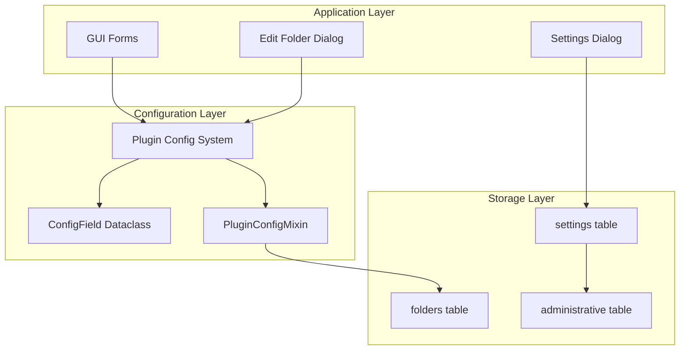
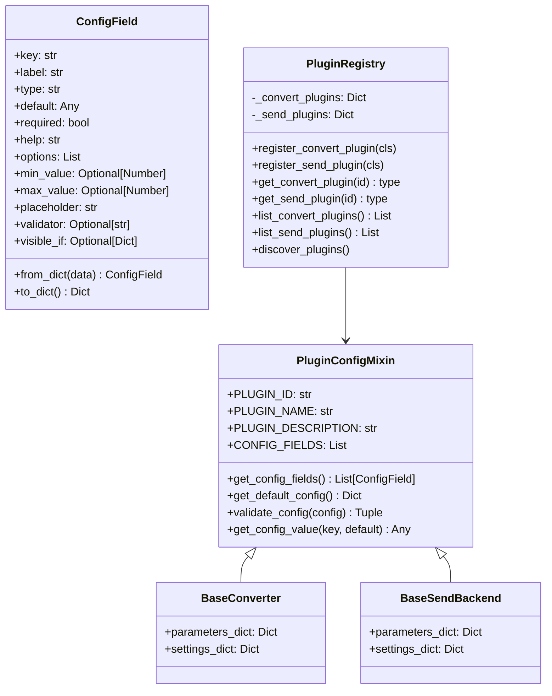
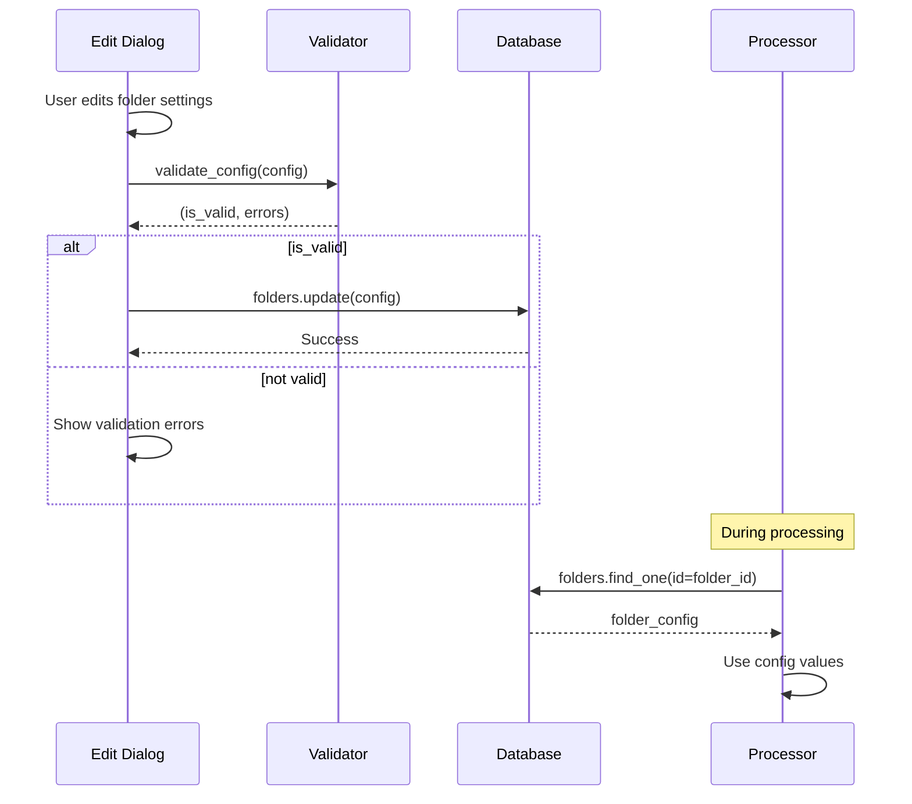

# Configuration Design Document

**Generated:** 2026-02-02  
**Commit:** c2898be44  
**Branch:** cleanup-refactoring

## 1. Overview

This document describes the configuration system architecture, including global settings, folder configuration, and plugin configuration fields.

## 2. Configuration Layers



## 3. Global Settings

### 3.1 Settings Table Schema

Global application settings stored in the `settings` table:

| Column | Type | Default | Description |
|--------|------|---------|-------------|
| `enable_email` | INTEGER | 0 | Enable email sending functionality |
| `email_address` | TEXT | "" | Sender email address |
| `email_username` | TEXT | "" | SMTP login username |
| `email_password` | TEXT | "" | SMTP login password |
| `email_smtp_server` | TEXT | "smtp.gmail.com" | SMTP server hostname |
| `smtp_port` | INTEGER | 587 | SMTP server port |
| `backup_counter` | INTEGER | 0 | Current backup count |
| `backup_counter_maximum` | INTEGER | 200 | Maximum backups before cleanup |
| `enable_interval_backups` | INTEGER | 1 | Enable periodic database backups |
| `odbc_driver` | TEXT | "Select ODBC Driver..." | AS/400 ODBC driver selection |
| `as400_address` | TEXT | "" | AS/400 server address |
| `as400_username` | TEXT | "" | AS/400 login username |
| `as400_password` | TEXT | "" | AS/400 login password |
| `created_at` | TEXT | (timestamp) | Record creation time |
| `updated_at` | TEXT | (timestamp) | Last update time |

### 3.2 Settings Access Pattern

```python
# Reading settings
settings = db["settings"].find_one()
smtp_server = settings.get("email_smtp_server", "smtp.gmail.com")

# Updating settings
db["settings"].update(
    {"email_smtp_server": "mail.example.com"},
    keys=[]  # No key needed, single row
)
```

## 4. Folder Configuration

### 4.1 Folders Table Schema

Per-folder processing configuration stored in the `folders` table:

#### Core Fields

| Column | Type | Default | Description |
|--------|------|---------|-------------|
| `id` | INTEGER | AUTO | Primary key |
| `alias` | TEXT | "" | Display name for folder |
| `folder_name` | TEXT | "template" | File system path to watch |
| `folder_is_active` | TEXT | "False" | Enable processing for this folder |
| `created_at` | TEXT | (timestamp) | Record creation time |
| `updated_at` | TEXT | (timestamp) | Last update time |

#### Processing Options

| Column | Type | Default | Description |
|--------|------|---------|-------------|
| `process_edi` | TEXT | "False" | Enable EDI processing |
| `convert_to_format` | TEXT | "csv" | Target conversion format |
| `edi_format` | TEXT | "default" | EDI format definition to use |
| `split_edi` | INTEGER | 0 | Split EDI into separate invoices |
| `split_edi_include_invoices` | INTEGER | 1 | Include invoices in split |
| `split_edi_include_credits` | INTEGER | 1 | Include credits in split |
| `force_edi_validation` | INTEGER | 0 | Require EDI validation to pass |
| `report_edi_errors` | INTEGER | 0 | Report EDI validation errors |
| `tweak_edi` | INTEGER | 0 | Apply EDI tweaks before conversion |

#### Output Options

| Column | Type | Default | Description |
|--------|------|---------|-------------|
| `include_headers` | TEXT | "False" | Include column headers in output |
| `include_a_records` | TEXT | "False" | Include A records in output |
| `include_c_records` | TEXT | "False" | Include C records in output |
| `filter_ampersand` | TEXT | "False" | Replace & with AND |
| `calculate_upc_check_digit` | TEXT | "False" | Calculate UPC check digits |
| `force_txt_file_ext` | TEXT | "False" | Force .txt extension on output |
| `prepend_date_files` | INTEGER | 0 | Add date prefix to output files |
| `rename_file` | TEXT | "" | Custom output filename |

#### A Record Options

| Column | Type | Default | Description |
|--------|------|---------|-------------|
| `pad_a_records` | TEXT | "False" | Use custom padding for A records |
| `a_record_padding` | TEXT | "" | Padding value for A records |
| `a_record_padding_length` | INTEGER | 6 | Padding length |
| `append_a_records` | TEXT | "False" | Append text to A records |
| `a_record_append_text` | TEXT | "" | Text to append to A records |

#### Date Formatting

| Column | Type | Default | Description |
|--------|------|---------|-------------|
| `invoice_date_custom_format` | INTEGER | 0 | Enable custom date format |
| `invoice_date_custom_format_string` | TEXT | "%Y%m%d" | Custom date format string |
| `invoice_date_offset` | INTEGER | 0 | Days to add/subtract from date |

#### UPC Override Options

| Column | Type | Default | Description |
|--------|------|---------|-------------|
| `override_upc_bool` | INTEGER | 0 | Enable UPC override from lookup |
| `override_upc_level` | INTEGER | 1 | Override priority level |
| `override_upc_category_filter` | TEXT | "ALL" | Category filter for override |
| `retail_uom` | INTEGER | 0 | Use retail unit of measure |

#### Send Backend Options

| Column | Type | Default | Description |
|--------|------|---------|-------------|
| `process_backend_copy` | INTEGER | 0 | Enable local copy backend |
| `process_backend_ftp` | INTEGER | 0 | Enable FTP backend |
| `process_backend_email` | INTEGER | 0 | Enable email backend |
| `copy_to_directory` | TEXT | NULL | Local copy destination |

#### FTP Configuration

| Column | Type | Default | Description |
|--------|------|---------|-------------|
| `ftp_server` | TEXT | "" | FTP server hostname |
| `ftp_port` | INTEGER | 21 | FTP server port |
| `ftp_folder` | TEXT | "/" | Remote destination folder |
| `ftp_username` | TEXT | "" | FTP login username |
| `ftp_password` | TEXT | "" | FTP login password |

#### Email Configuration

| Column | Type | Default | Description |
|--------|------|---------|-------------|
| `email_to` | TEXT | "" | Email recipient address |
| `email_subject_line` | TEXT | "" | Email subject line |
| `reporting_email` | TEXT | "" | Email for error reports |
| `report_email_destination` | TEXT | "" | Report destination email |
| `enable_reporting` | TEXT | "False" | Enable email reporting |
| `report_printing_fallback` | TEXT | "False" | Print on email failure |

#### Logging Configuration

| Column | Type | Default | Description |
|--------|------|---------|-------------|
| `logs_directory` | TEXT | "{config}/run_logs" | Log file directory |
| `errors_folder` | TEXT | "{config}/errors" | Error report directory |

#### Converter-Specific Fields

| Column | Type | Default | Description |
|--------|------|---------|-------------|
| `fintech_division_id` | INTEGER | 0 | Fintech converter division ID |
| `simple_csv_sort_order` | TEXT | (default) | Column order for simple CSV |
| `split_prepaid_sales_tax_crec` | INTEGER | 0 | Split prepaid sales tax |
| `estore_store_number` | INTEGER | 0 | eStore store number |
| `estore_Vendor_OId` | INTEGER | 0 | eStore vendor OID |
| `estore_vendor_NameVendorOID` | TEXT | "replaceme" | eStore vendor name OID |
| `estore_c_record_OID` | TEXT | "" | eStore C record OID |
| `include_item_numbers` | INTEGER | 0 | Include item numbers in output |
| `include_item_description` | INTEGER | 0 | Include item descriptions |
| `plugin_config` | TEXT | NULL | JSON plugin configuration |

### 4.2 Administrative Table

The `administrative` table stores default/template values with the same schema as `folders`.

```python
# Get default values for new folder
admin = db["administrative"].find_one()
new_folder = {**admin, "alias": "New Folder", "folder_name": "/path/to/folder"}
del new_folder["id"]
db["folders"].insert(new_folder)
```

## 5. Plugin Configuration System

### 5.1 Architecture



### 5.2 ConfigField Dataclass

The `ConfigField` dataclass defines a single configuration field:

```python
@dataclass
class ConfigField:
    key: str           # Unique identifier (used in parameters_dict)
    label: str         # Human-readable label for UI
    type: Literal["boolean", "string", "integer", "float", "select", "multiselect", "text"]
    default: Any       # Default value
    required: bool = False
    help: str = ""     # Help text/tooltip
    options: List[Union[str, tuple]] = field(default_factory=list)
    min_value: Optional[Union[int, float]] = None
    max_value: Optional[Union[int, float]] = None
    placeholder: str = ""
    validator: Optional[str] = None  # Regex pattern
    visible_if: Optional[Dict[str, Any]] = None  # Conditional visibility
```

### 5.3 Field Types

| Type | UI Widget | Python Type | Example |
|------|-----------|-------------|---------|
| `boolean` | QCheckBox | bool | `True`, `False` |
| `string` | QLineEdit | str | `"ftp.example.com"` |
| `integer` | QSpinBox | int | `21`, `587` |
| `float` | QDoubleSpinBox | float | `3.14` |
| `select` | QComboBox | str | `"option1"` |
| `multiselect` | QListWidget | List[str] | `["a", "b"]` |
| `text` | QTextEdit | str | Multi-line text |

### 5.4 Declaring Plugin Configuration

```python
class FTPSendBackend(BaseSendBackend):
    PLUGIN_ID = "ftp"
    PLUGIN_NAME = "FTP Transfer"
    PLUGIN_DESCRIPTION = "Send files via FTP with TLS fallback"
    
    CONFIG_FIELDS = [
        {
            "key": "ftp_server",
            "label": "FTP Server",
            "type": "string",
            "default": "",
            "required": True,
            "placeholder": "ftp.example.com",
            "help": "FTP server hostname or IP address",
        },
        {
            "key": "ftp_port",
            "label": "FTP Port",
            "type": "integer",
            "default": 21,
            "min_value": 1,
            "max_value": 65535,
            "help": "FTP server port (usually 21)",
        },
        {
            "key": "ftp_password",
            "label": "Password",
            "type": "string",
            "default": "",
            "required": True,
            "help": "FTP login password",
        },
        {
            "key": "ftp_passive",
            "label": "Passive Mode",
            "type": "boolean",
            "default": True,
            "help": "Use passive mode for FTP connection",
        },
    ]
```

### 5.5 Accessing Configuration Values

```python
class MyConverter(BaseConverter):
    def process_record_b(self, record):
        # Using get_config_value from PluginConfigMixin
        include_headers = self.get_config_value("include_headers", False)
        
        # Or direct access via parameters_dict
        if self.parameters_dict.get("calculate_upc_check_digit") == "True":
            upc = self.calculate_check_digit(record["upc_number"])
```

### 5.6 Configuration Validation

```python
# Validate configuration before processing
is_valid, errors = FTPSendBackend.validate_config({
    "ftp_server": "ftp.example.com",
    "ftp_port": 21,
    "ftp_username": "",  # Missing required field
    "ftp_password": "secret",
})

# is_valid = False
# errors = ["Username is required"]
```

## 6. Plugin Registry

### 6.1 Plugin Discovery

The `PluginRegistry` discovers plugins by scanning for modules with specific naming patterns:

```python
class PluginRegistry:
    @classmethod
    def discover_plugins(cls):
        # Discover convert plugins (convert_to_*.py)
        for filepath in glob.glob("convert_to_*.py"):
            module_name = os.path.splitext(os.path.basename(filepath))[0]
            module = importlib.import_module(module_name)
            # Register classes with PLUGIN_ID and convert method
            
        # Discover send plugins (*_backend.py)
        for filepath in glob.glob("*_backend.py"):
            if filepath == "send_base.py":
                continue
            # Register classes with PLUGIN_ID and send method
```

### 6.2 Plugin Registration

```python
# Manual registration
PluginRegistry.register_convert_plugin(CsvConverter)
PluginRegistry.register_send_plugin(FTPSendBackend)

# Auto-discovery
PluginRegistry.discover_plugins()

# Listing plugins
for plugin_id, name, description in PluginRegistry.list_convert_plugins():
    print(f"{plugin_id}: {name} - {description}")
```

### 6.3 Plugin Retrieval

```python
# Get plugin class
converter_class = PluginRegistry.get_convert_plugin("csv")
if converter_class:
    config_fields = converter_class.get_config_fields()
    default_config = converter_class.get_default_config()
```

## 7. Configuration Storage Patterns

### 7.1 Folder Configuration Flow



### 7.2 Plugin Config JSON Storage

The `plugin_config` column stores extended plugin configuration as JSON:

```python
import json

# Store plugin-specific config
folder["plugin_config"] = json.dumps({
    "custom_field": "value",
    "extra_options": ["opt1", "opt2"]
})
db["folders"].update(folder, keys=["id"])

# Retrieve plugin config
folder = db["folders"].find_one(id=1)
plugin_config = json.loads(folder.get("plugin_config") or "{}")
```

### 7.3 Parameters Dict Structure

During processing, folder configuration is passed as `parameters_dict`:

```python
parameters_dict = {
    # From folders table columns
    "include_headers": "True",
    "calculate_upc_check_digit": "False",
    "convert_to_format": "csv",
    "edi_format": "default",
    
    # Merged from plugin_config JSON
    "custom_field": "value",
    
    # Runtime additions
    "processing_timestamp": "2026-02-02T14:30:00",
}
```

## 8. Default Values

### 8.1 Initial Schema Defaults

```python
# From core/database/schema.py
initial_db_dict = {
    "folder_is_active": "False",
    "convert_to_format": "csv",
    "calculate_upc_check_digit": "False",
    "include_headers": "False",
    "ftp_port": 21,
    "edi_format": "default",
    # ... more defaults
}
```

### 8.2 Plugin Default Config

```python
# Get defaults from plugin
default_config = CsvConverter.get_default_config()
# {
#     "include_headers": False,
#     "calculate_upc_check_digit": False,
#     "include_a_records": False,
#     ...
# }
```

## 9. Conditional Visibility

### 9.1 visible_if Pattern

Fields can be conditionally shown based on other field values:

```python
CONFIG_FIELDS = [
    {
        "key": "use_custom_format",
        "label": "Use Custom Format",
        "type": "boolean",
        "default": False,
    },
    {
        "key": "custom_format_string",
        "label": "Custom Format String",
        "type": "string",
        "default": "",
        "visible_if": {"use_custom_format": True},  # Only show when enabled
    },
]
```

### 9.2 UI Implementation

```python
# In UI code
def update_field_visibility(self, config):
    for field in plugin.get_config_fields():
        if field.visible_if:
            should_show = all(
                config.get(k) == v 
                for k, v in field.visible_if.items()
            )
            self.widgets[field.key].setVisible(should_show)
```

## 10. Configuration Migration

### 10.1 Adding New Fields

When adding new configuration fields:

1. Add column to database schema
2. Add migration in `folders_database_migrator.py`
3. Add to `CONFIG_FIELDS` in plugin class
4. Update UI form if needed

```python
# Example migration for new field
def migrate_v39_to_v40(db):
    db.query("ALTER TABLE folders ADD COLUMN new_field TEXT DEFAULT ''")
    db.query("ALTER TABLE administrative ADD COLUMN new_field TEXT DEFAULT ''")
```

### 10.2 String vs Boolean Storage

Note: Many boolean fields are stored as `"True"`/`"False"` strings for historical reasons:

```python
# Check boolean stored as string
if parameters_dict.get("include_headers") == "True":
    # Include headers

# Check boolean stored as integer
if parameters_dict.get("split_edi"):  # 0 or 1
    # Split EDI
```

## 11. Best Practices

### 11.1 Naming Conventions

| Convention | Example | Use For |
|------------|---------|---------|
| `snake_case` | `include_headers` | All config keys |
| `_bool` suffix | `override_upc_bool` | Boolean flags (legacy) |
| `process_backend_*` | `process_backend_ftp` | Backend enable flags |
| `*_directory` | `logs_directory` | Path fields |

### 11.2 Required vs Optional Fields

```python
# Required: Must have value for plugin to function
{"key": "ftp_server", "required": True, ...}

# Optional: Has sensible default
{"key": "ftp_port", "default": 21, ...}
```

### 11.3 Help Text Guidelines

- Keep help text concise (1-2 sentences)
- Explain the impact of the setting
- Include valid value ranges for numeric fields
- Mention default behavior if not set

## 12. Future Improvements

1. **Type Consistency**: Standardize on proper boolean storage
2. **Config Versioning**: Track config schema versions
3. **Encrypted Storage**: Encrypt sensitive fields (passwords)
4. **Config Export/Import**: JSON export for backup/transfer
5. **Config Profiles**: Named configuration presets
6. **Validation Rules**: More complex cross-field validation
