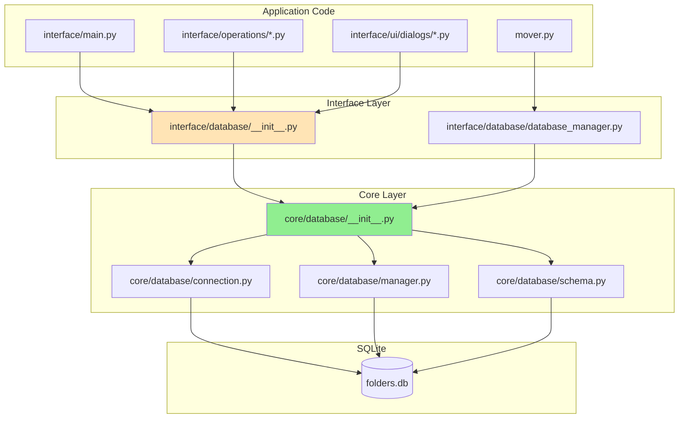

# Database Consolidation Analysis

**Generated:** 2026-02-02  
**Status:** Analysis Complete - Consolidation Already Achieved

---

## 1. File Inventory

### 1.1 `core/database/` Layer (Source of Truth)

| File | Lines | Responsibility |
|------|-------|----------------|
| [`core/database/connection.py`](../core/database/connection.py) | 167 | `Table` and `DatabaseConnection` classes - low-level SQLite wrapper |
| [`core/database/manager.py`](../core/database/manager.py) | 209 | `DatabaseManager` class - initialization, migrations, table references |
| [`core/database/schema.py`](../core/database/schema.py) | 200 | `create_database()` function - initial schema creation |
| [`core/database/__init__.py`](../core/database/__init__.py) | 21 | Public exports |

### 1.2 `interface/database/` Layer (Compatibility Wrapper)

| File | Lines | Responsibility |
|------|-------|----------------|
| [`interface/database/database_manager.py`](../interface/database/database_manager.py) | 25 | Re-exports from `core.database` for backward compatibility |
| [`interface/database/__init__.py`](../interface/database/__init__.py) | 9 | Module exports |

### 1.3 Related Root Files

| File | Responsibility |
|------|----------------|
| [`create_database.py`](../create_database.py) | Legacy wrapper delegating to `core.database.schema` |
| [`folders_database_migrator.py`](../folders_database_migrator.py) | Sequential migrations v5-v39 |
| [`dispatch/db_manager.py`](../dispatch/db_manager.py) | `DBManager` wrapper coordinating processed_files and folders |

---

## 2. Usage Analysis

### 2.1 Import Patterns

**Direct imports from `interface.database` (22 usages):**
```
interface/application_controller.py          TYPE_CHECKING import
interface/ui/main_window.py                  TYPE_CHECKING import
interface/ui/app.py                          TYPE_CHECKING import + property
interface/ui/widgets/folder_list.py          TYPE_CHECKING import
interface/ui/dialogs/processed_files_dialog.py TYPE_CHECKING import
interface/operations/processing.py           Runtime import
interface/operations/maintenance.py          Runtime import
interface/operations/folder_operations.py    Runtime import
interface/ui/dialogs/maintenance_dialog.py   TYPE_CHECKING import
interface/ui/dialogs/edit_settings_dialog.py TYPE_CHECKING import
interface/ui/dialogs/edit_folder_dialog.py   TYPE_CHECKING import
interface/main.py                            Runtime import
tests/test_app_smoke.py                      Runtime import
tests/integration/test_automatic_migrations.py Runtime import
tests/ui/test_interface_ui.py                Runtime import
tests/unit/test_interface_db_manager.py      Runtime import
```

**Direct imports from `core.database` (2 usages):**
```
tests/integration/database_schema_versions.py DatabaseConnection import
create_database.py                           create_database import
```

**Indirect/Hacky imports (1 usage):**
```
mover.py                                     sys.path manipulation + direct import
```

### 2.2 Class/Function API

```python
# core.database exports
from core.database import (
    DatabaseConnection,   # Connection wrapper with __getitem__
    Table,               # Dataset-like API (find, insert, update, delete)
    DatabaseManager,     # Full manager with migrations
    connect,             # Connect to file
    connect_memory,      # In-memory connection
    create_database,     # Schema creation
)

# interface.database re-exports same API
from interface.database import (
    DatabaseConnection,
    DatabaseManager,
    Table,
    connect,
    connect_memory,
)
```

---

## 3. Overlap Identification

### 3.1 What Exists in Both Layers

| Aspect | `core/database` | `interface/database` |
|--------|-----------------|----------------------|
| `DatabaseConnection` | Defined in `connection.py` | Re-export only |
| `Table` | Defined in `connection.py` | Re-export only |
| `DatabaseManager` | Defined in `manager.py` | Re-export only |
| `connect()` | Defined in `connection.py` | Re-export only |
| `connect_memory()` | Defined in `connection.py` | Re-export only |
| `create_database()` | Defined in `schema.py` | Not re-exported |

### 3.2 No Overlap - Consolidation Already Complete

**Finding:** The `interface/database/database_manager.py` is purely a re-export wrapper:

```python
# interface/database/database_manager.py
from core.database import (
    DatabaseConnection,
    DatabaseManager,
    Table,
    connect,
    connect_memory,
)
```

**No duplicate logic exists.** The dual-layer situation is intentional for backward compatibility.

### 3.3 Legacy File Still Present

- [`mover.py`](../mover.py) uses a hacky `sys.path.insert()` approach to import `DatabaseConnection` directly from `interface/database/database_manager.py`

---

## 4. Consolidation Recommendation

### 4.1 Current State: Already Consolidated

The database layer has already been consolidated. The architecture is:

```
                    ┌─────────────────────────┐
                    │  interface/database/*   │  ← Backward compatibility
                    │  (re-exports from core) │
                    └───────────┬─────────────┘
                                │
                    ┌───────────▼─────────────┐
                    │     core/database/*     │  ← Source of truth
                    │  (sqlite3-based impl)   │     Framework-agnostic
                    └───────────┬─────────────┘
                                │
                    ┌───────────▼─────────────┐
                    │        SQLite           │  ← Persistence
                    └─────────────────────────┘
```

### 4.2 Recommended Actions

| Priority | Action | Rationale |
|----------|--------|-----------|
| **P0** | Keep `core/database/` as source of truth | Framework-agnostic, no Qt dependency |
| **P1** | Keep `interface/database/` as compatibility layer | Existing code imports from here |
| **P2** | Clean up `mover.py` import | Remove `sys.path` hack |
| **P3** | Add `create_database` to interface exports | Complete API parity |

### 4.3 Future Direction

When all consumers migrate to `core.database` imports:
1. `interface/database/` can become deprecated
2. Eventually removed in a major version

---

## 5. Migration Plan

### 5.1 Step-by-Step Actions

#### Step 1: Fix mover.py Import (Low Risk)
```python
# mover.py - Current (hacky)
sys.path.insert(0, os.path.join(os.path.dirname(__file__), "interface", "database"))
from database_manager import DatabaseConnection

# mover.py - Recommended
from interface.database.database_manager import DatabaseConnection
```
**Files to modify:** [`mover.py`](../mover.py:10-13)

#### Step 2: Add create_database to interface exports (Low Risk)
```python
# interface/database/__init__.py
from .database_manager import DatabaseConnection, DatabaseManager, Table
from core.database import connect, connect_memory, create_database
```
**Files to modify:** [`interface/database/__init__.py`](../interface/database/__init__.py)

#### Step 3: Verify all tests pass
```bash
./run_tests.sh
```
**Validate:** 1346+ tests pass

### 5.2 Callers Requiring Updates

| File | Current Import | Required Change |
|------|---------------|-----------------|
| `mover.py` | `sys.path` hack | Direct `interface.database` import |
| (No other callers need changes) | - | - |

### 5.3 Migration Verification

```bash
# Run database-related tests
pytest tests/unit/test_interface_db_manager.py -v
pytest tests/integration/test_automatic_migrations.py -v
pytest tests/integration/test_database_migrations.py -v
```

---

## 6. Risk Assessment

### 6.1 Breaking Changes

| Risk | Severity | Mitigation |
|------|----------|------------|
| `mover.py` import change | **Low** | Only one file, simple fix |
| API change in `core.database` | **Medium** | `interface.database` wrapper absorbs change |

### 6.2 Test Coverage

| Test File | Coverage | Status |
|-----------|----------|--------|
| `tests/unit/test_interface_db_manager.py` | Table, DatabaseConnection, DatabaseManager | ✅ Complete |
| `tests/integration/test_automatic_migrations.py` | Migration v32→v38 | ✅ Complete |
| `tests/integration/test_database_migrations.py` | Sequential migrations | ✅ Complete |
| `tests/unit/test_create_database.py` | Schema creation | ✅ Complete |

**Total DB-related tests:** 100+ tests covering all functionality

### 6.3 Rollback Strategy

**If issues arise:**
1. Revert `mover.py` change (no impact on other code)
2. Revert `interface/database/__init__.py` change
3. All imports via `interface.database` continue working

**No database schema changes** - purely import path modifications.

### 6.4 AS400 Database Access

**No impact.** AS400 settings are stored in `settings` table but the database layer is SQLite-only. AS400 connection logic is elsewhere (ODBC-based).

---

## 7. Summary

### Current Architecture

- **`core/database/`** = Source of truth (sqlite3-based, framework-agnostic)
- **`interface/database/`** = Compatibility wrapper (re-exports core)
- **Consolidation status:** Already complete

### Recommended Actions

1. **Fix `mover.py`** - Remove `sys.path` hack, use standard import
2. **Add `create_database`** - Complete API parity in `interface.database`
3. **Verify tests** - Run full test suite

### Effort Estimate

- Code changes: ~10 lines
- Test verification: ~2 minutes (full suite)
- Risk: Minimal

---

## Appendix: Import Flow Diagram


