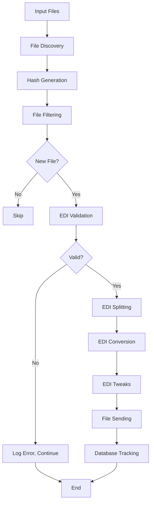
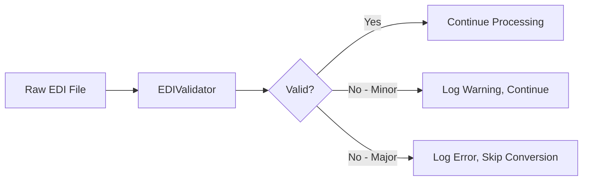
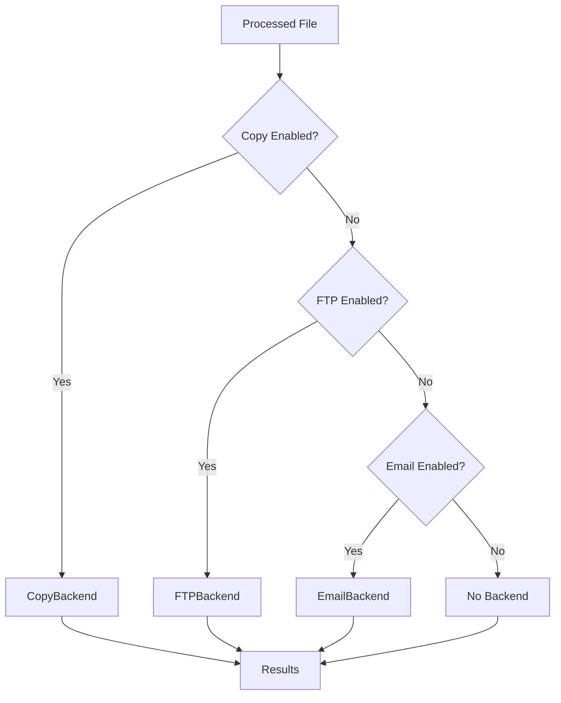
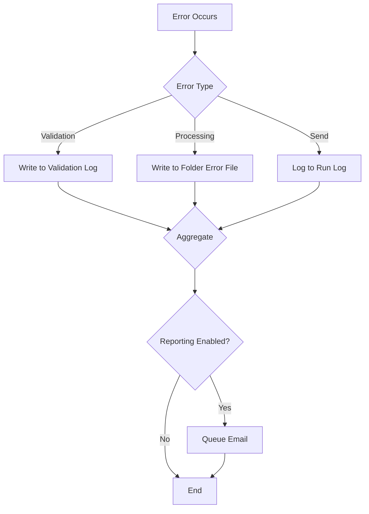
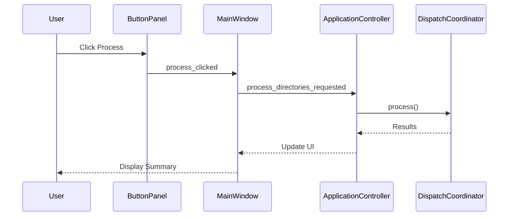
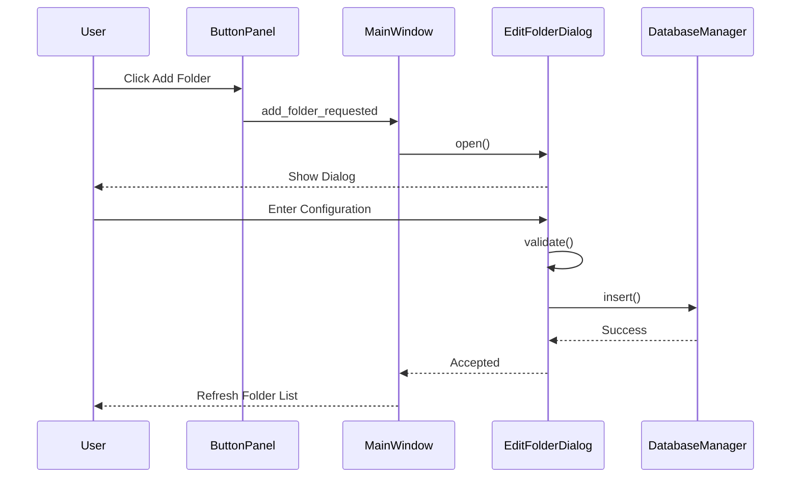
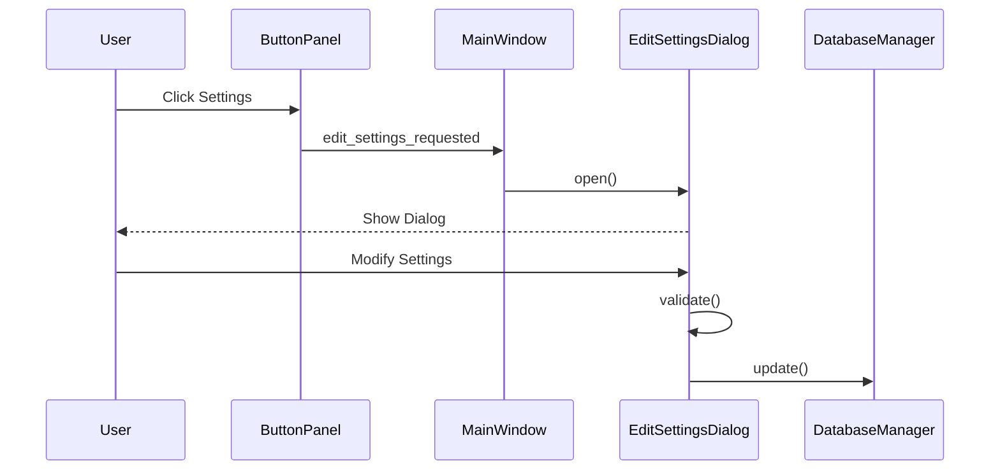

# Data Flow Document

**Generated:** 2026-01-30  
**Commit:** c2898be44  
**Branch:** cleanup-refactoring

## 1. Overview

This document describes the end-to-end data flows for processing EDI files through the batch file processor system.

## 2. End-to-End Processing Flow

### 2.1 High-Level Flow


```mermaid
flowchart TD
    A[Input Files] --> B[File Discovery]
    B --> C[Hash Generation]
    C --> D[File Filtering]
    D --> E{New File?}
    E -->|No| F[Skip]
    E -->|Yes| G[EDI Validation]
    G --> H{Valid?}
    H -->|No| I[Log Error, Continue]
    H -->|Yes| J[EDI Splitting]
    J --> K[EDI Conversion]
    K --> L[EDI Tweaks]
    L --> M[File Sending]
    M --> N[Database Tracking]
    I --> O[End]
    N --> O
```

### 2.2 Step Details

| Step | Description | Output |
|------|-------------|--------|
| File Discovery | Scan input folder for files | List of file paths |
| Hash Generation | Generate MD5 hashes for files | File-to-hash mapping |
| File Filtering | Match against processed files | Filtered file list |
| EDI Validation | Validate EDI format | Validation result |
| EDI Splitting | Split multi-transaction EDI | Individual transactions |
| EDI Conversion | Convert to target format | Converted file |
| EDI Tweaks | Apply modifications | Tweaked file |
| File Sending | Send to configured backends | Delivery confirmation |
| Database Tracking | Record processing result | Processed file entry |

## 3. File Input to Processing

### 3.1 Input Locations

Folders are configured in the `folders` table with `folder_is_active = "True"`.

```
Input: /path/to/configured/folder/
├── INCOMING/
│   ├── file1.edi
│   ├── file2.edi
│   └── file3.edi
```

### 3.2 File Discovery Process

```python
# dispatch/file_processor.py
class FileDiscoverer:
    @staticmethod
    def discover_files(folder_name: str) -> List[str]:
        return glob.glob(os.path.join(folder_name, "*"))
```

### 3.3 Hash-Based Deduplication

```python
# dispatch/orchestrator.py
class ProcessingContext:
    def __init__(self, folder, effective_folder, settings, upc_dict):
        self.folder = folder
        self.effective_folder = effective_folder
        self.settings = settings
        self.upc_dict = upc_dict
        self.temp_dirs = []
        self.temp_files = []
```

## 4. EDI Processing Pipeline

### 4.1 Validation Flow


```mermaid
flowchart LR
    A[Raw EDI File] --> B[EDIValidator]
    B --> C{Valid?}
    C -->|Yes| D[Continue Processing]
    C -->|No - Minor| E[Log Warning, Continue]
    C -->|No - Major| F[Log Error, Skip Conversion]
```

### 4.2 Conversion Flow

The conversion flow in `dispatch/orchestrator.py` is implemented in the `_apply_conversion_and_tweaks()` helper and integrates with the split behavior in `_process_split_pipeline()`.

- `convert_edi` flag controls whether conversion is run at all.
- `convert_to_format` sets the target plugin format (e.g., `csv`, `fintech`).
- `converter_step` is injected via `DispatchConfig` and is required for the conversion stage.
- Conversion is optional on split output and can be applied per split file.
- If `convert_to_format` is set but no output file is returned, a runtime error is raised.

```mermaid
flowchart TD
    A[EDI File] --> B{Validate EDI?}
    B -->|No| C[Use original file]
    B -->|Yes| D[Run Validator]
    D --> E{Valid?}
    E -->|No| F[Handle based on policy]
    E -->|Yes| G[Split EDI?]

    G -->|Yes| H[Split into temp files]
    H --> I[For each split file: Conversion + Tweak + Send]
    G -->|No| J[Original file]

    J --> K{Convert EDI?}
    K -->|Yes| L[EDIConverterStep.execute()]
    K -->|No| M[Skip Conversion]

    L --> N{Did conversion produce output?}
    N -->|Yes| O[Set current file to output]
    N -->|No| P[if convert_to_format non-empty -> ERROR]

    O --> Q{Tweak EDI?}
    Q -->|Yes| R[TweakerStep.execute()]
    Q -->|No| S[Send unchanged/converted]

    F --> T[Send original to backends (if configured)]
```

### 4.3 EDI Record Types

| Record | Purpose | Processed By |
|--------|---------|--------------|
| A | Invoice header | `process_record_a()` |
| B | Line item | `process_record_b()` |
| C | Charge/adjustment | `process_record_c()` |

## 5. Send Backend Flow

### 5.1 Multi-Backend Sending


```mermaid
flowchart TD
    A[Processed File] --> B{Copy Enabled?}
    B -->|Yes| C[CopyBackend]
    B -->|No| D{FTP Enabled?}
    D -->|Yes| E[FTPBackend]
    D -->|No| F{Email Enabled?}
    F -->|Yes| G[EmailBackend]
    F -->|No| H[No Backend]
    C --> I[Results]
    E --> I
    G --> I
    H --> I
```

### 5.2 Backend Configuration

```python
# dispatch/send_manager.py
class SendManager:
    BACKEND_CONFIG = {
        'copy': ('copy_backend', 'copy_to_directory', 'Copy Backend'),
        'ftp': ('ftp_backend', 'ftp_server', 'FTP Backend'),
        'email': ('email_backend', 'email_to', 'Email Backend')
    }
```

## 6. Error Handling Flow

### 6.1 Error Types

| Type | Handling | Reporting |
|------|----------|-----------|
| Validation Error | Log to validation report | Email if reporting enabled |
| Processing Error | Log to folder error file | Email per folder |
| Send Error | Log to run log | Continue with other backends |
| Missing Folder | Log to run log | Count as error |

### 6.2 Error Logging Flow


```mermaid
flowchart TD
    A[Error Occurs] --> B{Error Type}
    B -->|Validation| C[Write to Validation Log]
    B -->|Processing| D[Write to Folder Error File]
    B -->|Send| E[Log to Run Log]
    C --> F{Aggregate}
    D --> F
    E --> F
    F --> G{Reporting Enabled?}
    G -->|Yes| H[Queue Email]
    G -->|No| I[End]
    H --> I
```

### 6.3 Error File Location

```
errors/
└── folder_name/
    └── Folder errors.2024-01-30.txt
```

## 7. UI Interaction Flows

### 7.1 Process Button Flow


```mermaid
sequenceDiagram
    participant User
    participant ButtonPanel
    participant MainWindow
    participant ApplicationController
    participant DispatchCoordinator
    
    User->>ButtonPanel: Click Process
    ButtonPanel->>MainWindow: process_clicked
    MainWindow->>ApplicationController: process_directories_requested
    ApplicationController->>DispatchCoordinator: process()
    DispatchCoordinator-->>ApplicationController: Results
    ApplicationController-->>MainWindow: Update UI
    MainWindow-->>User: Display Summary
```

### 7.2 Add Folder Flow


```mermaid
sequenceDiagram
    participant User
    participant ButtonPanel
    participant MainWindow
    participant EditFolderDialog
    participant DatabaseManager
    
    User->>ButtonPanel: Click Add Folder
    ButtonPanel->>MainWindow: add_folder_requested
    MainWindow->>EditFolderDialog: open()
    EditFolderDialog-->>User: Show Dialog
    User->>EditFolderDialog: Enter Configuration
    EditFolderDialog->>EditFolderDialog: validate()
    EditFolderDialog->>DatabaseManager: insert()
    DatabaseManager-->>EditFolderDialog: Success
    EditFolderDialog-->>MainWindow: Accepted
    MainWindow-->>User: Refresh Folder List
```

### 7.3 Edit Settings Flow


```mermaid
sequenceDiagram
    participant User
    participant ButtonPanel
    participant MainWindow
    participant EditSettingsDialog
    participant DatabaseManager
    
    User->>ButtonPanel: Click Settings
    ButtonPanel->>MainWindow: edit_settings_requested
    MainWindow->>EditSettingsDialog: open()
    EditSettingsDialog-->>User: Show Dialog
    User->>EditSettingsDialog: Modify Settings
    EditSettingsDialog->>EditSettingsDialog: validate()
    EditSettingsDialog->>DatabaseManager: update()
```

## 8. Database Flow

### 8.1 Read Flow

```mermaid
flowchart TD
    A[Read Request] --> B{Query Type}
    B -->|Single Record| C[find_one()]
    B -->|Multiple Records| D[find()]
    B -->|Count| E[count()]
    C --> F[Return Dict]
    D --> G[Return List of Dicts]
    E --> H[Return Integer]
```

### 8.2 Write Flow

```mermaid
flowchart TD
    A[Write Request] --> B{Operation Type}
    B -->|Insert| C[insert()]
    B -->|Update| D[update()]
    B -->|Delete| E[delete()]
    C --> F[Execute SQL]
    D --> F
    E --> F
    F --> G[Commit Transaction]
```

## 9. Processing Summary Flow

### 9.1 Summary Generation

```python
# dispatch/orchestrator.py
def process_folder(self, folder, run_log, ... ) -> FolderResult:
    # ... processing ...
    result = FolderResult(...)
    return result
```

### 9.2 Summary Format

```
5 processed, 2 errors, has EDI validator errors
```

## 10. Data Transformation Examples

### 10.1 UPC Processing

```python
# utils.py
def process_upc(upc_string: str, calc_check_digit: bool = False) -> str:
    if len(upc_string) == 12:
        return upc_string  # Already UPCA
    elif len(upc_string) == 11:
        if calc_check_digit:
            return upc_string + calculate_check_digit(upc_string)
    elif len(upc_string) == 8:
        return convert_upce_to_upca(upc_string)
    return ""
```

### 10.2 Price Conversion

```python
# utils.py
def convert_to_price(value: str) -> str:
    dollars = value[:-2].lstrip("0") or "0"
    cents = value[-2:]
    return f"{dollars}.{cents}"
```

### 10.3 Date Processing

```python
# utils.py
def convert_date_format(date_string: str, format: str) -> str:
    return datetime.datetime.strptime(date_string, "%Y%m%d").strftime(format)
```

## 11. Key Data Structures

### 11.1 Folder Parameters Dict

```python
{
    "id": int,
    "folder_name": str,
    "alias": str,
    "folder_is_active": str,  # "True" or "False"
    "process_edi": str,
    "convert_to_format": str,
    "split_edi": bool,
    "tweak_edi": bool,
    "process_backend_copy": bool,
    "process_backend_ftp": bool,
    "process_backend_email": bool,
    "ftp_server": str,
    "ftp_folder": str,
    "email_to": str,
    # ... many more fields
}
```

### 11.2 EDI Record Dicts

```python
# A Record
{
    "record_type": "A",
    "cust_vendor": str,
    "invoice_number": str,
    "invoice_date": str,
    "invoice_total": str,
}

# B Record
{
    "record_type": "B",
    "upc_number": str,
    "qty_of_units": str,
    "unit_cost": str,
    "suggested_retail_price": str,
    "description": str,
    "unit_multiplier": str,
    "vendor_item": str,
}

# C Record
{
    "record_type": "C",
    "charge_type": str,
    "description": str,
    "amount": str,
}
```

### 11.3 Processed File Record

```python
{
    "id": int,
    "folder_id": int,
    "filename": str,
    "original_path": str,
    "processed_path": str,
    "status": str,
    "error_message": str,
    "convert_format": str,
    "sent_to": str,
    "created_at": str,
    "processed_at": str,
    "file_name": str,
    "file_checksum": str,
    "resend_flag": int,
}
```
