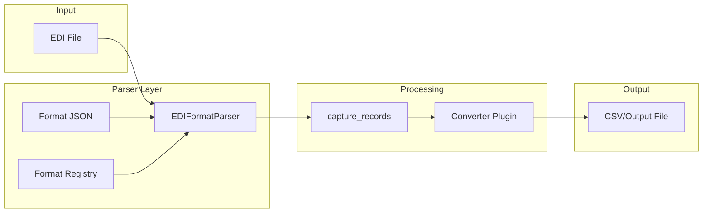
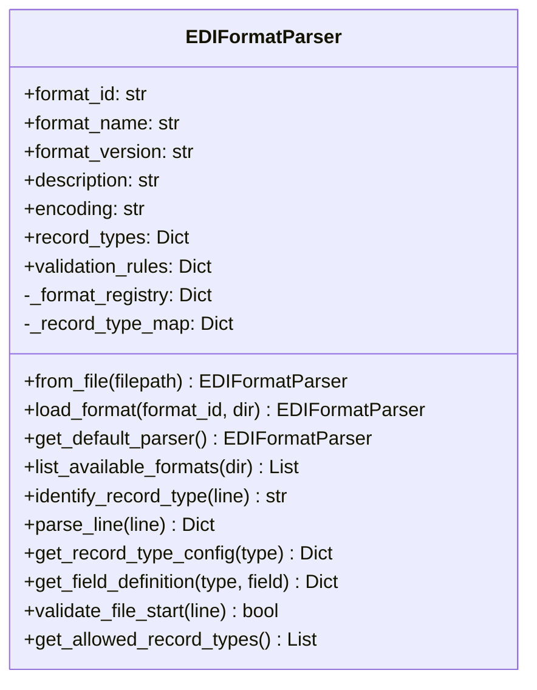

# EDI Format Design Document

**Generated:** 2026-02-02  
**Commit:** c2898be44  
**Branch:** cleanup-refactoring

## 1. Overview

This document describes the EDI format parsing system, including the JSON-based format configuration, parser API, and record type definitions.

## 2. Architecture

### 2.1 EDI Processing Pipeline



### 2.2 Key Components

| Component | Location | Purpose |
|-----------|----------|---------|
| `EDIFormatParser` | `edi_format_parser.py` | JSON-based format parser |
| `capture_records()` | `utils.py` | Legacy parsing function with fallback |
| Format definitions | `edi_formats/*.json` | Format configuration files |
| `EDIFormatError` | `edi_format_parser.py` | Custom exception class |

## 3. Record Types

### 3.1 Overview

The EDI format uses fixed-width records identified by a single-character prefix:

| Type | Name | Description | Min Length |
|------|------|-------------|------------|
| `A` | Invoice Header | Invoice-level information | 33 |
| `B` | Line Item | Product details and pricing | 71-77 |
| `C` | Charge/Fee | Additional charges | 38 |

### 3.2 A Record (Invoice Header)

```
Position: 0         1         2         3
          0123456789012345678901234567890123
Format:   A------iiiiiiiiiiDDDDDDtttttttttt
```

| Field | Position | Length | Type | Description |
|-------|----------|--------|------|-------------|
| `record_type` | 0 | 1 | char | Always "A" |
| `cust_vendor` | 1 | 6 | string | Customer/vendor code |
| `invoice_number` | 7 | 10 | string | Invoice identifier |
| `invoice_date` | 17 | 6 | string | Date (MMDDYY format) |
| `invoice_total` | 23 | 10 | string | Total amount (DAC format) |

**Example:**
```
A000001INV0000101122125100000012345
│└─┬──┘└───┬────┘└──┬──┘└────┬─────┘
│  │       │        │        └─ Total: $123.45
│  │       │        └─────────── Date: 01/12/21
│  │       └─────────────────── Invoice: INV0000101
│  └────────────────────────── Customer: 000001
└───────────────────────────── Record Type: A
```

### 3.3 B Record (Line Item)

```
Position: 0         1         2         3         4         5         6         7
          01234567890123456789012345678901234567890123456789012345678901234567890123456
Format:   BuuuuuuuuuuuddddddddddddddddddddddddvvvvvvccccccCCuuuuuuqqqqqsssssmppppppppp
```

| Field | Position | Length | Type | Description |
|-------|----------|--------|------|-------------|
| `record_type` | 0 | 1 | char | Always "B" |
| `upc_number` | 1 | 11 | string | UPC barcode |
| `description` | 12 | 25 | string | Product description |
| `vendor_item` | 37 | 6 | string | Vendor item number |
| `unit_cost` | 43 | 6 | string | Cost per unit (DAC) |
| `combo_code` | 49 | 2 | string | Combo indicator |
| `unit_multiplier` | 51 | 6 | string | Units per case |
| `qty_of_units` | 57 | 5 | string | Quantity shipped |
| `suggested_retail_price` | 62 | 5 | string | SRP (DAC) |
| `price_multi_pack` | 67 | 3 | string | Multi-pack price |
| `parent_item_number` | 70 | 6 | string | Parent item (for combos) |

**Example:**
```
B12345678901Widget Product Name      VEND0100250 10000100020 300500123456
│└────┬────┘└──────────┬──────────┘└──┬─┘└──┬──┘└─┬─┘└──┬─┘└─┬┘└┬┘└──┬──┘
│     │                │              │     │     │     │    │  │    │
│     │                │              │     │     │     │    │  │    └─ Parent: 123456
│     │                │              │     │     │     │    │  └────── Multi-pack: 500
│     │                │              │     │     │     │    └───────── SRP: $3.00
│     │                │              │     │     │     └────────────── Qty: 20
│     │                │              │     │     └──────────────────── Multiplier: 100001
│     │                │              │     └────────────────────────── Combo: 10
│     │                │              └──────────────────────────────── Cost: $2.50
│     │                └─────────────────────────────────────────────── Vendor: VEND01
│     └──────────────────────────────────────────────────────────────── Desc: Widget...
└────────────────────────────────────────────────────────────────────── UPC: 12345678901
```

### 3.4 C Record (Charge/Fee)

```
Position: 0         1         2         3
          0123456789012345678901234567890123456789
Format:   Cttydddddddddddddddddddddddddaaaaaaaaa
```

| Field | Position | Length | Type | Description |
|-------|----------|--------|------|-------------|
| `record_type` | 0 | 1 | char | Always "C" |
| `charge_type` | 1 | 3 | string | Type code |
| `description` | 4 | 25 | string | Charge description |
| `amount` | 29 | 9 | string | Amount (DAC format) |

**Example:**
```
C010Shipping Charge          000001500
│└┬┘└──────────┬──────────┘└────┬───┘
│ │            │                └──── Amount: $15.00
│ │            └───────────────────── Description
│ └────────────────────────────────── Type: 010
└──────────────────────────────────── Record Type: C
```

## 4. JSON Format Configuration

### 4.1 Format File Structure

```json
{
  "format_id": "default",
  "format_name": "Default Fixed-Width Format",
  "format_version": "1.0",
  "description": "Original proprietary fixed-width EDI format",
  "encoding": "utf-8",
  "record_types": { ... },
  "validation_rules": { ... }
}
```

### 4.2 Required Fields

| Field | Type | Description |
|-------|------|-------------|
| `format_id` | string | Unique identifier (e.g., "default") |
| `format_name` | string | Human-readable name |
| `format_version` | string | Version string |
| `record_types` | object | Record type definitions |

### 4.3 Optional Fields

| Field | Type | Default | Description |
|-------|------|---------|-------------|
| `description` | string | "" | Format description |
| `encoding` | string | "utf-8" | File encoding |
| `validation_rules` | object | {} | Validation configuration |

### 4.4 Record Type Definition

```json
{
  "A": {
    "name": "Invoice Header",
    "description": "Invoice header record",
    "identifier": {
      "position": 0,
      "length": 1,
      "value": "A"
    },
    "fields": [
      {
        "name": "record_type",
        "position": 0,
        "length": 1,
        "type": "string",
        "description": "Record type identifier"
      },
      {
        "name": "cust_vendor",
        "position": 1,
        "length": 6,
        "type": "string",
        "description": "Customer or vendor code"
      }
    ],
    "total_length": 33
  }
}
```

### 4.5 Field Definition

| Property | Type | Required | Description |
|----------|------|----------|-------------|
| `name` | string | Yes | Field identifier (used in parsed dict) |
| `position` | integer | Yes | Start position (0-indexed) |
| `length` | integer | Yes | Field length in characters |
| `type` | string | No | Data type hint (string, integer, etc.) |
| `description` | string | No | Human-readable description |

### 4.6 Validation Rules

```json
{
  "validation_rules": {
    "file_must_start_with": "A",
    "allowed_record_types": ["A", "B", "C"],
    "record_order": "A records followed by B and/or C records",
    "b_record_lengths": [71, 77],
    "upc_validation": {
      "blank_allowed": true,
      "suppressed_length": 8,
      "truncated_threshold": 11
    }
  }
}
```

## 5. EDIFormatParser API

### 5.1 Class Overview



### 5.2 Loading Formats

```python
# Load by format ID (from edi_formats/ directory)
parser = EDIFormatParser.load_format("default")

# Load from specific file
parser = EDIFormatParser.from_file("/path/to/custom_format.json")

# Get default parser
parser = EDIFormatParser.get_default_parser()

# List available formats
formats = EDIFormatParser.list_available_formats()
# [{'id': 'default', 'name': 'Default Fixed-Width Format', 'version': '1.0', ...}]
```

### 5.3 Parsing Lines

```python
# Parse a single line
record = parser.parse_line("A000001INV00001011221251000012345")
# Returns:
# {
#     'record_type': 'A',
#     'cust_vendor': '000001',
#     'invoice_number': 'INV0000101',
#     'invoice_date': '122125',
#     'invoice_total': '1000012345'
# }

# Identify record type only
record_type = parser.identify_record_type(line)
# Returns: 'A', 'B', 'C', or None
```

### 5.4 Querying Format Metadata

```python
# Get record type configuration
config = parser.get_record_type_config('B')
# Returns: {'name': 'Line Item', 'identifier': {...}, 'fields': [...]}

# Get specific field definition
field_def = parser.get_field_definition('B', 'upc_number')
# Returns: {'name': 'upc_number', 'position': 1, 'length': 11, ...}

# Get allowed record types
types = parser.get_allowed_record_types()
# Returns: ['A', 'B', 'C']
```

### 5.5 Format Registry

The parser uses a class-level registry for caching:

```python
# First load reads from disk and caches
parser1 = EDIFormatParser.load_format("default")

# Subsequent loads return cached instance
parser2 = EDIFormatParser.load_format("default")

# parser1 is parser2 (same instance)
```

## 6. Legacy capture_records() Function

### 6.1 Function Signature

```python
def capture_records(line: str, parser: Optional[EDIFormatParser] = None) -> Optional[Dict[str, str]]:
    """Parse an EDI line.
    
    Args:
        line: EDI record line to parse
        parser: Optional parser instance. If None, uses default format.
    
    Returns:
        Dictionary with parsed fields or None for empty lines
        
    Raises:
        Exception: "Not An EDI" for unrecognized record types
    """
```

### 6.2 Fallback Behavior

When no parser is available, `capture_records()` uses hardcoded field positions:

```python
def capture_records(line, parser=None):
    if parser is None:
        parser = _get_default_parser()
    
    if parser is not None:
        # Use parser-based extraction
        result = parser.parse_line(line)
        if result is None and line:
            raise Exception("Not An EDI")
        return result
    
    # Fallback to hardcoded positions
    if line.startswith("A"):
        fields = {
            "record_type": line[0],
            "cust_vendor": line[1:7],
            "invoice_number": line[7:17],
            "invoice_date": line[17:23],
            "invoice_total": line[23:33],
        }
        return fields
    # ... B and C record handling
```

### 6.3 Usage in Converters

```python
class MyConverter(BaseConverter):
    def convert(self):
        with open(self.edi_process, 'r') as f:
            for line in f:
                record = capture_records(line.rstrip(), self.edi_parser)
                
                if record is None:
                    continue
                    
                record_type = record.get('record_type')
                if record_type == 'A':
                    self.process_record_a(record)
                elif record_type == 'B':
                    self.process_record_b(record)
                elif record_type == 'C':
                    self.process_record_c(record)
```

## 7. DAC Format Values

### 7.1 Overview

Numeric values in EDI records use the DAC (Decimal Assumed Cents) format:

- Last 2 digits represent cents
- No decimal point stored
- Leading zeros for padding
- Example: `000012345` = $123.45

### 7.2 Conversion Functions

```python
# utils.py
def convert_to_price(value: str) -> str:
    """Convert DAC format to decimal string.
    
    Args:
        value: DAC format string (e.g., "000012345")
    
    Returns:
        Price string (e.g., "123.45")
    """
    if not value or len(value) < 2:
        return "0."
    dollars = value[:-2].lstrip("0") or "0"
    cents = value[-2:]
    return f"{dollars}.{cents}"
```

### 7.3 DAC Format Examples

| DAC Value | Decimal Value |
|-----------|---------------|
| `000012345` | $123.45 |
| `000000100` | $1.00 |
| `000000000` | $0.00 |
| `100000000` | $1,000,000.00 |

## 8. UPC Processing

### 8.1 UPC Types

| Type | Length | Description |
|------|--------|-------------|
| UPC-A | 12 | Standard retail UPC |
| UPC-A (no check) | 11 | UPC-A without check digit |
| UPC-E | 8 | Compressed UPC |
| UPC-E (no check) | 6-7 | UPC-E without check digit |

### 8.2 Check Digit Calculation

```python
def calc_check_digit(value: str) -> int:
    """Calculate UPC check digit (mod 10).
    
    Algorithm:
    1. Sum odd positions × 3
    2. Sum even positions × 1
    3. Total mod 10
    4. (10 - result) mod 10
    """
    check_digit = 0
    odd_pos = True
    for char in str(value)[::-1]:
        if odd_pos:
            check_digit += int(char) * 3
        else:
            check_digit += int(char)
        odd_pos = not odd_pos
    return (10 - (check_digit % 10)) % 10
```

### 8.3 UPC-E to UPC-A Conversion

```python
def convert_UPCE_to_UPCA(upce_value: str) -> str:
    """Convert UPC-E to UPC-A format.
    
    UPC-E uses a compression scheme based on the last digit.
    """
    # Extract middle 6 digits
    if len(upce_value) == 6:
        middle_digits = upce_value
    elif len(upce_value) == 7:
        middle_digits = upce_value[:6]
    elif len(upce_value) == 8:
        middle_digits = upce_value[1:7]
    
    # Apply decompression rules based on d6
    d1, d2, d3, d4, d5, d6 = list(middle_digits)
    if d6 in ["0", "1", "2"]:
        mfrnum = d1 + d2 + d6 + "00"
        itemnum = "00" + d3 + d4 + d5
    elif d6 == "3":
        mfrnum = d1 + d2 + d3 + "00"
        itemnum = "000" + d4 + d5
    # ... more rules
    
    return "0" + mfrnum + itemnum
```

## 9. File Structure

### 9.1 Formats Directory

```
edi_formats/
├── default_format.json        # Default EDI format
├── example_custom_format.json # Example custom format
└── <custom>_format.json       # User-defined formats
```

### 9.2 Format Discovery

```python
# EDIFormatParser searches for formats in order:
# 1. ./edi_formats/{format_id}_format.json
# 2. ./edi_formats/{format_id}.json
# 3. {cwd}/edi_formats/{format_id}_format.json
```

### 9.3 Creating Custom Formats

1. Create JSON file in `edi_formats/` directory
2. Follow the schema from default_format.json
3. Use unique `format_id`
4. Reference by ID: `EDIFormatParser.load_format("custom_id")`

## 10. Integration with Converters

### 10.1 Converter Initialization

```python
class BaseConverter:
    def __init__(self, edi_process, output_filename, settings_dict, 
                 parameters_dict, upc_lookup):
        # Load format based on folder configuration
        format_id = parameters_dict.get("edi_format", "default")
        try:
            self.edi_parser = EDIFormatParser.load_format(format_id)
        except Exception:
            self.edi_parser = None
```

### 10.2 Processing Loop

```python
def convert(self):
    self.initialize_output()
    
    with open(self.edi_process, 'r') as f:
        for line in f:
            line = line.rstrip('\r\n')
            
            if self.edi_parser:
                record = self.edi_parser.parse_line(line)
            else:
                record = capture_records(line)
            
            if record:
                self._process_record(record)
    
    self.finalize_output()
```

## 11. Error Handling

### 11.1 EDIFormatError Exception

```python
class EDIFormatError(Exception):
    """Raised when there's an error with EDI format configuration or parsing."""
    pass
```

### 11.2 Common Errors

| Error | Cause | Resolution |
|-------|-------|------------|
| "Format file not found" | Missing JSON file | Check formats directory |
| "Invalid JSON in format file" | Malformed JSON | Fix syntax errors |
| "Missing required field" | Incomplete config | Add missing fields |
| "Not An EDI" | Unrecognized record type | Check file format |

### 11.3 Error Handling Pattern

```python
try:
    parser = EDIFormatParser.load_format(format_id)
except EDIFormatError as e:
    logger.warning(f"Failed to load format {format_id}: {e}")
    parser = None  # Fall back to hardcoded parsing
```

## 12. Testing

### 12.1 Unit Test Patterns

```python
class TestEDIFormatParser:
    def test_parse_a_record(self):
        parser = EDIFormatParser.get_default_parser()
        record = parser.parse_line("A000001INV00001011221251000012345")
        
        assert record["record_type"] == "A"
        assert record["cust_vendor"] == "000001"
        assert record["invoice_number"] == "INV0000101"
    
    def test_parse_b_record(self):
        parser = EDIFormatParser.get_default_parser()
        line = "B12345678901Product Description      VND001002500 000100001000300000123456"
        record = parser.parse_line(line)
        
        assert record["record_type"] == "B"
        assert record["upc_number"] == "12345678901"
        assert record["description"].strip() == "Product Description"
    
    def test_identify_record_type(self):
        parser = EDIFormatParser.get_default_parser()
        
        assert parser.identify_record_type("A...") == "A"
        assert parser.identify_record_type("B...") == "B"
        assert parser.identify_record_type("C...") == "C"
        assert parser.identify_record_type("X...") is None
```

### 12.2 Format Validation Tests

```python
def test_format_file_integrity():
    """Verify all format files load successfully."""
    formats = EDIFormatParser.list_available_formats()
    
    for fmt in formats:
        parser = EDIFormatParser.load_format(fmt["id"])
        assert parser.format_id == fmt["id"]
        assert len(parser.record_types) > 0
```

## 13. Best Practices

### 13.1 Format Design Guidelines

1. **Unique IDs**: Use descriptive, unique format_id values
2. **Documentation**: Include clear descriptions for all fields
3. **Validation**: Define validation_rules for data integrity
4. **Version Control**: Update format_version when changing fields

### 13.2 Parser Usage Guidelines

1. **Caching**: Let the registry cache parsers (don't create new instances)
2. **Error Handling**: Always handle EDIFormatError
3. **Fallback**: Provide fallback for missing custom formats
4. **Testing**: Test with sample EDI files before deployment

## 14. Future Improvements

1. **Delimited Formats**: Support CSV/delimiter-based EDI formats
2. **Nested Records**: Support hierarchical record structures
3. **Field Transformations**: Add built-in type conversion
4. **Schema Validation**: Validate EDI content against schema
5. **Format Editor**: GUI tool for creating format definitions
6. **Format Import**: Import from X12/EDIFACT standard definitions
