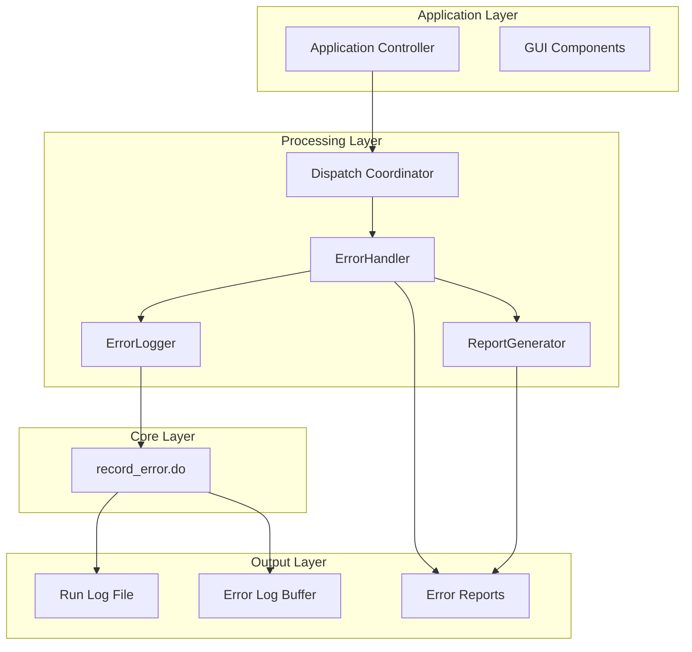
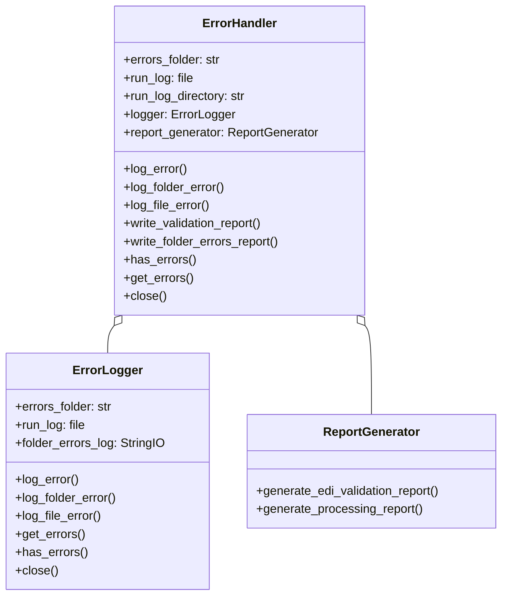
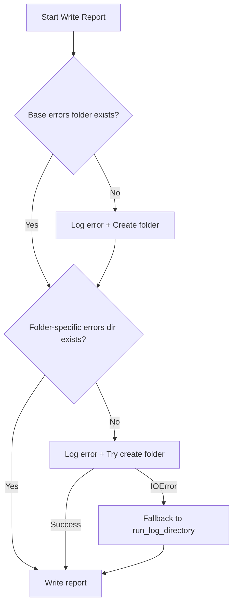
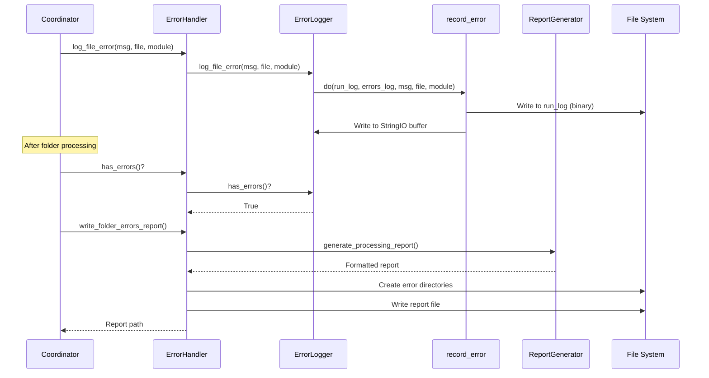

# Error Handling Design Document

**Generated:** 2026-02-02  
**Commit:** c2898be44  
**Branch:** cleanup-refactoring

## 1. Overview

This document describes the error handling patterns, logging mechanisms, and report generation system used in the batch file processor application.

## 2. Architecture

### 2.1 Error Handling Layers



### 2.2 Key Components

| Component | Location | Purpose |
|-----------|----------|---------|
| `record_error.do()` | `record_error.py` | Core error logging function |
| `ErrorLogger` | `dispatch/error_handler.py` | Error aggregation class |
| `ReportGenerator` | `dispatch/error_handler.py` | Report generation class |
| `ErrorHandler` | `dispatch/error_handler.py` | Central error management |

## 3. Core Error Logging

### 3.1 record_error.do()

The fundamental error logging function that writes to both run log and error log.

```python
# record_error.py
def do(run_log, errors_log, error_message, filename, error_source, threaded=False):
    """
    Record an error to both run log and errors log.
    
    Args:
        run_log: Binary file handle (non-threaded) or list (threaded)
        errors_log: StringIO buffer (non-threaded) or list (threaded)
        error_message: Description of the error
        filename: File/object that caused the error
        error_source: Module where error occurred
        threaded: If True, appends to lists instead of writing to files
    
    Returns:
        (run_log, errors_log) tuple when threaded=True
    """
    message = "At: " + str(time.ctime()) + "\r\n" + \
              "From module: " + error_source + "\r\n" + \
              "For object: " + filename + "\r\n" + \
              "Error Message is:" + "\r\n" + (str(error_message) + "\r\n\r\n")
    
    if not threaded:
        run_log.write(message.encode())
        errors_log.write(message)
    else:
        run_log.append(message)
        errors_log.append(message)
        return run_log, errors_log
```

### 3.2 Error Message Format

All errors follow a consistent format:

```
At: Mon Feb  2 14:30:45 2026
From module: Dispatch
For object: invoice_001.edi
Error Message is:
Invalid EDI segment: unexpected character at position 45

```

### 3.3 Usage Modes

| Mode | run_log Type | errors_log Type | Use Case |
|------|--------------|-----------------|----------|
| Normal | Binary file | StringIO | Standard single-threaded processing |
| Threaded | List | List | Thread-safe parallel processing |

## 4. ErrorLogger Class

### 4.1 Purpose

The `ErrorLogger` class wraps `record_error.do()` and provides a higher-level interface for error aggregation during folder processing.

### 4.2 Class Definition

```python
class ErrorLogger:
    """Handles error logging operations."""
    
    def __init__(self, errors_folder: str, run_log):
        self.errors_folder = errors_folder
        self.run_log = run_log
        self.folder_errors_log = StringIO()  # In-memory error buffer
    
    def log_error(self, error_message: str, filename: str, module: str):
        """Log an error with context."""
        record_error.do(
            self.run_log, self.folder_errors_log, 
            error_message, filename, module
        )
    
    def log_folder_error(self, error_message: str, folder_name: str, 
                         module: str = "Dispatch"):
        """Log a folder-related error."""
        self.log_error(error_message, folder_name, module)
    
    def log_file_error(self, error_message: str, filename: str, 
                       module: str = "Dispatch"):
        """Log a file-related error."""
        self.log_error(error_message, filename, module)
    
    def get_errors(self) -> str:
        """Get all logged errors as string."""
        return self.folder_errors_log.getvalue()
    
    def has_errors(self) -> bool:
        """Check if there are any logged errors."""
        return len(self.folder_errors_log.getvalue()) > 0
    
    def close(self):
        """Close the error log buffer."""
        self.folder_errors_log.close()
```

### 4.3 Specialized Logging Methods

| Method | Default Module | Use Case |
|--------|----------------|----------|
| `log_error()` | (caller provides) | Generic error logging |
| `log_folder_error()` | "Dispatch" | Folder configuration/access errors |
| `log_file_error()` | "Dispatch" | Individual file processing errors |

## 5. ReportGenerator Class

### 5.1 Purpose

The `ReportGenerator` class creates formatted error reports for different contexts.

### 5.2 Report Types

#### EDI Validation Report

```python
@staticmethod
def generate_edi_validation_report(errors: str) -> str:
    """Generate EDI validation report."""
    timestamp = datetime.datetime.now().isoformat().replace(":", "-")
    report = f"EDI Validation Report - {timestamp}\r\n"
    report += "=" * 50 + "\r\n"
    report += errors
    return report
```

**Output format:**
```
EDI Validation Report - 2026-02-02T14-30-45.123456
==================================================
[validation errors content]
```

#### Processing Report

```python
@staticmethod
def generate_processing_report(errors: str, version: str) -> str:
    """Generate processing report with version info."""
    report = f"Program Version = {version}\r\n\r\n"
    report += "Processing Errors\r\n"
    report += "=" * 30 + "\r\n"
    report += errors
    return report
```

**Output format:**
```
Program Version = 1.0.0

Processing Errors
==============================
[processing errors content]
```

## 6. ErrorHandler Class

### 6.1 Purpose

The `ErrorHandler` class is the central error management system that coordinates logging and report generation.

### 6.2 Class Definition

```python
class ErrorHandler:
    """Central error management system."""
    
    def __init__(self, errors_folder: str, run_log, run_log_directory: str):
        self.errors_folder = errors_folder
        self.run_log = run_log
        self.run_log_directory = run_log_directory
        self.logger = ErrorLogger(errors_folder, run_log)
        self.report_generator = ReportGenerator()
```

### 6.3 Component Composition



### 6.4 Report Writing Methods

#### Validation Report

```python
def write_validation_report(self, errors: str) -> str:
    """Write EDI validation report to file."""
    validator_log_name = (
        f"Validator Log {datetime.datetime.now().isoformat().replace(':', '-')}.txt"
    )
    validator_log_path = os.path.join(self.run_log_directory, validator_log_name)
    
    with open(validator_log_path, "wb") as validator_log_file:
        validator_log_file.write(errors.encode())
    
    return validator_log_path
```

**Output location:** `{run_log_directory}/Validator Log {timestamp}.txt`

#### Folder Errors Report

```python
def write_folder_errors_report(
    self, folder_name: str, folder_alias: str, version: str
) -> str:
    """Write folder errors report to file."""
    cleaned_alias_string = ErrorHandler._clean_filename(folder_alias)
    log_name = f"{cleaned_alias_string} errors.{timestamp}.txt"
    log_path = os.path.join(
        self.errors_folder, os.path.basename(folder_name), log_name
    )
    
    # Ensure directories exist (with error handling)
    # ...
    
    report_content = self.report_generator.generate_processing_report(
        self.logger.get_errors(), version
    )
    
    with open(log_path, "wb") as folder_errors_log_write:
        utils.do_clear_old_files(folder_errors_dir, 500)  # Cleanup old reports
        folder_errors_log_write.write(report_content.encode())
    
    return log_path
```

**Output location:** `{errors_folder}/{folder_basename}/{alias} errors.{timestamp}.txt`

### 6.5 Directory Auto-Creation

The `write_folder_errors_report()` method handles missing directories:



## 7. Error Flow in Processing

### 7.1 Dispatch Coordinator Integration

```python
# dispatch/coordinator.py usage pattern
class DispatchCoordinator:
    def __init__(self, ...):
        self.error_handler = ErrorHandler(
            errors_folder=self.errors_folder,
            run_log=self.run_log,
            run_log_directory=self.run_log_directory
        )
    
    def process_file(self, filename):
        try:
            # Process file...
        except Exception as e:
            self.error_handler.log_file_error(
                str(e), filename, "Dispatch"
            )
    
    def finalize_folder(self, folder_name, folder_alias, version):
        if self.error_handler.has_errors():
            self.error_handler.write_folder_errors_report(
                folder_name, folder_alias, version
            )
```

### 7.2 Error Categories

| Category | Module Source | Typical Causes |
|----------|--------------|----------------|
| File Discovery | "Dispatch" | Missing folder, permission denied |
| EDI Validation | "EDI Validator" | Invalid format, missing segments |
| EDI Processing | "EDI Processor" | Parse errors, conversion failures |
| Send | "Send Manager" | Connection failures, auth errors |
| Database | "DB Manager" | Query errors, constraint violations |
| Configuration | "Dispatch Error Logger" | Missing directories, invalid settings |

### 7.3 Complete Error Flow



## 8. Legacy Error Handling

### 8.1 dispatch.py Pattern

The legacy `dispatch.py` uses `record_error.do()` directly:

```python
# Legacy pattern in dispatch.py
record_error.do(
    process_files_log,
    folder_errors_log,
    str(error),
    str(original_filename),
    "Dispatch"
)
```

### 8.2 Migration Path

| Legacy Pattern | Modern Pattern |
|----------------|----------------|
| Direct `record_error.do()` calls | `error_handler.log_error()` |
| Manual directory creation | `ErrorHandler` auto-creates |
| Inline report formatting | `ReportGenerator` methods |
| Scattered error handling | Centralized `ErrorHandler` |

## 9. Threaded Error Handling

### 9.1 Thread-Safe Mode

For parallel processing, use `threaded=True`:

```python
# Thread-safe error logging
def process_file_threaded(file, run_log_list, errors_log_list):
    try:
        # Process...
    except Exception as e:
        run_log_list, errors_log_list = record_error.do(
            run_log_list,
            errors_log_list,
            str(e),
            file,
            "Threaded Processor",
            threaded=True
        )
    return run_log_list, errors_log_list
```

### 9.2 Aggregating Threaded Errors

```python
# After parallel processing
all_errors = "\n".join(errors_log_list)
run_log_content = "\n".join(run_log_list)
```

## 10. Error Report Cleanup

### 10.1 Automatic Cleanup

The `utils.do_clear_old_files()` function is called during report writing:

```python
# Keeps only the most recent 500 error reports
utils.do_clear_old_files(folder_errors_dir, 500)
```

### 10.2 Cleanup Behavior

- Removes oldest files when count exceeds threshold
- Based on file modification time
- Applies per folder-specific error directory

## 11. Testing Error Handling

### 11.1 Unit Test Patterns

```python
# tests/unit/test_dispatch_error_handler.py
class TestErrorLogger:
    def test_log_error(self):
        with patch("dispatch.error_handler.record_error.do") as mock_record:
            logger = ErrorLogger("/errors", mock_run_log)
            logger.log_error("Test error", "file.txt", "TestModule")
            
            mock_record.assert_called_once_with(
                mock_run_log,
                logger.folder_errors_log,
                "Test error",
                "file.txt",
                "TestModule"
            )
    
    def test_has_errors_empty(self):
        logger = ErrorLogger("/errors", mock_run_log)
        assert logger.has_errors() is False
    
    def test_has_errors_with_content(self):
        with patch("dispatch.error_handler.record_error.do"):
            logger = ErrorLogger("/errors", mock_run_log)
            logger.folder_errors_log.write("Error content")
            assert logger.has_errors() is True
```

### 11.2 Integration Test Patterns

```python
def test_error_report_file_creation(temp_dir):
    """Test that error reports are created correctly."""
    run_log = open(os.path.join(temp_dir, "run.log"), "wb")
    
    handler = ErrorHandler(
        errors_folder=temp_dir,
        run_log=run_log,
        run_log_directory=temp_dir
    )
    
    handler.log_file_error("Test error", "test.edi", "Test")
    report_path = handler.write_folder_errors_report(
        "/test/folder", "Test Alias", "1.0.0"
    )
    
    assert os.path.exists(report_path)
    with open(report_path, "r") as f:
        content = f.read()
    assert "Test error" in content
    assert "Program Version = 1.0.0" in content
```

## 12. Best Practices

### 12.1 Error Logging Guidelines

1. **Always provide context**: Include filename, module, and descriptive message
2. **Use appropriate method**: `log_folder_error()` vs `log_file_error()`
3. **Check for errors**: Call `has_errors()` before writing reports
4. **Clean up**: Call `close()` when done with ErrorLogger/ErrorHandler

### 12.2 Error Message Guidelines

```python
# Good: Descriptive with context
handler.log_file_error(
    f"EDI validation failed: invalid segment 'LIN' at position {pos}",
    filename,
    "EDI Validator"
)

# Bad: Vague message
handler.log_file_error("Error", filename, "Module")
```

### 12.3 Module Source Conventions

| Module | Use For |
|--------|---------|
| "Dispatch" | General file processing |
| "EDI Validator" | EDI validation errors |
| "EDI Processor" | EDI splitting/conversion |
| "Send Manager" | File transmission errors |
| "Dispatch Error Logger" | Error system internal errors |

## 13. Future Improvements

1. **Structured Logging**: Add JSON-formatted error output option
2. **Error Levels**: Add severity levels (ERROR, WARNING, INFO)
3. **Error Codes**: Add machine-readable error codes
4. **Async Logging**: Add async write option for high-volume scenarios
5. **Error Aggregation**: Add summary statistics to reports
6. **Notification Integration**: Add hooks for error notifications
