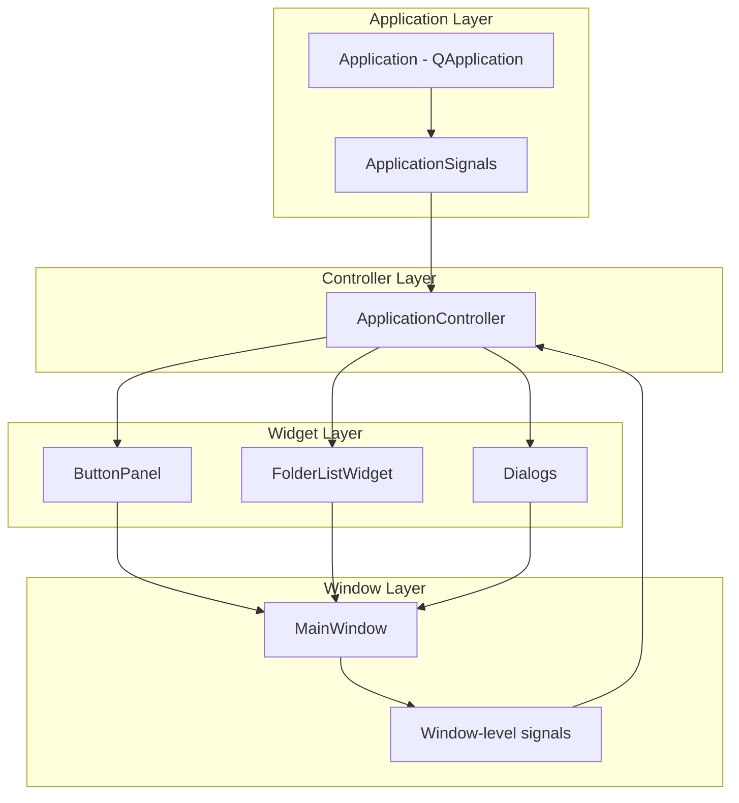

# GUI Design Document

**Generated:** 2026-01-30  
**Commit:** c2898be44  
**Branch:** cleanup-refactoring

## 1. Overview

The GUI layer is built with PyQt6 and follows a three-layer signal propagation pattern for communication between UI components and business logic.

### 1.1 Architecture Layers



## 2. Key Components

### 2.1 Application (`interface/ui/app.py`)

The main QApplication subclass that provides application-wide state and signals.

**Key Responsibilities:**
- Manage application lifecycle
- Provide application-wide signals for cross-component communication
- Load and apply stylesheets
- Hold database manager reference

**Signals:**
```python
class ApplicationSignals(QObject):
    # Database signals
    database_changed = Signal()
    
    # Folder signals
    folder_added = Signal(int)        # folder_id
    folder_updated = Signal(int)      # folder_id
    folder_deleted = Signal(int)      # folder_id
    folder_toggled = Signal(int, bool)  # folder_id, is_active
    
    # Processing signals
    processing_started = Signal()
    processing_finished = Signal()
    processing_error = Signal(str)    # error_message
    processing_progress = Signal(int, int)  # current, total
    
    # Dialog signals
    dialog_opened = Signal(str)       # dialog_name
    dialog_closed = Signal(str, bool) # dialog_name, accepted
```

### 2.2 MainWindow (`interface/ui/main_window.py`)

The main application window that composes all UI components.

**Key Responsibilities:**
- Compose button panel and folder list
- Re-emit widget signals as window-level API
- Provide access to database manager

**Signals:**
```python
class MainWindow(QMainWindow):
    process_directories_requested = Signal()
    add_folder_requested = Signal()
    batch_add_folders_requested = Signal()
    set_defaults_requested = Signal()
    edit_settings_requested = Signal()
    maintenance_requested = Signal()
    processed_files_requested = Signal()
    enable_resend_requested = Signal()
    edit_folder_requested = Signal(int)      # folder_id
    toggle_active_requested = Signal(int)    # folder_id
    delete_folder_requested = Signal(int)    # folder_id
    send_folder_requested = Signal(int)      # folder_id
```

**UI Composition:**
```python
class MainWindow(QMainWindow):
    def _setup_ui(self) -> None:
        # Left sidebar frame with ButtonPanel (160-180px fixed width)
        sidebar_frame = QFrame()
        sidebar_frame.setMinimumWidth(160)
        sidebar_frame.setMaximumWidth(180)
        self._button_panel = ButtonPanel()
        
        # Vertical separator line
        separator = QFrame()
        separator.setFrameShape(QFrame.Shape.VLine)
        
        # Right content area with FolderListWidget
        self._folder_splitter = QSplitter(Qt.Orientation.Horizontal)
        self._folder_list = FolderListWidget(db_manager=self._db_manager)
```

### 2.3 ButtonPanel (`interface/ui/widgets/button_panel.py`)

Vertical sidebar panel containing main actions.

**Buttons (top to bottom):**
- Add Directory...
- Batch Add Directories...
- Set Defaults...
- Process All Folders
- Processed Files Report...
- Maintenance...
- Edit Settings...
- Enable Resend

### 2.4 FolderListWidget (`interface/ui/widgets/folder_list.py`)

Dual-pane widget showing active and inactive folders.

**Features:**
- Active folders list (left pane)
- Inactive folders list (right pane)
- Per-folder actions: Edit, Toggle Active, Delete, Send
- Context menu support

### 2.5 Dialogs

#### BaseDialog (`interface/ui/base_dialog.py`)

Base class for all dialogs with validate/apply pattern.

```python
class BaseDialog(QDialog):
    def validate(self) -> bool:
        """Validate dialog inputs. Returns True if valid."""
        pass
    
    def apply(self) -> None:
        """Apply changes. Called only if validate() returns True."""
        pass
```

#### EditFolderDialog (`interface/ui/dialogs/edit_folder_dialog.py`)

Folder configuration dialog (730 lines).

**Sections:**
- General settings (name, alias, active status)
- EDI processing options
- Converter configuration
- Backend configuration (FTP, Email, Copy)

#### EditSettingsDialog (`interface/ui/dialogs/edit_settings_dialog.py`)

Global application settings.

#### MaintenanceDialog (`interface/ui/dialogs/maintenance_dialog.py`)

Maintenance operations dialog.

#### ProcessedFilesDialog (`interface/ui/dialogs/processed_files_dialog.py`)

View and manage processed files.

## 3. Signal Propagation Pattern

### 3.1 Layer 1: Widget Signals

Widgets emit local signals for their events:

```python
# interface/ui/widgets/button_panel.py
class ButtonPanel(QWidget):
    process_clicked = Signal()
    add_folder_clicked = Signal()
    batch_add_clicked = Signal()
    # ... etc
```

### 3.2 Layer 2: Window Re-emission

MainWindow connects widget signals to window-level signals:

```python
# interface/ui/main_window.py
class MainWindow(QMainWindow):
    def _connect_signals(self) -> None:
        self._button_panel.process_clicked.connect(
            self.process_directories_requested.emit
        )
        self._folder_list.folder_edit_requested.connect(
            self.edit_folder_requested.emit
        )
```

### 3.3 Layer 3: Controller Connection

ApplicationController connects window signals to business logic:

```python
# interface/application_controller.py
class ApplicationController:
    def _setup_connections(self) -> None:
        self._main_window.process_directories_requested.connect(
            self._process_directories
        )
        self._main_window.edit_folder_requested.connect(
            self._on_edit_folder
        )
```

## 4. Validation System

### 4.1 Qt Validators (`interface/utils/qt_validators.py`)

```python
EMAIL_VALIDATOR = QRegularExpressionValidator(
    QRegularExpression(r"[^@]+@[^@]+\.[^@]+")
)
PORT_VALIDATOR = QIntValidator(1, 65535)
```

### 4.2 Validation Feedback (`interface/utils/validation_feedback.py`)

Visual styling for validation feedback:
- Error state styling
- Success state styling
- Inline error messages

## 5. Dynamic UI Generation

### 5.1 Plugin UI Generator (`interface/ui/plugin_ui_generator.py`)

Generates UI components from plugin configuration.

```python
def build_plugin_ui(config_fields: List[dict]) -> QWidget:
    """Build a UI widget from configuration fields."""
    widget = QWidget()
    layout = QFormLayout()
    
    for field in config_fields:
        if field["type"] == "string":
            input_widget = QLineEdit()
        elif field["type"] == "boolean":
            input_widget = QCheckBox()
        elif field["type"] == "integer":
            input_widget = QSpinBox()
        
        layout.addRow(field["label"], input_widget)
    
    return widget
```

## 6. Database Access in UI

### 6.1 Database Manager Reference

```python
class MainWindow:
    @property
    def db_manager(self) -> DatabaseManager:
        return self._db_manager
```

### 6.2 Direct Table Access

```python
# Get folders
folders = self._db_manager.folders_table.find(active=True)

# Get settings
settings = self._db_manager.settings.find_one()

# Update record
self._db_manager.folders_table.update(
    {"id": folder_id, "alias": new_alias},
    ["id"]
)
```

## 7. Styling System

### 7.1 Stylesheet (`interface/styles/theme.qss`)

```css
/* Main application styling */
QMainWindow {
    background-color: #f0f0f0;
}

QDialog {
    background-color: #ffffff;
}

QPushButton {
    padding: 6px 12px;
    border-radius: 4px;
}
```

### 7.2 Loading Stylesheets

```python
# interface/ui/app.py
def _load_stylesheet(self) -> None:
    from interface.styles import load_stylesheet
    stylesheet = load_stylesheet()
    if stylesheet:
        self.setStyleSheet(stylesheet)
```

## 8. UI Testing

### 8.1 Test Fixtures

```python
# tests/conftest.py
@pytest.fixture
def qapp():
    """Create Qt application for testing."""
    app = QApplication([])
    yield app
    app.quit()

@pytest.fixture
def qtbot(qapp):
    """QWidget testing fixture."""
    from pytestqt.qtbot import QtBot
    return QtBot()
```

### 8.2 Test Markers

- `qt`: PyQt6-specific tests
- `ui`: UI component tests

### 8.3 Running Tests Headless

```bash
QT_QPA_PLATFORM=offscreen pytest tests/ui/ -v
```

## 9. Entry Point

### 9.1 Main Entry (`interface/main.py`)

```python
def main():
    from interface.ui.app import create_application
    from interface.database.database_manager import DatabaseManager
    from interface.ui.main_window import create_main_window
    
    app = create_application(sys.argv)
    
    db_manager = DatabaseManager(
        database_path="folders.db",
        config_folder="./config",
        platform=sys.platform,
        app_version="1.0.0",
        database_version="39"
    )
    app.database_manager = db_manager
    
    window = create_main_window(db_manager=db_manager, app=app)
    window.show()
    
    return app.exec()
```

## 10. Complexity Notes

### 10.1 Large Files

| File | Lines | Concern |
|------|-------|---------|
| `edit_folder_dialog.py` | 730 | Large dialog builder |
| `button_panel.py` | ~200 | Many button connections |
| `folder_list.py` | ~250 | Complex list management |

### 10.2 Refactoring Opportunities

1. **Dialog Builder:** `edit_folder_dialog.py` could be split into tab-based sections
2. **Folder List:** Could use model-view pattern for better separation
3. **Validation:** Could use Qt's built-in validation framework more extensively

## 11. Conventions

### 11.1 Naming Conventions

- Dialog classes: `*Dialog(QDialog)`
- Widget classes: `*Widget(QWidget)`
- Panel classes: `*Panel(QWidget)`

### 11.2 Signal Naming

- User actions: `*_clicked`, `*_requested`
- Data changes: `*_changed`, `*_updated`
- State changes: `*_toggled`, `*_activated`

### 11.3 Dialog Pattern

All dialogs should follow:

```python
class MyDialog(BaseDialog):
    def __init__(self, parent=None):
        super().__init__(parent)
        self._setup_ui()
    
    def validate(self) -> bool:
        """Return True if input is valid."""
        pass
    
    def apply(self) -> None:
        """Apply validated changes."""
        pass
```
