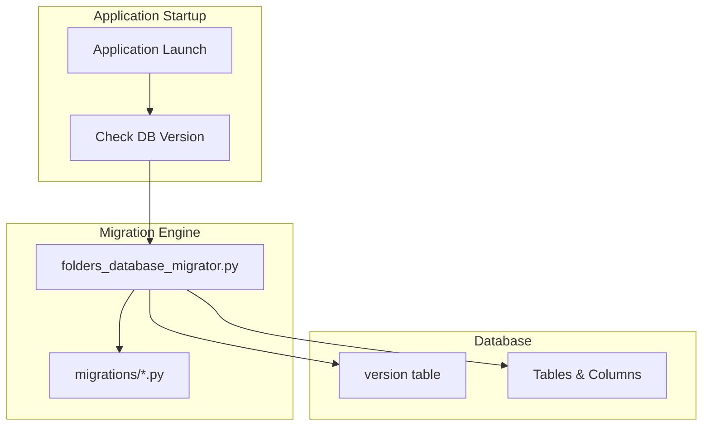
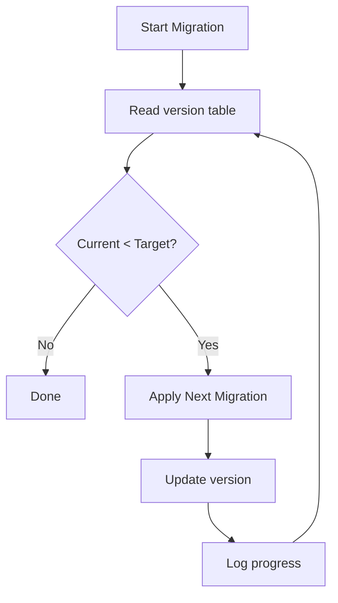

# Database Migration Design Document

**Generated:** 2026-02-02  
**Commit:** c2898be44  
**Branch:** cleanup-refactoring

## 1. Overview

This document describes the database migration system used in the batch file processor application, covering the sequential migration pattern, version management, and how to add new migrations.

## 2. Architecture

### 2.1 Migration System Overview



### 2.2 Key Components

| Component | Location | Purpose |
|-----------|----------|---------|
| `upgrade_database()` | `folders_database_migrator.py` | Main migration function |
| `_log_migration_step()` | `folders_database_migrator.py` | Progress logging |
| External migrations | `migrations/*.py` | Complex migration modules |
| `version` table | Database | Tracks current schema version |

## 3. Version Table

### 3.1 Schema

```sql
CREATE TABLE version (
    id INTEGER PRIMARY KEY,
    version TEXT,
    os TEXT,
    notes TEXT
)
```

### 3.2 Version Record

The database always contains exactly one version record:

```python
# Example version record
{
    "id": 1,
    "version": "40",
    "os": "linux",
    "notes": "..."
}
```

### 3.3 Version History

| Version | Migration Description |
|---------|----------------------|
| 5 | Baseline version (supported minimum) |
| 6 | Add `convert_to_format` column |
| 7 | Add `resend_flag` to processed_files |
| 8 | Add `tweak_edi` column |
| 9 | Add folder path history columns |
| 10 | Add `report_edi_errors` |
| 11 | Add `split_edi` column |
| 12 | Create `settings` table |
| 13-20 | Various column additions |
| 21-25 | Additional feature columns |
| 26-31 | More columns and indexes |
| 32 | Add `fintech_division_id` |
| 33 | Add `plugin_config` JSON column |
| 34 | Add timestamp columns |
| 35 | Add processed_files columns |
| 36 | Add database indexes |
| 37 | No-op migration |
| 38 | Add version notes |
| 39 | Add `edi_format` column |
| 40 | Ensure id columns exist (current) |

## 4. Migration Function

### 4.1 Function Signature

```python
def upgrade_database(
    database_connection,    # DatabaseConnection wrapper
    config_folder,         # Config folder path
    running_platform,      # "linux", "windows", or "darwin"
    target_version=None    # Optional: stop at specific version
):
    """
    Upgrade database schema to latest version.
    
    Migrations are applied sequentially from current version to target.
    Each migration checks current version before applying.
    """
```

### 4.2 Migration Flow



### 4.3 Migration Pattern

Each migration follows this pattern:

```python
# Check if migration should run
db_version_dict = db_version.find_one(id=1)
if target_version and int(db_version_dict["version"]) >= int(target_version):
    return

# Apply migration if at this version
if db_version_dict["version"] == "38":
    # Perform schema changes
    database_connection.query("ALTER TABLE 'folders' ADD COLUMN 'edi_format' TEXT")
    database_connection.query('UPDATE "folders" SET "edi_format" = "default"')
    
    # Also update administrative table
    database_connection.query("ALTER TABLE 'administrative' ADD COLUMN 'edi_format' TEXT")
    database_connection.query('UPDATE "administrative" SET "edi_format" = "default"')
    
    # Update version
    update_version = dict(id=1, version="39", os=running_platform)
    db_version.update(update_version, ["id"])
    _log_migration_step("38", "39")
```

## 5. Migration Types

### 5.1 Column Addition

Most common migration type - adds new columns:

```python
if db_version_dict["version"] == "6":
    # Add column using Table wrapper
    processed_table = database_connection["processed_files"]
    processed_table.create_column("resend_flag", "Boolean")
    
    # Initialize default values
    for line in processed_table:
        line["resend_flag"] = False
        processed_table.update(line, ["id"])
    
    update_version = dict(id=1, version="7")
    db_version.update(update_version, ["id"])
```

### 5.2 Table Creation

Create new tables:

```python
if db_version_dict["version"] == "11":
    # Drop and recreate settings table
    database_connection.query("DROP TABLE IF EXISTS settings")
    database_connection.query("""
        CREATE TABLE settings (
            id INTEGER PRIMARY KEY AUTOINCREMENT,
            enable_email INTEGER,
            email_address TEXT,
            email_smtp_server TEXT,
            smtp_port INTEGER,
            backup_counter INTEGER,
            backup_counter_maximum INTEGER,
            enable_interval_backups INTEGER
        )
    """)
    
    # Migrate data from administrative
    settings_table = database_connection["settings"]
    administrative_dict = database_connection["administrative"].find_one(id=1)
    settings_table.insert({
        "enable_email": 1 if administrative_dict.get("enable_reporting") == "True" else 0,
        "email_smtp_server": administrative_dict.get("smtp_server", "smtp.gmail.com"),
        # ... more fields
    })
```

### 5.3 Index Creation

Add database indexes:

```python
if db_version_dict["version"] == "35":
    database_connection.query(
        "CREATE INDEX IF NOT EXISTS idx_folders_active ON folders(folder_is_active)"
    )
    database_connection.query(
        "CREATE INDEX IF NOT EXISTS idx_folders_alias ON folders(alias)"
    )
    database_connection.query(
        "CREATE INDEX IF NOT EXISTS idx_processed_files_folder ON processed_files(folder_id)"
    )
    database_connection.query(
        "CREATE INDEX IF NOT EXISTS idx_processed_files_status ON processed_files(status)"
    )
```

### 5.4 Table Recreation

SQLite doesn't support dropping columns, so table recreation is needed:

```python
if db_version_dict["version"] == "39":
    cursor = database_connection.raw_connection.cursor()
    
    # Check if column exists
    cursor.execute("PRAGMA table_info(folders)")
    columns = [row[1] for row in cursor.fetchall()]
    
    if "id" not in columns:
        # Get current columns
        cursor.execute("PRAGMA table_info(folders)")
        old_columns = [(row[1], row[2]) for row in cursor.fetchall()]
        
        # Build new table with id column
        col_defs = ["id INTEGER PRIMARY KEY AUTOINCREMENT"]
        for col_name, col_type in old_columns:
            col_defs.append(f'"{col_name}" {col_type}')
        
        # Create, copy, drop, rename
        cursor.execute(f"CREATE TABLE folders_new ({', '.join(col_defs)})")
        old_cols = ", ".join([f'"{c[0]}"' for c in old_columns])
        cursor.execute(f"INSERT INTO folders_new ({old_cols}) SELECT {old_cols} FROM folders")
        cursor.execute("DROP TABLE folders")
        cursor.execute("ALTER TABLE folders_new RENAME TO folders")
        
        database_connection.raw_connection.commit()
```

### 5.5 External Migration Modules

Complex migrations can be split into separate files:

```python
if db_version_dict["version"] == "32":
    # Import and execute external migration
    from migrations.add_plugin_config_column import apply_migration
    
    if not apply_migration(database_connection):
        raise RuntimeError("Plugin config migration failed")
    
    update_version = dict(id=1, version="33", os=running_platform)
    db_version.update(update_version, ["id"])
```

## 6. External Migration Module Pattern

### 6.1 Module Structure

```python
# migrations/add_plugin_config_column.py
"""Database migration to add plugin_config JSON column."""

import json
import sqlite3
from typing import Union


def apply_migration(db: Union[sqlite3.Connection, "DatabaseConnection"]) -> bool:
    """Apply the migration.
    
    Args:
        db: Database connection
        
    Returns:
        True if successful, False otherwise
    """
    connection = db.raw_connection if hasattr(db, "raw_connection") else db
    cursor = connection.cursor()
    
    # Add new column
    cursor.execute("ALTER TABLE folders ADD COLUMN plugin_config TEXT")
    
    # Migrate existing data
    cursor.execute("SELECT * FROM folders")
    columns = [desc[0] for desc in cursor.description]
    
    for row in cursor.fetchall():
        row_dict = dict(zip(columns, row))
        config = migrate_folder_row_to_json(row_dict)
        cursor.execute(
            "UPDATE folders SET plugin_config = ? WHERE id = ?",
            (json.dumps(config), row_dict["id"])
        )
    
    connection.commit()
    return True


def rollback_migration(db) -> bool:
    """Rollback the migration (optional)."""
    return True
```

### 6.2 Data Migration Helper

```python
def migrate_folder_row_to_json(row_dict: dict) -> dict:
    """Convert existing columns to JSON config format."""
    convert_format = row_dict.get("convert_to_format", "csv")
    
    convert_config = {}
    if convert_format == "csv":
        convert_config = {
            "calculate_upc_check_digit": row_dict.get("calculate_upc_check_digit", "False"),
            "include_headers": row_dict.get("include_headers", "False"),
            # ... more fields
        }
    elif convert_format == "fintech":
        convert_config = {
            "fintech_division_id": row_dict.get("fintech_division_id", "")
        }
    
    return {
        "convert_plugin_config": convert_config,
        "send_plugin_configs": { ... }
    }
```

## 7. Adding New Migrations

### 7.1 Step-by-Step Guide

1. **Determine current version**: Check `version` table or end of `folders_database_migrator.py`

2. **Add migration code** at end of `upgrade_database()`:

```python
# At the end of upgrade_database()

db_version_dict = db_version.find_one(id=1)
if target_version and int(db_version_dict["version"]) >= int(target_version):
    return

if db_version_dict["version"] == "40":
    # Your migration code here
    database_connection.query("ALTER TABLE 'folders' ADD COLUMN 'new_field' TEXT")
    database_connection.query('UPDATE "folders" SET "new_field" = "default_value"')
    
    # Also update administrative table
    database_connection.query("ALTER TABLE 'administrative' ADD COLUMN 'new_field' TEXT")
    database_connection.query('UPDATE "administrative" SET "new_field" = "default_value"')
    
    update_version = dict(id=1, version="41", os=running_platform)
    db_version.update(update_version, ["id"])
    _log_migration_step("40", "41")
```

3. **Update schema creation** in `core/database/schema.py`:

```python
initial_db_dict = {
    # ... existing fields ...
    "new_field": "default_value",  # Add new field
}
```

4. **Add tests** in `tests/integration/test_database_migrations.py`

### 7.2 Migration Checklist

- [ ] Update both `folders` and `administrative` tables (they mirror each other)
- [ ] Set appropriate default values for existing rows
- [ ] Add column to `initial_db_dict` in `core/database/schema.py`
- [ ] Use `CREATE INDEX IF NOT EXISTS` for indexes
- [ ] Log migration with `_log_migration_step()`
- [ ] Test forward migration
- [ ] Test migration from multiple prior versions

### 7.3 Common Patterns

**Boolean column:**
```python
database_connection.query("ALTER TABLE 'folders' ADD COLUMN 'new_flag' INTEGER")
database_connection.query("UPDATE 'folders' SET new_flag = 0")
```

**String column:**
```python
database_connection.query("ALTER TABLE 'folders' ADD COLUMN 'new_text' TEXT")
database_connection.query("UPDATE 'folders' SET new_text = ''")
```

**Integer column with default:**
```python
database_connection.query("ALTER TABLE 'folders' ADD COLUMN 'new_count' INTEGER")
database_connection.query("UPDATE 'folders' SET new_count = 100")
```

## 8. Testing Migrations

### 8.1 Test Pattern

```python
# tests/integration/test_database_migrations.py
def test_migration_v39_to_v40(temp_dir):
    """Test migration from v39 to v40."""
    # Create database at version 39
    db = generate_database_at_version(39, temp_dir)
    
    # Apply migration
    upgrade_database(db, temp_dir, "linux", target_version=40)
    
    # Verify version
    version = db["version"].find_one(id=1)
    assert version["version"] == "40"
    
    # Verify schema changes
    cursor = db.raw_connection.cursor()
    cursor.execute("PRAGMA table_info(folders)")
    columns = [row[1] for row in cursor.fetchall()]
    assert "id" in columns
```

### 8.2 Schema Version Utilities

```python
# tests/integration/database_schema_versions.py
def generate_database_at_version(version: int, temp_dir: str):
    """Create a database at a specific version for testing."""
    # Create base schema
    db_path = os.path.join(temp_dir, "test.db")
    create_database("5", db_path, temp_dir, "linux")
    
    # Apply migrations up to target version
    db = DatabaseConnection.open(db_path)
    upgrade_database(db, temp_dir, "linux", target_version=version)
    
    return db
```

## 9. SQLite Limitations

### 9.1 Cannot Drop Columns

SQLite doesn't support `ALTER TABLE DROP COLUMN`. Workaround: recreate table.

```python
# Instead of: ALTER TABLE folders DROP COLUMN old_column
# Do this:
cursor.execute("CREATE TABLE folders_new AS SELECT col1, col2 FROM folders")
cursor.execute("DROP TABLE folders")
cursor.execute("ALTER TABLE folders_new RENAME TO folders")
```

### 9.2 Cannot Modify Column Types

SQLite doesn't support `ALTER TABLE MODIFY COLUMN`. Workaround: recreate table with new schema.

### 9.3 Cannot Add Primary Key

SQLite doesn't support `ALTER TABLE ADD PRIMARY KEY`. Workaround: recreate table.

```python
# Migration 39->40 example
col_defs = ["id INTEGER PRIMARY KEY AUTOINCREMENT"]
for col_name, col_type in old_columns:
    col_defs.append(f'"{col_name}" {col_type}')
cursor.execute(f"CREATE TABLE folders_new ({', '.join(col_defs)})")
# ... copy data, drop old, rename
```

## 10. Best Practices

### 10.1 Migration Guidelines

1. **Idempotent**: Migrations should be safe to run multiple times
2. **Atomic**: Each migration is a single logical change
3. **Forward-only**: No rollback mechanism (design for forward compatibility)
4. **Documented**: Include comments explaining the purpose
5. **Tested**: Write integration tests for each migration

### 10.2 Error Handling

```python
try:
    database_connection.query("ALTER TABLE 'folders' ADD COLUMN 'new_col' TEXT")
except sqlite3.OperationalError as e:
    if "duplicate column name" in str(e):
        # Column already exists, continue
        pass
    else:
        raise
```

### 10.3 Logging

```python
def _log_migration_step(from_version, to_version):
    """Log migration step progress."""
    print(f"  Migrating: v{from_version} → v{to_version}")
```

## 11. Migration File Structure

```
batch-file-processor/
├── folders_database_migrator.py    # Main migration script (~970 lines)
├── migrations/
│   └── add_plugin_config_column.py # External migration module
└── core/database/
    └── schema.py                   # Initial schema creation
```

## 12. Troubleshooting

### 12.1 Common Issues

| Issue | Cause | Solution |
|-------|-------|----------|
| "no such column" | Migration not applied | Run upgrade_database() |
| "duplicate column" | Migration applied twice | Check version table |
| Migration fails | Schema mismatch | Check target_version logic |
| Data loss | Column dropped | Use table recreation pattern |

### 12.2 Manual Version Fix

```sql
-- If needed, manually fix version
UPDATE version SET version = '39' WHERE id = 1;
```

### 12.3 Debug Mode

```python
# Print migration progress
import folders_database_migrator
folders_database_migrator.upgrade_database(
    db_connection, 
    config_folder, 
    "linux",
    target_version=40  # Stop at specific version
)
```

## 13. Future Improvements

1. **Migration Framework**: Abstract migrations into separate files
2. **Rollback Support**: Add rollback functions for each migration
3. **Dry Run Mode**: Preview changes without applying
4. **Migration History**: Track applied migrations in database
5. **Automatic Backup**: Create backup before each migration
6. **Version Ranges**: Support running specific version ranges
7. **CLI Tool**: Command-line interface for migration management
