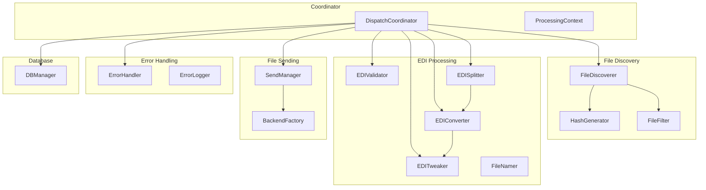
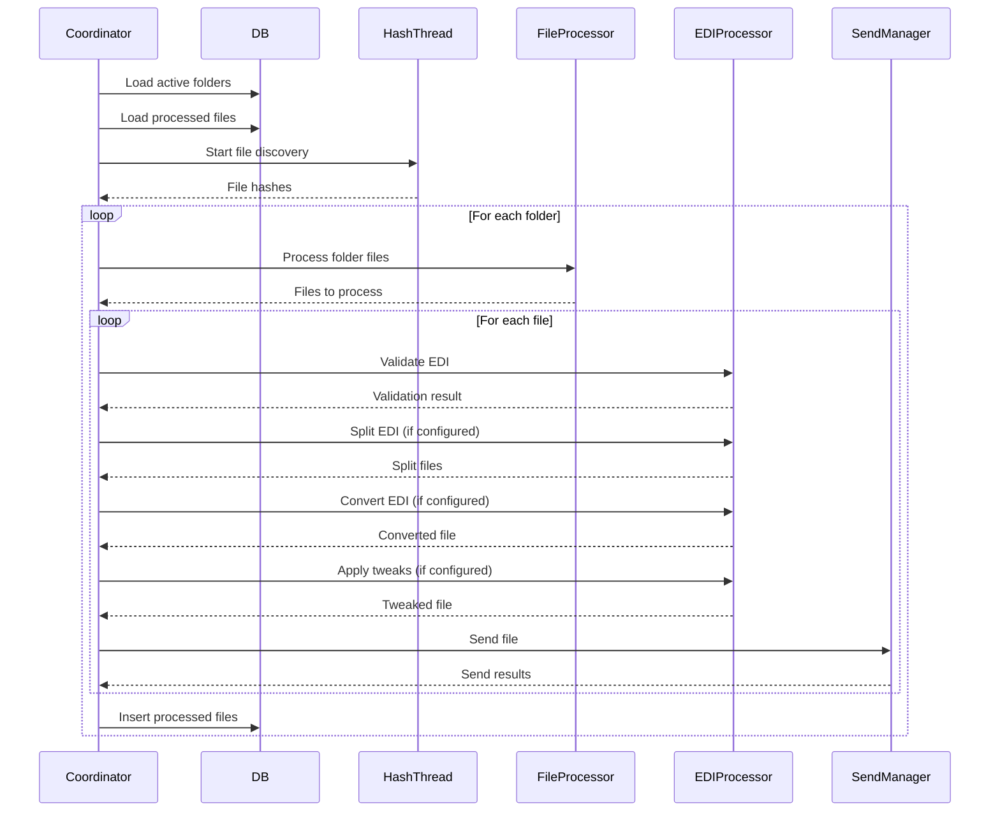
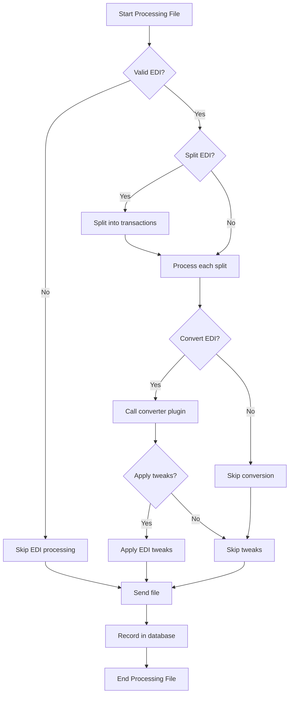

# Processing Layer Design Document

**Generated:** 2026-01-30  
**Commit:** c2898be44  
**Branch:** cleanup-refactoring

## 1. Overview

The processing layer handles the core business logic of batch file processing. It orchestrates file discovery, EDI validation, EDI processing, conversion, and file sending.

## 2. Architecture



## 3. Key Components

### 3.1 DispatchCoordinator (`dispatch/coordinator.py`)

Main orchestrator for the batch processing system.

**Key Responsibilities:**
- Load UPC data from database
- Load active folders from database
- Create hash thread for file discovery
- Process each folder sequentially
- Handle EDI validation errors
- Generate processing summary

**Processing Flow:**
```python
class DispatchCoordinator:
    def process(self) -> Tuple[bool, str]:
        self.context.reset()
        self._load_upc_data()
        self.context.parameters_dict_list = self.db_manager.get_active_folders()
        
        hash_thread = self._create_hash_thread(temp_processed_files_list)
        hash_thread.start()
        
        for parameters_dict in self.context.parameters_dict_list:
            folder_errors = self._process_folder(parameters_dict, ...)
        
        return error_counter > 0, run_summary_string
```

### 3.2 ProcessingContext

Encapsulates all processing state to replace global variables.

```python
class ProcessingContext:
    def __init__(self):
        self.hash_counter = 0
        self.file_count = 0
        self.parameters_dict_list = []
        self.hash_thread_return_queue = queue.Queue()
        self.edi_validator_errors = StringIO()
        self.global_edi_validator_error_status = False
        self.upc_dict = {}
```

### 3.3 File Processor Components

#### FileDiscoverer (`dispatch/file_processor.py`)

Discovers files in a directory.

```python
class FileDiscoverer:
    @staticmethod
    def discover_files(folder_name: str) -> List[str]:
        """Get all file paths in a folder."""
        pass
```

#### HashGenerator

Generates MD5 hashes for file identification.

```python
class HashGenerator:
    @staticmethod
    def generate_file_hash(file_path: str) -> str:
        """Generate MD5 hash of a file."""
        pass
```

#### FileFilter

Filters files based on processed history and resend flags.

```python
class FileFilter:
    @staticmethod
    def generate_match_lists(processed_files: List[Dict]) -> Tuple[Dict, Dict, Set]:
        """Generate match dictionaries for filtering."""
        pass
    
    @staticmethod
    def should_send_file(file_hash: str, folder_hash_dict: Dict, resend_flag_set: Set) -> bool:
        """Determine if a file should be sent."""
        pass
```

### 3.4 EDI Processing Components

#### EDIValidator (`dispatch/edi_validator.py`)

Validates EDI files against format specifications.

```python
class EDIValidator:
    def validate_file(self, input_filename: str, original_filename: str, edi_parser) -> ValidationResult:
        """Validate an EDI file."""
        pass
```

#### EDISplitter (`dispatch/edi_processor.py`)

Splits EDI files into individual transactions.

```python
class EDISplitter:
    @staticmethod
    def split_edi(input_file: str, scratch_folder: str, parameters_dict: dict) -> List[Tuple[str, str, str]]:
        """Split EDI file into multiple files."""
        pass
```

#### EDIConverter

Converts EDI to target format using plugin system.

```python
class EDIConverter:
    @staticmethod
    def convert_edi(input_file: str, output_file: str, settings: dict, 
                   parameters_dict: dict, upc_dict: dict) -> str:
        """Convert EDI to specified format."""
        module_name = "convert_to_" + parameters_dict["convert_to_format"].lower().replace(" ", "_")
        module = importlib.import_module(module_name)
        return module.edi_convert(input_file, output_file, settings, parameters_dict, upc_dict)
```

#### EDITweaker

Applies modifications to EDI data.

```python
class EDITweaker:
    @staticmethod
    def tweak_edi(input_file: str, output_file: str, settings: dict,
                 parameters_dict: dict, upc_dict: dict) -> str:
        """Apply EDI tweaks."""
        pass
```

#### FileNamer

Generates output filenames based on parameters.

```python
class FileNamer:
    @staticmethod
    def generate_output_filename(input_filename: str, parameters_dict: dict,
                                filename_prefix: str = "", filename_suffix: str = "") -> str:
        """Generate output filename."""
        pass
```

### 3.5 SendManager (`dispatch/send_manager.py`)

Manages file sending through configured backends.

```python
class SendManager:
    BACKEND_CONFIG = {
        'copy': ('copy_backend', 'copy_to_directory', 'Copy Backend'),
        'ftp': ('ftp_backend', 'ftp_server', 'FTP Backend'),
        'email': ('email_backend', 'email_to', 'Email Backend')
    }
    
    def send_file(self, file_path: str, parameters_dict: dict, settings: dict) -> List[SendResult]:
        """Send file through all configured backends."""
        results = []
        for backend_type, (backend_name, dir_setting, backend_name_print) in self.BACKEND_CONFIG.items():
            if parameters_dict[f'process_backend_{backend_type}'] is True:
                backend = BackendFactory.get_backend(backend_type)
                backend.do(parameters_dict, settings, file_path)
                results.append(SendResult(success=True, ...))
        return results
```

#### BackendFactory

Dynamically loads backend modules.

```python
class BackendFactory:
    @staticmethod
    def get_backend(backend_name: str):
        module_name = f"{backend_name}_backend"
        return importlib.import_module(module_name)
```

#### SendResult

Encapsulates the result of a sending operation.

```python
class SendResult:
    def __init__(self, success: bool, backend_name: str, destination: str,
                 error_message: str = "", details: Dict[str, Any] = None):
        self.success = success
        self.backend_name = backend_name
        self.destination = destination
        self.error_message = error_message
        self.details = details or {}
```

### 3.6 Error Handling

#### ErrorHandler (`dispatch/error_handler.py`)

Manages error folder creation and reporting.

```python
class ErrorHandler:
    def __init__(self, errors_folder: dict, run_log, run_log_directory):
        pass
```

#### ErrorLogger

Logs errors to files.

```python
class ErrorLogger:
    def log_error(self, error_message: str, file_path: str, source: str):
        """Log error to file."""
        pass
```

### 3.7 DBManager (`dispatch/db_manager.py`)

Database operations for the dispatch layer.

```python
class DBManager:
    def __init__(self, database_connection, processed_files, folders_database):
        self.tracker = ProcessedFileTracker(...)
    
    def get_active_folders(self) -> List[Dict]:
        """Get all active folders."""
        pass
    
    def get_processed_files(self) -> List[Dict]:
        """Get all processed files."""
        pass
    
    def insert_processed_files(self, files: List[Dict]):
        """Insert processed file records."""
        pass
```

## 4. Concurrency Model

### 4.1 Hash Thread

Separate thread for file hash generation.

```python
def _create_hash_thread(self, temp_processed_files_list: List[Dict]) -> threading.Thread:
    def hash_thread_target():
        with concurrent.futures.ProcessPoolExecutor() as hash_executor:
            for counter, entry_dict in enumerate(self.context.parameters_dict_list):
                hash_files = FileDiscoverer.discover_files(entry_dict["folder_name"])
                # ... process files
                self.context.hash_thread_return_queue.put(result_dict)
    
    return threading.Thread(target=hash_thread_target)
```

### 4.2 ThreadPoolExecutor for File Processing

Parallel processing of files within a folder.

```python
def _process_folder(self, parameters_dict: Dict, ...):
    with concurrent.futures.ThreadPoolExecutor() as executor:
        for result in executor.map(
            lambda idx: self._process_single_file(idx, parameters_dict, ...),
            [x[0] for x in filtered_files],
        ):
            # Handle result
```

## 5. Processing Sequence

### 5.1 High-Level Flow



### 5.2 Per-File Processing



## 6. Configuration Parameters

### 6.1 Folder Configuration

Key parameters from `folders` table:

| Parameter | Type | Purpose |
|-----------|------|---------|
| `folder_name` | string | Input directory path |
| `alias` | string | Display name |
| `folder_is_active` | boolean | Whether to process |
| `process_edi` | boolean | Enable EDI processing |
| `convert_to_format` | string | Target format |
| `split_edi` | boolean | Split multi-transaction files |
| `tweak_edi` | boolean | Apply EDI tweaks |
| `process_backend_copy` | boolean | Enable copy backend |
| `process_backend_ftp` | boolean | Enable FTP backend |
| `process_backend_email` | boolean | Enable email backend |

### 6.2 Global Settings

| Parameter | Type | Purpose |
|-----------|------|---------|
| `email_address` | string | SMTP from address |
| `email_username` | string | SMTP username |
| `email_password` | string | SMTP password |
| `email_smtp_server` | string | SMTP server |
| `smtp_port` | integer | SMTP port |

## 7. Error Handling

### 7.1 Validation Errors

EDI validation errors are accumulated and reported at the end:

```python
if self.context.global_edi_validator_error_status:
    validator_log_path = self._write_validation_report()
    if self.reporting["enable_reporting"] == "True":
        self.emails_table.insert(dict(log=validator_log_path))
```

### 7.2 Processing Errors

Individual file errors are logged to folder-specific error files:

```python
def _write_folder_errors_report(self, parameters_dict: Dict[str, Any], errors: str):
    folder_error_log_name_full_path = os.path.join(
        self.errors_folder["errors_folder"],
        os.path.basename(parameters_dict["folder_name"]),
        folder_error_log_name_constructor,
    )
```

### 7.3 Send Errors

Backend send errors are accumulated but don't stop processing:

```python
for result in send_results:
    if not result.success:
        process_files_log, process_files_error_log = record_error.do(
            process_files_log, process_files_error_log,
            result.error_message, str(output_send_filename),
            result.backend_name, True,
        )
```

## 8. Complexity Notes

### 8.1 Large Files

| File | Lines | Concern |
|------|-------|---------|
| `dispatch/coordinator.py` | 893 | Orchestration, mixes concerns |
| `dispatch.py` | 569 | Legacy code, depth 100 |

### 8.2 Refactoring Opportunities

1. **Split coordinator:** Separate concerns into dedicated classes
2. **Hash thread:** Could use async/await instead of threading
3. **Error handling:** Centralize error logging logic
4. **Configuration:** Use dataclasses for parameters

## 9. Testing

### 9.1 Test Coverage

- `tests/unit/test_dispatch_coordinator.py` - Coordinator tests
- `tests/unit/test_dispatch_edi_processor.py` - EDI processing tests
- `tests/unit/test_dispatch_file_processor.py` - File processing tests
- `tests/unit/test_dispatch_send_manager.py` - Send manager tests
- `tests/unit/test_dispatch_error_handler.py` - Error handling tests

### 9.2 Key Test Patterns

```python
def test_process_single_file():
    coordinator = DispatchCoordinator(...)
    result = coordinator._process_single_file(...)
    assert result.success == True
```

## 10. Entry Points

### 10.1 Main Processing Entry

```python
# dispatch/coordinator.py
def process(database_connection, folders_database, run_log, emails_table,
            run_log_directory, reporting, processed_files, root, args,
            version, errors_folder, settings, simple_output=None):
    coordinator = DispatchCoordinator(
        database_connection=database_connection,
        folders_database=folders_database,
        ...
    )
    return coordinator.process()
```

### 10.2 Command-Line Entry

```bash
./run.sh -a  # Automatic/headless mode
```
