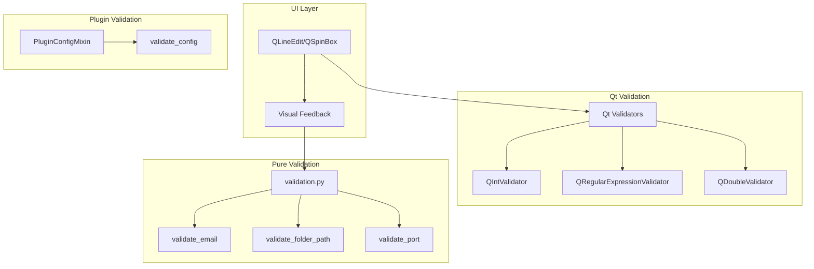
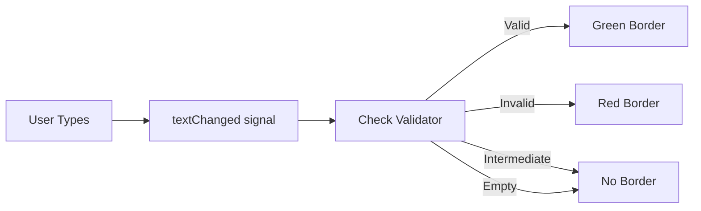

# Validation Design Document

**Generated:** 2026-02-02  
**Commit:** c2898be44  
**Branch:** cleanup-refactoring

## 1. Overview

This document describes the input validation framework used in the batch file processor application, covering pure validation functions, Qt validators, and visual feedback systems.

## 2. Architecture

### 2.1 Validation Layers



### 2.2 Key Components

| Component | Location | Purpose |
|-----------|----------|---------|
| `validation.py` | `interface/utils/` | Pure validation functions (no Qt) |
| `qt_validators.py` | `interface/utils/` | Pre-configured Qt validators |
| `validation_feedback.py` | `interface/utils/` | Visual feedback for validation |
| `PluginConfigMixin` | `plugin_config.py` | Plugin configuration validation |

## 3. Pure Validation Functions

### 3.1 Module Overview

The `interface/utils/validation.py` module provides framework-agnostic validation functions:

```python
# interface/utils/validation.py
import re
import os
from typing import Optional, Tuple
```

### 3.2 Email Validation

```python
def validate_email(email: str) -> bool:
    """
    Validate email address format.
    
    Args:
        email: Email address to validate.
        
    Returns:
        True if valid, False otherwise.
    """
    if not email:
        return False
    
    pattern = r'^[a-zA-Z0-9._%+-]+@[a-zA-Z0-9.-]+\.[a-zA-Z]{2,}$'
    return bool(re.match(pattern, email))
```

### 3.3 Folder Path Validation

```python
def validate_folder_path(path: str) -> Tuple[bool, Optional[str]]:
    """
    Validate folder path exists and is accessible.
    
    Args:
        path: Folder path to validate.
        
    Returns:
        Tuple of (is_valid, error_message).
    """
    if not path:
        return False, "Path is empty"
    
    if not os.path.exists(path):
        return False, f"Path does not exist: {path}"
    
    if not os.access(path, os.R_OK | os.W_OK):
        return False, f"Path is not accessible: {path}"
    
    return True, None
```

### 3.4 Network Validation

```python
def validate_ftp_host(host: str) -> bool:
    """Validate FTP host format (hostname or IP address)."""
    if not host:
        return False
    pattern = r'^[a-zA-Z0-9][a-zA-Z0-9.-]*[a-zA-Z0-9]$|^(\d{1,3}\.){3}\d{1,3}$'
    return bool(re.match(pattern, host))

def validate_port(port: int) -> bool:
    """Validate port number (1-65535)."""
    return isinstance(port, int) and 1 <= port <= 65535

def validate_ip_address(ip: str) -> bool:
    """Validate IPv4 address format with octet range checking."""
    if not ip:
        return False
    pattern = r'^(\d{1,3}\.){3}\d{1,3}$'
    if not re.match(pattern, ip):
        return False
    return all(int(octet) <= 255 for octet in ip.split('.'))

def validate_url(url: str) -> bool:
    """Validate URL format (http/https)."""
    if not url:
        return False
    pattern = r'^https?://[^\s]+$'
    return bool(re.match(pattern, url))
```

### 3.5 Numeric Validation

```python
def validate_positive_integer(value: int) -> bool:
    """Validate positive integer (> 0)."""
    return isinstance(value, int) and value > 0

def validate_non_negative_integer(value: int) -> bool:
    """Validate non-negative integer (>= 0)."""
    return isinstance(value, int) and value >= 0

def validate_numeric(value: str, allow_decimal: bool = False) -> bool:
    """Validate that a string is numeric."""
    if not value:
        return False
    try:
        float(value) if allow_decimal else int(value)
        return True
    except ValueError:
        return False
```

### 3.6 Type Conversion

```python
def validate_boolean(value: str) -> Optional[bool]:
    """
    Validate and convert a string to boolean.
    
    Accepts: 'true', '1', 'yes', 'on' → True
             'false', '0', 'no', 'off' → False
    
    Returns:
        Boolean or None if invalid.
    """
    if not value:
        return None
    value_lower = value.lower()
    if value_lower in ('true', '1', 'yes', 'on'):
        return True
    elif value_lower in ('false', '0', 'no', 'off'):
        return False
    return None
```

### 3.7 Input Sanitization

```python
def sanitize_input(value: str, max_length: int = 255) -> str:
    """
    Sanitize user input by removing control characters and limiting length.
    
    Args:
        value: Input value to sanitize.
        max_length: Maximum allowed length (default: 255).
        
    Returns:
        Sanitized string.
    """
    if value is None:
        return ""
    # Remove control characters
    sanitized = re.sub(r'[\x00-\x1f\x7f-\x9f]', '', str(value))
    return sanitized[:max_length]
```

## 4. Qt Validators

### 4.1 Pre-configured Validators

The `interface/utils/qt_validators.py` module provides ready-to-use Qt validators:

```python
from PyQt6.QtCore import QRegularExpression
from PyQt6.QtGui import QIntValidator, QDoubleValidator, QRegularExpressionValidator
```

### 4.2 Integer Range Validators

| Validator | Range | Use Case |
|-----------|-------|----------|
| `PORT_VALIDATOR` | 1-65535 | Network port numbers |
| `POSITIVE_INT_VALIDATOR` | 1-999999 | Positive integers |
| `NON_NEGATIVE_INT_VALIDATOR` | 0-999999 | Non-negative integers |

```python
PORT_VALIDATOR = QIntValidator(1, 65535)
POSITIVE_INT_VALIDATOR = QIntValidator(1, 999999)
NON_NEGATIVE_INT_VALIDATOR = QIntValidator(0, 999999)
```

### 4.3 Regex Validators

| Validator | Pattern | Use Case |
|-----------|---------|----------|
| `EMAIL_VALIDATOR` | Email pattern | Email addresses |
| `IP_ADDRESS_VALIDATOR` | IPv4 pattern | IP addresses |
| `FTP_HOST_VALIDATOR` | Host/IP pattern | FTP hostnames |
| `HEX_COLOR_VALIDATOR` | #RRGGBB | Color codes |

```python
EMAIL_VALIDATOR = QRegularExpressionValidator(
    QRegularExpression(r"^[a-zA-Z0-9._%+-]+@[a-zA-Z0-9.-]+\.[a-zA-Z]{2,}$")
)

IP_ADDRESS_VALIDATOR = QRegularExpressionValidator(
    QRegularExpression(
        r"^((25[0-5]|2[0-4][0-9]|[01]?[0-9][0-9]?)\.){3}"
        r"(25[0-5]|2[0-4][0-9]|[01]?[0-9][0-9]?)$"
    )
)

FTP_HOST_VALIDATOR = QRegularExpressionValidator(
    QRegularExpression(
        r"^[a-zA-Z0-9][a-zA-Z0-9.-]*[a-zA-Z0-9]$|^(\d{1,3}\.){3}\d{1,3}$"
    )
)

HEX_COLOR_VALIDATOR = QRegularExpressionValidator(
    QRegularExpression(r"^#[0-9a-fA-F]{6}$")
)
```

### 4.4 Float Validators

```python
POSITIVE_DOUBLE_VALIDATOR = QDoubleValidator(0.0, 999999.9999, 4)
```

### 4.5 Factory Functions

```python
def create_range_validator(minimum: int, maximum: int) -> QIntValidator:
    """Create a custom integer range validator."""
    return QIntValidator(minimum, maximum)

def create_regex_validator(pattern: str) -> QRegularExpressionValidator:
    """Create a custom regular expression validator."""
    return QRegularExpressionValidator(QRegularExpression(pattern))
```

## 5. Visual Feedback System

### 5.1 Overview

The `interface/utils/validation_feedback.py` module provides visual feedback for validation states:



### 5.2 Validation States

| State | Border Color | Description |
|-------|--------------|-------------|
| Acceptable | Green (#4CAF50) | Input passes validation |
| Invalid | Red (#f44336) | Input fails validation |
| Intermediate | None | Partial input (typing in progress) |
| Empty | None | No input provided |

### 5.3 Setup Function

```python
def setup_validation_feedback(line_edit: QLineEdit) -> None:
    """
    Setup visual feedback for QLineEdit with validator.
    
    Connects to textChanged signal to update styling based on validation state.
    
    Args:
        line_edit: QLineEdit instance with a validator
    """
    def update_styling():
        text = line_edit.text()
        
        if not text:
            line_edit.setStyleSheet("")
            return
        
        if line_edit.hasAcceptableInput():
            line_edit.setStyleSheet("QLineEdit { border: 2px solid #4CAF50; }")
        else:
            validator = line_edit.validator()
            if validator:
                state, _, _ = validator.validate(text, 0)
                if state == QValidator.State.Invalid:
                    line_edit.setStyleSheet("QLineEdit { border: 2px solid #f44336; }")
                else:
                    line_edit.setStyleSheet("")
    
    line_edit.textChanged.connect(update_styling)
    update_styling()  # Apply initial state
```

### 5.4 Batch Setup

```python
def add_validation_to_fields(*fields: QLineEdit) -> None:
    """
    Add validation feedback to multiple QLineEdit fields.
    
    Only applies to fields that have a validator set.
    
    Args:
        *fields: Variable number of QLineEdit instances
    """
    for field in fields:
        if field.validator() is not None:
            setup_validation_feedback(field)
```

### 5.5 Usage Example

```python
from PyQt6.QtWidgets import QLineEdit
from interface.utils.qt_validators import PORT_VALIDATOR, EMAIL_VALIDATOR
from interface.utils.validation_feedback import add_validation_to_fields

# Create fields
port_field = QLineEdit()
port_field.setValidator(PORT_VALIDATOR)

email_field = QLineEdit()
email_field.setValidator(EMAIL_VALIDATOR)

# Apply visual feedback to all fields
add_validation_to_fields(port_field, email_field)
```

## 6. Plugin Configuration Validation

### 6.1 PluginConfigMixin Validation

Plugins use `PluginConfigMixin.validate_config()` for configuration validation:

```python
@classmethod
def validate_config(cls, config: Dict[str, Any]) -> tuple[bool, List[str]]:
    """
    Validate configuration values.
    
    Returns:
        Tuple of (is_valid, error_messages).
    """
    errors = []
    fields = cls.get_config_fields()
    
    for field in fields:
        value = config.get(field.key)
        
        # Required field check
        if field.required and (value is None or value == ""):
            errors.append(f"{field.label} is required")
            continue
        
        # Skip empty non-required fields
        if value is None or value == "":
            continue
        
        # Type-specific validation
        if field.type == "boolean" and not isinstance(value, bool):
            errors.append(f"{field.label} must be a boolean")
            
        elif field.type == "integer":
            try:
                value = int(value)
            except (ValueError, TypeError):
                errors.append(f"{field.label} must be an integer")
                continue
            
            if field.min_value is not None and value < field.min_value:
                errors.append(f"{field.label} must be at least {field.min_value}")
            if field.max_value is not None and value > field.max_value:
                errors.append(f"{field.label} must be at most {field.max_value}")
                
        elif field.type == "select":
            valid_options = [
                opt if isinstance(opt, str) else opt[0] 
                for opt in field.options
            ]
            if value not in valid_options:
                errors.append(f"{field.label} has invalid value")
    
    return len(errors) == 0, errors
```

### 6.2 ConfigField Validation Rules

| Field Type | Validation Rules |
|------------|------------------|
| `boolean` | Must be Python bool |
| `string` | Required check only |
| `integer` | Must be int, min/max range |
| `float` | Must be numeric, min/max range |
| `select` | Value must be in options list |
| `multiselect` | All values must be in options |
| `text` | Required check only |

## 7. Validation Patterns

### 7.1 Form Validation Pattern

```python
class EditFolderDialog(QDialog):
    def __init__(self, folder_data):
        super().__init__()
        self._setup_validators()
        self._setup_validation_feedback()
    
    def _setup_validators(self):
        self.port_field.setValidator(PORT_VALIDATOR)
        self.email_field.setValidator(EMAIL_VALIDATOR)
        self.host_field.setValidator(FTP_HOST_VALIDATOR)
    
    def _setup_validation_feedback(self):
        add_validation_to_fields(
            self.port_field,
            self.email_field,
            self.host_field
        )
    
    def validate_form(self) -> Tuple[bool, List[str]]:
        """Validate all form fields."""
        errors = []
        
        # Check Qt validators
        if not self.port_field.hasAcceptableInput():
            errors.append("Invalid port number")
        
        if not self.email_field.hasAcceptableInput():
            errors.append("Invalid email address")
        
        # Check folder path
        is_valid, error = validate_folder_path(self.folder_field.text())
        if not is_valid:
            errors.append(error)
        
        return len(errors) == 0, errors
    
    def accept(self):
        is_valid, errors = self.validate_form()
        if is_valid:
            super().accept()
        else:
            QMessageBox.warning(self, "Validation Error", "\n".join(errors))
```

### 7.2 Pre-Save Validation Pattern

```python
def save_folder(self, folder_data: dict) -> Tuple[bool, Optional[str]]:
    """Save folder with validation."""
    # Validate required fields
    if not folder_data.get("alias"):
        return False, "Folder alias is required"
    
    # Validate folder path
    is_valid, error = validate_folder_path(folder_data.get("folder_name", ""))
    if not is_valid:
        return False, error
    
    # Validate FTP settings if enabled
    if folder_data.get("process_backend_ftp"):
        if not validate_ftp_host(folder_data.get("ftp_server", "")):
            return False, "Invalid FTP server address"
        if not validate_port(folder_data.get("ftp_port", 0)):
            return False, "Invalid FTP port"
    
    # Save to database
    self.db["folders"].update(folder_data, keys=["id"])
    return True, None
```

### 7.3 Plugin Validation Pattern

```python
def process_folder(self, folder_id: int):
    """Process folder with config validation."""
    folder = self.db["folders"].find_one(id=folder_id)
    
    # Get converter plugin
    converter_class = PluginRegistry.get_convert_plugin(
        folder["convert_to_format"]
    )
    
    # Validate plugin configuration
    is_valid, errors = converter_class.validate_config(folder)
    if not is_valid:
        raise ConfigurationError(f"Invalid config: {', '.join(errors)}")
    
    # Proceed with processing
    converter = converter_class(...)
```

## 8. Validation Function Reference

### 8.1 Pure Functions (validation.py)

| Function | Input | Output | Description |
|----------|-------|--------|-------------|
| `validate_email(str)` | email | bool | Check email format |
| `validate_folder_path(str)` | path | (bool, str?) | Check path exists/accessible |
| `validate_folder_exists(str)` | path | bool | Check folder exists |
| `validate_ftp_host(str)` | host | bool | Check hostname/IP format |
| `validate_port(int)` | port | bool | Check port range (1-65535) |
| `validate_ip_address(str)` | ip | bool | Check IPv4 format |
| `validate_url(str)` | url | bool | Check URL format |
| `validate_positive_integer(int)` | value | bool | Check > 0 |
| `validate_non_negative_integer(int)` | value | bool | Check >= 0 |
| `validate_numeric(str, bool)` | value, decimal | bool | Check numeric string |
| `validate_boolean(str)` | value | bool? | Convert string to bool |
| `sanitize_input(str, int)` | value, max_len | str | Clean/truncate input |

### 8.2 Qt Validators (qt_validators.py)

| Validator | Type | Range/Pattern |
|-----------|------|---------------|
| `PORT_VALIDATOR` | QIntValidator | 1-65535 |
| `POSITIVE_INT_VALIDATOR` | QIntValidator | 1-999999 |
| `NON_NEGATIVE_INT_VALIDATOR` | QIntValidator | 0-999999 |
| `EMAIL_VALIDATOR` | QRegularExpressionValidator | Email pattern |
| `IP_ADDRESS_VALIDATOR` | QRegularExpressionValidator | IPv4 pattern |
| `FTP_HOST_VALIDATOR` | QRegularExpressionValidator | Host/IP pattern |
| `HEX_COLOR_VALIDATOR` | QRegularExpressionValidator | #RRGGBB |
| `POSITIVE_DOUBLE_VALIDATOR` | QDoubleValidator | 0.0-999999.9999 |

## 9. Testing Validation

### 9.1 Unit Test Pattern

```python
class TestValidation:
    def test_validate_email_valid(self):
        assert validate_email("user@example.com") is True
        assert validate_email("user.name+tag@example.co.uk") is True
    
    def test_validate_email_invalid(self):
        assert validate_email("") is False
        assert validate_email("invalid") is False
        assert validate_email("@example.com") is False
    
    def test_validate_port_valid(self):
        assert validate_port(21) is True
        assert validate_port(65535) is True
    
    def test_validate_port_invalid(self):
        assert validate_port(0) is False
        assert validate_port(65536) is False
        assert validate_port(-1) is False
```

### 9.2 Qt Validator Test Pattern

```python
@pytest.mark.qt
def test_port_validator(qapp):
    field = QLineEdit()
    field.setValidator(PORT_VALIDATOR)
    
    field.setText("21")
    assert field.hasAcceptableInput() is True
    
    field.setText("0")
    assert field.hasAcceptableInput() is False
    
    field.setText("abc")
    assert field.hasAcceptableInput() is False
```

## 10. Best Practices

### 10.1 When to Use Each Validation Type

| Use Case | Validation Type | Example |
|----------|-----------------|---------|
| Real-time UI feedback | Qt Validators | Port field during typing |
| Form submission | Pure functions | Before saving to database |
| Plugin configuration | PluginConfigMixin | Before processing |
| API input | Pure functions | Backend validation |

### 10.2 Validation Guidelines

1. **Fail Fast**: Validate early, report all errors at once
2. **User-Friendly**: Provide clear error messages
3. **Consistent**: Use same validation rules across layers
4. **Testable**: Keep validation functions pure when possible

### 10.3 Error Message Guidelines

```python
# Good: Specific and actionable
"Port must be between 1 and 65535"
"Email address format is invalid (e.g., user@example.com)"
"Folder path does not exist: /path/to/folder"

# Bad: Vague
"Invalid input"
"Error in field"
"Validation failed"
```

## 11. Future Improvements

1. **Async Validation**: Add async validators for network checks
2. **Custom Error Messages**: Allow per-field custom error messages
3. **Validation Groups**: Group related fields for batch validation
4. **Cross-Field Validation**: Validate field combinations (e.g., date range)
5. **Validation Events**: Emit signals/events on validation state changes
6. **Localization**: Support translated error messages
