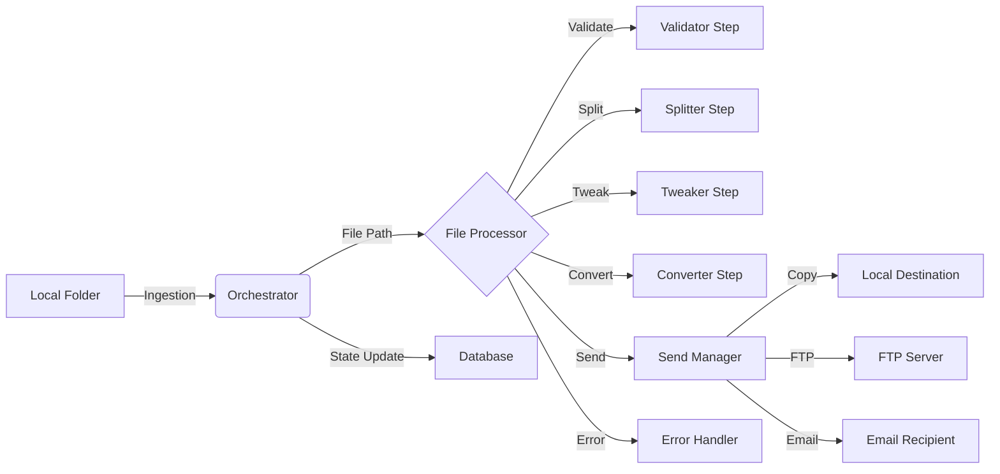

# Data Flow Design Document

This document details how data moves through the Batch File Processor system, from input to processing to output. It covers data sources, processing stages, data sinks, error handling, and state management.

## 1. Overview

The Batch File Processor is designed to automate the processing of EDI (Electronic Data Interchange) files. The system monitors configured local folders for new files, processes them through a pipeline of operations (validation, splitting, tweaking, conversion), and then distributes the results to various destinations (local folders, FTP servers, email).

The core orchestration logic resides in `dispatch/orchestrator.py`, which coordinates the processing of files across multiple folders. The actual file processing logic is encapsulated in `dispatch/services/file_processor.py` and the `dispatch/pipeline/` modules.

### High-Level Data Flow

## 2. Data Sources

The primary data source for the system is the local file system.

*   **Local Folders**: The system monitors a set of configured local directories. These directories are defined in the `folders` database table.
*   **File Types**: The system primarily processes EDI files, but can handle other file types depending on the configuration.
*   **Ingestion Mechanism**:
    *   The `DispatchOrchestrator` iterates through each active folder configuration.
    *   It uses `os.listdir` (via `FileSystemInterface`) to list files in the directory.
    *   It filters out files that have already been processed by checking the `processed_files` database table (if enabled).

## 3. Processing Stages

The processing pipeline is managed by the `FileProcessor` class in `dispatch/services/file_processor.py`. It executes a series of steps in a specific order.

### 3.1. Ingestion & Validation

*   **Detection**: The system detects new files in the monitored folders.
*   **Initial Validation**: The `EDIValidatorStep` (`dispatch/pipeline/validator.py`) parses the file to ensure it conforms to the EDI standard.
    *   It checks for valid segments, mandatory fields, and structure.
    *   It can return errors (blocking) and warnings (non-blocking).
    *   If `force_edi_validation` is enabled in the folder configuration, invalid files are rejected and processing stops for that file.

### 3.2. Splitting

*   **Logic**: The `EDISplitterStep` (`dispatch/pipeline/splitter.py`) splits a single EDI file (containing multiple invoices/orders) into multiple smaller files.
*   **Criteria**: Splitting is typically done by invoice or order.
*   **Filtering**:
    *   **Category Filtering**: Files can be filtered based on product categories (using UPC lookups).
    *   **Credit/Invoice Filtering**: Files can be filtered to include only invoices or only credit memos.
*   **Output**: The splitter generates a list of temporary file paths for the split files. If splitting is disabled, the original file path is passed to the next stage.

### 3.3. Tweaking

*   **Logic**: The `EDITweakerStep` (`dispatch/pipeline/tweaker.py`) applies custom modifications to the EDI content.
*   **Mechanism**: It uses the `edi_tweaks` module to perform specific text replacements or data manipulations based on the folder configuration.
*   **Output**: A new temporary file with the tweaked content.

### 3.4. Conversion

*   **Logic**: The `EDIConverterStep` (`dispatch/pipeline/converter.py`) transforms the EDI data into a different format.
*   **Supported Formats**: CSV, JSON, XML, and custom formats (e.g., `estore_einvoice`, `fintech`, `scannerware`).
*   **Mechanism**: It dynamically loads conversion modules (e.g., `convert_to_csv.py`) based on the `convert_to_format` setting.
*   **Output**: A new file in the target format.

## 4. Data Sinks

After processing, the `SendManager` (`dispatch/send_manager.py`) distributes the final output file(s) to one or more destinations.

### 4.1. Local File System (Copy)

*   **Backend**: `copy_backend`
*   **Configuration**: `copy_to_directory` setting.
*   **Action**: Copies the file to a specified local directory.
*   **Implementation**: Uses `shutil.copy2` to preserve metadata.

### 4.2. FTP Server

*   **Backend**: `ftp_backend`
*   **Configuration**: `ftp_server`, `ftp_user`, `ftp_password`, `ftp_folder`, `ftp_port`.
*   **Action**: Uploads the file to a remote FTP server.
*   **Implementation**: Uses `ftplib` (or `FTPClientProtocol`) to handle the connection and transfer. Supports standard FTP and FTP-TLS.

### 4.3. Email

*   **Backend**: `email_backend`
*   **Configuration**: `email_to`, `email_subject`.
*   **Action**: Sends the file as an attachment via SMTP.
*   **Implementation**: Uses `smtplib` (or `SMTPClientProtocol`) to send the email.

## 5. Error Handling Flow

Errors can occur at any stage of the pipeline. The system uses an `ErrorHandler` (`dispatch/error_handler.py`) to capture and record these errors.

*   **Capture**: Exceptions are caught within each pipeline step and the `FileProcessor`.
*   **Recording**:
    *   **Database**: Errors are logged to the `errors` table (or similar logging table) with details about the file, folder, and the error message.
    *   **Logs**: Errors are written to the application log file.
*   **Flow Control**:
    *   If a critical error occurs (e.g., validation failure, conversion crash), processing for that specific file is halted.
    *   The system continues to process other files in the batch.
    *   The `FolderResult` object aggregates error counts and messages for reporting.

## 6. State Management

The system maintains state to track progress and prevent duplicate processing.

*   **Processed Files Tracker**:
    *   **Table**: `processed_files`
    *   **Mechanism**: Stores the filename and a hash (checksum) of the file content.
    *   **Check**: Before processing, the system checks if the file's hash already exists in the table.
    *   **Update**: After successful processing (and sending), the file's hash is added to the table.

*   **Run Logs**:
    *   The `DispatchOrchestrator` maintains an in-memory log of the current run's activities.
    *   This log is used for generating reports and email notifications.

*   **Folder Status**:
    *   The `FolderResult` object tracks the number of files processed, failed, and skipped for each folder during a single run.
