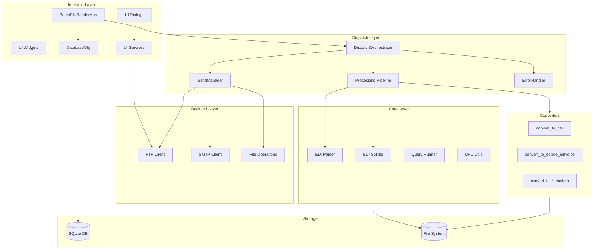
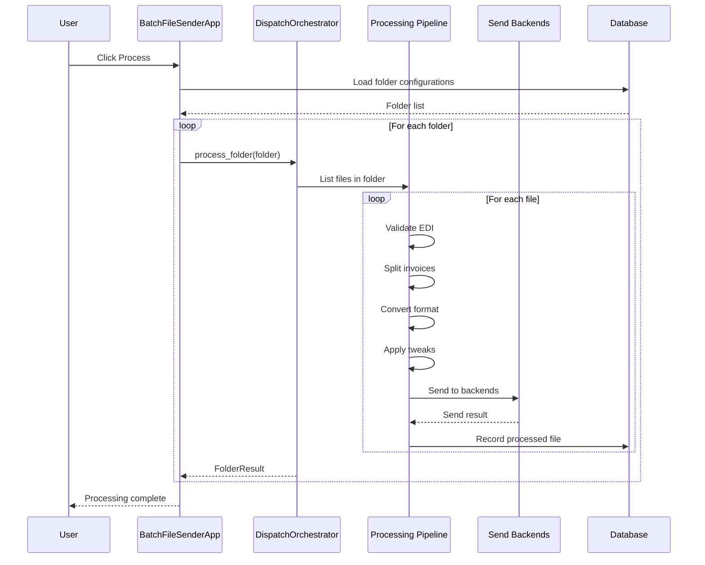
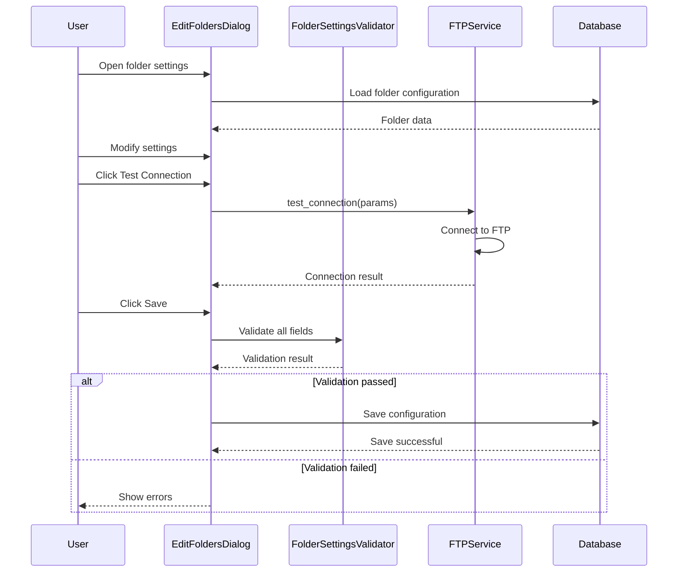
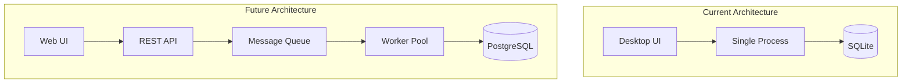

# System Architecture Design Document

## Batch File Processor

**Version:** 1.0  
**Date:** February 2026  
**Status:** Final

---

## Table of Contents

1. [Executive Summary](#1-executive-summary)
2. [System Overview](#2-system-overview)
3. [Architecture Principles](#3-architecture-principles)
4. [High-Level Architecture](#4-high-level-architecture)
5. [Component Details](#5-component-details)
6. [Data Flow Overview](#6-data-flow-overview)
7. [Technology Stack](#7-technology-stack)
8. [Deployment Architecture](#8-deployment-architecture)
9. [Security Considerations](#9-security-considerations)
10. [Scalability Considerations](#10-scalability-considerations)
11. [Appendix](#11-appendix)

---

## 1. Executive Summary

The Batch File Processor is a Python-based desktop application designed to automate the processing, conversion, and distribution of EDI (Electronic Data Interchange) files. The system provides a Tkinter-based graphical user interface for configuration management and supports multiple output formats and delivery mechanisms.

### Key Capabilities

- **EDI File Processing**: Parse, validate, split, and convert EDI files to various formats
- **Multi-Backend Delivery**: Send processed files via FTP/FTPS, SMTP email, or file copy operations
- **Configuration Management**: Database-driven folder configuration with validation
- **Batch Processing**: Process multiple folders with configurable scheduling
- **Audit Trail**: Track processed files with checksums and timestamps

### Architecture Highlights

- **Layered Architecture**: Clear separation between interface, orchestration, backend, and core layers
- **Protocol-Based Design**: Extensive use of Python Protocol classes for dependency injection
- **Pipeline Pattern**: Modular processing pipeline with pluggable steps
- **Testability**: Comprehensive mock implementations for unit and integration testing

---

## 2. System Overview

### 2.1 Purpose

The Batch File Processor automates the workflow of receiving EDI invoice files, transforming them into customer-specific formats, and delivering them to appropriate destinations. It serves as a middleware solution between EDI data sources and downstream systems.

### 2.2 Scope

| In Scope | Out of Scope |
|----------|--------------|
| EDI file parsing and validation | Real-time event processing |
| Format conversion (CSV, custom formats) | Web-based interface |
| FTP/FTPS file transfer | Mobile applications |
| SMTP email delivery | Cloud-native deployment |
| File copy operations | API gateway services |
| Folder configuration management | Multi-tenant SaaS |
| Processing audit logs | Message queue integration |

### 2.3 Key Features

#### 2.3.1 EDI Processing Features

- **Record Parsing**: Support for EDI A (invoice header), B (line item), and C (charge/allowance) records
- **Invoice Splitting**: Split multi-invoice EDI files into individual invoice files
- **Category Filtering**: Filter invoices based on UPC category codes
- **Credit Memo Detection**: Automatic detection and handling of credit memos

#### 2.3.2 Conversion Features

- **Multiple Output Formats**: CSV, eStore eInvoice, Scannerware, YellowDog, Stewart's Custom, Jolley Custom
- **UPC Lookup**: Integration with UPC dictionary for product code resolution
- **Custom Transformations**: Configurable field mappings and calculations

#### 2.3.3 Delivery Features

- **FTP/FTPS**: Secure file transfer with TLS support and automatic fallback
- **SMTP Email**: Email delivery with attachments and templated subject lines
- **File Copy**: Local and network file copy operations

#### 2.3.4 Management Features

- **Folder Configuration**: Database-driven configuration per watched folder
- **Settings Management**: Global application settings with validation
- **Processed Files Tracking**: Prevent duplicate processing with checksum verification
- **Maintenance Functions**: Database backup, log management, cache clearing

---

## 3. Architecture Principles

### 3.1 Separation of Concerns

The system is organized into distinct layers, each with a specific responsibility:

```
┌─────────────────────────────────────────────────────────────┐
│                    INTERFACE LAYER                          │
│         UI Components, Dialogs, Widgets, Services           │
├─────────────────────────────────────────────────────────────┤
│                    DISPATCH LAYER                           │
│      Orchestration, Pipeline, Validation, Error Handling    │
├─────────────────────────────────────────────────────────────┤
│                    BACKEND LAYER                            │
│        FTP Client, SMTP Client, File Operations             │
├─────────────────────────────────────────────────────────────┤
│                    CORE LAYER                               │
│          Database, EDI Processing, Utilities                │
└─────────────────────────────────────────────────────────────┘
```

### 3.2 Dependency Inversion

High-level modules do not depend on low-level modules. Both depend on abstractions defined via Protocol classes.

**Example**: The [`DispatchOrchestrator`](dispatch/orchestrator.py:103) depends on [`DatabaseInterface`](dispatch/interfaces.py:11), [`FileSystemInterface`](dispatch/interfaces.py:87), and [`BackendInterface`](dispatch/interfaces.py:219) protocols, not concrete implementations.

### 3.3 Protocol-Based Abstraction

The system extensively uses Python's `typing.Protocol` with `@runtime_checkable` decorator to define interfaces:

| Protocol | Location | Purpose |
|----------|----------|---------|
| [`FTPClientProtocol`](backend/protocols.py:11) | backend/protocols.py | FTP client abstraction |
| [`SMTPClientProtocol`](backend/protocols.py:73) | backend/protocols.py | SMTP client abstraction |
| [`DatabaseInterface`](dispatch/interfaces.py:11) | dispatch/interfaces.py | Database operations |
| [`FileSystemInterface`](dispatch/interfaces.py:87) | dispatch/interfaces.py | File system operations |
| [`BackendInterface`](dispatch/interfaces.py:219) | dispatch/interfaces.py | Send backend abstraction |
| [`ValidatorInterface`](dispatch/interfaces.py:261) | dispatch/interfaces.py | File validation |
| [`TkinterProtocol`](interface/interfaces.py) | interface/interfaces.py | Tkinter abstraction |

### 3.4 Pipeline Pattern

File processing follows a pipeline architecture with discrete, composable steps:

```
┌──────────┐   ┌──────────┐   ┌──────────┐   ┌──────────┐   ┌──────────┐
│  Input   │──▶│ Validate │──▶│  Split   │──▶│ Convert  │──▶│   Send   │
│  File    │   │          │   │          │   │          │   │          │
└──────────┘   └──────────┘   └──────────┘   └──────────┘   └──────────┘
```

Each pipeline step implements a specific interface and can be independently tested and mocked.

### 3.5 Dependency Injection

Components receive their dependencies through constructor injection, enabling:

- **Testability**: Mock implementations can be injected during testing
- **Flexibility**: Different implementations can be swapped without code changes
- **Configuration**: Behavior can be customized through dependency configuration

**Example** from [`EditFoldersDialog`](interface/ui/dialogs/edit_folders_dialog.py:37):

```python
def __init__(
    self,
    parent,
    foldersnameinput: Dict[str, Any],
    title: Optional[str] = None,
    ftp_service: Optional[FTPServiceProtocol] = None,  # Injectable
    validator: Optional[FolderSettingsValidator] = None,  # Injectable
    extractor: Optional[FolderDataExtractor] = None,  # Injectable
    ...
):
```

### 3.6 Single Responsibility

Each module and class has a single, well-defined purpose:

| Module | Responsibility |
|--------|----------------|
| [`edi_parser.py`](core/edi/edi_parser.py) | Parse EDI records into data structures |
| [`edi_splitter.py`](core/edi/edi_splitter.py) | Split multi-invoice files |
| [`orchestrator.py`](dispatch/orchestrator.py) | Coordinate processing workflow |
| [`error_handler.py`](dispatch/error_handler.py) | Record and manage errors |
| [`send_manager.py`](dispatch/send_manager.py) | Manage backend dispatch |

---

## 4. High-Level Architecture

### 4.1 Component Diagram



### 4.2 Layer Responsibilities

#### 4.2.1 Interface Layer

**Location**: [`interface/`](interface/)

The Interface Layer provides the graphical user interface and handles user interactions. It is responsible for:

- Application lifecycle management
- User input validation and feedback
- Configuration dialog presentation
- Progress reporting and status display
- Database connection management for UI operations

**Key Components**:

| Component | File | Description |
|-----------|------|-------------|
| BatchFileSenderApp | [`app.py`](interface/app.py) | Main application class |
| EditFoldersDialog | [`edit_folders_dialog.py`](interface/ui/dialogs/edit_folders_dialog.py) | Folder configuration dialog |
| EditSettingsDialog | [`edit_settings_dialog.py`](interface/ui/dialogs/edit_settings_dialog.py) | Settings configuration dialog |
| MaintenanceDialog | [`maintenance_dialog.py`](interface/ui/dialogs/maintenance_dialog.py) | Maintenance functions dialog |
| DatabaseObj | [`database_obj.py`](interface/database/database_obj.py) | Database access object |
| FolderManager | [`folder_manager.py`](interface/operations/folder_manager.py) | Folder operations manager |

#### 4.2.2 Dispatch Layer

**Location**: [`dispatch/`](dispatch/)

The Dispatch Layer orchestrates the processing workflow. It coordinates validation, conversion, and delivery operations without depending on specific implementations.

**Key Components**:

| Component | File | Description |
|-----------|------|-------------|
| DispatchOrchestrator | [`orchestrator.py`](dispatch/orchestrator.py) | Main orchestration class |
| ValidatorStep | [`pipeline/validator.py`](dispatch/pipeline/validator.py) | EDI validation step |
| SplitterStep | [`pipeline/splitter.py`](dispatch/pipeline/splitter.py) | File splitting step |
| ConverterStep | [`pipeline/converter.py`](dispatch/pipeline/converter.py) | Format conversion step |
| TweakerStep | [`pipeline/tweaker.py`](dispatch/pipeline/tweaker.py) | Post-conversion tweaks |
| SendManager | [`send_manager.py`](dispatch/send_manager.py) | Backend dispatch manager |
| ErrorHandler | [`error_handler.py`](dispatch/error_handler.py) | Error recording and handling |
| FileProcessor | [`services/file_processor.py`](dispatch/services/file_processor.py) | File-level processing |

#### 4.2.3 Backend Layer

**Location**: [`backend/`](backend/)

The Backend Layer provides abstractions over external systems and services. It implements the Protocol interfaces defined for external communications.

**Key Components**:

| Component | File | Description |
|-----------|------|-------------|
| RealFTPClient | [`ftp_client.py`](backend/ftp_client.py) | FTP/FTPS client implementation |
| RealSMTPClient | [`smtp_client.py`](backend/smtp_client.py) | SMTP client implementation |
| FileOperations | [`file_operations.py`](backend/file_operations.py) | File system operations |
| Protocols | [`protocols.py`](backend/protocols.py) | Backend protocol definitions |

#### 4.2.4 Core Layer

**Location**: [`core/`](core/)

The Core Layer contains domain logic and foundational utilities. It has no dependencies on UI or orchestration layers.

**Key Components**:

| Component | File | Description |
|-----------|------|-------------|
| EDIParser | [`edi/edi_parser.py`](core/edi/edi_parser.py) | EDI record parsing |
| EDISplitter | [`edi/edi_splitter.py`](core/edi/edi_splitter.py) | Invoice file splitting |
| CRecGenerator | [`edi/c_rec_generator.py`](core/edi/c_rec_generator.py) | C record generation |
| InvFetcher | [`edi/inv_fetcher.py`](core/edi/inv_fetcher.py) | Invoice fetching |
| POFetcher | [`edi/po_fetcher.py`](core/edi/po_fetcher.py) | Purchase order fetching |
| UPCUtils | [`edi/upc_utils.py`](core/edi/upc_utils.py) | UPC check digit calculation |
| QueryRunner | [`database/query_runner.py`](core/database/query_runner.py) | Database query execution |

#### 4.2.5 Converter Modules

**Location**: Root directory (`convert_to_*.py`)

Converter modules are standalone scripts that transform EDI files into specific output formats. Each converter follows a consistent interface.

**Available Converters**:

| Module | Output Format |
|--------|---------------|
| [`convert_to_csv.py`](convert_to_csv.py) | Standard CSV format |
| [`convert_to_estore_einvoice.py`](convert_to_estore_einvoice.py) | eStore eInvoice format |
| [`convert_to_estore_einvoice_generic.py`](convert_to_estore_einvoice_generic.py) | Generic eStore eInvoice |
| [`convert_to_fintech.py`](convert_to_fintech.py) | Fintech format |
| [`convert_to_jolley_custom.py`](convert_to_jolley_custom.py) | Jolley custom format |
| [`convert_to_scannerware.py`](convert_to_scannerware.py) | Scannerware format |
| [`convert_to_scansheet_type_a.py`](convert_to_scansheet_type_a.py) | ScanSheet Type A |
| [`convert_to_simplified_csv.py`](convert_to_simplified_csv.py) | Simplified CSV |
| [`convert_to_stewarts_custom.py`](convert_to_stewarts_custom.py) | Stewart's custom format |
| [`convert_to_yellowdog_csv.py`](convert_to_yellowdog_csv.py) | YellowDog CSV format |

---

## 5. Component Details

### 5.1 Interface Layer

#### 5.1.1 BatchFileSenderApp

**File**: [`interface/app.py`](interface/app.py)

The main application class that encapsulates all application state and logic.

**Responsibilities**:
- Application initialization and configuration
- UI setup and management
- Event coordination
- Lifecycle methods (setup, run, cleanup)
- Dependency injection for testability

**Key Attributes**:

| Attribute | Type | Description |
|-----------|------|-------------|
| `_appname` | str | Application name |
| `_version` | str | Version string |
| `_database_version` | str | Database schema version |
| `_root` | tkinter.Tk | Tkinter root window |
| `_database_obj` | DatabaseObj | Database access object |

**Key Methods**:

| Method | Description |
|--------|-------------|
| `initialize()` | Initialize application components |
| `run()` | Start the main event loop |
| `shutdown()` | Clean up resources on exit |
| `process_folders()` | Trigger batch processing |
| `edit_folders()` | Open folder configuration dialog |
| `edit_settings()` | Open settings configuration dialog |

#### 5.1.2 DatabaseObj

**File**: [`interface/database/database_obj.py`](interface/database/database_obj.py)

Manages database connections and table access for the application.

**Responsibilities**:
- Database connection management
- Table access abstraction
- Automatic schema migration
- Settings retrieval and caching

**Tables Managed**:

| Table | Purpose |
|-------|---------|
| `folders_table` | Folder configurations |
| `emails_table` | Emails to send |
| `emails_table_batch` | Batch email operations |
| `sent_emails_removal_queue` | Queue for sent email removal |
| `oversight_and_defaults` | Administrative settings |
| `processed_files` | Processed file tracking |
| `settings` | Application settings |

#### 5.1.3 EditFoldersDialog

**File**: [`interface/ui/dialogs/edit_folders_dialog.py`](interface/ui/dialogs/edit_folders_dialog.py)

Dialog for configuring folder settings with dependency injection support.

**Injectable Dependencies**:
- `ftp_service`: FTP connection testing service
- `validator`: Folder settings validator
- `extractor`: Field extraction logic
- `settings_provider`: Settings retrieval callback
- `alias_provider`: Alias retrieval callback

#### 5.1.4 UI Services

**Location**: [`interface/services/`](interface/services/)

| Service | File | Purpose |
|---------|------|---------|
| FTPService | [`ftp_service.py`](interface/services/ftp_service.py) | FTP connection testing |
| ReportingService | [`reporting_service.py`](interface/services/reporting_service.py) | Report generation |

### 5.2 Dispatch Layer

#### 5.2.1 DispatchOrchestrator

**File**: [`dispatch/orchestrator.py`](dispatch/orchestrator.py)

The central coordination class for file processing operations.

**Configuration** via [`DispatchConfig`](dispatch/orchestrator.py:23) dataclass:

| Field | Type | Description |
|-------|------|-------------|
| `database` | DatabaseInterface | Database persistence |
| `file_system` | FileSystemInterface | File operations |
| `backends` | dict[str, BackendInterface] | Send backends |
| `validator` | ValidatorInterface | EDI validator |
| `error_handler` | ErrorHandlerInterface | Error handling |
| `settings` | dict | Global settings |
| `use_pipeline` | bool | Use new pipeline architecture |

**Result Types**:

| Dataclass | Purpose |
|-----------|---------|
| [`FolderResult`](dispatch/orchestrator.py:63) | Result of processing a folder |
| [`FileResult`](dispatch/orchestrator.py:83) | Result of processing a file |

**Key Methods**:

| Method | Description |
|--------|-------------|
| `process_folder()` | Process a single folder |
| `process_file()` | Process a single file |
| `process_folder_with_pipeline()` | Process using pipeline architecture |

#### 5.2.2 Processing Pipeline

**Location**: [`dispatch/pipeline/`](dispatch/pipeline/)

The pipeline architecture provides modular, composable processing steps.

**Pipeline Steps**:

```
┌─────────────────────────────────────────────────────────────────────┐
│                         PROCESSING PIPELINE                          │
├─────────────┬─────────────┬─────────────┬─────────────┬─────────────┤
│  Validator  │   Splitter  │  Converter  │   Tweaker   │    Sender   │
│    Step     │    Step     │    Step     │    Step     │             │
├─────────────┼─────────────┼─────────────┼─────────────┼─────────────┤
│ Validate    │ Split multi │ Convert EDI │ Apply post- │ Send to     │
│ EDI format  │ invoice     │ to output   │ conversion  │ configured  │
│ and content │ files       │ format      │ tweaks      │ backends    │
└─────────────┴─────────────┴─────────────┴─────────────┴─────────────┘
```

**ValidatorStep** ([`validator.py`](dispatch/pipeline/validator.py)):
- Validates EDI file format
- Checks record structure
- Reports validation errors

**SplitterStep** ([`splitter.py`](dispatch/pipeline/splitter.py)):
- Splits multi-invoice files
- Applies category filtering
- Handles credit memo detection

**ConverterStep** ([`converter.py`](dispatch/pipeline/converter.py)):
- Converts EDI to target format
- Supports 10 output formats
- Dynamic module loading

**TweakerStep** ([`tweaker.py`](dispatch/pipeline/tweaker.py)):
- Post-conversion modifications
- Format-specific adjustments

#### 5.2.3 SendManager

**File**: [`dispatch/send_manager.py`](dispatch/send_manager.py)

Manages dispatch of processed files to configured backends.

**Supported Backends**:

| Backend | Module | Protocol |
|---------|--------|----------|
| FTP/FTPS | [`ftp_backend.py`](ftp_backend.py) | FTPClientProtocol |
| SMTP Email | [`email_backend.py`](email_backend.py) | SMTPClientProtocol |
| File Copy | [`copy_backend.py`](copy_backend.py) | FileOperationsProtocol |

#### 5.2.4 FileProcessor Service

**File**: [`dispatch/services/file_processor.py`](dispatch/services/file_processor.py)

Coordinates pipeline steps for individual file processing.

**Result** via [`FileProcessorResult`](dispatch/services/file_processor.py:20) dataclass:

| Field | Type | Description |
|-------|------|-------------|
| `input_path` | str | Original input file path |
| `output_path` | str | Final output file path |
| `was_validated` | bool | Validation performed |
| `validation_passed` | bool | Validation result |
| `was_split` | bool | File was split |
| `was_converted` | bool | File was converted |
| `was_tweaked` | bool | Tweaks applied |
| `files_sent` | bool | Files sent to backends |
| `checksum` | str | MD5 checksum |
| `errors` | list[str] | Error messages |

### 5.3 Backend Layer

#### 5.3.1 FTP Client

**File**: [`backend/ftp_client.py`](backend/ftp_client.py)

**Class**: `RealFTPClient`

Implements [`FTPClientProtocol`](backend/protocols.py:11) for actual FTP connections.

**Features**:
- Support for TLS and non-TLS connections
- Automatic TLS fallback
- Connection retry logic
- Passive mode support

**Key Methods**:

| Method | Description |
|--------|-------------|
| `connect(host, port, timeout)` | Connect to FTP server |
| `login(user, password)` | Authenticate |
| `cwd(directory)` | Change directory |
| `storbinary(cmd, fp, blocksize)` | Store file |
| `quit()` | Graceful disconnect |
| `close()` | Force close |

#### 5.3.2 SMTP Client

**File**: [`backend/smtp_client.py`](backend/smtp_client.py)

**Class**: `RealSMTPClient`

Implements [`SMTPClientProtocol`](backend/protocols.py:73) for email delivery.

**Features**:
- TLS support
- Authentication
- Message and raw email sending

**Key Methods**:

| Method | Description |
|--------|-------------|
| `connect(host, port)` | Connect to SMTP server |
| `starttls()` | Upgrade to TLS |
| `login(user, password)` | Authenticate |
| `sendmail(from_addr, to_addrs, msg)` | Send raw email |
| `send_message(msg)` | Send EmailMessage |

#### 5.3.3 File Operations

**File**: [`backend/file_operations.py`](backend/file_operations.py)

Implements [`FileOperationsProtocol`](backend/protocols.py:148) for file system operations.

**Operations**:
- Copy, move, remove files
- Directory creation and management
- Path manipulation

### 5.4 Core Layer

#### 5.4.1 EDI Parser

**File**: [`core/edi/edi_parser.py`](core/edi/edi_parser.py)

Parses EDI records into structured data.

**Record Types**:

| Record | Dataclass | Description |
|--------|-----------|-------------|
| A Record | [`ARecord`](core/edi/edi_parser.py:11) | Invoice header |
| B Record | [`BRecord`](core/edi/edi_parser.py:28) | Line item |
| C Record | [`CRecord`](core/edi/edi_parser.py:58) | Charge/allowance |

**Key Function**: [`capture_records(line)`](core/edi/edi_parser.py:74)

Parses a single EDI record line into a dictionary based on the record type prefix.

#### 5.4.2 EDI Splitter

**File**: [`core/edi/edi_splitter.py`](core/edi/edi_splitter.py)

**Class**: `EDISplitter`

Splits multi-invoice EDI files into individual invoice files.

**Configuration** via [`SplitConfig`](core/edi/edi_splitter.py) dataclass:

| Field | Description |
|-------|-------------|
| `input_path` | Input file path |
| `output_dir` | Output directory |
| `prefix` | Output filename prefix |
| `suffix` | Output filename suffix |
| `category_filter` | UPC categories to include |
| `upc_dict` | UPC dictionary for filtering |

**Result** via [`SplitResult`](core/edi/edi_splitter.py) dataclass:

| Field | Description |
|-------|-------------|
| `files` | List of output file paths |
| `invoices_processed` | Number of invoices processed |
| `invoices_skipped` | Invoices skipped by filter |

#### 5.4.3 Query Runner

**File**: [`core/database/query_runner.py`](core/database/query_runner.py)

Provides database query execution with dependency injection support.

**Configuration** via [`ConnectionConfig`](core/database/query_runner.py:14) dataclass:

| Field | Description |
|-------|-------------|
| `username` | Database username |
| `password` | Database password |
| `dsn` | ODBC Data Source Name |
| `database` | Database name |

**Protocol**: [`DatabaseConnectionProtocol`](core/database/query_runner.py:30)

**Implementation**: [`PyODBCConnection`](core/database/query_runner.py:54)

### 5.5 Converter Modules

#### 5.5.1 Converter Interface

All converters follow a consistent interface:

```python
def edi_convert(
    edi_process: str,        # Input EDI file path
    output_filename: str,    # Output filename (without extension)
    settings_dict: dict,     # Global settings
    parameters_dict: dict,   # Folder-specific parameters
    upc_lut: dict           # UPC lookup table
) -> None:
```

#### 5.5.2 Supported Formats

| Format | Module | Description |
|--------|--------|-------------|
| CSV | [`convert_to_csv.py`](convert_to_csv.py) | Standard CSV with configurable headers |
| eStore eInvoice | [`convert_to_estore_einvoice.py`](convert_to_estore_einvoice.py) | eStore electronic invoice format |
| eStore Generic | [`convert_to_estore_einvoice_generic.py`](convert_to_estore_einvoice_generic.py) | Generic eStore format |
| Fintech | [`convert_to_fintech.py`](convert_to_fintech.py) | Fintech payment format |
| Jolley Custom | [`convert_to_jolley_custom.py`](convert_to_jolley_custom.py) | Custom Jolley format |
| Scannerware | [`convert_to_scannerware.py`](convert_to_scannerware.py) | Scannerware POS format |
| ScanSheet Type A | [`convert_to_scansheet_type_a.py`](convert_to_scansheet_type_a.py) | ScanSheet Type A format |
| Simplified CSV | [`convert_to_simplified_csv.py`](convert_to_simplified_csv.py) | Simplified CSV format |
| Stewart's Custom | [`convert_to_stewarts_custom.py`](convert_to_stewarts_custom.py) | Stewart's custom format |
| YellowDog CSV | [`convert_to_yellowdog_csv.py`](convert_to_yellowdog_csv.py) | YellowDog CSV format |

---

## 6. Data Flow Overview

### 6.1 Processing Flow



### 6.2 Configuration Flow



### 6.3 Data Structures

#### 6.3.1 Folder Configuration

```python
{
    'id': int,
    'alias': str,                    # Display name
    'folder_name': str,              # Watched folder path
    'enabled': bool,                 # Processing enabled
    'send_backend': str,             # Backend type: ftp, email, copy
    'convert_format': str,           # Output format
    'split_files': bool,             # Split multi-invoice files
    'category_filter': str,          # UPC categories to include
    # FTP parameters
    'ftp_server': str,
    'ftp_port': int,
    'ftp_username': str,
    'ftp_password': str,
    'ftp_folder': str,
    # Email parameters
    'email_to': str,
    'email_subject_line': str,
    # Conversion parameters
    'calculate_upc_check_digit': bool,
    'include_a_records': bool,
    'include_c_records': bool,
    'include_headers': bool,
    # ... additional parameters
}
```

#### 6.3.2 Settings Dictionary

```python
{
    'email_address': str,            # Sender email
    'email_smtp_server': str,        # SMTP server
    'smtp_port': int,                # SMTP port
    'email_username': str,           # SMTP username
    'email_password': str,           # SMTP password
    'database_path': str,            # Database file path
    'log_path': str,                 # Log file path
    # ... additional settings
}
```

---

## 7. Technology Stack

### 7.1 Core Technologies

| Category | Technology | Version | Purpose |
|----------|------------|---------|---------|
| Language | Python | 3.10+ | Primary development language |
| GUI Framework | Tkinter | stdlib | Desktop user interface |
| Database | SQLite | 3.x | Configuration storage |
| ORM | Dataset | 1.6.2 | Database abstraction |

### 7.2 Key Dependencies

#### 7.2.1 User Interface

| Package | Version | Purpose |
|---------|---------|---------|
| `appdirs` | 1.4.4 | Platform-specific directories |
| `Pillow` | 10.3.0 | Image processing for icons |

#### 7.2.2 Data Processing

| Package | Version | Purpose |
|---------|---------|---------|
| `openpyxl` | 3.0.9 | Excel file handling |
| `lxml` | 4.9.3 | XML processing |
| `python-barcode` | 0.15.1 | Barcode generation |
| `python-Levenshtein` | 0.22.0 | Fuzzy string matching |

#### 7.2.3 Database

| Package | Version | Purpose |
|---------|---------|---------|
| `dataset` | 1.6.2 | SQL abstraction layer |
| `SQLAlchemy` | 1.4.49 | Database toolkit |
| `alembic` | 1.7.7 | Database migrations |
| `pyodbc` | 5.0.1 | ODBC connectivity |

#### 7.2.4 Networking

| Package | Version | Purpose |
|---------|---------|---------|
| `requests` | 2.32.2 | HTTP client |
| `urllib3` | 2.2.2 | URL handling |
| `certifi` | 2024.7.4 | SSL certificates |

#### 7.2.5 Email

| Package | Version | Purpose |
|---------|---------|---------|
| `premailer` | 3.10.0 | Email HTML processing |
| `validate-email` | 1.3 | Email validation |

#### 7.2.6 Testing

| Package | Version | Purpose |
|---------|---------|---------|
| `pytest` | 7.4.3 | Test framework |
| `pytest-timeout` | 2.2.0 | Test timeout handling |

### 7.3 Build Tools

| Tool | Purpose |
|------|---------|
| PyInstaller | Create Windows executable |
| Docker | Containerized testing environment |

---

## 8. Deployment Architecture

### 8.1 Desktop Deployment

The application is deployed as a desktop application on Windows workstations.

```
┌─────────────────────────────────────────────────────────────┐
│                    WINDOWS WORKSTATION                       │
├─────────────────────────────────────────────────────────────┤
│  ┌─────────────────────────────────────────────────────┐    │
│  │              BATCH FILE SENDER                       │    │
│  │              (PyInstaller Executable)                │    │
│  └─────────────────────────────────────────────────────┘    │
│                           │                                  │
│                           ▼                                  │
│  ┌─────────────────────────────────────────────────────┐    │
│  │              SQLite Database                         │    │
│  │              (Local Configuration)                   │    │
│  └─────────────────────────────────────────────────────┘    │
│                           │                                  │
│                           ▼                                  │
│  ┌─────────────────────────────────────────────────────┐    │
│  │              Watched Folders                         │    │
│  │              (EDI Input Files)                       │    │
│  └─────────────────────────────────────────────────────┘    │
└─────────────────────────────────────────────────────────────┘
                           │
                           ▼
        ┌──────────────────┼──────────────────┐
                        External
                        Services
        ┌──────────────────┼──────────────────┐
        │                  │                  │
        ▼                  ▼                  ▼
   ┌─────────┐       ┌─────────┐       ┌─────────┐
   │   FTP   │       │  SMTP   │       │  File   │
   │ Server  │       │ Server  │       │  Share  │
   └─────────┘       └─────────┘       └─────────┘
```

### 8.2 Directory Structure

```
%APPDATA%/Batch File Sender/
├── batch_file_sender.db      # SQLite database
├── logs/                     # Application logs
│   └── processing.log
├── backups/                  # Database backups
│   └── backup_YYYYMMDD.db
└── cache/                    # Temporary cache
    └── upc_dictionary.pkl
```

### 8.3 Build Process

The application is built using PyInstaller with hooks for module inclusion.

**Build Script**: [`buildwin.sh`](buildwin.sh)

**PyInstaller Hooks**: [`hooks/`](hooks/)

| Hook | Purpose |
|------|---------|
| `hook-backend.py` | Include backend module |
| `hook-core.py` | Include core module |
| `hook-dispatch.py` | Include dispatch module |
| `hook-interface.py` | Include interface module |

### 8.4 Docker Support

A Dockerfile is provided for containerized testing and development.

**Dockerfile**: [`Dockerfile`](Dockerfile)

---

## 9. Security Considerations

### 9.1 Credential Storage

**Current Implementation**: Credentials are stored in the SQLite database.

| Credential Type | Storage Location |
|-----------------|------------------|
| FTP Password | `folders_table.ftp_password` |
| SMTP Password | `settings.email_password` |
| Database Password | `settings.db_password` |

**Recommendation**: Consider encrypting sensitive credentials at rest using a key derived from user credentials or system keychain integration.

### 9.2 Network Communications

| Protocol | Security |
|----------|----------|
| FTP | Plain text (not recommended) |
| FTPS | TLS encryption (recommended) |
| SMTP | STARTTLS support |
| SMTPS | TLS encryption |

**Implementation Notes**:
- FTP backend attempts TLS first, falls back to plain FTP
- SMTP client uses STARTTLS when available
- Certificate validation uses `certifi` package for trusted roots

### 9.3 File System Access

The application operates with the permissions of the logged-in user.

**Access Patterns**:
- Read access to watched folders
- Write access to output directories
- Read/write access to application data directory

### 9.4 Input Validation

**EDI Validation**: Files are validated for:
- Correct record structure
- Valid record types (A, B, C)
- Field length compliance
- Numeric field validation

**Configuration Validation**: User inputs are validated via [`FolderSettingsValidator`](interface/validation/folder_settings_validator.py):
- Email address format
- Port number ranges
- Path existence checks
- Required field validation

### 9.5 Error Handling

Sensitive information is protected in error handling:
- Passwords are not logged
- Connection strings are sanitized
- Stack traces are logged but not displayed to users

---

## 10. Scalability Considerations

### 10.1 Current Limitations

| Limitation | Impact |
|------------|--------|
| Single-threaded UI | UI freezes during processing |
| Synchronous processing | One folder at a time |
| Desktop-only | No remote access |
| File-based database | Limited concurrent access |

### 10.2 Horizontal Scaling

The current architecture supports horizontal scaling at the folder level:

```
┌─────────────────────────────────────────────────────────────┐
│                    LOAD BALANCER                             │
└───────────────────────────┬─────────────────────────────────┘
                            │
        ┌───────────────────┼───────────────────┐
        │                   │                   │
        ▼                   ▼                   ▼
┌───────────────┐   ┌───────────────┐   ┌───────────────┐
│  Worker 1     │   │  Worker 2     │   │  Worker 3     │
│  Folders A-D  │   │  Folders E-H  │   │  Folders I-L  │
└───────────────┘   └───────────────┘   └───────────────┘
        │                   │                   │
        └───────────────────┼───────────────────┘
                            │
                            ▼
                    ┌───────────────┐
                    │ Shared Storage│
                    │  & Database   │
                    └───────────────┘
```

### 10.3 Vertical Scaling

The pipeline architecture supports vertical scaling through:

1. **Parallel Pipeline Steps**: Steps can be parallelized for independent operations
2. **Batch Processing**: Multiple files can be processed concurrently
3. **Async I/O**: Network operations can use async patterns

### 10.4 Future Architecture Evolution



**Migration Path**:
1. Extract business logic into service layer
2. Add REST API wrapper
3. Implement message queue for async processing
4. Migrate database to PostgreSQL
5. Build web UI

---

## 11. Appendix

### 11.1 Glossary

| Term | Definition |
|------|------------|
| **EDI** | Electronic Data Interchange - standard format for business documents |
| **A Record** | EDI invoice header record containing vendor and invoice information |
| **B Record** | EDI line item record containing product and pricing details |
| **C Record** | EDI charge/allowance record for adjustments |
| **UPC** | Universal Product Code - product identifier |
| **FTPS** | FTP over TLS/SSL - secure file transfer |
| **Pipeline** | Sequential processing pattern with discrete steps |
| **Protocol** | Python structural typing interface |
| **Dependency Injection** | Design pattern for providing dependencies externally |

### 11.2 File Reference

#### 11.2.1 Interface Layer Files

| File | Lines | Purpose |
|------|-------|---------|
| [`interface/app.py`](interface/app.py) | ~1000 | Main application class |
| [`interface/interfaces.py`](interface/interfaces.py) | ~300 | UI protocols |
| [`interface/database/database_obj.py`](interface/database/database_obj.py) | ~350 | Database access |
| [`interface/ui/dialogs/edit_folders_dialog.py`](interface/ui/dialogs/edit_folders_dialog.py) | ~1800 | Folder configuration |
| [`interface/ui/dialogs/edit_settings_dialog.py`](interface/ui/dialogs/edit_settings_dialog.py) | ~600 | Settings configuration |
| [`interface/ui/dialogs/maintenance_dialog.py`](interface/ui/dialogs/maintenance_dialog.py) | ~500 | Maintenance functions |
| [`interface/services/ftp_service.py`](interface/services/ftp_service.py) | ~120 | FTP testing service |
| [`interface/services/reporting_service.py`](interface/services/reporting_service.py) | ~400 | Report generation |

#### 11.2.2 Dispatch Layer Files

| File | Lines | Purpose |
|------|-------|---------|
| [`dispatch/orchestrator.py`](dispatch/orchestrator.py) | ~550 | Processing orchestration |
| [`dispatch/interfaces.py`](dispatch/interfaces.py) | ~360 | Dispatch protocols |
| [`dispatch/pipeline/validator.py`](dispatch/pipeline/validator.py) | ~250 | Validation step |
| [`dispatch/pipeline/splitter.py`](dispatch/pipeline/splitter.py) | ~400 | Splitting step |
| [`dispatch/pipeline/converter.py`](dispatch/pipeline/converter.py) | ~300 | Conversion step |
| [`dispatch/pipeline/tweaker.py`](dispatch/pipeline/tweaker.py) | ~250 | Tweaking step |
| [`dispatch/send_manager.py`](dispatch/send_manager.py) | ~200 | Backend dispatch |
| [`dispatch/error_handler.py`](dispatch/error_handler.py) | ~250 | Error handling |
| [`dispatch/services/file_processor.py`](dispatch/services/file_processor.py) | ~400 | File processing |

#### 11.2.3 Backend Layer Files

| File | Lines | Purpose |
|------|-------|---------|
| [`backend/protocols.py`](backend/protocols.py) | ~230 | Backend protocols |
| [`backend/ftp_client.py`](backend/ftp_client.py) | ~300 | FTP client |
| [`backend/smtp_client.py`](backend/smtp_client.py) | ~280 | SMTP client |
| [`backend/file_operations.py`](backend/file_operations.py) | ~380 | File operations |

#### 11.2.4 Core Layer Files

| File | Lines | Purpose |
|------|-------|---------|
| [`core/edi/edi_parser.py`](core/edi/edi_parser.py) | ~200 | EDI parsing |
| [`core/edi/edi_splitter.py`](core/edi/edi_splitter.py) | ~350 | EDI splitting |
| [`core/edi/c_rec_generator.py`](core/edi/c_rec_generator.py) | ~150 | C record generation |
| [`core/edi/inv_fetcher.py`](core/edi/inv_fetcher.py) | ~180 | Invoice fetching |
| [`core/edi/po_fetcher.py`](core/edi/po_fetcher.py) | ~100 | PO fetching |
| [`core/edi/upc_utils.py`](core/edi/upc_utils.py) | ~80 | UPC utilities |
| [`core/database/query_runner.py`](core/database/query_runner.py) | ~180 | Query execution |

### 11.3 References

- [Python typing.Protocol Documentation](https://docs.python.org/3/library/typing.html#typing.Protocol)
- [Tkinter Documentation](https://docs.python.org/3/library/tkinter.html)
- [Dataset Library](https://dataset.readthedocs.io/)
- [EDI Standards](https://www.x12.org/)
- [PyInstaller Documentation](https://pyinstaller.org/)

### 11.4 Document History

| Version | Date | Author | Changes |
|---------|------|--------|---------|
| 1.0 | February 2026 | Architecture Team | Initial document |

---

*End of Document*
