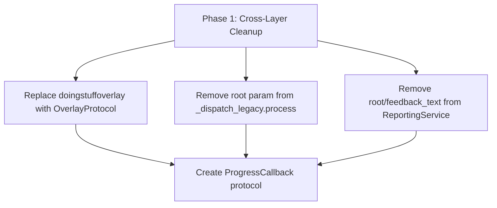
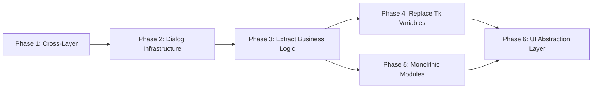

# UI-Business Logic Decoupling Analysis

## Batch File Processor

**Version:** 1.0  
**Date:** February 2026  
**Status:** Analysis Complete  
**Purpose:** Identify all coupling points between Tkinter UI and business logic to enable UI toolkit swap

---

## Table of Contents

1. [Executive Summary](#1-executive-summary)
2. [Current Architecture Overview](#2-current-architecture-overview)
3. [Coupling Points Inventory](#3-coupling-points-inventory)
4. [Already Decoupled Areas](#4-already-decoupled-areas)
5. [Severity Assessment](#5-severity-assessment)
6. [Recommended Decoupling Strategy](#6-recommended-decoupling-strategy)
7. [Risk Assessment](#7-risk-assessment)
8. [Appendix: File-by-File Summary](#8-appendix-file-by-file-summary)

---

## 1. Executive Summary

The Batch File Processor has a **partially refactored** architecture. Significant work has already been done to extract business logic into services, operations, models, and validation layers. However, substantial coupling remains, particularly in:

- **35+ Tkinter variable types** (`StringVar`, `BooleanVar`, `IntVar`) used as business state containers
- **Direct database access** from within UI dialog code
- **SMTP/FTP network operations** embedded in validation methods
- **The `doingstuffoverlay` module** acting as a global Tkinter-dependent progress indicator used across all layers
- **The `_dispatch_legacy.py` module** accepting a Tkinter root window parameter for overlay updates
- **The `dialog.py` base class** inheriting directly from `tkinter.Toplevel`
- **5 root-level modules** (`dialog.py`, `doingstuffoverlay.py`, `resend_interface.py`, `database_import.py`, `tk_extra_widgets.py`) that are pure Tkinter with no abstraction

The **backend**, **dispatch**, and **core** layers are **completely clean** of Tkinter imports — a strong foundation for decoupling.

### Key Metrics

| Metric | Count |
|--------|-------|
| Files with Tkinter imports | ~15 |
| Tkinter variable instances (StringVar/BooleanVar/IntVar) | ~45 |
| Direct `tkinter.messagebox` calls from business logic | ~12 |
| Database operations inside UI classes | ~20 |
| Network operations inside UI validation | 2 (SMTP, FTP) |
| Modules passing `tkinter.Tk` root to non-UI layers | 2 |

---

## 2. Current Architecture Overview

### 2.1 Layer Diagram

```
┌─────────────────────────────────────────────────────────────────────┐
│                    INTERFACE LAYER (Tkinter-coupled)                │
│                                                                     │
│  ┌──────────────┐  ┌──────────────┐  ┌──────────────────────────┐  │
│  │ app.py       │  │ Dialogs      │  │ Root-level UI modules    │  │
│  │ (orchestrator│  │ edit_folders  │  │ dialog.py                │  │
│  │  + UI)       │  │ edit_settings│  │ doingstuffoverlay.py     │  │
│  │              │  │ maintenance  │  │ resend_interface.py      │  │
│  │              │  │ processed    │  │ database_import.py       │  │
│  │              │  │              │  │ tk_extra_widgets.py      │  │
│  └──────────────┘  └──────────────┘  └──────────────────────────┘  │
│                                                                     │
│  ┌──────────────┐  ┌──────────────┐  ┌──────────────────────────┐  │
│  │ Widgets      │  │ Services     │  │ Protocols                │  │
│  │ folder_list  │  │ ftp_service  │  │ interfaces.py            │  │
│  │ search       │  │ reporting    │  │ (MessageBox, FileDialog, │  │
│  │              │  │              │  │  Widget, Tkinter, Overlay)│  │
│  └──────────────┘  └──────────────┘  └──────────────────────────┘  │
│                                                                     │
│  ┌──────────────┐  ┌──────────────┐  ┌──────────────────────────┐  │
│  │ Operations   │  │ Models       │  │ Validation               │  │
│  │ folder_mgr   │  │ folder_config│  │ folder_settings_validator│  │
│  │ data_extract │  │              │  │ email_validator          │  │
│  └──────────────┘  └──────────────┘  └──────────────────────────┘  │
├─────────────────────────────────────────────────────────────────────┤
│                    DISPATCH LAYER (Clean - no Tkinter)              │
│         Orchestrator, Pipeline, Validation, Error Handling          │
│         EXCEPT: _dispatch_legacy.py imports doingstuffoverlay       │
├─────────────────────────────────────────────────────────────────────┤
│                    BACKEND LAYER (Clean - no Tkinter)               │
│        FTP Client, SMTP Client, File Operations                    │
├─────────────────────────────────────────────────────────────────────┤
│                    CORE LAYER (Clean - no Tkinter)                  │
│          Database, EDI Processing, Utilities                       │
└─────────────────────────────────────────────────────────────────────┘
```

### 2.2 Refactoring Progress

The codebase is in a **transitional state**. A major refactoring effort has already:

1. **Extracted** the monolithic `main_interface.py` (164K chars) into [`interface/app.py`](interface/app.py) (~41K chars)
2. **Created** service classes: [`FTPService`](interface/services/ftp_service.py), [`ReportingService`](interface/services/reporting_service.py)
3. **Created** operation classes: [`FolderManager`](interface/operations/folder_manager.py), [`FolderDataExtractor`](interface/operations/folder_data_extractor.py)
4. **Created** data models: [`FolderConfiguration`](interface/models/folder_configuration.py) with dataclasses
5. **Created** validation: [`FolderSettingsValidator`](interface/validation/folder_settings_validator.py), [`EmailValidator`](interface/validation/email_validator.py)
6. **Created** UI protocols: [`interface/interfaces.py`](interface/interfaces.py) with `MessageBoxProtocol`, `FileDialogProtocol`, `TkinterProtocol`, `OverlayProtocol`
7. **Extracted** dialogs into separate modules under `interface/ui/dialogs/`
8. **Extracted** widgets into `interface/ui/widgets/`

However, the **protocols defined in `interface/interfaces.py` are not yet used** by the actual UI code. The dialogs and app still call `tkinter.messagebox` functions directly.

---

## 3. Coupling Points Inventory

### 3.1 Tkinter Variables as Business State (HIGH)

Tkinter-specific variable types (`StringVar`, `BooleanVar`, `IntVar`) are used extensively to hold business state that should be plain Python types.

#### 3.1.1 [`EditFoldersDialog`](interface/ui/dialogs/edit_folders_dialog.py:160-197)

| Variable | Type | Line | Business Purpose |
|----------|------|------|-----------------|
| `backendvariable` | `tk.StringVar` | 161 | Backend selection |
| `active_checkbutton` | `tk.StringVar` | 162 | Folder active state |
| `split_edi` | `tk.BooleanVar` | 163 | EDI split toggle |
| `split_edi_send_credits` | `tk.BooleanVar` | 164 | Credit memo toggle |
| `split_edi_send_invoices` | `tk.BooleanVar` | 165 | Invoice toggle |
| `split_edi_filter_categories` | `tk.StringVar` | 166 | Category filter |
| `split_edi_filter_mode` | `tk.StringVar` | 167 | Filter mode |
| `prepend_file_dates` | `tk.BooleanVar` | 168 | Date prepend toggle |
| `ediconvert_options` | `tk.StringVar` | 169 | EDI convert mode |
| `process_edi` | `tk.StringVar` | 170 | EDI processing flag |
| `upc_var_check` | `tk.StringVar` | 171 | UPC check digit |
| `a_rec_var_check` | `tk.StringVar` | 172 | A-record inclusion |
| `c_rec_var_check` | `tk.StringVar` | 173 | C-record inclusion |
| `headers_check` | `tk.StringVar` | 174 | Headers inclusion |
| `ampersand_check` | `tk.StringVar` | 175 | Ampersand filter |
| `tweak_edi` | `tk.BooleanVar` | 176 | EDI tweak toggle |
| `pad_arec_check` | `tk.StringVar` | 177 | A-record padding |
| `a_record_padding_length` | `tk.IntVar` | 178 | Padding length |
| `append_arec_check` | `tk.StringVar` | 179 | A-record append |
| `force_txt_file_ext_check` | `tk.StringVar` | 180 | Force .txt extension |
| `process_backend_copy_check` | `tk.BooleanVar` | 181 | Copy backend toggle |
| `process_backend_ftp_check` | `tk.BooleanVar` | 182 | FTP backend toggle |
| `process_backend_email_check` | `tk.BooleanVar` | 183 | Email backend toggle |
| `force_edi_check_var` | `tk.BooleanVar` | 184 | Force EDI validation |
| `invoice_date_offset` | `tk.IntVar` | 186 | Date offset value |
| `invoice_date_custom_format_string` | `tk.StringVar` | 187 | Custom date format |
| `invoice_date_custom_format` | `tk.BooleanVar` | 188 | Custom format toggle |
| `edi_each_uom_tweak` | `tk.BooleanVar` | 189 | UOM tweak toggle |
| `include_item_numbers` | `tk.BooleanVar` | 190 | Item numbers toggle |
| `include_item_description` | `tk.BooleanVar` | 191 | Item description toggle |
| `split_sales_tax_prepaid_var` | `tk.BooleanVar` | 192 | Sales tax split |
| `override_upc_bool` | `tk.BooleanVar` | 193 | UPC override toggle |
| `override_upc_level` | `tk.IntVar` | 194 | UPC override level |
| `override_upc_category_filter` | `tk.StringVar` | 195 | UPC category filter |
| `upc_target_length` | `tk.IntVar` | 196 | UPC target length |
| `upc_padding_pattern` | `tk.StringVar` | 197 | UPC padding pattern |
| `convert_formats_var` | `tk.StringVar` | 144 | Output format selection |

**Total: 37 Tkinter variables** in `EditFoldersDialog` alone.

#### 3.1.2 [`EditSettingsDialog`](interface/ui/dialogs/edit_settings_dialog.py:120-127)

| Variable | Type | Line | Business Purpose |
|----------|------|------|-----------------|
| `enable_email_checkbutton_variable` | `tkinter.BooleanVar` | 120 | Email enabled |
| `enable_interval_backup_variable` | `tkinter.BooleanVar` | 121 | Backup enabled |
| `enable_reporting_checkbutton_variable` | `tkinter.StringVar` | 122 | Reporting enabled |
| `enable_report_printing_checkbutton_variable` | `tkinter.StringVar` | 123 | Print fallback |
| `report_edi_validator_warnings_checkbutton_variable` | `tkinter.BooleanVar` | 125 | EDI warnings |
| `odbc_drivers_var` | `tkinter.StringVar` | 127 | ODBC driver selection |

**Total: 6 Tkinter variables** in `EditSettingsDialog`.

#### 3.1.3 [`resend_interface.py`](resend_interface.py:22-24)

| Variable | Type | Line | Business Purpose |
|----------|------|------|-----------------|
| `folder_button_variable` | `IntVar` | 22 | Selected folder ID |
| `files_count_variable` | `StringVar` | 23 | File count display |

#### 3.1.4 [`processed_files_dialog.py`](interface/ui/dialogs/processed_files_dialog.py:164)

| Variable | Type | Line | Business Purpose |
|----------|------|------|-----------------|
| `folder_button_variable` | `tkinter.IntVar` | 164 | Selected folder ID |

#### 3.1.5 [`doingstuffoverlay.py`](doingstuffoverlay.py:34-38)

| Variable | Type | Line | Business Purpose |
|----------|------|------|-----------------|
| `label_var` | `tkinter.StringVar` | 34 | Overlay text |
| `header_var` | `tkinter.StringVar` | 36 | Header text |
| `footer_var` | `tkinter.StringVar` | 38 | Footer text |

---

### 3.2 Direct Database Access from UI Code (HIGH)

#### 3.2.1 [`EditFoldersDialog`](interface/ui/dialogs/edit_folders_dialog.py) — Direct `database_import` Access

The dialog falls back to importing `database_import.database_obj_instance` when no provider is injected:

- **Line 133-135**: `database_import.database_obj_instance.settings.find_one(id=1)` — fetches settings for copy directory
- **Line 1381-1383**: `database_import.database_obj_instance.folders_table.find_one(alias=...)` — fetches folder config for "copy from others"
- **Line 1429-1431**: `database_import.database_obj_instance.folders_table.all()` — fetches all aliases for listbox

These are wrapped in `try/except ImportError` blocks, suggesting they are legacy fallbacks, but they still represent direct database coupling.

#### 3.2.2 [`BatchFileSenderApp`](interface/app.py) — Mixed DB + UI Operations

| Method | Line | Coupling Description |
|--------|------|---------------------|
| `_select_folder()` | 449-479 | Reads `oversight_and_defaults`, updates DB, shows `askdirectory`/`askyesno` |
| `_batch_add_folders()` | 481-519 | Reads DB, shows `askdirectory`/`askokcancel`/`showinfo`, updates DB |
| `_send_single()` | 532-549 | Drops/creates session table, shows overlay, processes |
| `_set_main_button_states()` | 426-441 | Queries DB counts, configures button states |
| `_graphical_process_directories()` | 602-631 | Queries DB, shows `showerror`, manages overlay |
| `_process_directories()` | 633-748 | Heavy DB access, file I/O, overlay management, `dispatch.process()` call |
| `_set_defaults_popup()` | 826-892 | Reads DB defaults, constructs 50+ field defaults dict |
| `_show_edit_settings_dialog()` | 776-797 | Passes DB lambdas to dialog |

#### 3.2.3 [`MaintenanceFunctions`](interface/ui/dialogs/maintenance_dialog.py)

| Method | Line | Coupling Description |
|--------|------|---------------------|
| `set_all_inactive()` | 74-92 | Raw SQL query + overlay + popup.update() |
| `set_all_active()` | 94-112 | Raw SQL query + overlay + popup.update() |
| `clear_resend_flags()` | 114-130 | Raw SQL query + overlay |
| `clear_processed_files_log()` | 132-143 | DB delete + `askokcancel` |
| `remove_inactive_folders()` | 145-174 | DB queries + overlay updates |
| `mark_active_as_processed()` | 176-288 | File system + DB + overlay (90+ lines of mixed logic) |
| `database_import_wrapper()` | 290-334 | DB reload + overlay + email backend disable logic |

#### 3.2.4 [`processed_files_dialog.py`](interface/ui/dialogs/processed_files_dialog.py)

| Location | Line | Coupling Description |
|----------|------|---------------------|
| `show_processed_files_dialog()` | 132-148 | DB queries for folder selection |
| `set_output_folder()` | 129-157 | DB read/update for prior folder |
| `export_processed_report()` | 56-79 | DB queries + file I/O |
| Main body | 206-223 | DB queries to populate folder list |

#### 3.2.5 [`resend_interface.py`](resend_interface.py)

The entire module directly accesses `database_connection` tables:
- Line 13-14: `processed_files_table = database_connection['processed_files']`
- Line 17: `configured_folders_table = database_connection['folders']`
- Line 44: `processed_files_table.update(...)` — direct DB update from checkbox callback
- Line 61-66: `processed_files_table.find(...)` — DB query in UI callback

---

### 3.3 Network Operations in UI Validation (HIGH)

#### 3.3.1 [`EditSettingsDialog.validate()`](interface/ui/dialogs/edit_settings_dialog.py:376-495)

**Lines 391-406**: Real SMTP connection test embedded in validation:
```python
server = smtplib.SMTP(
    str(self.email_smtp_server_field.get()),
    str(self.smtp_port_field.get()),
)
server.ehlo()
server.starttls()
server.login(...)
server.quit()
```

This is a **blocking network call** inside a UI validation method with no abstraction or dependency injection.

#### 3.3.2 [`EditFoldersDialog`](interface/ui/dialogs/edit_folders_dialog.py) — FTP Testing

The FTP connection test has been **partially decoupled** via [`FTPService`](interface/services/ftp_service.py). The dialog accepts an injectable `ftp_service` parameter. However, the default still creates a real `FTPService` instance.

---

### 3.4 Tkinter-Specific UI Patterns in Business Logic (MEDIUM)

#### 3.4.1 `doingstuffoverlay.py` — Global Tkinter Module

[`doingstuffoverlay.py`](doingstuffoverlay.py) is a **global module** using module-level Tkinter state:

- **Global variables**: `doing_stuff_frame`, `doing_stuff`, `label_var`, `header_var`, `footer_var` (lines 5-11)
- **`make_overlay()`**: Creates `tkinter.ttk.Frame`, `tkinter.ttk.Label`, calls `parent.update()` (line 19-49)
- **`update_overlay()`**: Configures Tkinter labels, calls `parent.update()` (line 52-60)
- **`destroy_overlay()`**: Destroys Tkinter frame (line 63-71)

This module is imported and used by:
- [`interface/app.py`](interface/app.py) — 8 calls
- [`interface/ui/dialogs/maintenance_dialog.py`](interface/ui/dialogs/maintenance_dialog.py) — 10 calls
- [`interface/ui/dialogs/edit_settings_dialog.py`](interface/ui/dialogs/edit_settings_dialog.py) — 3 calls
- [`_dispatch_legacy.py`](_dispatch_legacy.py) — 1 import + usage in `update_overlay()` function

#### 3.4.2 `_dispatch_legacy.py` — Root Window Parameter

[`_dispatch_legacy.py`](_dispatch_legacy.py:81-83) accepts `root` (Tkinter root window) as a parameter:

```python
def process(database_connection, folders_database, run_log, emails_table,
            run_log_directory, reporting, processed_files, root, args,
            version, errors_folder, settings, simple_output=None):
```

- **Line 122**: `doingstuffoverlay.update_overlay(parent=root, ...)` — uses root for overlay
- **Line 128-130**: `simple_output.configure(text=...)` — configures a Tkinter label directly

This means the **dispatch layer** (which should be UI-agnostic) has an implicit dependency on Tkinter through the `root` and `simple_output` parameters.

#### 3.4.3 [`ReportingService`](interface/services/reporting_service.py) — Root/Feedback Parameters

The `send_report_emails()` method accepts `root` and `feedback_text` parameters (lines 161-163) and passes them through to `batch_log_sender`. While the service itself doesn't import Tkinter, it **propagates Tkinter objects** through its API.

#### 3.4.4 [`dialog.py`](dialog.py) — Base Class Inherits Toplevel

The [`Dialog`](dialog.py:5) base class directly inherits from `tkinter.Toplevel`:

```python
from tkinter import *
from tkinter.ttk import *

class Dialog(Toplevel):
```

All dialogs (`EditFoldersDialog`, `EditSettingsDialog`) inherit from this class, making them **structurally coupled** to Tkinter.

#### 3.4.5 Direct `tkinter.messagebox` Calls

The following files call `tkinter.messagebox` functions directly instead of using the `MessageBoxProtocol`:

| File | Functions Used | Count |
|------|---------------|-------|
| [`interface/app.py`](interface/app.py:27) | `askdirectory`, `askokcancel`, `askyesno`, `showerror`, `showinfo` | ~10 |
| [`interface/ui/dialogs/edit_settings_dialog.py`](interface/ui/dialogs/edit_settings_dialog.py:14) | `askdirectory`, `askokcancel`, `showerror` | ~4 |
| [`interface/ui/dialogs/edit_folders_dialog.py`](interface/ui/dialogs/edit_folders_dialog.py:1686) | `showerror` | 1 |
| [`interface/ui/dialogs/maintenance_dialog.py`](interface/ui/dialogs/maintenance_dialog.py:14) | `askokcancel` | 2 |
| [`resend_interface.py`](resend_interface.py:5) | `showerror` | 3 |
| [`database_import.py`](database_import.py:2) | `askokcancel` | 5 |

---

### 3.5 Callbacks Mixing UI Updates with Business Operations (MEDIUM)

#### 3.5.1 [`BatchFileSenderApp._select_folder()`](interface/app.py:447-479)

This single method:
1. Reads database for prior folder path
2. Shows `askdirectory` dialog
3. Updates database with selected folder
4. Calls `folder_manager.check_folder_exists()`
5. Shows `doingstuffoverlay`
6. Calls `folder_manager.add_folder()`
7. Shows `askyesno` dialog
8. Reads database for folder dict
9. Calls `mark_active_as_processed_wrapper()`
10. Destroys overlay
11. Refreshes UI list

#### 3.5.2 [`BatchFileSenderApp._process_directories()`](interface/app.py:633-748)

This 115-line method mixes:
- Database reads (settings, reporting config)
- File system operations (log directory creation, file writing)
- Backup logic
- UI dialogs (`askokcancel`, `showerror`)
- Overlay management
- Dispatch module invocation (passing `self._root`)
- Reporting service invocation (passing `root` and `feedback_text`)

#### 3.5.3 [`MaintenanceFunctions.mark_active_as_processed()`](interface/ui/dialogs/maintenance_dialog.py:176-288)

This 112-line method mixes:
- File system traversal (`os.listdir`, `os.chdir`)
- MD5 checksum computation
- Database queries and inserts
- Overlay updates (10+ calls to `doingstuffoverlay`)
- Popup window management

---

### 3.6 Custom Tkinter Widgets (LOW-MEDIUM)

#### 3.6.1 [`tk_extra_widgets.py`](tk_extra_widgets.py)

Contains 4 custom Tkinter widgets that would need equivalents in any new toolkit:

| Widget | Lines | Purpose |
|--------|-------|---------|
| [`RightClickMenu`](tk_extra_widgets.py:6) | 6-92 | Context menu for entry widgets |
| [`VerticalScrolledFrame`](tk_extra_widgets.py:97) | 97-250 | Scrollable frame container |
| [`CreateToolTip`](tk_extra_widgets.py:252) | 252-310 | Tooltip for widgets |
| [`columnSorterWidget`](tk_extra_widgets.py:313) | 313-373 | Column order sorter with listbox |

These are **pure UI widgets** with no business logic — they just need toolkit-equivalent replacements.

---

## 4. Already Decoupled Areas

### 4.1 Fully Decoupled (No Tkinter Dependencies)

| Component | File | Description |
|-----------|------|-------------|
| **Backend Layer** | `backend/` | FTP, SMTP, File Operations — all protocol-based |
| **Dispatch Layer** | `dispatch/` | Orchestrator, Pipeline, Validators — all protocol-based |
| **Core Layer** | `core/` | Database, EDI parsing — no UI dependencies |
| **FolderManager** | [`interface/operations/folder_manager.py`](interface/operations/folder_manager.py) | CRUD operations with protocol-based DB access |
| **FolderDataExtractor** | [`interface/operations/folder_data_extractor.py`](interface/operations/folder_data_extractor.py) | Extracts field values from widget refs |
| **FolderConfiguration** | [`interface/models/folder_configuration.py`](interface/models/folder_configuration.py) | Pure dataclass model with validation |
| **FolderSettingsValidator** | [`interface/validation/folder_settings_validator.py`](interface/validation/folder_settings_validator.py) | Pure validation logic |
| **EmailValidator** | [`interface/validation/email_validator.py`](interface/validation/email_validator.py) | Pure regex validation |
| **FTPService** | [`interface/services/ftp_service.py`](interface/services/ftp_service.py) | FTP connection testing abstraction |
| **DatabaseObj** | [`interface/database/database_obj.py`](interface/database/database_obj.py) | Database access with protocol-based design |

### 4.2 Partially Decoupled

| Component | File | What's Done | What Remains |
|-----------|------|-------------|--------------|
| **EditFoldersDialog** | [`edit_folders_dialog.py`](interface/ui/dialogs/edit_folders_dialog.py) | DI for FTP, validator, extractor, alias/settings providers | 37 StringVar/BooleanVar/IntVar; fallback `database_import` access; inherits `Dialog(Toplevel)` |
| **EditSettingsDialog** | [`edit_settings_dialog.py`](interface/ui/dialogs/edit_settings_dialog.py) | DI for settings/oversight providers, callbacks | 6 Tkinter vars; direct SMTP test in validate(); inherits `Dialog(Toplevel)` |
| **MaintenanceFunctions** | [`maintenance_dialog.py`](interface/ui/dialogs/maintenance_dialog.py) | DI for callbacks, database_obj | Direct overlay calls; raw SQL; mixed file I/O + DB + UI |
| **FolderListWidget** | [`folder_list_widget.py`](interface/ui/widgets/folder_list_widget.py) | Protocol-based `FolderTableProtocol`; callback-based actions | Tkinter widget construction |
| **SearchWidget** | [`search_widget.py`](interface/ui/widgets/search_widget.py) | Callback-based filter; clean API | Tkinter widget construction |
| **ReportingService** | [`reporting_service.py`](interface/services/reporting_service.py) | No Tkinter imports | Accepts `root` and `feedback_text` as `Any` parameters |

### 4.3 Protocol Definitions (Ready but Unused)

[`interface/interfaces.py`](interface/interfaces.py) defines these protocols that are **not yet consumed** by the UI code:

| Protocol | Purpose | Used By |
|----------|---------|---------|
| `MessageBoxProtocol` | Abstract message dialogs | Not used — dialogs call `tkinter.messagebox` directly |
| `FileDialogProtocol` | Abstract file/directory selection | Not used — code calls `askdirectory` directly |
| `WidgetProtocol` | Abstract widget operations | Not used |
| `TkinterProtocol` | Abstract root window | Referenced in `app.py` import but not enforced |
| `OverlayProtocol` | Abstract overlay operations | Not used — code calls `doingstuffoverlay` directly |

---

## 5. Severity Assessment

### 5.1 Severity Rating Scale

- **HIGH**: Requires significant architectural changes; business logic is deeply intertwined with UI
- **MEDIUM**: Requires moderate refactoring; coupling exists but boundaries are partially defined
- **LOW**: Straightforward replacement; pure UI code with no business logic

### 5.2 Coupling Points by Severity

| # | Coupling Point | Severity | Affected Files | Description |
|---|---------------|----------|----------------|-------------|
| C1 | Tkinter variables as business state | **HIGH** | `edit_folders_dialog.py`, `edit_settings_dialog.py` | 43+ `StringVar`/`BooleanVar`/`IntVar` instances hold business state |
| C2 | `_process_directories()` mixed concerns | **HIGH** | `interface/app.py` | 115 lines mixing DB, file I/O, UI dialogs, overlay, dispatch |
| C3 | `_dispatch_legacy.py` root parameter | **HIGH** | `_dispatch_legacy.py`, `interface/app.py` | Dispatch layer accepts Tkinter root for overlay updates |
| C4 | `doingstuffoverlay` global module | **HIGH** | 4+ files | Global Tkinter state; used across all layers |
| C5 | `dialog.py` base class | **HIGH** | `dialog.py`, all dialogs | Base class inherits `tkinter.Toplevel` |
| C6 | SMTP test in `EditSettingsDialog.validate()` | **HIGH** | `edit_settings_dialog.py` | Blocking network call in UI validation |
| C7 | `mark_active_as_processed()` mixed concerns | **HIGH** | `maintenance_dialog.py` | 112 lines mixing file I/O, DB, checksums, overlay |
| C8 | `resend_interface.py` monolithic module | **MEDIUM** | `resend_interface.py` | Entire module is Tkinter + DB with no separation |
| C9 | `database_import.py` monolithic module | **MEDIUM** | `database_import.py` | Tkinter UI + DB migration logic |
| C10 | Direct `messagebox` calls | **MEDIUM** | 6 files | ~12 direct calls instead of using `MessageBoxProtocol` |
| C11 | Direct `askdirectory` calls | **MEDIUM** | 3 files | Direct calls instead of using `FileDialogProtocol` |
| C12 | `_select_folder()` mixed concerns | **MEDIUM** | `interface/app.py` | DB + UI + overlay in single method |
| C13 | `_batch_add_folders()` mixed concerns | **MEDIUM** | `interface/app.py` | DB + UI + overlay in single method |
| C14 | `ReportingService` root/feedback params | **MEDIUM** | `reporting_service.py` | Propagates Tkinter objects through service API |
| C15 | `EditFoldersDialog` fallback DB access | **MEDIUM** | `edit_folders_dialog.py` | `database_import.database_obj_instance` fallback |
| C16 | `processed_files_dialog.py` mixed concerns | **MEDIUM** | `processed_files_dialog.py` | DB queries + Tkinter construction in single function |
| C17 | `tk_extra_widgets.py` custom widgets | **LOW** | `tk_extra_widgets.py` | Pure UI widgets needing toolkit equivalents |
| C18 | `FolderListWidget` Tkinter construction | **LOW** | `folder_list_widget.py` | Clean API but Tkinter internals |
| C19 | `SearchWidget` Tkinter construction | **LOW** | `search_widget.py` | Clean API but Tkinter internals |

---

## 6. Recommended Decoupling Strategy

### 6.1 Phase 1: Eliminate Cross-Layer Tkinter Dependencies

**Goal**: Remove Tkinter from dispatch and service layers.



**Actions**:
1. **Create a `ProgressCallback` protocol** — a simple callable interface `(text: str, header: str, footer: str) -> None` that replaces direct overlay calls
2. **Refactor `_dispatch_legacy.process()`** to accept a `ProgressCallback` instead of `root`
3. **Refactor `ReportingService.send_report_emails()`** to accept a `ProgressCallback` instead of `root`/`feedback_text`
4. **Create a Tkinter implementation** of `ProgressCallback` that wraps `doingstuffoverlay`

### 6.2 Phase 2: Abstract Dialog Infrastructure

**Goal**: Replace `dialog.py` base class and message box calls.

**Actions**:
1. **Create an abstract `DialogBase` class** that doesn't inherit from `tkinter.Toplevel`
2. **Wire up `MessageBoxProtocol`** — inject it into all classes that currently call `tkinter.messagebox` directly
3. **Wire up `FileDialogProtocol`** — inject it into `BatchFileSenderApp`, `EditSettingsDialog`
4. **Create Tkinter implementations** of both protocols

### 6.3 Phase 3: Extract Business Logic from Dialogs

**Goal**: Move all business logic out of dialog classes.

**Actions**:
1. **Extract SMTP validation** from `EditSettingsDialog.validate()` into a new `SMTPService` (similar to existing `FTPService`)
2. **Extract `mark_active_as_processed()`** business logic from `MaintenanceFunctions` into a new `ProcessedFilesService`
3. **Extract `_process_directories()`** from `BatchFileSenderApp` into a `ProcessingService`
4. **Extract `_select_folder()`** and `_batch_add_folders()` into `FolderManager` methods
5. **Remove `database_import` fallback** from `EditFoldersDialog` — require providers to be injected

### 6.4 Phase 4: Replace Tkinter Variables with Plain State

**Goal**: Eliminate all `StringVar`/`BooleanVar`/`IntVar` from business state.

**Actions**:
1. **Create a `DialogState` dataclass** mirroring `FolderConfiguration` for dialog state
2. **Use the existing `FolderConfiguration` model** as the source of truth
3. **Create a bidirectional binding layer** that syncs between `DialogState` and UI widgets
4. **Replace all `.get()` calls on Tkinter vars** with reads from `DialogState`

### 6.5 Phase 5: Refactor Monolithic UI Modules

**Goal**: Separate UI construction from business logic in remaining modules.

**Actions**:
1. **Refactor `resend_interface.py`** — extract DB operations into a service, keep only UI construction
2. **Refactor `database_import.py`** — extract migration logic into a service
3. **Refactor `processed_files_dialog.py`** — extract DB queries into a service

### 6.6 Phase 6: Create UI Abstraction Layer

**Goal**: Define a toolkit-agnostic widget API.

**Actions**:
1. **Define abstract widget interfaces** for: Window, Frame, Button, Label, Entry, Checkbutton, Radiobutton, OptionMenu, Listbox, Scrollbar, Spinbox
2. **Create Tkinter implementations** of each interface
3. **Rewrite dialog `body()` methods** to use abstract interfaces
4. **Replace `tk_extra_widgets.py`** with abstract equivalents

---

## 7. Risk Assessment

### 7.1 High Risk

| Risk | Impact | Mitigation |
|------|--------|------------|
| **Breaking `_dispatch_legacy.py`** | Processing stops working | Comprehensive integration tests exist; refactor incrementally |
| **Breaking dialog validation** | Users can save invalid configs | Existing unit tests for `FolderSettingsValidator`; add SMTP service tests |
| **State synchronization bugs** | UI shows stale data | Implement observer pattern for state changes; add integration tests |
| **Overlay timing issues** | UI freezes or crashes | Replace global state with instance-based overlay; test with mock |

### 7.2 Medium Risk

| Risk | Impact | Mitigation |
|------|--------|------------|
| **Regression in folder operations** | Folders not added/edited correctly | Existing UI tests in `tests/ui/`; expand coverage |
| **Database migration breakage** | Can't import old configs | Test `database_import` refactoring against real DB files |
| **Performance degradation** | Slower UI response | Profile before/after; keep Tkinter event loop responsive |

### 7.3 Low Risk

| Risk | Impact | Mitigation |
|------|--------|------------|
| **Custom widget replacement** | Visual differences | Side-by-side comparison testing |
| **Right-click menu loss** | Minor UX regression | Implement in new toolkit |

### 7.4 Dependencies Between Phases



Phase 1 is the **critical first step** because it removes Tkinter from non-UI layers. Phases 2-5 can be done in parallel to some extent. Phase 6 is the final step that enables the actual toolkit swap.

---

## 8. Appendix: File-by-File Summary

### 8.1 Files Requiring Changes (by effort)

| File | Size | Tkinter Coupling Level | Effort |
|------|------|----------------------|--------|
| [`interface/ui/dialogs/edit_folders_dialog.py`](interface/ui/dialogs/edit_folders_dialog.py) | 74K chars | Very High — 37 Tk vars, DB fallback, 1500+ lines of Tk code | Very High |
| [`interface/app.py`](interface/app.py) | 41K chars | High — mixed DB/UI/overlay, direct messagebox calls | High |
| [`interface/ui/dialogs/edit_settings_dialog.py`](interface/ui/dialogs/edit_settings_dialog.py) | 25K chars | High — 6 Tk vars, SMTP test, direct messagebox | High |
| [`interface/ui/dialogs/maintenance_dialog.py`](interface/ui/dialogs/maintenance_dialog.py) | 19K chars | High — mixed DB/file I/O/overlay, raw SQL | High |
| [`interface/ui/widgets/folder_list_widget.py`](interface/ui/widgets/folder_list_widget.py) | 17K chars | Medium — clean API but Tk internals | Medium |
| [`tk_extra_widgets.py`](tk_extra_widgets.py) | 15K chars | Low — pure Tk widgets, no business logic | Medium |
| [`interface/ui/dialogs/processed_files_dialog.py`](interface/ui/dialogs/processed_files_dialog.py) | 10K chars | Medium — mixed DB/Tk construction | Medium |
| [`resend_interface.py`](resend_interface.py) | 8K chars | High — monolithic Tk + DB | Medium |
| [`interface/ui/widgets/search_widget.py`](interface/ui/widgets/search_widget.py) | 6K chars | Low — clean API, Tk internals | Low |
| [`database_import.py`](database_import.py) | 5K chars | High — monolithic Tk + DB migration | Medium |
| [`doingstuffoverlay.py`](doingstuffoverlay.py) | 2K chars | Very High — global Tk state, used everywhere | Medium |
| [`dialog.py`](dialog.py) | 2K chars | Very High — base class is Toplevel | Low |
| [`_dispatch_legacy.py`](_dispatch_legacy.py) | 34K chars | Medium — accepts root param, uses overlay | Medium |
| [`interface/services/reporting_service.py`](interface/services/reporting_service.py) | 17K chars | Low — passes root/feedback through | Low |

### 8.2 Files Requiring No Changes

| File/Directory | Reason |
|---------------|--------|
| `backend/` (all files) | No Tkinter imports |
| `dispatch/` (all files) | No Tkinter imports |
| `core/` (all files) | No Tkinter imports |
| `interface/models/folder_configuration.py` | Pure dataclass |
| `interface/validation/folder_settings_validator.py` | Pure validation |
| `interface/validation/email_validator.py` | Pure validation |
| `interface/services/ftp_service.py` | Pure service |
| `interface/operations/folder_manager.py` | Pure operations |
| `interface/operations/folder_data_extractor.py` | Pure operations |
| `interface/database/database_obj.py` | Pure database access |
| `interface/interfaces.py` | Protocol definitions (keep and expand) |
