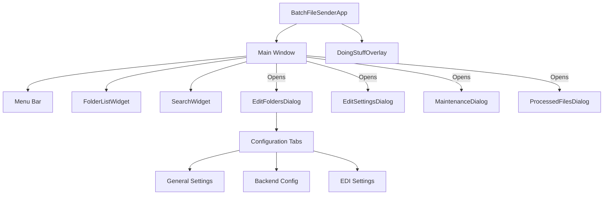

# User Interface Design Document

## 1. Executive Summary

The Batch File Processor application utilizes a desktop-based User Interface (UI) built with Python's Tkinter library. The UI serves as the primary control center for configuring folder monitoring, managing file processing rules, and overseeing the automated dispatch of files.

The design philosophy prioritizes functionality and density of information, reflecting its nature as a utility tool for technical operations. The application follows a single-window architecture with modal dialogs for complex configuration tasks.

Key UI components include:
- **Main Dashboard**: A comprehensive view of active and inactive monitored folders.
- **Configuration Dialogs**: Detailed forms for setting up file processing rules, including FTP, Email, and Copy backends.
- **Maintenance Tools**: Utilities for database management, log viewing, and system health checks.
- **Status Feedback**: Real-time visual feedback through overlays and status bars.

## 2. UI Architecture Overview

### 2.1 Framework Choice
- **Framework**: Tkinter (Python's standard GUI package)
- **Rationale**:
  - Native inclusion in Python (no external dependencies for basic UI).
  - Cross-platform compatibility (Windows/Linux).
  - Sufficient for standard desktop form-based applications.
  - Mature ecosystem with established patterns for event handling and layout management.

### 2.2 High-Level Component Diagram

### 2.3 Window Hierarchy
1.  **Root Window (`Tk`)**: The main application container.
2.  **Top-Level Windows (`Toplevel`)**:
    *   `EditFoldersDialog`: Modal configuration window.
    *   `EditSettingsDialog`: Application-wide settings.
    *   `MaintenanceDialog`: Advanced tools.
    *   `ProcessedFilesDialog`: Reporting interface.

> **Note:** For a detailed, pedantic specification of the widget layout for each window, please refer to the [**Widget Layout Specification**](WIDGET_LAYOUT_SPECIFICATION.md).
    *   `EditSettingsDialog`: Application-wide settings.
    *   `MaintenanceDialog`: Database and system tools.
    *   `ProcessedFilesDialog`: Reporting and log viewing.
    *   `DoingStuffOverlay`: Transient overlay for blocking operations.

## 3. Main Application Window (`BatchFileSenderApp`)

**File**: `interface/app.py`

### 3.1 Window Layout and Geometry
-   **Title**: "Batch File Sender"
-   **Geometry**: Dynamically sized, typically starts centered.
-   **Layout Manager**: `pack` and `grid` are used in combination.
-   **Structure**:
    -   **Top**: Menu Bar
    -   **Header**: Search/Filter Widget
    -   **Body**: Split pane (Active Folders / Inactive Folders) via `FolderListWidget`
    -   **Bottom**: Status/Action Bar (Add Folder, Settings, Maintenance buttons)

### 3.2 Menu Bar Structure
The application uses a standard menu bar with the following structure:

| Menu | Item | Shortcut | Action |
| :--- | :--- | :--- | :--- |
| **File** | Add Folder | `Ctrl+N` | Opens `EditFoldersDialog` for new folder |
| | Settings | `Ctrl+,` | Opens `EditSettingsDialog` |
| | Exit | `Alt+F4` | Closes application |
| **View** | Refresh | `F5` | Reloads folder list from database |
| | Show Logs | `Ctrl+L` | Opens log folder |
| **Tools** | Maintenance | `Ctrl+M` | Opens `MaintenanceDialog` |
| | Processed Files | `Ctrl+P` | Opens `ProcessedFilesDialog` |
| **Help** | About | `F1` | Shows version info |

### 3.3 Main Content Area (`FolderListWidget`)
**File**: `interface/ui/widgets/folder_list_widget.py`

This custom widget manages the display of monitored folders.

-   **Layout**: Two vertical columns (Active Folders, Inactive Folders).
-   **Components**:
    -   `VerticalScrolledFrame`: Custom scrollable container for lists.
    -   **Folder Item**: Each folder is represented by a row containing:
        -   **Label**: Folder Alias (Name)
        -   **Buttons**:
            -   `Send`: Trigger immediate processing.
            -   `Edit`: Open configuration.
            -   `Disable/Enable`: Toggle active state.
            -   `Delete`: Remove configuration.

### 3.4 Search Widget (`SearchWidget`)
**File**: `interface/ui/widgets/search_widget.py`

Provides real-time filtering of the folder list.

-   **Components**:
    -   `Entry`: Text input for search terms.
    -   `Button`: Clear search.
-   **Behavior**: Filters the `FolderListWidget` items based on alias matching as the user types.

## 4. Edit Folders Dialog (`EditFoldersDialog`)

**File**: `interface/ui/dialogs/edit_folders_dialog.py`

This is the most complex dialog in the application, responsible for configuring all aspects of a monitored folder. Due to its complexity, it has its own dedicated design document.

**Reference**: [**Edit Folders Dialog Design**](EDIT_FOLDERS_DIALOG_DESIGN.md)

### 4.1 Key Features
*   **Tabbed Interface**: Organizes settings into logical groups (General, Paths, Processing, Email, Advanced).
*   **Dynamic Fields**: Shows/hides configuration options based on the selected "Convert To" format.
*   **Validation**: Implements robust validation logic for all fields, including connectivity tests for FTP.
*   **Dependency Injection**: Uses injected services for validation and data extraction to facilitate testing.

## 5. Other Dialogs
**File**: `interface/ui/widgets/search_widget.py`

-   **Location**: Top of the main window.
-   **Function**: Filters the folder list in real-time.
-   **Features**:
    -   Fuzzy matching using `thefuzz`.
    -   `Enter` key triggers filter.
    -   `Escape` key clears filter.
    -   Right-click context menu for text operations.

## 4. Dialog Specifications

### 4.1 Edit Folders Dialog (`EditFoldersDialog`)
**File**: `interface/ui/dialogs/edit_folders_dialog.py`

This is the most complex dialog in the system, handling all configuration for a single monitored folder.

-   **Properties**: Modal, Fixed size (resizable=False).
-   **Layout**: Tabbed interface (implied by frames) or segmented vertical layout.

#### Widget Hierarchy & Input Fields

**1. General Settings Frame**
| Label | Widget Type | Variable | Validation |
| :--- | :--- | :--- | :--- |
| Folder Path | `Entry` + `Button` | `folder_name` | Must exist, must be directory |
| Alias | `Entry` | `alias` | Unique, Max 50 chars |
| Backend | `OptionMenu` | `backendvariable` | Selection required |

**2. Backend Settings Frame**
| Label | Widget Type | Variable | Validation |
| :--- | :--- | :--- | :--- |
| Copy Enabled | `Checkbutton` | `process_backend_copy_check` | - |
| Copy Path | `Entry` + `Button` | `copy_to_directory` | Required if enabled |
| FTP Enabled | `Checkbutton` | `process_backend_ftp_check` | - |
| FTP Server | `Entry` | `ftp_server` | Hostname/IP format |
| FTP Port | `Entry` | `ftp_port` | Integer, 1-65535 |
| FTP User | `Entry` | `ftp_user` | Required if enabled |
| FTP Pass | `Entry` (masked) | `ftp_pass` | Required if enabled |
| Email Enabled | `Checkbutton` | `process_backend_email_check` | - |
| Email To | `Entry` | `email_to` | Valid email format |
| Subject | `Entry` | `email_subject` | - |

**3. EDI Configuration Frame**
| Label | Widget Type | Variable | Description |
| :--- | :--- | :--- | :--- |
| Split EDI | `Checkbutton` | `split_edi` | Enable EDI splitting |
| Convert To | `OptionMenu` | `convert_to` | Target format (CSV, etc.) |
| Map Headers | `Checkbutton` | `headers_check` | Include CSV headers |

### 4.2 Edit Settings Dialog (`EditSettingsDialog`)
**File**: `interface/ui/dialogs/edit_settings_dialog.py`

Manages global application configuration.

-   **Properties**: Modal, Fixed size.
-   **Sections**:
    -   **Database**: AS400 connection details (ODBC driver, host, user, pass).
    -   **Email Server**: SMTP settings (Host, Port, User, Pass) for sending emails.
    -   **Reporting**: Global reporting toggles and destination addresses.
    -   **Backup**: Database backup interval settings.

### 4.3 Maintenance Dialog (`MaintenanceDialog`)
**File**: `interface/ui/dialogs/maintenance_dialog.py`

Provides system tools.

-   **Properties**: Modal.
-   **Actions**:
    -   `Set All Active/Inactive`: Bulk status toggle.
    -   `Clear Resend Flags`: Reset processing state.
    -   `Remove Inactive`: Cleanup database.
    -   `Mark Processed`: Manual state override.
    -   `Import Database`: Restore from backup.

### 4.4 Processed Files Dialog (`ProcessedFilesDialog`)
**File**: `interface/ui/dialogs/processed_files_dialog.py`

Displays history of processed files.

-   **Properties**: Modal, Transient.
-   **Layout**:
    -   **Left**: List of folders with history.
    -   **Right**: Action buttons (Export Report).
-   **Features**:
    -   Export to CSV.
    -   Filter by folder.

## 5. Custom Widgets

**File**: `tk_extra_widgets.py`

### 5.1 `VerticalScrolledFrame`
A robust implementation of a scrollable frame in Tkinter.
-   **Usage**: Used in `FolderListWidget` and `ProcessedFilesDialog`.
-   **Features**:
    -   Mousewheel support (Windows/Linux/MacOS).
    -   Dynamic resizing of interior content.
    -   Proper event unbinding to prevent memory leaks.

### 5.2 `RightClickMenu`
Adds standard clipboard operations to Entry widgets.
-   **Actions**: Cut, Copy, Paste, Delete, Select All.
-   **Behavior**: Context-aware (disables Paste if clipboard empty, disables Copy if no selection).

### 5.3 `CreateToolTip`
Provides hover-over tooltips for widgets.
-   **Properties**: `waittime` (500ms), `wraplength` (180px).
-   **Events**: `Enter` (schedule), `Leave` (cancel/hide).

## 6. Widget Catalog

| Widget Class | Native/Custom | Usage | Naming Convention |
| :--- | :--- | :--- | :--- |
| `ttk.Frame` | Native | Layout containers | `*frame` |
| `ttk.Label` | Native | Text display | `*label` |
| `ttk.Entry` | Native | Text input | `*field` or `*entry` |
| `ttk.Button` | Native | Actions | `*button` |
| `ttk.Checkbutton` | Native | Boolean toggles | `*checkbutton` |
| `ttk.OptionMenu` | Native | Dropdown selection | `*menu` |
| `VerticalScrolledFrame` | Custom | Scrollable lists | `*scrolled_frame` |
| `RightClickMenu` | Custom | Context menus | `rclick_menu` |

**Styling Conventions**:
-   Standard `ttk` themes are used (adapts to OS).
-   Padding: Standard `padx=5`, `pady=5` for spacing.
-   Alignment: Labels typically `sticky=tk.E` (right-aligned), Inputs `sticky=tk.W` (left-aligned).

## 7. User Interaction Flows

### 7.1 Adding a New Folder
1.  User clicks "Add Folder" button or `Ctrl+N`.
2.  `EditFoldersDialog` opens with empty fields.
3.  User enters "Folder Path" (validated for existence).
4.  User enters "Alias" (validated for uniqueness).
5.  User selects "Backend" (e.g., Email).
6.  User fills required backend fields (Email To, Subject).
7.  User clicks "Save".
8.  Validation runs; if successful, dialog closes and Main Window refreshes.

### 7.2 Processing a Folder
1.  User locates folder in "Active Folders" list.
2.  User clicks "Send" button on the folder row.
3.  `DoingStuffOverlay` appears with "Working..." message.
4.  Background process executes file operations.
5.  Overlay updates with progress (e.g., "Processing file 1 of 5").
6.  On completion, overlay disappears.
7.  If errors occur, an error dialog or log entry is generated.

## 8. Accessibility Considerations

-   **Keyboard Navigation**:
    -   Standard Tab traversal is supported by Tkinter default behavior.
    -   `SearchWidget` captures focus on specific shortcuts.
-   **Focus Management**:
    -   Dialogs use `grab_set()` to enforce modality and trap focus.
    -   `initial_focus` is set to the first input field in dialogs.
-   **Screen Readers**:
    -   Standard Tkinter widgets generally expose accessible names, though explicit ARIA-like tagging is limited in Tkinter.

## 9. Theming and Styling

-   **Theme**: Uses `ttk` styling which defaults to the OS native look (Vista/Win7 on Windows, Aqua on macOS, Clam/Alt on Linux).
-   **Colors**: Standard system colors. No hardcoded color values are used, ensuring compatibility with system dark/light modes where supported by Tcl/Tk.
-   **Fonts**: Default system fonts.

## 10. Error Handling and User Feedback

### 10.1 Error Dialogs
-   **Module**: `tkinter.messagebox`
-   **Usage**: `showerror`, `showwarning`.
-   **Scenarios**:
    -   Validation failures (e.g., "Invalid Email").
    -   Database connection errors.
    -   File access errors.

### 10.2 Progress Indicators
-   **Component**: `DoingStuffOverlay` (`doingstuffoverlay.py`).
-   **Behavior**:
    -   Blocks all user interaction with the main window.
    -   Displays a centered message (e.g., "Working...").
    -   Updates dynamically via `update_overlay()`.
    -   Prevents "Application Not Responding" perception during long synchronous tasks.

## 11. UI State Management

-   **Persistence**: State is primarily persisted in the SQLite database (`folders` table, `settings` table).
-   **Runtime State**:
    -   `BatchFileSenderApp` holds references to active widgets.
    -   `StringVar`, `IntVar`, `BooleanVar` are used for two-way data binding between widgets and internal logic.
-   **Refresh Mechanism**:
    -   `refresh_ui()` methods re-query the database and rebuild the `FolderListWidget` to reflect changes.

## 12. Appendix

### 12.1 Keyboard Shortcut Reference
| Key | Context | Action |
| :--- | :--- | :--- |
| `Ctrl+N` | Main Window | Add New Folder |
| `F5` | Main Window | Refresh List |
| `Esc` | Dialogs | Cancel / Close |
| `Enter` | Dialogs | OK / Submit |
| `Enter` | Search Widget | Apply Filter |
| `Esc` | Search Widget | Clear Filter |

### 12.2 Widget Property Reference (Common)
| Property | Value | Notes |
| :--- | :--- | :--- |
| `relief` | `tk.GROOVE`, `tk.RIDGE` | Used for frame borders |
| `orient` | `tk.VERTICAL`, `tk.HORIZONTAL` | Separators and Scrollbars |
| `state` | `tk.NORMAL`, `tk.DISABLED` | Toggling interactivity |
