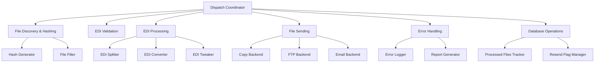
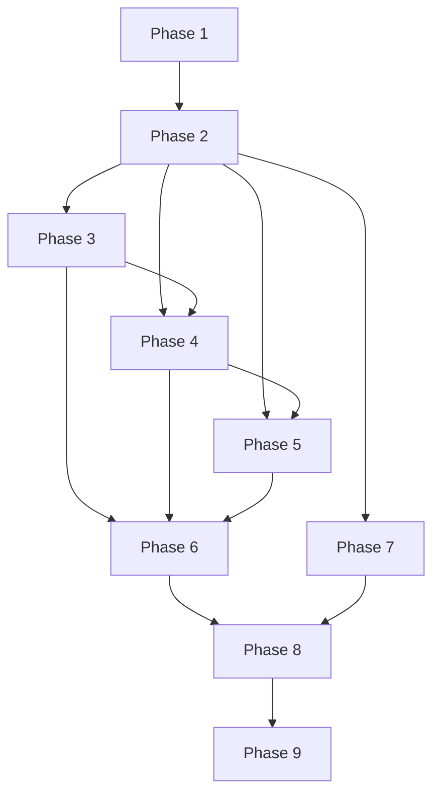

# Dispatch.py Refactoring Plan

## Current Architecture Analysis

**File Location**: `dispatch.py`
**Main Entry Point**: `process()` function (lines 82-569)

### Key Responsibilities
The current dispatch.py is a monolithic module handling:
1. File discovery and hashing
2. EDI validation
3. EDI processing (split, convert, tweak)
4. File sending through multiple backends
5. Error handling and logging
6. Database operations

### Complexity Issues
- **Monolithic structure**: `process()` function is over 400 lines long
- **Global variables**: Extensive use of global state
- **Nested functions**: 4 nested functions within `process()`
- **Complex conditional logic**: Intricate if-else chains
- **Hardcoding**: Backend configurations hardcoded
- **Limited testability**: Tight coupling and global state make testing difficult
- **Threading complexity**: Manual thread management with queues

---

## Refactored Architecture

### High-Level Architecture Diagram

---

## Module Structure Breakdown

### 1. Main Coordinator (`dispatch/coordinator.py`)
- **Responsibilities**:
  - Orchestrate the entire batch processing workflow
  - Manage dependencies between modules
  - Handle configuration and settings
- **Key Classes**:
  - `DispatchCoordinator`: Main orchestrator
  - `ProcessingContext`: Encapsulates all processing state (replaces globals)

### 2. File Discovery & Hashing (`dispatch/file_processor.py`)
- **Responsibilities**:
  - Discover files in folders
  - Generate MD5 checksums with retry logic
  - Determine if files need to be sent (new or resend flag)
- **Key Classes**:
  - `FileDiscoverer`: Finds files in directories
  - `HashGenerator`: Generates MD5 checksums with retry logic
  - `FileFilter`: Determines which files to process

### 3. EDI Validation (`dispatch/edi_validator.py`)
- **Responsibilities**:
  - Validate EDI files using MTC validator
  - Collect and report validation errors
- **Key Classes**:
  - `EDIValidator`: Wraps mtc_edi_validator
  - `ValidationResult`: Encapsulates validation output

### 4. EDI Processing (`dispatch/edi_processor.py`)
- **Responsibilities**:
  - Split EDI files
  - Convert EDI files to various formats
  - Apply EDI tweaks
- **Key Classes**:
  - `EDISplitter`: Handles EDI file splitting
  - `EDIConverter`: Manages format conversion
  - `EDITweaker`: Applies edi_tweaks

### 5. File Sending (`dispatch/send_manager.py`)
- **Responsibilities**:
  - Send files through configured backends
  - Manage backend selection and execution
- **Key Classes**:
  - `SendManager`: Coordinates backend selection
  - `BackendFactory`: Creates backend instances
  - `SendResult`: Encapsulates sending outcome

### 6. Error Handling (`dispatch/error_handler.py`)
- **Responsibilities**:
  - Log errors with context
  - Generate error reports
  - Manage error log files
- **Key Classes**:
  - `ErrorHandler`: Central error management
  - `ErrorLogger`: Handles log file creation
  - `ReportGenerator`: Creates error reports

### 7. Database Operations (`dispatch/db_manager.py`)
- **Responsibilities**:
  - Track processed files
  - Manage resend flags
  - Clean up old records
- **Key Classes**:
  - `DBManager`: Coordinates database operations
  - `ProcessedFilesTracker`: Tracks file processing status
  - `ResendFlagManager`: Manages resend flag logic

---

## Refactoring Task Steps

### Phase 1: Foundation & Setup (Low Complexity)
1. Create dispatch directory structure for modules
2. Move existing test file to appropriate location
3. Create base classes and interfaces
4. Set up module __init__.py files

### Phase 2: Extract File Processing (Medium Complexity)
1. Extract `generate_match_lists()` and `generate_file_hash()` to file_processor.py
2. Create FileDiscoverer, HashGenerator, and FileFilter classes
3. Implement ProcessingContext to replace global variables
4. Update tests for new module

### Phase 3: Extract EDI Validation (Medium Complexity)
1. Extract validate_file() function to edi_validator.py
2. Create EDIValidator class with ValidationResult
3. Remove global variables for validation state
4. Update tests for new module

### Phase 4: Extract EDI Processing (High Complexity)
1. Extract EDI splitting logic to EDISplitter
2. Extract EDI conversion logic to EDIConverter
3. Extract EDI tweaking logic to EDITweaker
4. Handle complex conditional logic for processing paths
5. Update tests for new modules

### Phase 5: Extract File Sending (High Complexity)
1. Extract backend configuration and sending logic to send_manager.py
2. Create BackendFactory for backend instantiation
3. Implement SendManager to coordinate sending operations
4. Remove hardcoded backend configurations
5. Update tests for new module

### Phase 6: Extract Error Handling (Medium Complexity)
1. Extract error logging and reporting to error_handler.py
2. Create ErrorHandler and ErrorLogger classes
3. Implement ReportGenerator for validation reports
4. Update tests for new module

### Phase 7: Extract Database Operations (Medium Complexity)
1. Extract database operations to db_manager.py
2. Create DBManager, ProcessedFilesTracker, and ResendFlagManager
3. Handle processed files tracking and resend flag logic
4. Update tests for new module

### Phase 8: Create Main Coordinator (High Complexity)
1. Create DispatchCoordinator in coordinator.py
2. Implement workflow orchestration logic
3. Replace nested functions with class methods
4. Ensure all modules integrate properly

### Phase 9: Testing & Verification (High Complexity)
1. Run existing tests to ensure functionality preserved
2. Create integration tests for module interactions
3. Verify all edge cases handled correctly
4. Performance testing for multi-threaded operations

---

## Task Dependencies

---

## Complexity & Impact Assessment

| Phase | Complexity | Impact | Risk Level |
|-------|------------|--------|------------|
| 1 | Low | Minimal | Low |
| 2 | Medium | Moderate | Medium |
| 3 | Medium | Moderate | Medium |
| 4 | High | High | High |
| 5 | High | High | High |
| 6 | Medium | Moderate | Medium |
| 7 | Medium | Moderate | Medium |
| 8 | High | Critical | High |
| 9 | High | Critical | High |

---

## Testing Strategy

### 1. Unit Testing
- **Maintain existing tests**: Keep all current test cases for helper functions
- **Module-specific tests**: Create new tests for each extracted module
- **Test isolation**: Use mocking to isolate dependencies
- **Parameterized tests**: Test various configurations and edge cases

### 2. Integration Testing
- **Module interactions**: Test how modules work together
- **Workflow integration**: Test complete processing pipeline
- **Backend integration**: Test with real backend implementations

### 3. Performance Testing
- **Hash generation**: Test multi-threaded hash performance
- **File processing**: Test with large numbers of files
- **EDI processing**: Test with large EDI files

### 4. Regression Testing
- **Run all existing tests**: Ensure no functionality broken
- **Test edge cases**: Handle empty folders, missing files, etc.
- **Validate with real data**: Test with production-like EDI files

---

## Key Improvements

1. **Reduced function length**: Each module has focused responsibilities
2. **Eliminated global variables**: ProcessingContext encapsulates state
3. **Simplified conditional logic**: Modular design reduces nesting
4. **Removed hardcoding**: Backend configurations via BackendFactory
5. **Improved testability**: Dependency injection and isolation
6. **Enhanced code organization**: Clear module boundaries and responsibilities

---

## Files to Be Created/Modified

### New Files
- `dispatch/__init__.py` - Module entry point
- `dispatch/coordinator.py` - Main orchestrator
- `dispatch/file_processor.py` - File discovery and hashing
- `dispatch/edi_validator.py` - EDI validation
- `dispatch/edi_processor.py` - EDI processing
- `dispatch/send_manager.py` - File sending management
- `dispatch/error_handler.py` - Error handling and logging
- `dispatch/db_manager.py` - Database operations

### Modified Files
- `dispatch.py` - Will become a thin wrapper around DispatchCoordinator
- `tests/unit/test_dispatch.py` - Updated with module-specific tests

---

## Success Criteria

1. All existing tests pass
2. New integration tests pass
3. No functionality regression
4. Code complexity metrics show significant improvement
5. Test coverage remains high (or improves)
6. The system functions identically from external perspective
