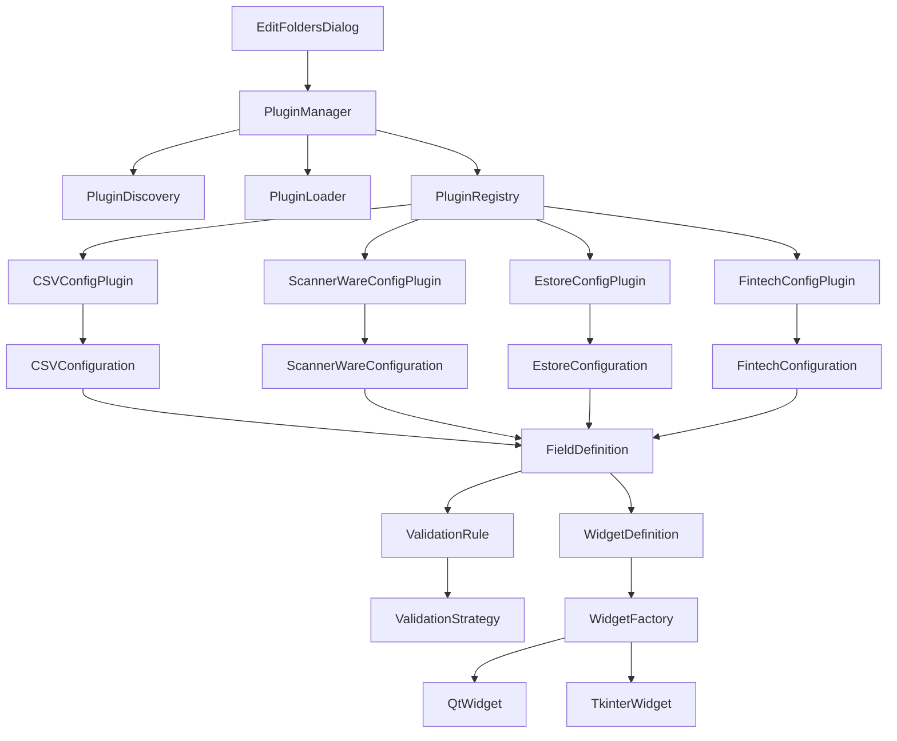

# Edit Folders Dialog Refactoring Plan

## 1. Project Overview

This document outlines a comprehensive refactoring plan for the Edit Folders Dialog system. The goal is to create a modular, extensible architecture that addresses the current monolithic design and improves maintainability, testability, and flexibility.

### Current Challenges

- **Monolithic dialog classes**: Qt (~53KB), Tkinter (~75KB)
- **High coupling**: Direct widget access in validation and data extraction
- **Code duplication**: Similar logic in both Qt and Tkinter implementations
- **Complex dynamic behavior**: EDI configuration based on 11+ convert formats
- **Database schema complexity**: 60+ fields in the folders table
- **Limited extensibility**: Hard to add new convert formats or backend types

## 2. Architecture Goals

### 2.1 Plugin Architecture

Create a plugin system for backend-specific configurations that supports:
- **Modular development**: Each backend type as separate plugin
- **Dynamic discovery**: Plugins loaded at runtime
- **Version management**: Support for plugin versions
- **Isolation**: Plugins don't affect other parts of the system

### 2.2 Widget System

Implement a modular widget system allowing plugins to provide their own UI components:
- **UI framework abstraction**: Support for Qt and Tkinter
- **Component reuse**: Common widgets shared across implementations
- **Dynamic rendering**: Widgets generated from configuration
- **Event management**: Centralized event handling system

### 2.3 Database Field Partitioning

Design a database field partitioning strategy:
- **Normalization**: Split large folders table into logical partitions
- **Configuration storage**: Plugins manage their own field storage
- **Schema evolution**: Support for adding fields without breaking changes
- **Migration support**: Seamless transition from existing system

### 2.4 Generic Config Section Framework

Create a generic framework for configuration sections:
- **Standardized interface**: All config sections follow same pattern
- **Validation system**: Pluggable validation strategies
- **Data mapping**: Automatic field extraction and population
- **Serialization**: Standardized config serialization/deserialization

## 3. Architecture Design

### 3.1 Plugin System Architecture



### 3.2 Plugin Interface Definition

```python
# interface/plugins/base_plugin.py
from abc import ABC, abstractmethod
from typing import Dict, Any, List, Optional
from interface.models.folder_configuration import ConvertFormat
from interface.validation.folder_settings_validator import ValidationResult


class ConfigurationPlugin(ABC):
    """Base interface for all configuration plugins."""
    
    @property
    @abstractmethod
    def format_name(self) -> str:
        """Get the convert format name this plugin supports."""
        pass
    
    @property
    @abstractmethod
    def format_enum(self) -> ConvertFormat:
        """Get the convert format enum."""
        pass
    
    @abstractmethod
    def get_config_fields(self) -> List[Dict[str, Any]]:
        """Get list of field definitions for this configuration."""
        pass
    
    @abstractmethod
    def validate_config(self, config_data: Dict[str, Any]) -> ValidationResult:
        """Validate configuration data for this plugin."""
        pass
    
    @abstractmethod
    def create_config(self, config_data: Dict[str, Any]) -> Dict[str, Any]:
        """Create configuration instance from data."""
        pass
    
    @abstractmethod
    def serialize_config(self, config: Dict[str, Any]) -> Dict[str, Any]:
        """Serialize configuration to dictionary for storage."""
        pass
    
    @abstractmethod
    def deserialize_config(self, data: Dict[str, Any]) -> Dict[str, Any]:
        """Deserialize configuration from stored data."""
        pass
```

### 3.3 Plugin Lifecycle

```
Plugin Discovery → Plugin Loading → Plugin Initialization → Configuration Building → 
UI Rendering → Validation → Serialization → Storage → Plugin Unloading
```

## 4. Implementation Phases

### Phase 1: Plugin System Foundation (Weeks 1-2)

**Key Tasks:**
- [ ] Create plugin interface and base classes
- [ ] Implement plugin discovery mechanism
- [ ] Create plugin manager and registry
- [ ] Develop plugin configuration schema
- [ ] Implement first backend-specific plugin (CSV)
- [ ] Create plugin testing infrastructure

**New Files:**
```
interface/plugins/
├── __init__.py
├── base_plugin.py          # Plugin interface and base classes
├── plugin_manager.py       # Plugin discovery and lifecycle management
├── plugin_registry.py      # Plugin registry
├── csv_config.py           # CSV backend plugin
└── plugin_loader.py        # Plugin loading mechanism
```

### Phase 2: Componentization (Weeks 3-4)

**Key Tasks:**
- [ ] Extract common sections as reusable components
- [ ] Create component factory
- [ ] Implement component-based architecture
- [ ] Refactor dialog to use component system
- [ ] Create UI framework abstraction layer
- [ ] Implement widget factory for dynamic rendering

**New Files:**
```
interface/components/
├── __init__.py
├── component_factory.py    # Component creation and management
├── base_component.py       # Base component interface
├── ftp_section.py          # FTP configuration section
├── email_section.py        # Email configuration section
├── copy_section.py         # Copy configuration section
├── edi_section.py          # EDI configuration section
└── upc_override_section.py # UPC override section
```

### Phase 3: Data Mapping & State Management (Weeks 5-6)

**Key Tasks:**
- [ ] Implement data mapping layer
- [ ] Create state management system
- [ ] Refactor field extraction and population
- [ ] Implement data transformer
- [ ] Create configuration provider pattern

**New Files:**
```
interface/configuration/
├── __init__.py
├── config_provider.py      # Configuration provider interface
├── database_config_provider.py # Database-based config storage
├── file_config_provider.py # File-based config storage
├── data_mapper.py          # Data mapping layer
├── state_manager.py        # Centralized state management
└── dialog_state.py         # Dialog state container
```

### Phase 4: Validation Strategy (Weeks 7-8)

**Key Tasks:**
- [ ] Create validation strategy interface
- [ ] Implement strategy for each configuration type
- [ ] Add validator factory
- [ ] Refactor validation logic
- [ ] Implement validation chain
- [ ] Create validation rule definitions

**New Files:**
```
interface/validation/
├── strategies/
│   ├── __init__.py
│   ├── ftp_validation.py         # FTP validation strategy
│   ├── email_validation.py       # Email validation strategy
│   ├── edi_validation.py         # EDI validation strategy
│   └── backend_specific_validation.py # Plugin-specific validation
├── validator_factory.py    # Validation strategy factory
└── validation_chain.py     # Validation chain management
```

### Phase 5: Dynamic Form Generation (Weeks 9-10)

**Key Tasks:**
- [ ] Create form configuration schema
- [ ] Implement form generator
- [ ] Refactor dialog to use dynamic form rendering
- [ ] Create widget definition system
- [ ] Implement widget factory
- [ ] Support for both Qt and Tkinter

**New Files:**
```
interface/form/
├── __init__.py
├── form_generator.py       # Dynamic form generation
├── field_config.py         # Field configuration definitions
├── form_renderer.py        # Form rendering engine
├── widget_factory.py       # Widget creation factory
└── form_validator.py       # Form validation system
```

### Phase 6: Database Migration & Testing (Weeks 11-12)

**Key Tasks:**
- [ ] Create database migration scripts
- [ ] Implement data migration strategy
- [ ] Update tests for new architecture
- [ ] Create integration tests
- [ ] Performance testing
- [ ] Documentation and examples

**Updated Files:**
```
interface/qt/dialogs/
└── edit_folders_dialog.py  # Updated to use new architecture
interface/ui/dialogs/
└── edit_folders_dialog.py  # Updated to use new architecture
```

## 5. Database Schema Changes

### Current Schema Issues

The current `folders` table has 60+ fields, leading to:
- Complex SQL operations
- Hard to maintain queries
- Limited extensibility
- Performance issues

### Proposed Partitioning Strategy

Split into logical tables:
1. `folders`: Core folder information
2. `folder_backend_config`: Backend-specific configurations (JSONB)
3. `folder_edi_config`: EDI processing configurations (JSONB)
4. `folder_backend_fields`: Backend field definitions (for plugins)
5. `folder_edi_fields`: EDI field definitions (for plugins)

### Migration Strategy

```python
# Migration steps:
1. Create new tables with proper indexing
2. Copy existing data to new structure
3. Update foreign key relationships
4. Create triggers for data consistency
5. Backward compatibility views and functions
6. Drop old columns (after migration period)
```

## 6. UI Framework Compatibility

### Qt Implementation

```python
# interface/qt/widgets/dynamic_widget.py
from PyQt6.QtWidgets import QWidget

class DynamicQtWidget(QWidget):
    """Base class for dynamically generated Qt widgets."""
    
    def __init__(self, widget_config: Dict[str, Any], parent=None):
        super().__init__(parent)
        self._widget_config = widget_config
        self._create_widget()
    
    @abstractmethod
    def _create_widget(self):
        """Create the actual widget based on configuration."""
        pass
    
    @abstractmethod
    def get_value(self) -> Any:
        """Get the current value from the widget."""
        pass
    
    @abstractmethod
    def set_value(self, value: Any):
        """Set value to the widget."""
        pass
```

### Tkinter Implementation

```python
# interface/ui/widgets/dynamic_widget.py
import tkinter as tk
from tkinter import ttk

class DynamicTkWidget(ttk.Frame):
    """Base class for dynamically generated Tkinter widgets."""
    
    def __init__(self, widget_config: Dict[str, Any], parent=None):
        super().__init__(parent)
        self._widget_config = widget_config
        self._create_widget()
    
    @abstractmethod
    def _create_widget(self):
        """Create the actual widget based on configuration."""
        pass
    
    @abstractmethod
    def get_value(self) -> Any:
        """Get the current value from the widget."""
        pass
    
    @abstractmethod
    def set_value(self, value: Any):
        """Set value to the widget."""
        pass
```

## 7. Testing Strategy

### Test Phases

1. **Unit Testing (Phase 1-5):**
   - Plugin interface and base classes
   - Plugin discovery and management
   - Configuration validation
   - Widget rendering and interaction
   - Data mapping and state management

2. **Integration Testing (Phase 6):**
   - Plugin integration with dialog
   - Database operations
   - Migration process
   - Performance testing

3. **UI Testing (Phase 6):**
   - Dialog rendering with plugins
   - Widget interaction testing
   - Dynamic section behavior
   - Field validation

### Test Coverage Goals

- **Unit Tests**: 90% coverage for core components
- **Integration Tests**: 75% coverage for critical paths
- **UI Tests**: 60% coverage for major user interactions

### Test Infrastructure

```
tests/
├── unit/
│   ├── test_plugins/
│   │   ├── test_base_plugin.py
│   │   ├── test_csv_plugin.py
│   │   └── test_plugin_manager.py
│   ├── test_components/
│   │   ├── test_ftp_section.py
│   │   └── test_email_section.py
│   ├── test_validation/
│   │   ├── test_strategies.py
│   │   └── test_factory.py
│   └── test_form/
│       ├── test_generator.py
│       └── test_renderer.py
└── integration/
    ├── test_plugin_integration.py
    ├── test_migration/
    └── test_dialog_integration.py
```

## 8. Documentation

### Architecture Documentation

- **Plugin Development Guide**: How to create new plugins
- **Component Reference**: Available components and usage
- **API Documentation**: Complete API reference for all modules
- **Migration Guide**: Instructions for migrating existing data

### Examples

```python
# Example: Creating a new backend configuration plugin
from interface.plugins.base_plugin import ConfigurationPlugin
from interface.models.folder_configuration import ConvertFormat

class MyCustomConfigPlugin(ConfigurationPlugin):
    """Configuration plugin for MyCustom convert format."""
    
    @property
    def format_name(self) -> str:
        return "my_custom_format"
    
    @property
    def format_enum(self) -> ConvertFormat:
        return ConvertFormat.MY_CUSTOM
    
    def get_config_fields(self):
        return [
            {
                "name": "custom_field_1",
                "label": "Custom Field 1",
                "type": "text",
                "required": True,
                "default": ""
            },
            {
                "name": "custom_field_2", 
                "label": "Custom Field 2",
                "type": "checkbox",
                "required": False,
                "default": False
            }
        ]
    
    # Implement validation, serialization, etc.
```

## 9. Success Metrics

### Quality Metrics

- **Lines of Code Reduction**: Target 50% reduction in main dialog classes
- **Cyclomatic Complexity**: Reduce from 80+ to < 20 per module
- **Test Coverage**: Increase from current ~60% to 80%
- **Code Duplication**: Reduce from current ~30% to < 5%
- **Maintainability Index**: Increase from ~40 to > 70

### Performance Metrics

- **Dialog Load Time**: Reduce by 30%
- **Configuration Serialization**: Improve by 40%
- **Validation Speed**: Improve by 50%
- **Database Query Performance**: Reduce latency by 60%

## 10. Risks & Mitigation

### Technical Risks

| Risk | Mitigation Strategy |
|------|----------------------|
| Plugin compatibility issues | Comprehensive integration testing |
| Data migration failures | Test migrations with production data samples |
| UI framework compatibility | Abstraction layer with fallback mechanisms |
| Performance regression | Performance testing in each phase |

### Project Risks

| Risk | Mitigation Strategy |
|------|----------------------|
| Scope creep | Strict feature prioritization |
| Delays | Agile development with iterative delivery |
| Resource constraints | Cross-functional team collaboration |

## 11. Conclusion

This refactoring plan provides a comprehensive roadmap to transform the Edit Folders Dialog into a modular, extensible system. By implementing a plugin architecture, modular widget system, and improved database design, we address the current maintainability issues while enabling future growth and flexibility.

The phased approach ensures that the project remains manageable and allows for incremental delivery of improvements. The detailed testing and documentation strategies will ensure the stability and usability of the new system.
