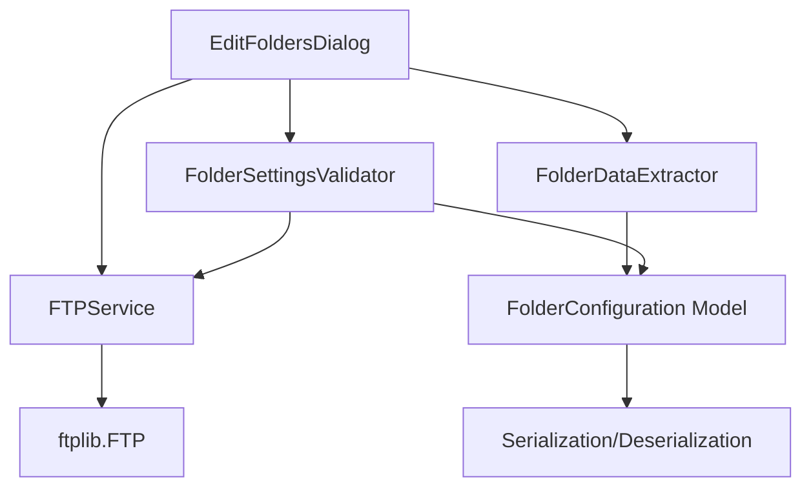

# EditFoldersDialog Refactoring Plan for Testability

## Overview

This document outlines a comprehensive plan to refactor the [`EditDialog`](interface.py:1214) class for improved testability. The current implementation has significant issues with tight coupling, direct global state usage, and mixed concerns that make testing difficult.

## Current Issues Analysis

### Identified Problems

1. **Tight Coupling to Database Operations** (interface.py:1216)
   - Direct access to `database_obj_instance.settings.find_one(id=1)`
   - Direct calls to `database_obj_instance.folders_table.find_one(alias=...)`

2. **Direct Use of Global State/Functions**
   - `global copy_to_directory` (interface.py:1218-1219)
   - Global `destination_directory_is_altered` (interface.py:2369)
   - Direct calls to `update_folder_alias()` (interface.py:2458)
   - Direct calls to `update_reporting()` (interface.py:2460)
   - Direct calls to `set_main_button_states()` (interface.py:2461)

3. **FTP Connection Testing in validate()** (interface.py:2527-2562)
   - Direct `ftplib.FTP()` usage embedded in validation
   - Real network connections during tests
   - No isolation for testing

4. **240 Lines of Validation Logic Mixed with UI** (interface.py:2464-2703)
   - [`validate()`](interface.py:2464) method contains validation AND network operations
   - Direct widget access for field values

5. **100 Lines of Data Extraction in apply()** (interface.py:2366-2462)
   - Direct field value extraction scattered throughout
   - Type conversions inline with extraction

6. **No Dependency Injection**
   - All dependencies hardcoded
   - Cannot substitute mock implementations

---

## Proposed Architecture



---

## File Structure

```
interface/
├── models/
│   └── folder_configuration.py    # NEW: Data model
├── validation/
│   └── folder_settings_validator.py  # NEW: Validation logic
├── services/
│   └── ftp_service.py            # NEW: FTP abstraction
├── operations/
│   └── folder_data_extractor.py  # NEW: Data extraction
└── ui/
    └── dialogs/
        └── edit_folders_dialog.py  # NEW: Refactored dialog

tests/unit/test_edit_dialog/
├── __init__.py
├── test_folder_configuration.py
├── test_folder_settings_validator.py
├── test_ftp_service.py
├── test_folder_data_extractor.py
├── test_edit_dialog_unit.py
└── conftest.py
```

---

## Component Specifications

### 1. FolderConfiguration Data Model

**File:** [`interface/models/folder_configuration.py`](interface/models/folder_configuration.py)

```python
from dataclasses import dataclass, field
from typing import Optional, List, Dict, Any
from enum import Enum

class BackendType(Enum):
    COPY = "copy"
    FTP = "ftp"
    EMAIL = "email"

class ConvertFormat(Enum):
    CSV = "csv"
    SCANNERWARE = "ScannerWare"
    SCANSHEET_A = "ScanSheet_Type_A"
    JOLLEY_CUSTOM = "jolley_custom"
    ESTORE_EINVOICE = "eStore_eInvoice"
    ESTORE_EINVOICE_GENERIC = "eStore_eInvoice_Generic"
    FINTECH = "fintech"
    STEWARTS_CUSTOM = "stewarts_custom"
    YELLOWDOG_CSV = "yellowdog_csv"
    SIMPLIFIED_CSV = "simplified_csv"
    DO_NOTHING = "do_nothing"

@dataclass
class FTPConfiguration:
    """FTP connection configuration."""
    server: str
    port: int
    username: str
    password: str
    folder: str
    
    def validate(self) -> List[str]:
        """Validate FTP configuration."""
        errors = []
        if not self.server:
            errors.append("FTP Server Field Is Required")
        if not self.username:
            errors.append("FTP Username Field Is Required")
        if not self.password:
            errors.append("FTP Password Field Is Required")
        if not self.folder:
            errors.append("FTP Folder Field Is Required")
        elif not self.folder.endswith("/"):
            errors.append("FTP Folder Path Needs To End In /")
        try:
            port_int = int(self.port)
            if not (1 <= port_int <= 65535):
                errors.append("FTP Port Field Needs To Be A Valid Port Number")
        except (ValueError, TypeError):
            errors.append("FTP Port Field Needs To Be A Number")
        return errors

@dataclass
class EmailConfiguration:
    """Email backend configuration."""
    recipients: str  # Comma-separated addresses
    subject_line: str
    sender_address: Optional[str] = None
    
    def validate(self) -> List[str]:
        """Validate email configuration."""
        errors = []
        if not self.recipients:
            errors.append("Email Destination Address Field Is Required")
        else:
            emails = self.recipients.split(", ")
            for email in emails:
                if not self._validate_email(email):
                    errors.append(f"Invalid Email Destination Address: {email}")
        return errors
    
    def _validate_email(self, email: str) -> bool:
        """Basic email validation."""
        import re
        pattern = r'^[a-zA-Z0-9._%+-]+@[a-zA-Z0-9.-]+\.[a-zA-Z]{2,}$'
        return bool(re.match(pattern, email))

@dataclass
class CopyConfiguration:
    """Copy backend configuration."""
    destination_directory: str
    
    def validate(self) -> List[str]:
        """Validate copy configuration."""
        errors = []
        if not self.destination_directory:
            errors.append("Copy Backend Destination Is Currently Unset")
        return errors

@dataclass
class EDIConfiguration:
    """EDI processing configuration."""
    process_edi: str  # "True", "False"
    tweak_edi: bool
    split_edi: bool
    split_edi_include_invoices: bool
    split_edi_include_credits: bool
    prepend_date_files: bool
    convert_to_format: str
    force_edi_validation: bool
    rename_file: str
    split_edi_filter_categories: str = "ALL"
    split_edi_filter_mode: str = "include"
    
    def validate(self) -> List[str]:
        """Validate EDI configuration."""
        errors = []
        if self.prepend_date_files and not self.split_edi:
            errors.append("EDI needs to be split for prepending dates")
        return errors

@dataclass
class UPCOverrideConfiguration:
    """UPC override configuration."""
    enabled: bool
    level: int = 1
    category_filter: str = ""
    target_length: int = 11
    padding_pattern: str = "           "
    
    def validate(self) -> List[str]:
        """Validate UPC override configuration."""
        errors = []
        if self.enabled and not self.category_filter:
            errors.append("Override UPC Category Filter Is Required")
        if self.enabled:
            for category in self.category_filter.split(","):
                if category != "ALL":
                    try:
                        cat_int = int(category)
                        if cat_int not in range(1, 100):
                            errors.append("Override UPC Category Filter Is Invalid")
                    except ValueError:
                        if category != "ALL":
                            errors.append("Override UPC Category Filter Is Invalid")
        return errors

@dataclass
class ARecordPaddingConfiguration:
    """A-record padding configuration."""
    enabled: bool
    padding_text: str
    padding_length: int
    append_text: str = ""
    append_enabled: bool = False
    force_txt_extension: bool = False
    
    def validate(self, convert_format: str = None) -> List[str]:
        """Validate A-record padding configuration."""
        errors = []
        if self.enabled:
            if len(self.padding_text) > self.padding_length:
                errors.append(
                    f'"A" Record Padding Needs To Be At Most '
                    f'{self.padding_length} Characters'
                )
            if len(self.padding_text) != 6:
                errors.append('"A" Record Padding Needs To Be Six Characters')
            if convert_format == "ScannerWare" and self.padding_length != 6:
                pass  # ScannerWare handled separately
        return errors

@dataclass
class InvoiceDateConfiguration:
    """Invoice date configuration."""
    offset: int
    custom_format_enabled: bool
    custom_format_string: str
    retail_uom: bool = False
    
    def validate(self) -> List[str]:
        """Validate invoice date configuration."""
        errors = []
        if self.offset not in range(-14, 15):
            errors.append("Invoice date offset not in valid range (-14 to 14)")
        return errors

@dataclass
class BackendSpecificConfiguration:
    """Backend-specific configuration fields."""
    # Estore
    estore_store_number: str = ""
    estore_vendor_oid: str = ""
    estore_vendor_namevendoroid: str = ""
    estore_c_record_oid: str = ""
    # Fintech
    fintech_division_id: str = ""
    # ScannerWare specific handled in EDI

@dataclass
class CSVConfiguration:
    """CSV-specific configuration."""
    include_headers: bool = False
    filter_ampersand: bool = False
    include_item_numbers: bool = False
    include_item_description: bool = False
    simple_csv_sort_order: str = ""
    split_prepaid_sales_tax_crec: bool = False

@dataclass
class FolderConfiguration:
    """Complete folder configuration data model."""
    # Identity
    folder_name: str
    folder_is_active: str = "False"
    alias: str = ""
    is_template: bool = False
    
    # Backend toggles
    process_backend_copy: bool = False
    process_backend_ftp: bool = False
    process_backend_email: bool = False
    
    # Backend configurations
    ftp: Optional[FTPConfiguration] = None
    email: Optional[EmailConfiguration] = None
    copy: Optional[CopyConfiguration] = None
    
    # EDI
    edi: Optional[EDIConfiguration] = None
    
    # UPC Override
    upc_override: Optional[UPCOverrideConfiguration] = None
    
    # A-Record
    a_record_padding: Optional[ARecordPaddingConfiguration] = None
    
    # Invoice Date
    invoice_date: Optional[InvoiceDateConfiguration] = None
    
    # Backend-specific
    backend_specific: Optional[BackendSpecificConfiguration] = None
    
    # CSV
    csv: Optional[CSVConfiguration] = None
    
    def validate(
        self, 
        existing_aliases: List[str] = None,
        ftp_service = None
    ) -> Dict[str, List[str]]:
        """
        Validate the complete configuration.
        
        Args:
            existing_aliases: List of existing folder aliases to check against
            ftp_service: Optional FTPService instance for connection testing
            
        Returns:
            Dictionary with validation errors by category
        """
        errors = {
            "general": [],
            "ftp": [],
            "email": [],
            "copy": [],
            "edi": [],
            "alias": [],
            "backend_specific": [],
        }
        
        # General validation
        if self.folder_name != "template":
            if len(self.alias) > 50:
                errors["alias"].append("Alias Too Long")
            
            # Alias uniqueness
            if existing_aliases and self.alias in existing_aliases:
                if self.folder_name != "template":
                    errors["alias"].append("Folder Alias Already In Use")
        
        # FTP validation
        if self.process_backend_ftp and self.ftp:
            errors["ftp"].extend(self.ftp.validate())
            
            # FTP connection test (if service provided)
            if ftp_service and not errors["ftp"]:
                success, error_msg = ftp_service.test_connection(
                    self.ftp.server,
                    self.ftp.port,
                    self.ftp.username,
                    self.ftp.password,
                    self.ftp.folder
                )
                if not success:
                    errors["ftp"].append(error_msg)
        
        # Email validation
        if self.process_backend_email and self.email:
            errors["email"].extend(self.email.validate())
        
        # Copy validation
        if self.process_backend_copy and self.copy:
            errors["copy"].extend(self.copy.validate())
        
        # Backend count check
        backend_count = sum([
            self.process_backend_copy,
            self.process_backend_ftp,
            self.process_backend_email
        ])
        if backend_count == 0 and self.folder_is_active == "True":
            errors["general"].append("No Backend Is Selected")
        
        # EDI validation
        if self.edi:
            errors["edi"].extend(self.edi.validate())
        
        # UPC override validation
        if self.upc_override:
            errors["backend_specific"].extend(self.upc_override.validate())
        
        # A-record padding validation
        if self.a_record_padding:
            errors["backend_specific"].extend(
                self.a_record_padding.validate(self.edi.convert_to_format if self.edi else None)
            )
        
        # Invoice date validation
        if self.invoice_date:
            errors["backend_specific"].extend(self.invoice_date.validate())
        
        # Backend-specific validation
        if self.backend_specific:
            if self.edi and self.edi.convert_to_format == "fintech":
                try:
                    int(self.backend_specific.fintech_division_id)
                except ValueError:
                    errors["backend_specific"].append(
                        "fintech divisionid needs to be a number"
                    )
        
        return errors
    
    @classmethod
    def from_dict(cls, data: Dict[str, Any]) -> "FolderConfiguration":
        """Create FolderConfiguration from dictionary."""
        # Extract nested configurations
        ftp = None
        if all(k in data for k in ['ftp_server', 'ftp_port', 'ftp_username', 'ftp_password', 'ftp_folder']):
            ftp = FTPConfiguration(
                server=data['ftp_server'],
                port=data['ftp_port'],
                username=data['ftp_username'],
                password=data['ftp_password'],
                folder=data['ftp_folder']
            )
        
        email = None
        if all(k in data for k in ['email_to', 'email_subject_line']):
            email = EmailConfiguration(
                recipients=data.get('email_to', ''),
                subject_line=data.get('email_subject_line', '')
            )
        
        copy = None
        if 'copy_to_directory' in data:
            copy = CopyConfiguration(
                destination_directory=data.get('copy_to_directory', '')
            )
        
        # ... more extraction logic
        
        return cls(
            folder_name=data.get('folder_name', ''),
            folder_is_active=data.get('folder_is_active', 'False'),
            alias=data.get('alias', ''),
            is_template=data.get('folder_name') == 'template',
            process_backend_copy=data.get('process_backend_copy', False),
            process_backend_ftp=data.get('process_backend_ftp', False),
            process_backend_email=data.get('process_backend_email', False),
            ftp=ftp,
            email=email,
            copy=copy,
            # ... more fields
        )
    
    def to_dict(self) -> Dict[str, Any]:
        """Convert FolderConfiguration to dictionary for database."""
        data = {
            'folder_name': self.folder_name,
            'folder_is_active': self.folder_is_active,
            'alias': self.alias,
            'process_backend_copy': self.process_backend_copy,
            'process_backend_ftp': self.process_backend_ftp,
            'process_backend_email': self.process_backend_email,
        }
        
        if self.ftp:
            data.update({
                'ftp_server': self.ftp.server,
                'ftp_port': self.ftp.port,
                'ftp_username': self.ftp.username,
                'ftp_password': self.ftp.password,
                'ftp_folder': self.ftp.folder,
            })
        
        if self.email:
            data.update({
                'email_to': self.email.recipients,
                'email_subject_line': self.email.subject_line,
            })
        
        if self.copy:
            data['copy_to_directory'] = self.copy.destination_directory
        
        # ... more fields
        
        return data
```

---

### 2. FTPService Class

**File:** [`interface/services/ftp_service.py`](interface/services/ftp_service.py)

```python
"""FTP Service abstraction for testable FTP operations."""

import ftplib
from typing import Tuple, Optional
from dataclasses import dataclass

@dataclass
class FTPConnectionResult:
    """Result of an FTP connection test."""
    success: bool
    error_message: Optional[str] = None
    error_type: Optional[str] = None  # "server", "login", "cwd", "unknown"

class FTPServiceProtocol:
    """Protocol defining the FTP service interface."""
    
    def test_connection(
        self,
        server: str,
        port: int,
        username: str,
        password: str,
        folder: str
    ) -> FTPConnectionResult:
        """Test FTP connection credentials."""
        raise NotImplementedError
    
    def connect(
        self,
        server: str,
        port: int,
        username: str,
        password: str
    ) -> ftplib.FTP:
        """Create and return an FTP connection."""
        raise NotImplementedError


class FTPService(FTPServiceProtocol):
    """Real FTP service implementation."""
    
    def test_connection(
        self,
        server: str,
        port: int,
        username: str,
        password: str,
        folder: str
    ) -> FTPConnectionResult:
        """
        Test FTP connection credentials.
        
        Args:
            server: FTP server hostname
            port: FTP port number
            username: FTP username
            password: FTP password
            folder: FTP folder path to test
            
        Returns:
            FTPConnectionResult indicating success or failure with error details
        """
        ftp = ftplib.FTP()
        
        try:
            # Test server connection
            ftp.connect(str(server), int(port))
            
            try:
                # Test login
                ftp.login(username, password)
                
                try:
                    # Test folder access
                    ftp.cwd(folder)
                    return FTPConnectionResult(success=True)
                    
                except Exception as e:
                    return FTPConnectionResult(
                        success=False,
                        error_message="FTP Folder Field Incorrect",
                        error_type="cwd"
                    )
                    
            except Exception as e:
                return FTPConnectionResult(
                    success=False,
                    error_message="FTP Username or Password Incorrect",
                    error_type="login"
                )
                
        except Exception as e:
            return FTPConnectionResult(
                success=False,
                error_message="FTP Server or Port Field Incorrect",
                error_type="server"
            )
            
        finally:
            try:
                ftp.close()
            except Exception:
                pass
    
    def connect(
        self,
        server: str,
        port: int,
        username: str,
        password: str
    ) -> ftplib.FTP:
        """Create and return an FTP connection."""
        ftp = ftplib.FTP()
        ftp.connect(str(server), int(port))
        ftp.login(username, password)
        return ftp


class MockFTPService(FTPServiceProtocol):
    """Mock FTP service for testing."""
    
    def __init__(
        self,
        should_succeed: bool = True,
        fail_at: str = None,
        error_message: str = "Mock FTP Error"
    ):
        """
        Initialize mock FTP service.
        
        Args:
            should_succeed: Whether connections should succeed
            fail_at: Stage to fail at ("connect", "login", "cwd")
            error_message: Error message to return on failure
        """
        self.should_succeed = should_succeed
        self.fail_at = fail_at
        self.error_message = error_message
        self.connection_attempts = []
    
    def test_connection(
        self,
        server: str,
        port: int,
        username: str,
        password: str,
        folder: str
    ) -> FTPConnectionResult:
        """Record connection attempt and return configured result."""
        self.connection_attempts.append({
            'server': server,
            'port': port,
            'username': username,
            'folder': folder
        })
        
        if self.should_succeed:
            return FTPConnectionResult(success=True)
        
        error_type = self.fail_at or "unknown"
        return FTPConnectionResult(
            success=False,
            error_message=self.error_message,
            error_type=error_type
        )
    
    def connect(
        self,
        server: str,
        port: int,
        username: str,
        password: str
    ) -> "MockFTPConnection":
        """Return a mock FTP connection."""
        return MockFTPConnection()


class MockFTPConnection:
    """Mock FTP connection for testing."""
    
    def __init__(self):
        self.cwd_calls = []
        self.closed = False
    
    def cwd(self, path: str):
        """Record CWD call."""
        self.cwd_calls.append(path)
    
    def close(self):
        """Mark connection as closed."""
        self.closed = True
```

---

### 3. FolderSettingsValidator Class

**File:** [`interface/validation/folder_settings_validator.py`](interface/validation/folder_settings_validator.py)

```python
"""Folder settings validation logic extracted from EditDialog."""

from typing import List, Dict, Optional, Tuple
from dataclasses import dataclass
from enum import Enum

import re

from interface.models.folder_configuration import (
    FolderConfiguration,
    FTPConfiguration,
    EmailConfiguration,
    CopyConfiguration,
    EDIConfiguration,
)
from interface.services.ftp_service import FTPServiceProtocol, FTPConnectionResult


@dataclass
class ValidationError:
    """Structured validation error."""
    field: str
    message: str
    severity: str = "error"  # "error", "warning"


class ValidationResult:
    """Result of validation operation."""
    
    def __init__(self, is_valid: bool = True):
        self.is_valid = is_valid
        self.errors: List[ValidationError] = []
        self.warnings: List[ValidationError] = []
    
    def add_error(self, field: str, message: str):
        """Add an error to the result."""
        self.errors.append(ValidationError(field=field, message=message))
        self.is_valid = False
    
    def add_warning(self, field: str, message: str):
        """Add a warning to the result."""
        self.warnings.append(ValidationError(field=field, message=message))
    
    def get_all_messages(self) -> List[str]:
        """Get all error and warning messages."""
        return [e.message for e in self.errors + self.warnings]


class FolderSettingsValidator:
    """
    Validates folder settings with support for dependency injection.
    
    This class extracts validation logic from EditDialog to enable
    comprehensive unit testing.
    """
    
    def __init__(
        self,
        ftp_service: FTPServiceProtocol = None,
        existing_aliases: List[str] = None
    ):
        """
        Initialize validator with optional dependencies.
        
        Args:
            ftp_service: Optional FTP service for connection testing
            existing_aliases: List of existing folder aliases for uniqueness check
        """
        self.ftp_service = ftp_service
        self.existing_aliases = existing_aliases or []
    
    def validate_ftp_settings(
        self,
        server: str,
        port: str,
        folder: str,
        username: str,
        password: str,
        enabled: bool
    ) -> ValidationResult:
        """
        Validate FTP settings.
        
        Args:
            server: FTP server field value
            port: FTP port field value
            folder: FTP folder field value
            username: FTP username field value
            password: FTP password field value
            enabled: Whether FTP backend is enabled
            
        Returns:
            ValidationResult with any validation errors
        """
        result = ValidationResult()
        
        if not enabled:
            return result
        
        # Required field checks
        if not server:
            result.add_error("ftp_server", "FTP Server Field Is Required")
        
        if not port:
            result.add_error("ftp_port", "FTP Port Field Is Required")
        
        if not folder:
            result.add_error("ftp_folder", "FTP Folder Field Is Required")
        elif not folder.endswith("/"):
            result.add_error("ftp_folder", "FTP Folder Path Needs To End In /")
        
        if not username:
            result.add_error("ftp_username", "FTP Username Field Is Required")
        
        if not password:
            result.add_error("ftp_password", "FTP Password Field Is Required")
        
        # Port validation
        try:
            port_int = int(port)
            if not (1 <= port_int <= 65535):
                result.add_error("ftp_port", "FTP Port Field Needs To Be A Valid Port Number")
        except ValueError:
            result.add_error("ftp_port", "FTP Port Field Needs To Be A Number")
        
        # FTP connection test (if all fields valid and service available)
        if result.is_valid and self.ftp_service:
            conn_result = self.ftp_service.test_connection(
                server=server,
                port=int(port),
                username=username,
                password=password,
                folder=folder
            )
            if not conn_result.success:
                result.add_error("ftp_connection", conn_result.error_message)
        
        return result
    
    def validate_email_settings(
        self,
        recipients: str,
        enabled: bool
    ) -> ValidationResult:
        """
        Validate email settings.
        
        Args:
            recipients: Email recipients field value
            enabled: Whether email backend is enabled
            
        Returns:
            ValidationResult with any validation errors
        """
        result = ValidationResult()
        
        if not enabled:
            return result
        
        if not recipients:
            result.add_error("email_recipient", "Email Destination Address Field Is Required")
            return result
        
        # Validate each recipient
        emails = recipients.split(", ")
        for email in emails:
            if not self._validate_email(email):
                result.add_error("email_recipient", f"Invalid Email Destination Address: {email}")
        
        return result
    
    def _validate_email(self, email: str) -> bool:
        """Basic email validation."""
        pattern = r'^[a-zA-Z0-9._%+-]+@[a-zA-Z0-9.-]+\.[a-zA-Z]{2,}$'
        return bool(re.match(pattern, email))
    
    def validate_copy_settings(
        self,
        destination: str,
        enabled: bool
    ) -> ValidationResult:
        """
        Validate copy backend settings.
        
        Args:
            destination: Copy destination directory
            enabled: Whether copy backend is enabled
            
        Returns:
            ValidationResult with any validation errors
        """
        result = ValidationResult()
        
        if not enabled:
            return result
        
        if not destination:
            result.add_error("copy_destination", "Copy Backend Destination Is Currently Unset")
        
        return result
    
    def validate_alias(
        self,
        alias: str,
        folder_name: str,
        current_alias: str = None
    ) -> ValidationResult:
        """
        Validate folder alias.
        
        Args:
            alias: Proposed alias value
            folder_name: Folder name (template check)
            current_alias: Current alias if editing existing
            
        Returns:
            ValidationResult with any validation errors
        """
        result = ValidationResult()
        
        if folder_name == "template":
            return result
        
        # Check length
        if len(alias) > 50:
            result.add_error("alias", "Alias Too Long")
        
        # Check uniqueness (exclude current alias if editing)
        if alias in self.existing_aliases:
            if alias != current_alias:
                result.add_error("alias", "Folder Alias Already In Use")
        
        return result
    
    def validate_invoice_date_offset(self, offset: int) -> ValidationResult:
        """
        Validate invoice date offset.
        
        Args:
            offset: Invoice date offset value
            
        Returns:
            ValidationResult with any validation errors
        """
        result = ValidationResult()
        
        if offset not in range(-14, 15):
            result.add_error("invoice_date_offset", "Invoice date offset not in valid range")
        
        return result
    
    def validate_a_record_padding(
        self,
        padding_text: str,
        padding_length: int,
        enabled: bool,
        convert_format: str = None
    ) -> ValidationResult:
        """
        Validate A-record padding settings.
        
        Args:
            padding_text: A-record padding text
            padding_length: Maximum padding length
            enabled: Whether padding is enabled
            convert_format: Current convert format
            
        Returns:
            ValidationResult with any validation errors
        """
        result = ValidationResult()
        
        if not enabled:
            return result
        
        if len(padding_text) > padding_length:
            result.add_error(
                "a_record_padding",
                f'"A" Record Padding Needs To Be At Most {padding_length} Characters'
            )
        
        if len(padding_text) != 6:
            result.add_error("a_record_padding", '"A" Record Padding Needs To Be Six Characters')
        
        # ScannerWare specific
        if convert_format == "ScannerWare":
            if not enabled:
                result.add_error(
                    "a_record_padding",
                    '"A" Record Padding Needs To Be Enabled For ScannerWare Backend'
                )
        
        return result
    
    def validate_upc_override(
        self,
        enabled: bool,
        category_filter: str
    ) -> ValidationResult:
        """
        Validate UPC override settings.
        
        Args:
            enabled: Whether UPC override is enabled
            category_filter: Category filter string
            
        Returns:
            ValidationResult with any validation errors
        """
        result = ValidationResult()
        
        if not enabled:
            return result
        
        if not category_filter:
            result.add_error(
                "upc_category_filter",
                "Override UPC Category Filter Is Required"
            )
            return result
        
        # Validate each category
        for category in category_filter.split(","):
            if category != "ALL":
                try:
                    cat_int = int(category)
                    if cat_int not in range(1, 100):
                        result.add_error(
                            "upc_category_filter",
                            "Override UPC Category Filter Is Invalid"
                        )
                except ValueError:
                    result.add_error(
                        "upc_category_filter",
                        "Override UPC Category Filter Is Invalid"
                    )
        
        return result
    
    def validate_backend_specific(
        self,
        convert_format: str,
        division_id: str = None
    ) -> ValidationResult:
        """
        Validate backend-specific settings.
        
        Args:
            convert_format: Current convert format
            division_id: Fintech division ID (if applicable)
            
        Returns:
            ValidationResult with any validation errors
        """
        result = ValidationResult()
        
        if convert_format == "fintech":
            if division_id:
                try:
                    int(division_id)
                except ValueError:
                    result.add_error(
                        "fintech_division_id",
                        "fintech divisionid needs to be a number"
                    )
        
        return result
    
    def validate_edi_split_requirements(
        self,
        convert_format: str,
        split_edi: bool,
        prepend_dates: bool,
        tweak_edi: bool
    ) -> ValidationResult:
        """
        Validate EDI split requirements.
        
        Args:
            convert_format: Current convert format
            split_edi: Whether EDI is split
            prepend_dates: Whether to prepend dates to files
            tweak_edi: Whether EDI tweaking is enabled
            
        Returns:
            ValidationResult with any validation errors
        """
        result = ValidationResult()
        
        # Prepend dates requires split EDI
        if prepend_dates and not split_edi:
            result.add_error("split_edi", "EDI needs to be split for prepending dates")
        
        # Jolley custom requires split EDI
        if convert_format == "jolley_custom" and not split_edi and not tweak_edi:
            result.add_error("split_edi", "EDI needs to be split for jolley_custom backend")
        
        return result
    
    def validate_complete(
        self,
        config: FolderConfiguration,
        current_alias: str = None
    ) -> ValidationResult:
        """
        Validate complete folder configuration.
        
        Args:
            config: FolderConfiguration to validate
            current_alias: Current alias if editing existing
            
        Returns:
            ValidationResult with all validation errors
        """
        result = ValidationResult()
        
        # Validate FTP
        if config.ftp:
            ftp_result = self.validate_ftp_settings(
                server=config.ftp.server,
                port=str(config.ftp.port),
                folder=config.ftp.folder,
                username=config.ftp.username,
                password=config.ftp.password,
                enabled=config.process_backend_ftp
            )
            for error in ftp_result.errors:
                result.add_error(error.field, error.message)
        
        # Validate Email
        if config.email:
            email_result = self.validate_email_settings(
                recipients=config.email.recipients,
                enabled=config.process_backend_email
            )
            for error in email_result.errors:
                result.add_error(error.field, error.message)
        
        # Validate Copy
        if config.copy:
            copy_result = self.validate_copy_settings(
                destination=config.copy.destination_directory,
                enabled=config.process_backend_copy
            )
            for error in copy_result.errors:
                result.add_error(error.field, error.message)
        
        # Validate Alias
        alias_result = self.validate_alias(
            alias=config.alias,
            folder_name=config.folder_name,
            current_alias=current_alias
        )
        for error in alias_result.errors:
            result.add_error(error.field, error.message)
        
        # Validate Invoice Date
        if config.invoice_date:
            date_result = self.validate_invoice_date_offset(
                offset=config.invoice_date.offset
            )
            for error in date_result.errors:
                result.add_error(error.field, error.message)
        
        # Validate UPC Override
        if config.upc_override:
            upc_result = self.validate_upc_override(
                enabled=config.upc_override.enabled,
                category_filter=config.upc_override.category_filter
            )
            for error in upc_result.errors:
                result.add_error(error.field, error.message)
        
        # Validate Backend-Specific
        if config.backend_specific and config.edi:
            backend_result = self.validate_backend_specific(
                convert_format=config.edi.convert_to_format,
                division_id=config.backend_specific.fintech_division_id
            )
            for error in backend_result.errors:
                result.add_error(error.field, error.message)
        
        # Backend count check
        backend_count = sum([
            config.process_backend_copy,
            config.process_backend_ftp,
            config.process_backend_email
        ])
        if backend_count == 0 and config.folder_is_active == "True":
            result.add_error("backends", "No Backend Is Selected")
        
        return result
```

---

### 4. FolderDataExtractor Class

**File:** [`interface/operations/folder_data_extractor.py`](interface/operations/folder_data_extractor.py)

```python
"""Data extraction logic for EditDialog fields."""

from typing import Dict, Any, Optional
from dataclasses import dataclass

import tkinter as tk
from tkinter import ttk

from interface.models.folder_configuration import (
    FolderConfiguration,
    FTPConfiguration,
    EmailConfiguration,
    CopyConfiguration,
    EDIConfiguration,
    UPCOverrideConfiguration,
    ARecordPaddingConfiguration,
    InvoiceDateConfiguration,
    BackendSpecificConfiguration,
    CSVConfiguration,
)


@dataclass
class ExtractedDialogFields:
    """Container for extracted dialog field values."""
    # Identity
    folder_name: str
    alias: str
    folder_is_active: str
    
    # Backend toggles
    process_backend_copy: bool
    process_backend_ftp: bool
    process_backend_email: bool
    
    # FTP fields
    ftp_server: str
    ftp_port: int
    ftp_folder: str
    ftp_username: str
    ftp_password: str
    
    # Email fields
    email_to: str
    email_subject_line: str
    
    # EDI fields
    process_edi: str
    convert_to_format: str
    tweak_edi: bool
    split_edi: bool
    split_edi_include_invoices: bool
    split_edi_include_credits: bool
    prepend_date_files: bool
    rename_file: str
    split_edi_filter_categories: str
    split_edi_filter_mode: str
    
    # EDI options
    calculate_upc_check_digit: str
    include_a_records: str
    include_c_records: str
    include_headers: str
    filter_ampersand: str
    force_edi_validation: bool
    
    # A-record
    pad_a_records: str
    a_record_padding: str
    a_record_padding_length: int
    append_a_records: str
    a_record_append_text: str
    force_txt_file_ext: str
    
    # Invoice date
    invoice_date_offset: int
    invoice_date_custom_format: bool
    invoice_date_custom_format_string: str
    retail_uom: bool
    
    # UPC override
    override_upc_bool: bool
    override_upc_level: int
    override_upc_category_filter: str
    upc_target_length: int
    upc_padding_pattern: str
    
    # Item fields
    include_item_numbers: bool
    include_item_description: bool
    
    # CSV sort
    simple_csv_sort_order: str
    
    # Tax
    split_prepaid_sales_tax_crec: bool
    
    # Backend-specific
    estore_store_number: str
    estore_vendor_oid: str
    estore_vendor_namevendoroid: str
    fintech_division_id: str
    
    # Copy destination
    copy_to_directory: str


class FolderDataExtractor:
    """
    Extracts folder configuration data from dialog fields.
    
    This class centralizes the logic for extracting values from
    tkinter widgets and converting them to a consistent format.
    """
    
    def __init__(self, dialog_fields: Dict[str, Any]):
        """
        Initialize extractor with dialog field references.
        
        Args:
            dialog_fields: Dictionary mapping field names to tkinter widget references
        """
        self.fields = dialog_fields
    
    def extract_all(self) -> ExtractedDialogFields:
        """Extract all field values from the dialog."""
        return ExtractedDialogFields(
            # Identity
            folder_name=self._get_text("foldersnameinput", "folder_name"),
            alias=self._get_text("folder_alias_field"),
            folder_is_active=self._get_value("active_checkbutton"),
            
            # Backend toggles
            process_backend_copy=self._get_bool("process_backend_copy_check"),
            process_backend_ftp=self._get_bool("process_backend_ftp_check"),
            process_backend_email=self._get_bool("process_backend_email_check"),
            
            # FTP
            ftp_server=self._get_text("ftp_server_field"),
            ftp_port=self._get_int("ftp_port_field"),
            ftp_folder=self._get_text("ftp_folder_field"),
            ftp_username=self._get_text("ftp_username_field"),
            ftp_password=self._get_text("ftp_password_field"),
            
            # Email
            email_to=self._get_text("email_recepient_field"),
            email_subject_line=self._get_text("email_sender_subject_field"),
            
            # EDI
            process_edi=self._get_value("process_edi"),
            convert_to_format=self._get_value("convert_formats_var"),
            tweak_edi=self._get_bool("tweak_edi"),
            split_edi=self._get_bool("split_edi"),
            split_edi_include_invoices=self._get_bool("split_edi_send_invoices"),
            split_edi_include_credits=self._get_bool("split_edi_send_credits"),
            prepend_date_files=self._get_bool("prepend_file_dates"),
            rename_file=self._get_text("rename_file_field"),
            split_edi_filter_categories=self._get_text("split_edi_filter_categories_entry"),
            split_edi_filter_mode=self._get_value("split_edi_filter_mode"),
            
            # EDI options
            calculate_upc_check_digit=self._get_value("upc_var_check"),
            include_a_records=self._get_value("a_rec_var_check"),
            include_c_records=self._get_value("c_rec_var_check"),
            include_headers=self._get_value("headers_check"),
            filter_ampersand=self._get_value("ampersand_check"),
            force_edi_validation=self._get_bool("force_edi_check_var"),
            
            # A-record
            pad_a_records=self._get_value("pad_arec_check"),
            a_record_padding=self._get_text("a_record_padding_field"),
            a_record_padding_length=self._get_int("a_record_padding_length"),
            append_a_records=self._get_value("append_arec_check"),
            a_record_append_text=self._get_text("a_record_append_field"),
            force_txt_file_ext=self._get_value("force_txt_file_ext_check"),
            
            # Invoice date
            invoice_date_offset=self._get_int("invoice_date_offset"),
            invoice_date_custom_format=self._get_bool("invoice_date_custom_format"),
            invoice_date_custom_format_string=self._get_text("invoice_date_custom_format_field"),
            retail_uom=self._get_bool("edi_each_uom_tweak"),
            
            # UPC override
            override_upc_bool=self._get_bool("override_upc_bool"),
            override_upc_level=self._get_int("override_upc_level"),
            override_upc_category_filter=self._get_text("override_upc_category_filter_entry"),
            upc_target_length=self._get_int("upc_target_length_entry"),
            upc_padding_pattern=self._get_text("upc_padding_pattern_entry"),
            
            # Item fields
            include_item_numbers=self._get_bool("include_item_numbers"),
            include_item_description=self._get_bool("include_item_description"),
            
            # CSV sort
            simple_csv_sort_order=self._get_value("simple_csv_column_sorter"),
            
            # Tax
            split_prepaid_sales_tax_crec=self._get_bool("split_sales_tax_prepaid_var"),
            
            # Backend-specific
            estore_store_number=self._get_text("estore_store_number_field"),
            estore_vendor_oid=self._get_text("estore_Vendor_OId_field"),
            estore_vendor_namevendoroid=self._get_text("estore_vendor_namevendoroid_field"),
            fintech_division_id=self._get_text("fintech_divisionid_field"),
            
            # Copy destination (handled globally)
            copy_to_directory=None  # Set externally
        )
    
    def to_folder_configuration(self, extracted: ExtractedDialogFields) -> FolderConfiguration:
        """
        Convert extracted fields to FolderConfiguration.
        
        Args:
            extracted: Extracted dialog field values
            
        Returns:
            FolderConfiguration instance
        """
        # Build FTP config
        ftp = FTPConfiguration(
            server=extracted.ftp_server,
            port=extracted.ftp_port,
            username=extracted.ftp_username,
            password=extracted.ftp_password,
            folder=extracted.ftp_folder
        ) if extracted.process_backend_ftp else None
        
        # Build Email config
        email = EmailConfiguration(
            recipients=extracted.email_to,
            subject_line=extracted.email_subject_line
        ) if extracted.process_backend_email else None
        
        # Build Copy config
        copy = CopyConfiguration(
            destination_directory=extracted.copy_to_directory or ""
        ) if extracted.process_backend_copy else None
        
        # Build EDI config
        edi = EDIConfiguration(
            process_edi=extracted.process_edi,
            tweak_edi=extracted.tweak_edi,
            split_edi=extracted.split_edi,
            split_edi_include_invoices=extracted.split_edi_include_invoices,
            split_edi_include_credits=extracted.split_edi_include_credits,
            prepend_date_files=extracted.prepend_date_files,
            convert_to_format=extracted.convert_to_format,
            force_edi_validation=extracted.force_edi_validation,
            rename_file=extracted.rename_file,
            split_edi_filter_categories=extracted.split_edi_filter_categories,
            split_edi_filter_mode=extracted.split_edi_filter_mode
        )
        
        # Build UPC override config
        upc_override = UPCOverrideConfiguration(
            enabled=extracted.override_upc_bool,
            level=extracted.override_upc_level,
            category_filter=extracted.override_upc_category_filter,
            target_length=extracted.upc_target_length,
            padding_pattern=extracted.upc_padding_pattern
        ) if extracted.override_upc_bool else None
        
        # Build A-record config
        a_record = ARecordPaddingConfiguration(
            enabled=extracted.pad_a_records == "True",
            padding_text=extracted.a_record_padding,
            padding_length=extracted.a_record_padding_length,
            append_text=extracted.a_record_append_text,
            append_enabled=extracted.append_a_records == "True",
            force_txt_extension=extracted.force_txt_file_ext == "True"
        )
        
        # Build Invoice date config
        invoice_date = InvoiceDateConfiguration(
            offset=extracted.invoice_date_offset,
            custom_format_enabled=extracted.invoice_date_custom_format,
            custom_format_string=extracted.invoice_date_custom_format_string,
            retail_uom=extracted.retail_uom
        )
        
        # Build Backend-specific config
        backend_specific = BackendSpecificConfiguration(
            estore_store_number=extracted.estore_store_number,
            estore_vendor_oid=extracted.estore_vendor_oid,
            estore_vendor_namevendoroid=extracted.estore_vendor_namevendoroid,
            fintech_division_id=extracted.fintech_division_id
        )
        
        # Build CSV config
        csv = CSVConfiguration(
            include_headers=extracted.include_headers == "True",
            filter_ampersand=extracted.filter_ampersand == "True",
            include_item_numbers=extracted.include_item_numbers,
            include_item_description=extracted.include_item_description,
            simple_csv_sort_order=extracted.simple_csv_sort_order,
            split_prepaid_sales_tax_crec=extracted.split_prepaid_sales_tax_crec
        )
        
        return FolderConfiguration(
            folder_name=extracted.folder_name,
            folder_is_active=extracted.folder_is_active,
            alias=extracted.alias,
            is_template=extracted.folder_name == "template",
            process_backend_copy=extracted.process_backend_copy,
            process_backend_ftp=extracted.process_backend_ftp,
            process_backend_email=extracted.process_backend_email,
            ftp=ftp,
            email=email,
            copy=copy,
            edi=edi,
            upc_override=upc_override,
            a_record_padding=a_record,
            invoice_date=invoice_date,
            backend_specific=backend_specific,
            csv=csv
        )
    
    def to_database_dict(
        self, 
        extracted: ExtractedDialogFields,
        copy_to_directory: str = None
    ) -> Dict[str, Any]:
        """
        Convert extracted fields to database format.
        
        Args:
            extracted: Extracted dialog field values
            copy_to_directory: Copy destination (if not in fields)
            
        Returns:
            Dictionary ready for database update
        """
        data = {
            # Identity
            "folder_is_active": str(extracted.folder_is_active),
            "alias": self._get_alias(extracted),
            
            # Backend toggles
            "process_backend_copy": extracted.process_backend_copy,
            "process_backend_ftp": extracted.process_backend_ftp,
            "process_backend_email": extracted.process_backend_email,
            
            # FTP
            "ftp_server": str(extracted.ftp_server),
            "ftp_port": int(extracted.ftp_port),
            "ftp_folder": str(extracted.ftp_folder),
            "ftp_username": str(extracted.ftp_username),
            "ftp_password": str(extracted.ftp_password),
            
            # Email
            "email_to": str(extracted.email_to),
            "email_subject_line": str(extracted.email_subject_line),
            
            # EDI
            "process_edi": str(extracted.process_edi),
            "convert_to_format": str(extracted.convert_to_format),
            "calculate_upc_check_digit": str(extracted.calculate_upc_check_digit),
            "include_a_records": str(extracted.include_a_records),
            "include_c_records": str(extracted.include_c_records),
            "include_headers": str(extracted.include_headers),
            "filter_ampersand": str(extracted.filter_ampersand),
            "force_edi_validation": extracted.force_edi_validation,
            "tweak_edi": extracted.tweak_edi,
            "split_edi": extracted.split_edi,
            "split_edi_include_invoices": extracted.split_edi_include_invoices,
            "split_edi_include_credits": extracted.split_edi_include_credits,
            "prepend_date_files": extracted.prepend_date_files,
            "split_edi_filter_categories": extracted.split_edi_filter_categories,
            "split_edi_filter_mode": extracted.split_edi_filter_mode,
            "rename_file": extracted.rename_file,
            
            # A-record
            "pad_a_records": str(extracted.pad_a_records),
            "a_record_padding": str(extracted.a_record_padding),
            "a_record_padding_length": int(extracted.a_record_padding_length),
            "append_a_records": str(extracted.append_a_records),
            "a_record_append_text": str(extracted.a_record_append_text),
            "force_txt_file_ext": str(extracted.force_txt_file_ext),
            
            # Invoice date
            "invoice_date_offset": int(extracted.invoice_date_offset),
            "invoice_date_custom_format": extracted.invoice_date_custom_format,
            "invoice_date_custom_format_string": str(extracted.invoice_date_custom_format_string),
            "retail_uom": extracted.retail_uom,
            
            # UPC override
            "override_upc_bool": extracted.override_upc_bool,
            "override_upc_level": extracted.override_upc_level,
            "override_upc_category_filter": extracted.override_upc_category_filter,
            "upc_target_length": int(extracted.upc_target_length),
            "upc_padding_pattern": str(extracted.upc_padding_pattern),
            
            # Items
            "include_item_numbers": extracted.include_item_numbers,
            "include_item_description": extracted.include_item_description,
            
            # CSV sort
            "simple_csv_sort_order": extracted.simple_csv_sort_order,
            
            # Tax
            "split_prepaid_sales_tax_crec": extracted.split_prepaid_sales_tax_crec,
            
            # Backend-specific
            "estore_store_number": extracted.estore_store_number,
            "estore_Vendor_OId": extracted.estore_vendor_oid,
            "estore_vendor_NameVendorOID": extracted.estore_vendor_namevendoroid,
            "fintech_division_id": extracted.fintech_division_id,
            
            # Copy destination
            "copy_to_directory": copy_to_directory or extracted.copy_to_directory or "",
        }
        
        return data
    
    def _get_alias(self, extracted: ExtractedDialogFields) -> str:
        """Get alias value, using folder name basename if empty."""
        if extracted.alias:
            return str(extracted.alias)
        if extracted.folder_name and extracted.folder_name != "template":
            import os
            return os.path.basename(extracted.folder_name)
        return ""
    
    def _get_text(self, field_name: str, key: str = None) -> str:
        """Get text value from Entry widget."""
        widget = self.fields.get(field_name)
        if widget is None:
            return ""
        if key:
            return str(widget.get(key, ""))
        return str(widget.get())
    
    def _get_int(self, field_name: str) -> int:
        """Get integer value from widget."""
        widget = self.fields.get(field_name)
        if widget is None:
            return 0
        try:
            return int(widget.get())
        except (ValueError, tk.TclError):
            return 0
    
    def _get_bool(self, field_name: str) -> bool:
        """Get boolean value from widget."""
        widget = self.fields.get(field_name)
        if widget is None:
            return False
        return bool(widget.get())
    
    def _get_value(self, field_name: str) -> str:
        """Get value from StringVar/BooleanVar."""
        widget = self.fields.get(field_name)
        if widget is None:
            return ""
        return str(widget.get())
```

---

### 5. EditFoldersDialog Refactoring

**File:** [`interface/ui/dialogs/edit_folders_dialog.py`](interface/ui/dialogs/edit_folders_dialog.py)

```python
"""Refactored EditFoldersDialog with dependency injection for testability."""

import tkinter as tk
from tkinter import ttk
from typing import Dict, Any, Optional, List, Callable

import sys
import os
# Add parent directory to path for imports
sys.path.insert(0, os.path.dirname(os.path.dirname(os.path.dirname(os.path.dirname(os.path.abspath(__file__))))))

from dialog import Dialog

from interface.models.folder_configuration import FolderConfiguration
from interface.validation.folder_settings_validator import (
    FolderSettingsValidator,
    ValidationResult,
)
from interface.operations.folder_data_extractor import (
    FolderDataExtractor,
    ExtractedDialogFields,
)
from interface.services.ftp_service import (
    FTPService,
    FTPServiceProtocol,
    MockFTPService,
)


class EditFoldersDialog(Dialog):
    """
    Refactored dialog for editing folder settings.
    
    This dialog accepts injectable dependencies for:
    - FTPService: For connection testing (mockable for tests)
    - FolderSettingsValidator: For validation logic
    - FolderDataExtractor: For field extraction
    
    This design enables comprehensive unit testing without:
    - Real network connections
    - Database access
    - Global state dependencies
    """
    
    # Default dependencies (can be overridden for testing)
    DEFAULT_FTP_SERVICE: FTPServiceProtocol = None
    DEFAULT_VALIDATOR_CLASS = FolderSettingsValidator
    DEFAULT_EXTRACTOR_CLASS = FolderDataExtractor
    
    def __init__(
        self,
        parent,
        foldersnameinput: Dict[str, Any],
        title: str = None,
        ftp_service: FTPServiceProtocol = None,
        validator: FolderSettingsValidator = None,
        extractor: FolderDataExtractor = None,
        settings_provider: Callable = None,
        alias_provider: Callable = None,
        on_apply_success: Callable = None,
    ):
        """
        Initialize EditFoldersDialog with dependencies.
        
        Args:
            parent: Parent window
            foldersnameinput: Folder configuration dictionary
            title: Dialog title
            ftp_service: Optional FTP service for connection testing
            validator: Optional custom validator instance
            extractor: Optional custom extractor instance
            settings_provider: Callable to get settings (defaults to database)
            alias_provider: Callable to get existing aliases (defaults to database)
            on_apply_success: Callback after successful apply
        """
        # Store dependencies
        self._ftp_service = ftp_service or self.DEFAULT_FTP_SERVICE
        self._validator = validator
        self._validator_class = self.DEFAULT_VALIDATOR_CLASS
        self._extractor_class = self.DEFAULT_EXTRACTOR_CLASS
        self._settings_provider = settings_provider
        self._alias_provider = alias_provider
        self._on_apply_success = on_apply_success
        
        # Store for use after base class initialization
        self._foldersnameinput = foldersnameinput
        
        # Initialize base dialog
        super().__init__(parent, foldersnameinput, title)
    
    def _create_validator(self) -> FolderSettingsValidator:
        """Create validator with current dependencies."""
        if self._validator is not None:
            return self._validator
        
        # Get existing aliases if provider available
        existing_aliases = []
        if self._alias_provider:
            existing_aliases = self._alias_provider()
        
        return self._validator_class(
            ftp_service=self._ftp_service,
            existing_aliases=existing_aliases
        )
    
    def _create_extractor(self, field_refs: Dict[str, Any]) -> FolderDataExtractor:
        """Create extractor with dialog field references."""
        return self._extractor_class(field_refs)
    
    def body(self, master) -> tk.Widget:
        """
        Create dialog body with all widgets.
        
        This method maintains the original UI creation logic but:
        1. Stores widget references for extraction
        2. Keeps validation/data extraction delegated to injected classes
        """
        # Store widget references for extractor
        self._field_refs = {}
        
        # Initialize settings
        settings = None
        if self._settings_provider:
            settings = self._settings_provider()
        else:
            # Fallback to original database access (only if no provider)
            import database_import
            settings = database_import.database_obj_instance.settings.find_one(id=1)
        
        self.settings = settings
        self.resizable(width=tk.FALSE, height=tk.FALSE)
        
        # Copy to directory (will be handled by extractor)
        global copy_to_directory
        copy_to_directory = self._field_refs.get("copy_to_directory", {}).get("value")
        
        # Initialize StringVar/BooleanVar
        self.convert_formats_var = tk.StringVar(master)
        self.active_checkbutton = tk.StringVar(master)
        # ... all other variables ...
        
        # Build UI (existing logic, condensed for brevity)
        self._build_ui(master)
        
        # Load existing configuration if editing
        if self._foldersnameinput:
            self._load_configuration(self._foldersnameinput)
        
        return self.active_checkbutton_object
    
    def _build_ui(self, master):
        """Build all UI elements (extracted from original body method)."""
        # Frames
        self.bodyframe = tk.ttk.Frame(master)
        self.othersframe = tk.ttk.Frame(self.bodyframe)
        self.folderframe = tk.ttk.Frame(self.bodyframe)
        self.prefsframe = tk.ttk.Frame(self.bodyframe)
        self.ediframe = tk.ttk.Frame(self.bodyframe)
        self.convert_options_frame = tk.ttk.Frame(self.ediframe)
        
        # Separators
        self.separatorv0 = tk.ttk.Separator(self.bodyframe, orient=tk.VERTICAL)
        self.separatorv1 = tk.ttk.Separator(self.bodyframe, orient=tk.VERTICAL)
        self.separatorv2 = tk.ttk.Separator(self.bodyframe, orient=tk.VERTICAL)
        
        # Variables
        self.backendvariable = tk.StringVar(master)
        self.active_checkbutton = tk.StringVar(master)
        self.split_edi = tk.BooleanVar(master)
        # ... all other variables ...
        
        # Store variable references for extractor
        self._field_refs["active_checkbutton"] = self.active_checkbutton
        self._field_refs["process_backend_copy_check"] = self.process_backend_copy_check
        self._field_refs["process_backend_ftp_check"] = self.process_backend_ftp_check
        self._field_refs["process_backend_email_check"] = self.process_backend_email_check
        # ... all other field references ...
        
        # Labels and widgets (existing implementation)
        self._build_prefs_frame()
        self._build_edi_frame()
        # ... rest of UI build ...
    
    def _build_prefs_frame(self):
        """Build preferences frame (FTP, Email settings)."""
        tk.ttk.Label(self.prefsframe, text="Copy Backend Settings:").grid(
            row=3, columnspan=2, pady=3
        )
        tk.ttk.Separator(self.prefsframe, orient=tk.HORIZONTAL).grid(
            row=5, columnspan=2, sticky=tk.E + tk.W, pady=2
        )
        tk.ttk.Label(self.prefsframe, text="Ftp Backend Settings:").grid(
            row=6, columnspan=2, pady=3
        )
        tk.ttk.Label(self.prefsframe, text="FTP Server:").grid(row=7, sticky=tk.E)
        tk.ttk.Label(self.prefsframe, text="FTP Port:").grid(row=8, sticky=tk.E)
        # ... etc ...
    
    def _build_edi_frame(self):
        """Build EDI frame."""
        tk.ttk.Label(self.ediframe, text="EDI Convert Settings:").grid(
            row=0, column=0, columnspan=2, pady=3
        )
        # ... etc ...
    
    def validate(self) -> bool:
        """
        Validate dialog fields.
        
        Delegates to injected validator while keeping UI feedback logic.
        
        Returns:
            True if validation passes, False otherwise
        """
        # Create validator with dependencies
        validator = self._create_validator()
        
        # Extract current field values
        extractor = self._create_extractor(self._field_refs)
        extracted = extractor.extract_all()
        
        # Get current alias if editing
        current_alias = self._foldersnameinput.get("alias", "") if self._foldersnameinput else ""
        
        # Perform validation
        result = validator.validate_complete(
            config=extractor.to_folder_configuration(extracted),
            current_alias=current_alias
        )
        
        # Handle errors (keep original UI feedback)
        if not result.is_valid:
            error_messages = [e.message for e in result.errors]
            self._show_validation_errors(error_messages)
            return False
        
        return True
    
    def apply(self, apply_to_folder: Dict[str, Any]):
        """
        Apply dialog changes.
        
        Delegates to extractor while keeping database update logic.
        
        Args:
            apply_to_folder: Dictionary to update with changes
        """
        # Extract field values
        extractor = self._create_extractor(self._field_refs)
        extracted = extractor.extract_all()
        
        # Convert to database format
        database_dict = extractor.to_database_dict(
            extracted,
            copy_to_directory=copy_to_directory if 'copy_to_directory' in globals() else None
        )
        
        # Update folder dictionary
        apply_to_folder.update(database_dict)
        
        # Handle template vs regular folder
        if self._foldersnameinput.get("folder_name") != "template":
            # Import update functions (still needed for side effects)
            from interface.operations.folder_operations import (
                update_folder_alias,
                update_reporting,
            )
            update_folder_alias(apply_to_folder)
        else:
            from interface.operations.folder_operations import update_reporting
            update_reporting(apply_to_folder)
        
        # Notify main window
        from interface.ui.main_window import set_main_button_states
        set_main_button_states()
        
        # Callback if provided
        if self._on_apply_success:
            self._on_apply_success(apply_to_folder)
    
    def _show_validation_errors(self, errors: List[str]):
        """Show validation errors in dialog."""
        error_string = "\r\n".join(errors)
        from tkinter.messagebox import showerror
        showerror(parent=self, message=error_string)
    
    # Testing helper methods
    @classmethod
    def create_for_testing(
        cls,
        parent=None,
        foldersnameinput: Dict[str, Any] = None,
        ftp_service: FTPServiceProtocol = None,
        mock_validator: FolderSettingsValidator = None,
        mock_extractor: FolderDataExtractor = None,
    ) -> "EditFoldersDialog":
        """
        Create dialog configured for testing.
        
        This is the primary entry point for tests.
        
        Args:
            parent: Test parent (can be tkinter.Tk or None)
            foldersnameinput: Test folder data
            ftp_service: Mock FTP service
            mock_validator: Pre-configured validator with controlled behavior
            mock_extractor: Pre-configured extractor
            
        Returns:
            EditFoldersDialog configured for testing
        """
        # Create mock validator if not provided
        if mock_validator is None:
            mock_validator = FolderSettingsValidator(
                ftp_service=ftp_service or MockFTPService(should_succeed=True)
            )
        
        # Create mock FTP service
        if ftp_service is None:
            ftp_service = MockFTPService(should_succeed=True)
        
        return cls(
            parent=parent,
            foldersnameinput=foldersnameinput or {},
            ftp_service=ftp_service,
            validator=mock_validator,
            extractor=mock_extractor,
        )
```

---

## Migration Strategy

### Phase 1: Create New Components

1. **Create [`interface/models/folder_configuration.py`](interface/models/folder_configuration.py)**
   - Define all dataclasses
   - Implement serialization/deserialization methods
   - Add validation methods

2. **Create [`interface/services/ftp_service.py`](interface/services/ftp_service.py)**
   - Implement FTPServiceProtocol
   - Implement real FTPService
   - Implement MockFTPService for testing

3. **Create [`interface/validation/folder_settings_validator.py`](interface/validation/folder_settings_validator.py)**
   - Extract validation logic from EditDialog.validate()
   - Create ValidationResult dataclass
   - Implement all validation methods

4. **Create [`interface/operations/folder_data_extractor.py`](interface/operations/folder_data_extractor.py)**
   - Extract field extraction logic from EditDialog.apply()
   - Implement ExtractedDialogFields dataclass
   - Implement FolderDataExtractor class

### Phase 2: Create Refactored Dialog

5. **Create [`interface/ui/dialogs/edit_folders_dialog.py`](interface/ui/dialogs/edit_folders_dialog.py)**
   - Implement new EditFoldersDialog class
   - Accept injected dependencies
   - Delegate validation and extraction
   - Keep UI creation logic

### Phase 3: Update Interface.py

6. **Update [`interface.py`](interface.py:1214-2703)**
   - Import new components
   - Replace EditDialog with EditFoldersDialog import
   - Keep backward compatibility alias
   - Remove extracted validation/data extraction code

### Phase 4: Create Tests

7. **Create test directory and files**
   - [`tests/unit/test_edit_dialog/__init__.py`](tests/unit/test_edit_dialog/__init__.py)
   - [`tests/unit/test_edit_dialog/conftest.py`](tests/unit/test_edit_dialog/conftest.py)
   - [`tests/unit/test_edit_dialog/test_folder_configuration.py`](tests/unit/test_edit_dialog/test_folder_configuration.py)
   - [`tests/unit/test_edit_dialog/test_folder_settings_validator.py`](tests/unit/test_edit_dialog/test_folder_settings_validator.py)
   - [`tests/unit/test_edit_dialog/test_ftp_service.py`](tests/unit/test_edit_dialog/test_ftp_service.py)
   - [`tests/unit/test_edit_dialog/test_folder_data_extractor.py`](tests/unit/test_edit_dialog/test_folder_data_extractor.py)
   - [`tests/unit/test_edit_dialog/test_edit_dialog_unit.py`](tests/unit/test_edit_dialog/test_edit_dialog_unit.py)

---

## Test Examples

### FTP Service Test

```python
"""tests/unit/test_edit_dialog/test_ftp_service.py"""

import pytest
from unittest.mock import patch, MagicMock

from interface.services.ftp_service import (
    FTPService,
    MockFTPService,
    FTPConnectionResult,
)


class TestMockFTPService:
    """Test suite for MockFTPService."""
    
    def test_successful_connection(self):
        """Test successful FTP connection simulation."""
        mock_service = MockFTPService(should_succeed=True)
        
        result = mock_service.test_connection(
            server="ftp.example.com",
            port=21,
            username="testuser",
            password="testpass",
            folder="/uploads/"
        )
        
        assert result.success is True
        assert result.error_message is None
    
    def test_failed_connection_server(self):
        """Test failed connection at server level."""
        mock_service = MockFTPService(
            should_succeed=False,
            fail_at="server",
            error_message="FTP Server or Port Field Incorrect"
        )
        
        result = mock_service.test_connection(
            server="invalid.server",
            port=99999,
            username="testuser",
            password="testpass",
            folder="/uploads/"
        )
        
        assert result.success is False
        assert result.error_type == "server"
        assert "FTP Server or Port Field Incorrect" in result.error_message
    
    def test_failed_connection_login(self):
        """Test failed connection at login level."""
        mock_service = MockFTPService(
            should_succeed=False,
            fail_at="login",
            error_message="FTP Username or Password Incorrect"
        )
        
        result = mock_service.test_connection(
            server="ftp.example.com",
            port=21,
            username="wronguser",
            password="wrongpass",
            folder="/uploads/"
        )
        
        assert result.success is False
        assert result.error_type == "login"
    
    def test_connection_attempts_recorded(self):
        """Test that connection attempts are recorded."""
        mock_service = MockFTPService(should_succeed=True)
        
        mock_service.test_connection(
            server="ftp.example.com",
            port=21,
            username="testuser",
            password="testpass",
            folder="/uploads/"
        )
        
        assert len(mock_service.connection_attempts) == 1
        assert mock_service.connection_attempts[0]["server"] == "ftp.example.com"
        assert mock_service.connection_attempts[0]["folder"] == "/uploads/"
```

### Folder Settings Validator Test

```python
"""tests/unit/test_edit_dialog/test_folder_settings_validator.py"""

import pytest

from interface.validation.folder_settings_validator import (
    FolderSettingsValidator,
    ValidationResult,
)
from interface.services.ftp_service import MockFTPService


class TestFolderSettingsValidator:
    """Test suite for FolderSettingsValidator."""
    
    @pytest.fixture
    def mock_ftp_service(self):
        """Create mock FTP service for testing."""
        return MockFTPService(should_succeed=True)
    
    @pytest.fixture
    def validator(self, mock_ftp_service):
        """Create validator with mock dependencies."""
        return FolderSettingsValidator(
            ftp_service=mock_ftp_service,
            existing_aliases=["existing_alias", "another_alias"]
        )
    
    def test_validate_ftp_settings_valid(self, validator, mock_ftp_service):
        """Test valid FTP settings pass validation."""
        result = validator.validate_ftp_settings(
            server="ftp.example.com",
            port="21",
            folder="/uploads/",
            username="testuser",
            password="testpass",
            enabled=True
        )
        
        assert result.is_valid is True
        assert len(result.errors) == 0
    
    def test_validate_ftp_settings_missing_server(self, validator):
        """Test validation fails when server is missing."""
        result = validator.validate_ftp_settings(
            server="",
            port="21",
            folder="/uploads/",
            username="testuser",
            password="testpass",
            enabled=True
        )
        
        assert result.is_valid is False
        assert any(e.field == "ftp_server" for e in result.errors)
    
    def test_validate_ftp_settings_invalid_port(self, validator):
        """Test validation fails when port is invalid."""
        result = validator.validate_ftp_settings(
            server="ftp.example.com",
            port="invalid",
            folder="/uploads/",
            username="testuser",
            password="testpass",
            enabled=True
        )
        
        assert result.is_valid is False
        assert any(e.field == "ftp_port" for e in result.errors)
    
    def test_validate_ftp_settings_missing_trailing_slash(self, validator):
        """Test validation fails when folder missing trailing slash."""
        result = validator.validate_ftp_settings(
            server="ftp.example.com",
            port="21",
            folder="uploads",
            username="testuser",
            password="testpass",
            enabled=True
        )
        
        assert result.is_valid is False
        assert any("trailing slash" in e.message.lower() for e in result.errors)
    
    def test_validate_ftp_settings_disabled(self, validator):
        """Test validation passes when FTP is disabled."""
        result = validator.validate_ftp_settings(
            server="",
            port="",
            folder="",
            username="",
            password="",
            enabled=False
        )
        
        assert result.is_valid is True
    
    def test_validate_ftp_connection_failure(self, validator):
        """Test validation fails when FTP connection fails."""
        # Configure mock to fail
        validator._ftp_service = MockFTPService(
            should_succeed=False,
            fail_at="login",
            error_message="FTP Username or Password Incorrect"
        )
        
        result = validator.validate_ftp_settings(
            server="ftp.example.com",
            port="21",
            folder="/uploads/",
            username="wronguser",
            password="wrongpass",
            enabled=True
        )
        
        assert result.is_valid is False
        assert any("login" in e.message.lower() or "password" in e.message.lower() 
                   for e in result.errors)
    
    def test_validate_email_valid(self, validator):
        """Test valid email settings pass validation."""
        result = validator.validate_email_settings(
            recipients="test@example.com, another@example.com",
            enabled=True
        )
        
        assert result.is_valid is True
    
    def test_validate_email_invalid_address(self, validator):
        """Test validation fails for invalid email address."""
        result = validator.validate_email_settings(
            recipients="invalid-email",
            enabled=True
        )
        
        assert result.is_valid is False
        assert any("email" in e.field.lower() for e in result.errors)
    
    def test_validate_alias_unique(self, validator):
        """Test alias uniqueness validation."""
        # This alias exists in our fixture
        result = validator.validate_alias(
            alias="existing_alias",
            folder_name="test_folder",
            current_alias="different_alias"
        )
        
        assert result.is_valid is False
        assert any("already in use" in e.message.lower() for e in result.errors)
    
    def test_validate_alias_allows_current(self, validator):
        """Test editing current alias is allowed."""
        result = validator.validate_alias(
            alias="existing_alias",
            folder_name="test_folder",
            current_alias="existing_alias"  # Same as current
        )
        
        assert result.is_valid is True
    
    def test_validate_alias_too_long(self, validator):
        """Test alias length validation."""
        result = validator.validate_alias(
            alias="a" * 51,  # Max is 50
            folder_name="test_folder"
        )
        
        assert result.is_valid is False
        assert any("too long" in e.message.lower() for e in result.errors)
    
    def test_validate_invoice_date_offset_valid(self, validator):
        """Test valid invoice date offset."""
        for offset in range(-14, 15):
            result = validator.validate_invoice_date_offset(offset)
            assert result.is_valid is True, f"Offset {offset} should be valid"
    
    def test_validate_invoice_date_offset_invalid(self, validator):
        """Test invalid invoice date offset."""
        result = validator.validate_invoice_date_offset(20)
        assert result.is_valid is False
        
        result = validator.validate_invoice_date_offset(-15)
        assert result.is_valid is False
    
    def test_validate_upc_override_valid(self, validator):
        """Test valid UPC override settings."""
        result = validator.validate_upc_override(
            enabled=True,
            category_filter="1,2,3,ALL"
        )
        
        assert result.is_valid is True
    
    def test_validate_upc_override_missing_filter(self, validator):
        """Test validation fails when category filter missing."""
        result = validator.validate_upc_override(
            enabled=True,
            category_filter=""
        )
        
        assert result.is_valid is False
        assert any("category filter" in e.message.lower() for e in result.errors)
    
    def test_validate_upc_override_invalid_category(self, validator):
        """Test validation fails for invalid category."""
        result = validator.validate_upc_override(
            enabled=True,
            category_filter="1,999,ALL"  # 999 is out of range
        )
        
        assert result.is_valid is False
```

### Folder Data Extractor Test

```python
"""tests/unit/test_edit_dialog/test_folder_data_extractor.py"""

import pytest
from unittest.mock import MagicMock

from interface.operations.folder_data_extractor import (
    FolderDataExtractor,
    ExtractedDialogFields,
)


class TestFolderDataExtractor:
    """Test suite for FolderDataExtractor."""
    
    @pytest.fixture
    def mock_fields(self):
        """Create mock dialog fields."""
        fields = {}
        
        # Mock StringVar
        def create_string_var(value):
            var = MagicMock()
            var.get.return_value = value
            return var
        
        # Mock IntVar
        def create_int_var(value):
            var = MagicMock()
            var.get.return_value = value
            return var
        
        # Mock BooleanVar
        def create_bool_var(value):
            var = MagicMock()
            var.get.return_value = value
            return var
        
        # Mock Entry
        def create_entry(value):
            entry = MagicMock()
            entry.get.return_value = value
            return entry
        
        # Identity fields
        fields["active_checkbutton"] = create_string_var("False")
        fields["folder_alias_field"] = create_entry("Test Folder")
        fields["foldersnameinput"] = {"folder_name": "/path/to/folder"}
        
        # Backend toggles
        fields["process_backend_copy_check"] = create_bool_var(True)
        fields["process_backend_ftp_check"] = create_bool_var(True)
        fields["process_backend_email_check"] = create_bool_var(False)
        
        # FTP fields
        fields["ftp_server_field"] = create_entry("ftp.example.com")
        fields["ftp_port_field"] = create_int_var(21)
        fields["ftp_folder_field"] = create_entry("/uploads/")
        fields["ftp_username_field"] = create_entry("testuser")
        fields["ftp_password_field"] = create_entry("testpass")
        
        # Email fields
        fields["email_recepient_field"] = create_entry("")
        fields["email_sender_subject_field"] = create_entry("Test subject")
        
        # EDI fields
        fields["process_edi"] = create_string_var("False")
        fields["convert_formats_var"] = create_string_var("csv")
        fields["tweak_edi"] = create_bool_var(False)
        fields["split_edi"] = create_bool_var(True)
        fields["split_edi_send_invoices"] = create_bool_var(True)
        fields["split_edi_send_credits"] = create_bool_var(False)
        fields["prepend_file_dates"] = create_bool_var(True)
        fields["rename_file_field"] = create_entry("output.txt")
        fields["split_edi_filter_categories_entry"] = create_entry("ALL")
        fields["split_edi_filter_mode"] = create_string_var("include")
        
        # EDI options
        fields["upc_var_check"] = create_string_var("True")
        fields["a_rec_var_check"] = create_string_var("True")
        fields["c_rec_var_check"] = create_string_var("False")
        fields["headers_check"] = create_string_var("True")
        fields["ampersand_check"] = create_string_var("False")
        fields["force_edi_check_var"] = create_bool_var(False)
        
        # A-record fields
        fields["pad_arec_check"] = create_string_var("True")
        fields["a_record_padding_field"] = create_entry("123456")
        fields["a_record_padding_length"] = create_int_var(6)
        fields["append_arec_check"] = create_string_var("False")
        fields["a_record_append_field"] = create_entry("")
        fields["force_txt_file_ext_check"] = create_string_var("False")
        
        # Invoice date fields
        fields["invoice_date_offset"] = create_int_var(0)
        fields["invoice_date_custom_format"] = create_bool_var(False)
        fields["invoice_date_custom_format_field"] = create_entry("")
        fields["edi_each_uom_tweak"] = create_bool_var(False)
        
        # UPC override fields
        fields["override_upc_bool"] = create_bool_var(False)
        fields["override_upc_level"] = create_int_var(1)
        fields["override_upc_category_filter_entry"] = create_entry("")
        fields["upc_target_length_entry"] = create_int_var(11)
        fields["upc_padding_pattern_entry"] = create_entry("           ")
        
        # Item fields
        fields["include_item_numbers"] = create_bool_var(True)
        fields["include_item_description"] = create_bool_var(True)
        
        # CSV sort
        fields["simple_csv_column_sorter"] = create_string_var("")
        
        # Tax
        fields["split_sales_tax_prepaid_var"] = create_bool_var(False)
        
        # Backend-specific
        fields["estore_store_number_field"] = create_entry("")
        fields["estore_Vendor_OId_field"] = create_entry("")
        fields["estore_vendor_namevendoroid_field"] = create_entry("")
        fields["fintech_divisionid_field"] = create_entry("")
        
        return fields
    
    def test_extract_all(self, mock_fields):
        """Test extracting all fields from dialog."""
        extractor = FolderDataExtractor(mock_fields)
        extracted = extractor.extract_all()
        
        # Verify key fields
        assert extracted.folder_is_active == "False"
        assert extracted.alias == "Test Folder"
        assert extracted.process_backend_copy is True
        assert extracted.process_backend_ftp is True
        assert extracted.ftp_server == "ftp.example.com"
        assert extracted.ftp_port == 21
        assert extracted.ftp_folder == "/uploads/"
        assert extracted.split_edi is True
        assert extracted.prepend_date_files is True
    
    def test_extract_ftp_with_trailing_slash(self, mock_fields):
        """Test FTP folder extraction preserves trailing slash."""
        extractor = FolderDataExtractor(mock_fields)
        extracted = extractor.extract_all()
        
        assert extracted.ftp_folder.endswith("/")
    
    def test_to_folder_configuration(self, mock_fields):
        """Test conversion to FolderConfiguration."""
        extractor = FolderDataExtractor(mock_fields)
        extracted = extractor.extract_all()
        config = extractor.to_folder_configuration(extracted)
        
        # Verify configuration
        assert config.folder_name == "/path/to/folder"
        assert config.folder_is_active == "False"
        assert config.alias == "Test Folder"
        assert config.process_backend_ftp is True
        assert config.ftp is not None
        assert config.ftp.server == "ftp.example.com"
        assert config.process_backend_copy is True
        assert config.copy is not None
    
    def test_to_database_dict(self, mock_fields):
        """Test conversion to database format."""
        extractor = FolderDataExtractor(mock_fields)
        extracted = extractor.extract_all()
        db_dict = extractor.to_database_dict(extracted)
        
        # Verify database format
        assert db_dict["folder_is_active"] == "False"
        assert db_dict["alias"] == "Test Folder"
        assert db_dict["ftp_server"] == "ftp.example.com"
        assert db_dict["ftp_port"] == 21
        assert isinstance(db_dict["ftp_port"], int)
        assert db_dict["process_backend_copy"] is True
        assert db_dict["split_edi"] is True
    
    def test_extract_missing_fields(self, mock_fields):
        """Test extraction with missing fields returns defaults."""
        empty_fields = {}
        extractor = FolderDataExtractor(empty_fields)
        extracted = extractor.extract_all()
        
        # Should return defaults for missing fields
        assert extracted.ftp_server == ""
        assert extracted.ftp_port == 0
        assert extracted.process_backend_ftp is False
```

### Edit Dialog Unit Test

```python
"""tests/unit/test_edit_dialog/test_edit_dialog_unit.py"""

import pytest
from unittest.mock import MagicMock, patch
import tkinter as tk

from interface.ui.dialogs.edit_folders_dialog import EditFoldersDialog
from interface.validation.folder_settings_validator import FolderSettingsValidator
from interface.services.ftp_service import MockFTPService, FTPConnectionResult


class TestEditFoldersDialogUnit:
    """Unit tests for EditFoldersDialog."""
    
    @pytest.fixture
    def root(self):
        """Create tkinter root window."""
        root = tk.Tk()
        root.withdraw()  # Hide window
        yield root
        root.destroy()
    
    @pytest.fixture
    def mock_ftp_service(self):
        """Create mock FTP service."""
        return MockFTPService(should_succeed=True)
    
    @pytest.fixture
    def mock_validator(self, mock_ftp_service):
        """Create mock validator."""
        validator = FolderSettingsValidator(
            ftp_service=mock_ftp_service,
            existing_aliases=["existing_alias"]
        )
        return validator
    
    @pytest.fixture
    def test_folder_data(self):
        """Create test folder data."""
        return {
            "folder_name": "/path/to/test_folder",
            "alias": "test_alias",
            "folder_is_active": "True",
        }
    
    def test_dialog_creation(self, root, mock_validator, test_folder_data):
        """Test dialog can be created with dependencies."""
        dialog = EditFoldersDialog.create_for_testing(
            parent=root,
            foldersnameinput=test_folder_data,
            mock_validator=mock_validator
        )
        
        assert dialog is not None
        assert dialog._validator is mock_validator
    
    def test_validate_with_valid_settings(self, root, mock_validator, test_folder_data):
        """Test validation passes with valid settings."""
        # Create dialog
        dialog = EditFoldersDialog.create_for_testing(
            parent=root,
            foldersnameinput=test_folder_data,
            mock_validator=mock_validator
        )
        
        # Set up field references with valid values
        dialog._field_refs = {
            "active_checkbutton": tk.StringVar(value="True"),
            "process_backend_copy_check": tk.BooleanVar(value=False),
            "process_backend_ftp_check": tk.BooleanVar(value=True),
            "process_backend_email_check": tk.BooleanVar(value=False),
            "ftp_server_field": tk.Entry(value="ftp.example.com"),
            "ftp_port_field": tk.Entry(value="21"),
            "ftp_folder_field": tk.Entry(value="/uploads/"),
            "ftp_username_field": tk.Entry(value="testuser"),
            "ftp_password_field": tk.Entry(value="testpass"),
            # ... other required fields ...
        }
        
        # Validate
        result = dialog.validate()
        
        # Should pass
        assert result is True
    
    def test_validate_with_invalid_ftp(self, root, test_folder_data):
        """Test validation fails with invalid FTP settings."""
        # Create validator that will fail FTP
        mock_ftp_service = MockFTPService(
            should_succeed=False,
            fail_at="login",
            error_message="FTP Username or Password Incorrect"
        )
        mock_validator = FolderSettingsValidator(
            ftp_service=mock_ftp_service,
            existing_aliases=[]
        )
        
        dialog = EditFoldersDialog.create_for_testing(
            parent=root,
            foldersnameinput=test_folder_data,
            mock_validator=mock_validator
        )
        
        # Set up field references with invalid FTP
        dialog._field_refs = {
            "active_checkbutton": tk.StringVar(value="True"),
            "process_backend_copy_check": tk.BooleanVar(value=False),
            "process_backend_ftp_check": tk.BooleanVar(value=True),
            "process_backend_email_check": tk.BooleanVar(value=False),
            "ftp_server_field": tk.Entry(value="ftp.example.com"),
            "ftp_port_field": tk.Entry(value="21"),
            "ftp_folder_field": tk.Entry(value="/uploads/"),
            "ftp_username_field": tk.Entry(value="wronguser"),
            "ftp_password_field": tk.Entry(value="wrongpass"),
        }
        
        # Validate
        result = dialog.validate()
        
        # Should fail
        assert result is False
    
    def test_validate_missing_alias(self, root, test_folder_data):
        """Test validation fails when alias is missing."""
        mock_validator = FolderSettingsValidator(
            ftp_service=None,
            existing_aliases=[]
        )
        
        dialog = EditFoldersDialog.create_for_testing(
            parent=root,
            foldersnameinput=test_folder_data,
            mock_validator=mock_validator
        )
        
        # Set up field references without alias
        dialog._field_refs = {
            "active_checkbutton": tk.StringVar(value="True"),
            "process_backend_copy_check": tk.BooleanVar(value=True),
            "process_backend_ftp_check": tk.BooleanVar(value=False),
            "process_backend_email_check": tk.BooleanVar(value=False),
            "folder_alias_field": tk.Entry(value=""),  # Empty alias
            "copy_to_directory": tk.Entry(value="/tmp/dest"),
        }
        
        # Validate
        result = dialog.validate()
        
        # Should fail - no backend selected
        assert result is False
    
    def test_apply_updates_folder(self, root, test_folder_data):
        """Test apply updates folder dictionary."""
        dialog = EditFoldersDialog.create_for_testing(
            parent=root,
            foldersnameinput=test_folder_data
        )
        
        # Set up field references
        dialog._field_refs = {
            "active_checkbutton": tk.StringVar(value="True"),
            "process_backend_copy_check": tk.BooleanVar(value=True),
            "process_backend_ftp_check": tk.BooleanVar(value=True),
            "process_backend_email_check": tk.BooleanVar(value=False),
            "folder_alias_field": tk.Entry(value="new_alias"),
            "ftp_server_field": tk.Entry(value="ftp.example.com"),
            "ftp_port_field": tk.Entry(value="21"),
            "ftp_folder_field": tk.Entry(value="/uploads/"),
            "ftp_username_field": tk.Entry(value="testuser"),
            "ftp_password_field": tk.Entry(value="testpass"),
            "email_recepient_field": tk.Entry(value=""),
            "email_sender_subject_field": tk.Entry(value=""),
            "process_edi": tk.StringVar(value="False"),
            "convert_formats_var": tk.StringVar(value="csv"),
            "tweak_edi": tk.BooleanVar(value=False),
            "split_edi": tk.BooleanVar(value=True),
            "split_edi_send_invoices": tk.BooleanVar(value=True),
            "split_edi_send_credits": tk.BooleanVar(value=False),
            "prepend_file_dates": tk.BooleanVar(value=False),
            "rename_file_field": tk.Entry(value=""),
            "split_edi_filter_categories_entry": tk.Entry(value="ALL"),
            "split_edi_filter_mode": tk.StringVar(value="include"),
            "upc_var_check": tk.StringVar(value="True"),
            "a_rec_var_check": tk.StringVar(value="True"),
            "c_rec_var_check": tk.StringVar(value="False"),
            "headers_check": tk.StringVar(value="True"),
            "ampersand_check": tk.StringVar(value="False"),
            "force_edi_check_var": tk.BooleanVar(value=False),
            "pad_arec_check": tk.StringVar(value="True"),
            "a_record_padding_field": tk.Entry(value="123456"),
            "a_record_padding_length": tk.IntVar(value=6),
            "append_arec_check": tk.StringVar(value="False"),
            "a_record_append_field": tk.Entry(value=""),
            "force_txt_file_ext_check": tk.StringVar(value="False"),
            "invoice_date_offset": tk.IntVar(value=0),
            "invoice_date_custom_format": tk.BooleanVar(value=False),
            "invoice_date_custom_format_field": tk.Entry(value=""),
            "edi_each_uom_tweak": tk.BooleanVar(value=False),
            "override_upc_bool": tk.BooleanVar(value=False),
            "override_upc_level": tk.IntVar(value=1),
            "override_upc_category_filter_entry": tk.Entry(value=""),
            "upc_target_length_entry": tk.IntVar(value=11),
            "upc_padding_pattern_entry": tk.Entry(value="           "),
            "include_item_numbers": tk.BooleanVar(value=True),
            "include_item_description": tk.BooleanVar(value=True),
            "simple_csv_column_sorter": tk.StringVar(value=""),
            "split_sales_tax_prepaid_var": tk.BooleanVar(value=False),
            "estore_store_number_field": tk.Entry(value=""),
            "estore_Vendor_OId_field": tk.Entry(value=""),
            "estore_vendor_namevendoroid_field": tk.Entry(value=""),
            "fintech_divisionid_field": tk.Entry(value=""),
        }
        
        # Apply changes
        apply_to = {}
        dialog.apply(apply_to)
        
        # Verify updates
        assert apply_to["folder_is_active"] == "True"
        assert apply_to["alias"] == "new_alias"
        assert apply_to["process_backend_ftp"] is True
        assert apply_to["ftp_server"] == "ftp.example.com"
        assert apply_to["ftp_port"] == 21
```

---

## Dependencies Summary

### New Files Created

| File | Purpose |
|------|---------|
| [`interface/models/folder_configuration.py`](interface/models/folder_configuration.py) | Data model for folder configuration |
| [`interface/validation/folder_settings_validator.py`](interface/validation/folder_settings_validator.py) | Validation logic extracted from EditDialog |
| [`interface/services/ftp_service.py`](interface/services/ftp_service.py) | FTP connection abstraction |
| [`interface/operations/folder_data_extractor.py`](interface/operations/folder_data_extractor.py) | Field extraction from dialog |
| [`interface/ui/dialogs/edit_folders_dialog.py`](interface/ui/dialogs/edit_folders_dialog.py) | Refactored dialog with DI |
| [`tests/unit/test_edit_dialog/__init__.py`](tests/unit/test_edit_dialog/__init__.py) | Test package init |
| [`tests/unit/test_edit_dialog/conftest.py`](tests/unit/test_edit_dialog/conftest.py) | Test fixtures |
| [`tests/unit/test_edit_dialog/test_folder_configuration.py`](tests/unit/test_edit_dialog/test_folder_configuration.py) | Model tests |
| [`tests/unit/test_edit_dialog/test_folder_settings_validator.py`](tests/unit/test_edit_dialog/test_folder_settings_validator.py) | Validator tests |
| [`tests/unit/test_edit_dialog/test_ftp_service.py`](tests/unit/test_edit_dialog/test_ftp_service.py) | FTP service tests |
| [`tests/unit/test_edit_dialog/test_folder_data_extractor.py`](tests/unit/test_edit_dialog/test_folder_data_extractor.py) | Extractor tests |
| [`tests/unit/test_edit_dialog/test_edit_dialog_unit.py`](tests/unit/test_edit_dialog/test_edit_dialog_unit.py) | Dialog tests |

### Modified Files

| File | Changes |
|------|---------|
| [`interface.py`](interface.py) | Import refactored dialog, maintain backward compatibility |

---

## Backward Compatibility

The refactoring maintains backward compatibility by:

1. **Keeping the EditDialog class name** in interface.py as an alias
2. **Using the same constructor signature** for the dialog
3. **Maintaining the same UI behavior** (validation, apply flow)
4. **Supporting fallback to original database access** if no providers provided

Example compatibility import:
```python
# In interface.py, after refactoring:
from interface.ui.dialogs.edit_folders_dialog import EditFoldersDialog as EditDialog

# Old code continues to work
class EditDialog(EditFoldersDialog):
    pass  # Just inherits from refactored version
```

---

## Implementation Order

1. Create [`interface/services/ftp_service.py`](interface/services/ftp_service.py) (foundation for testing)
2. Create [`interface/models/folder_configuration.py`](interface/models/folder_configuration.py)
3. Create [`interface/validation/folder_settings_validator.py`](interface/validation/folder_settings_validator.py)
4. Create [`interface/operations/folder_data_extractor.py`](interface/operations/folder_data_extractor.py)
5. Create [`interface/ui/dialogs/edit_folders_dialog.py`](interface/ui/dialogs/edit_folders_dialog.py)
6. Update [`interface.py`](interface.py) to use new dialog
7. Create all test files
8. Run tests and verify coverage
