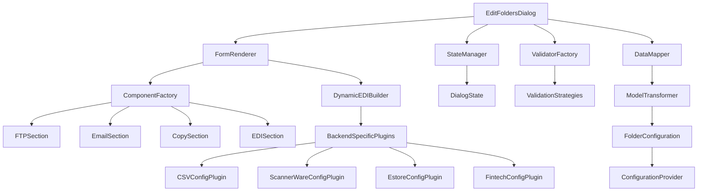

# Edit Folders Dialog Architecture Analysis

## Current Architecture Overview

The Edit Folders Dialog system has been refactored to improve testability and maintainability, with both Qt and Tkinter implementations. Here's what exists today:

### File Structure

```
interface/
├── models/
│   └── folder_configuration.py          # Data model with dataclasses
├── validation/
│   └── folder_settings_validator.py     # Validation logic
├── operations/
│   └── folder_data_extractor.py         # Data extraction from dialog fields
├── services/
│   └── ftp_service.py                   # FTP connection abstraction
├── qt/
│   └── dialogs/
│       ├── edit_folders_dialog.py       # Main Qt dialog (52KB)
│       └── edit_folders/
│           ├── __init__.py
│           ├── column_builders.py       # Column layout builders
│           ├── data_extractor.py        # Qt-specific field extraction
│           ├── dynamic_edi_builder.py   # Dynamic EDI section management
│           ├── event_handlers.py        # Event handling
│           └── layout_builder.py        # Overall layout construction
└── ui/
    └── dialogs/
        └── edit_folders_dialog.py       # Tkinter dialog (75KB)

tests/unit/test_edit_dialog/
├── test_folder_configuration.py
├── test_folder_settings_validator.py
├── test_folder_data_extractor.py
├── test_edit_dialog_ui.py
├── test_field_coverage.py
├── test_field_population_and_saving.py
├── test_ftp_service.py
└── conftest.py
```

## Current Architecture Strengths

### 1. Dependency Injection
- Both dialog implementations support dependency injection
- FTP service, validator, and extractor can be mocked for testing
- Settings and alias providers injected to avoid direct database access

### 2. Separation of Concerns
- **Data Model**: [`folder_configuration.py`](interface/models/folder_configuration.py) - Dataclass-based model with validation
- **Validation**: [`folder_settings_validator.py`](interface/validation/folder_settings_validator.py) - Centralized validation logic
- **Extraction**: [`folder_data_extractor.py`](interface/operations/folder_data_extractor.py) - Dialog field extraction
- **Service**: [`ftp_service.py`](interface/services/ftp_service.py) - FTP connection abstraction
- **UI**: Separate implementations for Qt and Tkinter

### 3. Modular Components (Qt Version)
The Qt dialog has been decomposed into:
- **Column Builders**: Creates individual dialog columns
- **Dynamic EDI Builder**: Handles dynamic EDI configuration sections
- **Data Extractor**: Extracts values from Qt widgets
- **Event Handlers**: Manages user interactions
- **Layout Builder**: Constructs overall dialog layout

### 4. Comprehensive Testing
- Tests cover all major components
- Mock FTP service for testing without real connections
- Field coverage and population testing
- Validation logic testing

## Complexity Issues

### 1. Monolithic Dialog Classes
Both implementations are still very large:
- **Qt**: ~53,000 characters (52KB)
- **Tkinter**: ~75,000 characters (75KB)

### 2. High Coupling
- Direct widget access in validation and data extraction
- Mixed concerns in main dialog classes
- Hard to modify or extend without affecting other parts

### 3. Duplication Between Implementations
- Similar logic duplicated in both Qt and Tkinter versions
- Changes need to be made in two places
- Increases maintenance effort

### 4. Complex Dynamic EDI Configuration
The EDI section has complex dynamic behavior based on convert format:
```
if fmt == "csv":
    self._build_csv_sub()
elif fmt == "ScannerWare":
    self._build_scannerware_sub()
elif fmt == "simplified_csv":
    self._build_simplified_csv_sub()
elif fmt in ("Estore eInvoice", "Estore eInvoice Generic"):
    self._build_estore_sub(fmt)
elif fmt == "fintech":
    self._build_fintech_sub()
elif fmt == "scansheet-type-a":
    pass
elif fmt in ("jolley_custom", "stewarts_custom", "YellowDog CSV"):
    self._build_basic_options_sub()
```

### 5. Field Extraction Complexity
Separate extractors for Qt and Tkinter:
- [`folder_data_extractor.py`](interface/operations/folder_data_extractor.py) - Tkinter
- [`data_extractor.py`](interface/qt/dialogs/edit_folders/data_extractor.py) - Qt

Both have similar logic with widget-specific implementations.

### 6. Configuration Management
The system handles:
- 11 different convert formats
- 3 backend types (copy, FTP, email)
- Multiple EDI processing options
- Numerous backend-specific configurations
- Complex validation rules

### 7. Database Schema Complexity
The folders table has many fields (60+), leading to complex SQL operations and data handling.

## Modularization Opportunities

### 1. Plugin System for Backend-Specific Configuration
Create a plugin architecture for backend-specific settings:
```
interface/plugins/
├── csv_config.py
├── scannerware_config.py
├── estore_config.py
├── fintech_config.py
└── __init__.py
```

Each plugin would handle:
- UI construction for backend-specific fields
- Validation logic
- Data extraction and population
- Configuration serialization/deserialization

### 2. Component-Based UI Architecture
Break dialog into reusable components:
```
interface/components/
├── ftp_section.py
├── email_section.py
├── copy_section.py
├── edi_section.py
└── upc_override_section.py
```

### 3. Configuration Provider Pattern
Separate configuration storage from UI logic:
```
interface/configuration/
├── config_provider.py
├── database_config_provider.py
└── file_config_provider.py
```

### 4. Validation Strategy Pattern
Create validation strategies for different configuration types:
```
interface/validation/
├── strategies/
│   ├── ftp_validation.py
│   ├── email_validation.py
│   ├── edi_validation.py
│   └── backend_specific_validation.py
└── validator_factory.py
```

### 5. Dynamic Form Generation
Implement dynamic form generation from configuration schema:
```
interface/form/
├── form_generator.py
├── field_config.py
└── form_renderer.py
```

### 6. Data Mapping Layer
Create a data mapping layer between UI fields and data model:
```
interface/mapping/
├── field_mapper.py
└── model_transformer.py
```

### 7. State Management
Implement centralized state management for dialog state:
```
interface/state/
├── dialog_state.py
└── state_manager.py
```

## Recommended Architecture



## Implementation Roadmap

### Phase 1: Plugin System Foundation
1. Create plugin interface and base class
2. Implement first backend-specific plugin (e.g., CSV)
3. Add plugin discovery mechanism
4. Refactor dialog to use plugins for backend-specific sections

### Phase 2: Componentization
1. Extract common sections as reusable components
2. Create component factory
3. Refactor dialog to use component-based architecture

### Phase 3: Data Mapping & State
1. Implement data mapping layer
2. Create state management system
3. Refactor field extraction and population

### Phase 4: Validation Strategy
1. Create validation strategy interface
2. Implement strategy for each configuration type
3. Add validator factory
4. Refactor validation logic

### Phase 5: Dynamic Form Generation
1. Create form configuration schema
2. Implement form generator
3. Refactor dialog to use dynamic form rendering

## Benefits of Modularization

### 1. Improved Maintainability
- Changes to backend-specific functionality isolated in plugins
- Components have single responsibility
- Easier to locate and fix bugs

### 2. Enhanced Testability
- Plugins can be tested in isolation
- Components have clear interfaces
- Reduced test setup complexity

### 3. Faster Development
- Reusable components accelerate new features
- Plugins enable parallel development
- Clear architecture guidelines

### 4. Flexibility
- Easy to add new convert formats
- Simple to extend with new backend types
- Support for custom configurations

### 5. Reduced Duplication
- Shared logic in base classes
- Common components reused across implementations
- Configuration-driven behavior

## Complexity Metrics to Track

- Number of lines in main dialog classes
- Number of cyclomatic complexity hotspots
- Test coverage percentage
- Number of components/plugins
- Code duplication percentage
- Time to add new convert format

This architecture will make the Edit Folders Dialog system much more maintainable and extensible while maintaining compatibility with both Qt and Tkinter implementations.
