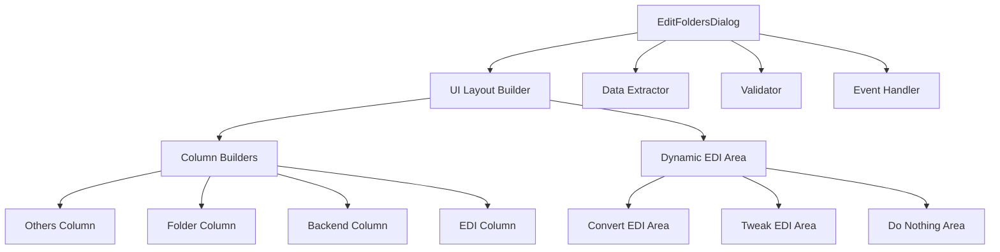

# Edit Folders Dialog Decomposition Plan

## Overview

This plan outlines the decomposition of the large, monolithic edit folders dialog files into smaller, manageable components while maintaining compatibility with both Qt and Tkinter UI architectures.

## Current Status Analysis

### Existing Files
- **Qt version**: `interface/qt/dialogs/edit_folders_dialog.py` (58,539 chars)
- **Tkinter version**: `interface/ui/dialogs/edit_folders_dialog.py` (75,218 chars)

### Already Extracted Components
The project has already implemented a solid foundation with these extracted modules:

| Component | File | Purpose |
|-----------|------|---------|
| Data Model | `interface/models/folder_configuration.py` | Folder configuration data structure with validation |
| Validation | `interface/validation/folder_settings_validator.py` | Settings validation logic |
| Data Extraction | `interface/operations/folder_data_extractor.py` | Dialog field extraction |
| FTP Service | `interface/services/ftp_service.py` | FTP operations abstraction |

## Decomposition Strategy

### 1. UI Component Architecture



### 2. Key Decomposition Areas

#### A. UI Layout Construction
Both dialogs follow a 4-column layout structure:
- **Others Column**: Displays other folders list and copy config functionality
- **Folder Column**: Basic folder settings (active state, backends)
- **Backend Column**: FTP, Email, and Copy backend configuration
- **EDI Column**: EDI processing settings with dynamic sub-areas

#### B. Dynamic EDI Configuration
The EDI column includes dynamic sections that appear based on user selection:
- **Do Nothing**: Basic state for "Send As Is"
- **Convert EDI**: Conversion format selection with format-specific settings
- **Tweak EDI**: Advanced EDI tweaking options

#### C. Event Handling
Key user interactions that need dedicated handlers:
- EDI option changes (show/hide dynamic sections)
- Backend toggle changes (enable/disable backend-specific fields)
- Copy config from other folder
- Show folder path
- Select copy destination
- Apply changes
- Validate inputs

## Proposed File Structure

```
interface/
├── qt/
│   └── dialogs/
│       ├── edit_folders_dialog.py        # Main dialog (reduced size)
│       ├── edit_folders/
│       │   ├── __init__.py
│       │   ├── layout_builder.py         # UI construction
│       │   ├── column_builders.py        # Column-specific layout
│       │   ├── dynamic_edi_builder.py    # Dynamic EDI section creation
│       │   ├── event_handlers.py         # User interaction handlers
│       │   └── data_extractor.py         # Qt-specific field extraction
└── ui/
    └── dialogs/
        ├── edit_folders_dialog.py        # Main dialog (reduced size)
        └── edit_folders/
            ├── __init__.py
            ├── layout_builder.py         # UI construction
            ├── column_builders.py        # Column-specific layout
            ├── dynamic_edi_builder.py    # Dynamic EDI section creation
            ├── event_handlers.py         # User interaction handlers
            └── data_extractor.py         # Tkinter-specific field extraction
```

## Detailed Decomposition Steps

### Step 1: Create Base Structure
1. Create `edit_folders` subdirectories in both Qt and Tkinter dialog directories
2. Add `__init__.py` files for package visibility
3. Define base interfaces for shared patterns

### Step 2: Extract Column Builders
For both Qt and Tkinter versions:
1. Extract `_build_others_column()` into `column_builders.py`
2. Extract `_build_folder_column()` into `column_builders.py`
3. Extract `_build_backend_column()` into `column_builders.py`
4. Extract `_build_edi_column()` into `column_builders.py`
5. Create column builder classes that accept parent widget/dialog references

### Step 3: Extract Dynamic EDI Builders
For both Qt and Tkinter versions:
1. Extract `_build_do_nothing_area()` into `dynamic_edi_builder.py`
2. Extract `_build_convert_edi_area()` into `dynamic_edi_builder.py`
3. Extract `_build_tweak_edi_area()` into `dynamic_edi_builder.py`
4. Extract `_clear_dynamic_edi()` and `_on_edi_option_changed()` into `dynamic_edi_builder.py`
5. Create a `DynamicEDIBuilder` class that manages the dynamic sections

### Step 4: Extract Event Handlers
For both Qt and Tkinter versions:
1. Extract `_update_active_state()` and `_update_backend_states()` into `event_handlers.py`
2. Extract `_copy_config_from_other()` and `_show_folder_path()` into `event_handlers.py`
3. Extract `_select_copy_directory()` and `_on_ok()` into `event_handlers.py`
4. Create an `EventHandler` class that handles all user interactions

### Step 5: Extract Layout Management
For both Qt and Tkinter versions:
1. Extract `_build_ui()` method into `layout_builder.py`
2. Create a `UILayoutBuilder` class that manages the complete UI construction
3. Handle widget container management and spacing

### Step 6: Extract Data Extraction (Qt version)
1. Move `QtFolderDataExtractor` from main dialog into `data_extractor.py`
2. Refactor to follow the same pattern as the Tkinter version's `FolderDataExtractor`
3. Ensure compatibility with `ExtractedDialogFields` dataclass

### Step 7: Refactor Main Dialog Classes
For both Qt and Tkinter versions:
1. Keep only minimal initialization logic in main dialog classes
2. Inject builder and handler dependencies
3. Maintain existing public API for compatibility
4. Remove redundant code sections

## Shared Functionality and Base Classes

### Cross-Platform Abstractions
1. **Data Extraction Interface**: Both versions use `ExtractedDialogFields` dataclass
2. **Validation**: Shared `FolderSettingsValidator` for both UI frameworks
3. **Data Model**: Shared `FolderConfiguration` across all platforms

### Platform-Specific Implementations
Each UI framework will implement:
- UI component builders (Qt widgets vs Tkinter widgets)
- Event handlers (Qt signals/slots vs Tkinter callbacks)
- Data extractors (widget value extraction)

## Benefits of Decomposition

### 1. Improved Maintainability
- Smaller, focused files that are easier to understand
- Clear separation of concerns
- Reduced complexity in each module

### 2. Enhanced Testability
- Isolated components that can be tested independently
- Easier to mock dependencies for unit testing
- Clear interfaces between components

### 3. Better Code Reuse
- Shared validation and data model logic
- Common patterns across UI frameworks
- Easier to add new UI platforms in the future

### 4. Simplified Debugging
- Each component has a single responsibility
- Clear error isolation
- Easier to track down issues

## Implementation Guidelines

### 1. Maintain Compatibility
- Keep existing public API unchanged
- Ensure all existing functionality works exactly the same
- Maintain compatibility with existing tests

### 2. Incremental Changes
- Implement decomposition in small, testable steps
- Test each component after extraction
- Use version control to track changes

### 3. Clear Interfaces
- Define clear public interfaces for all components
- Minimize coupling between modules
- Use dependency injection where possible

### 4. Documentation
- Document each component's purpose and responsibility
- Add docstrings for all classes and methods
- Update existing documentation to reflect changes

## Validation Plan

1. Run existing test suite before decomposition
2. Test each component after extraction
3. Run integration tests to ensure complete functionality
4. Verify both UI versions (Qt and Tkinter) work correctly
5. Check for any regression in functionality

## Estimated Scope

### Files to Create (for each UI framework)
- 1 layout builder
- 1 column builders module
- 1 dynamic EDI builder
- 1 event handlers module
- 1 data extractor module

### Files to Modify
- Main `edit_folders_dialog.py` (reduce size by ~70-80%)

### Expected Results
After decomposition:
- Main dialog files will be under 20KB each
- Each component file will focus on a single responsibility
- Clear separation between UI, logic, and data layers

## Next Steps

1. Begin with the Qt version decomposition
2. Implement one component at a time
3. Test thoroughly after each step
4. Repeat process for Tkinter version
5. Validate complete functionality
