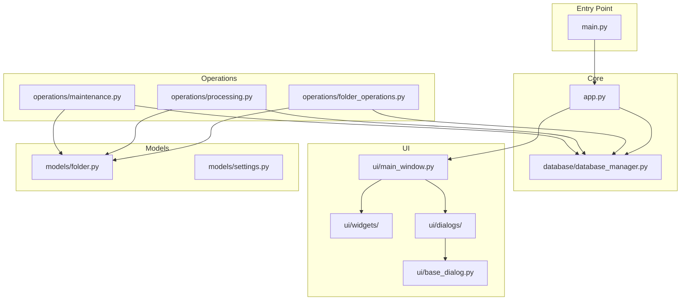

# Interface.py Refactoring Plan

## Executive Summary

The `interface.py` file is a 3564-line monolithic Tkinter GUI application that has grown organically over time, resulting in several critical maintainability issues. This plan outlines a comprehensive refactoring strategy to break the monolithic structure into focused, maintainable modules with clear separation of concerns.

## 1. Current State Analysis

### Critical Issues Summary

| Issue | Location | Severity | Impact |
|-------|----------|----------|--------|
| God Class - EditDialog | Lines 1214-2587 | 🔴 Critical | 1373 lines - Single Responsibility Principle violation |
| God Function - make_users_list | Lines 412-670 | 🔴 Critical | 258 lines - Handles UI, filtering, and button generation |
| God Function - process_directories | Lines 2651-2950 | 🔴 Critical | 300 lines - Does too much (logging, backup, processing, email) |
| God Function - mark_active_as_processed | Lines 3002-3102 | 🟡 Medium | 100 lines - Complex file processing logic |
| Missing docstrings | Throughout | 🟡 Medium | No documentation for most functions |
| Hardcoded strings | Throughout | 🟡 Medium | No i18n support |
| Global state abuse | Multiple locations | 🟡 Medium | Excessive use of `global` keyword |
| No type annotations | Throughout | 🟢 Low | Modern Python typing not used |

### File Statistics

- **Total Lines**: 3,564
- **Classes**: 4 (DatabaseObj, columnSorterWidget, EditSettingsDialog, EditDialog)
- **Functions**: ~40+ (many tightly coupled)
- **Cyclomatic Complexity**: Very high in several functions

## 2. Proposed New Directory Structure

```
interface/
├── __init__.py
├── main.py                          # Entry point, minimal bootstrapping
├── app.py                           # Main Application class
├── database/
│   ├── __init__.py
│   ├── database_manager.py          # DatabaseObj class (refactored)
│   └── database_operations.py       # Database helper functions
├── models/
│   ├── __init__.py
│   ├── folder.py                    # Folder configuration model
│   ├── settings.py                  # Settings model
│   └── processed_file.py            # Processed file model
├── ui/
│   ├── __init__.py
│   ├── base_dialog.py               # Base dialog class
│   ├── main_window.py               # Main application window
│   ├── widgets/
│   │   ├── __init__.py
│   │   ├── column_sorter.py         # columnSorterWidget
│   │   ├── folder_list.py           # make_users_list logic
│   │   └── button_panel.py          # Main button definitions
│   └── dialogs/
│       ├── __init__.py
│       ├── edit_folder_dialog.py    # EditDialog (refactored)
│       ├── edit_settings_dialog.py  # EditSettingsDialog (refactored)
│       ├── maintenance_dialog.py    # maintenance_functions_popup
│       └── processed_files_dialog.py # processed_files_popup
├── operations/
│   ├── __init__.py
│   ├── folder_operations.py         # add_folder, batch_add_folders, etc.
│   ├── processing.py                # process_directories logic
│   └── maintenance.py               # mark_active_as_processed, etc.
├── utils/
│   ├── __init__.py
│   └── validation.py                # Email validation, etc.
└── frontend/                        # Tkinter widgets that may be reused
    └── ...
```

## 3. Module Breakdown with Line Count Targets

### Phase 1: Foundation (Target: < 200 lines per module)

| New Module | Source Content | Target Lines | Responsibility |
|------------|----------------|--------------|----------------|
| `main.py` | Lines 1-62, 3486-3564 | ~150 | Entry point, argument parsing, app initialization |
| `database/database_manager.py` | DatabaseObj class (63-238) | ~175 | Database connection, migration, table access |
| `ui/base_dialog.py` | dialog.Dialog usage | ~100 | Base dialog with common patterns |

### Phase 2: Core UI Components (Target: < 300 lines per module)

| New Module | Source Content | Target Lines | Responsibility |
|------------|----------------|--------------|----------------|
| `ui/main_window.py` | Main UI setup (3490-3562) | ~100 | Main window, button panel, layout |
| `ui/widgets/folder_list.py` | make_users_list (412-670) | ~200 | Folder list with filtering, active/inactive split |
| `ui/widgets/column_sorter.py` | columnSorterWidget (672-732) | ~60 | Column sorting widget |
| `models/folder.py` | Folder data structures | ~100 | Folder configuration model |

### Phase 3: Dialogs (Target: < 350 lines per module)

| New Module | Source Content | Target Lines | Responsibility |
|------------|----------------|--------------|----------------|
| `ui/dialogs/edit_folder_dialog.py` | EditDialog (1214-2587) | ~350 | Folder/backend configuration - split into tabs |
| `ui/dialogs/edit_settings_dialog.py` | EditSettingsDialog (734-1212) | ~350 | Global settings - split into sections |
| `ui/dialogs/maintenance_dialog.py` | maintenance_functions_popup (3190-3275) | ~85 | Maintenance functions dialog |
| `ui/dialogs/processed_files_dialog.py` | processed_files_popup (3322-3468) | ~150 | Processed files report dialog |

### Phase 4: Operations (Target: < 250 lines per module)

| New Module | Source Content | Target Lines | Responsibility |
|------------|----------------|--------------|----------------|
| `operations/folder_operations.py` | add_folder, batch_add_folders, etc. (261-410) | ~150 | Folder CRUD operations |
| `operations/processing.py` | process_directories (2651-2950) | ~250 | Main processing loop - extract to separate concerns |
| `operations/maintenance.py` | mark_active_as_processed, etc. (2975-3147) | ~175 | Maintenance operations |

### Phase 5: Utilities and Models (Target: < 150 lines per module)

| New Module | Source Content | Target Lines | Responsibility |
|------------|----------------|--------------|----------------|
| `utils/validation.py` | validate_email (371-376) | ~50 | Validation utilities |
| `models/settings.py` | Settings data structures | ~100 | Settings model |
| `models/processed_file.py` | Processed file data structures | ~75 | Processed file model |

## 4. Dependencies Between New Modules



### Dependency Details

| Module | Depends On | Description |
|--------|------------|-------------|
| `main.py` | `app.py` | Entry point calls application initialization |
| `app.py` | `database_manager.py`, `main_window.py` | Coordinates database and UI |
| `database_manager.py` | - | Self-contained, manages all DB connections |
| `main_window.py` | `folder_list.py`, `dialogs/*` | Composes widgets and dialogs |
| `edit_folder_dialog.py` | `base_dialog.py`, `folder_model` | Inherits base dialog, uses folder model |
| `edit_settings_dialog.py` | `base_dialog.py`, `settings_model` | Inherits base dialog, uses settings model |
| `folder_operations.py` | `database_manager.py` | Uses database for folder operations |
| `processing.py` | `database_manager.py`, `folder_model` | Uses database and folder configs |
| `maintenance.py` | `database_manager.py` | Uses database for maintenance |

## 5. Phased Implementation Approach

### Phase 1: Foundation
**Goal**: Establish the new module structure without changing behavior

1. Create new directory structure
2. Create `__init__.py` files for all packages
3. Move `main.py` entry point logic
4. Move `DatabaseObj` class to `database_manager.py`
5. Create base dialog class in `base_dialog.py`
6. Verify all imports work correctly

### Phase 2: UI Components
**Goal**: Extract UI components with preserved functionality

1. Move main window setup to `main_window.py`
2. Extract `columnSorterWidget` to `column_sorter.py`
3. Refactor `make_users_list` to `folder_list.py`:
   - Extract folder filtering logic
   - Extract button generation to separate functions
   - Extract active/inactive list building
4. Create folder model in `models/folder.py`

### Phase 3: Dialogs Refactoring
**Goal**: Break down large dialog classes

1. Refactor `EditSettingsDialog`:
   - Extract AS400 connection settings to separate method
   - Extract email settings to separate method
   - Extract backup settings to separate method
   - Move to `edit_settings_dialog.py` (~350 lines target)

2. Refactor `EditDialog` (biggest task):
   - Split into tab-based interface:
     - Tab 1: General (active, alias, backends)
     - Tab 2: Copy Backend Settings
     - Tab 3: FTP Backend Settings
     - Tab 4: Email Backend Settings
     - Tab 5: EDI Processing Settings
     - Tab 6: Conversion Format Settings
   - Move to `edit_folder_dialog.py` (~350 lines target)

3. Move maintenance dialog to `maintenance_dialog.py`
4. Move processed files dialog to `processed_files_dialog.py`

### Phase 4: Operations Extraction
**Goal**: Extract business logic from UI

1. Move folder operations to `folder_operations.py`:
   - `add_folder()`
   - `batch_add_folders()`
   - `delete_folder_entry()`
   - `check_folder_exists()`

2. Refactor `process_directories`:
   - Extract backup logic to separate function
   - Extract logging setup to separate function
   - Extract email reporting to separate function
   - Move to `processing.py`

3. Move maintenance operations to `maintenance.py`:
   - `mark_active_as_processed()`
   - `remove_inactive_folders()`
   - `set_all_active()`
   - `set_all_inactive()`

### Phase 5: Cleanup and Documentation
**Goal**: Final improvements and documentation

1. Add type annotations throughout
2. Add docstrings to all public functions and classes
3. Extract validation utilities to `utils/validation.py`
4. Create settings and processed file models
5. Remove old `interface.py` or convert to thin wrapper
6. Update all import statements

## 6. Testing Strategy

### Unit Tests
- **Database Manager**: Test connection, migration, table access
- **Models**: Test data validation, serialization
- **Operations**: Test business logic functions
- **Validation Utils**: Test email validation, field validation

### Integration Tests
- **Dialog Flow**: Test dialog open/close, data persistence
- **Folder Operations**: Test add/edit/delete folder flow
- **Processing Flow**: Test processing with mock database

### GUI Tests
- **Main Window**: Test button actions, layout
- **Folder List**: Test filtering, button callbacks
- **Dialogs**: Test form validation, save/cancel

### Test Coverage Target
- **Phase 1-2**: 70% coverage for database and operations
- **Phase 3-4**: 80% coverage for core functionality
- **Phase 5**: 85% coverage overall

## 7. Backward Compatibility

### API Preservation
- Keep function signatures identical during extraction
- Maintain same import paths where possible
- Use deprecation warnings for renamed functions

### Migration Path
1. **Step 1**: Create new modules alongside `interface.py`
2. **Step 2**: Update internal imports to use new modules
3. **Step 3**: Add `interface_compat.py` wrapper with original function names
4. **Step 4**: Gradually migrate external code to new modules
5. **Step 5**: Remove `interface.py` or keep as thin compatibility layer

### External Script Compatibility
- Scripts importing `interface.py` directly should continue to work
- Provide migration guide for external consumers
- Maintain the same command-line interface

## 8. Implementation Steps

### Step 1: Project Setup
- [ ] Create `interface/` directory
- [ ] Create `interface/__init__.py`
- [ ] Create subdirectories for all packages
- [ ] Create `__init__.py` for each package

### Step 2: Database Module
- [ ] Create `interface/database/database_manager.py`
- [ ] Move `DatabaseObj` class
- [ ] Update imports to use new module
- [ ] Test database connectivity

### Step 3: UI Foundation
- [ ] Create `interface/ui/base_dialog.py`
- [ ] Create `interface/ui/main_window.py`
- [ ] Move main window setup
- [ ] Test application startup

### Step 4: Widgets
- [ ] Create `interface/ui/widgets/column_sorter.py`
- [ ] Create `interface/ui/widgets/folder_list.py`
- [ ] Extract and refactor `make_users_list()`
- [ ] Test folder list display and filtering

### Step 5: Dialogs - Settings
- [ ] Create `interface/ui/dialogs/edit_settings_dialog.py`
- [ ] Refactor `EditSettingsDialog` into tabs
- [ ] Test settings dialog functionality

### Step 6: Dialogs - Folder
- [ ] Create `interface/ui/dialogs/edit_folder_dialog.py`
- [ ] Refactor `EditDialog` into tabbed interface
- [ ] Test folder edit dialog

### Step 7: Operations - Folders
- [ ] Create `interface/operations/folder_operations.py`
- [ ] Move folder CRUD operations
- [ ] Test folder operations

### Step 8: Operations - Processing
- [ ] Create `interface/operations/processing.py`
- [ ] Refactor `process_directories`
- [ ] Extract backup, logging, email logic
- [ ] Test processing flow

### Step 9: Operations - Maintenance
- [ ] Create `interface/operations/maintenance.py`
- [ ] Move maintenance functions
- [ ] Test maintenance operations

### Step 10: Remaining Dialogs
- [ ] Create `interface/ui/dialogs/maintenance_dialog.py`
- [ ] Create `interface/ui/dialogs/processed_files_dialog.py`
- [ ] Test both dialogs

### Step 11: Utilities and Models
- [ ] Create `interface/utils/validation.py`
- [ ] Create `interface/models/folder.py`
- [ ] Create `interface/models/settings.py`
- [ ] Create `interface/models/processed_file.py`

### Step 12: Cleanup
- [ ] Add type annotations throughout
- [ ] Add docstrings to all public APIs
- [ ] Update `interface.py` to import from new modules
- [ ] Run full test suite
- [ ] Update documentation

## 9. Risk Mitigation

### High-Risk Areas
1. **EditDialog refactoring** - Most complex, requires careful tab separation
2. **process_directories** - Critical for business functionality, extensive testing needed
3. **Database migration** - Must preserve all data and relationships

### Mitigation Strategies
- Extract functions one at a time
- Run tests after each extraction
- Maintain compatibility layer throughout
- Use feature flags for gradual rollout

### Rollback Plan
- Keep original `interface.py` in version control
- Use git tags for each phase completion
- Maintain working commits at each phase end

## 10. Success Criteria

- [ ] No single file exceeds 350 lines
- [ ] All functions have docstrings
- [ ] Type annotations on all public APIs
- [ ] 85% test coverage
- [ ] All external scripts continue to work
- [ ] No functionality regression
- [ ] Documentation updated

## 11. Timeline Considerations

This refactoring should be performed incrementally to minimize risk:
- **Phase 1-2**: Foundation (1-2 weeks)
- **Phase 3**: Dialogs (2-3 weeks)
- **Phase 4**: Operations (1-2 weeks)
- **Phase 5**: Cleanup (1 week)

Total estimated time: 5-8 weeks for complete refactoring with thorough testing.
