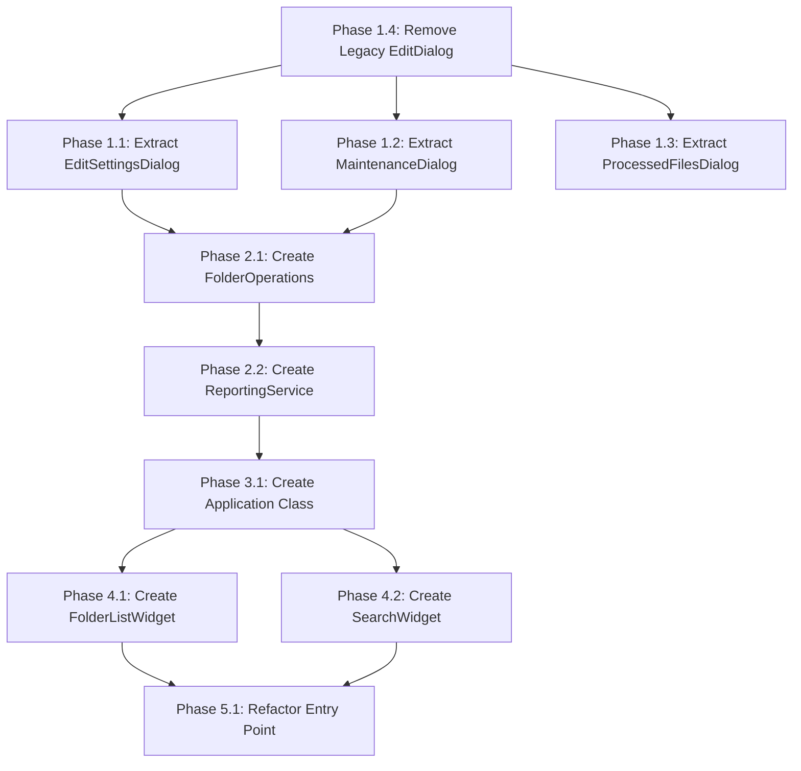

# Main Interface Refactoring Plan for Maintainability

## Executive Summary

The [`main_interface.py`](../main_interface.py) file is 164,682 characters (~3,582 lines) with significant maintainability challenges. The most critical issue is that **all application logic is nested inside an `if __name__ == "__main__":` block**, making functions and classes impossible to import, test, or reuse independently.

This plan outlines a phased approach to extract logical modules while maintaining backward compatibility and following established patterns from the existing refactored components.

---

## Current State Analysis

### File Structure Overview

```
main_interface.py (164,682 chars, ~3,582 lines)
├── Module-level functions (2)
│   ├── log_critical_error()        - Lines 62-80
│   └── attach_right_click_menu()   - Lines 83-94
│
└── if __name__ == "__main__": block (Lines 97-3582)
    ├── Initialization code         - Lines 97-130
    ├── Nested functions (65+)      - Lines 131-3580
    └── Main loop                   - Lines 3580-3582
```

### Critical Issues

#### 1. All Code in `if __name__` Block (CRITICAL)
**Impact**: Functions cannot be imported or tested

All 65+ functions and 2 dialog classes are defined inside the `if __name__ == "__main__":` block:
- [`check_logs_directory()`](../main_interface.py:132)
- [`add_folder()`](../main_interface.py:147)
- [`make_users_list()`](../main_interface.py:292) - ~258 lines
- [`process_directories()`](../main_interface.py:2683) - ~285 lines
- [`EditSettingsDialog`](../main_interface.py:551) class - ~452 lines
- [`EditDialog`](../main_interface.py:1004) class - ~1553 lines (legacy, see note)

#### 2. Global State Dependencies
**Impact**: Tight coupling, difficult testing

```python
# Global variables used throughout
root                      # Tkinter root window
database_obj_instance     # Database connection
folder_filter             # Filter state
users_list_frame          # UI frame
maintenance_popup         # Dialog reference
```

#### 3. Mixed Concerns
**Impact**: Violates single responsibility principle

- UI construction mixed with business logic
- Database operations embedded in UI code
- Processing logic intertwined with event handlers

#### 4. Legacy Code Duplication
**Impact**: Maintenance burden

The [`EditDialog`](../main_interface.py:1004) class (~1553 lines) appears to be legacy code that has been superseded by the refactored [`EditFoldersDialog`](../interface/ui/dialogs/edit_folders_dialog.py) but still exists in the file.

---

## Proposed Module Structure

### Target Directory Structure

```
interface/
├── __init__.py
├── interfaces.py                    # Existing - UI protocols
├── app.py                           # NEW - Application class
│
├── database/
│   ├── __init__.py
│   └── database_obj.py              # Existing
│
├── models/
│   ├── __init__.py
│   └── folder_configuration.py      # Existing
│
├── operations/
│   ├── __init__.py
│   ├── folder_manager.py            # Existing
│   ├── folder_operations.py         # NEW - CRUD operations
│   └── folder_data_extractor.py     # Existing
│
├── services/
│   ├── __init__.py
│   ├── ftp_service.py               # Existing
│   └── reporting_service.py         # NEW - Email reporting
│
├── ui/
│   ├── __init__.py
│   ├── main_window.py               # NEW - Main window class
│   ├── dialogs/
│   │   ├── __init__.py
│   │   ├── edit_folders_dialog.py   # Existing
│   │   ├── edit_settings_dialog.py  # NEW
│   │   ├── maintenance_dialog.py    # NEW
│   │   └── processed_files_dialog.py # NEW
│   └── widgets/
│       ├── __init__.py
│       ├── folder_list.py           # NEW
│       └── search_widget.py         # NEW
│
└── validation/
    ├── __init__.py
    ├── email_validator.py           # Existing
    └── folder_settings_validator.py # Existing

main_interface.py                    # Entry point only (~50 lines)
```

---

## Phased Implementation Approach

### Phase 1: Extract Dialogs (High Impact, Medium Risk)

**Rationale**: Dialogs are self-contained units with clear boundaries. The `EditFoldersDialog` pattern is already established.

#### 1.1 Extract EditSettingsDialog

**Source**: [`main_interface.py:551-1003`](../main_interface.py:551) (~452 lines)

**Target**: `interface/ui/dialogs/edit_settings_dialog.py`

**Dependencies to inject**:
- `database_obj_instance` → Settings provider protocol
- `root` → Parent window (passed as parameter)

**Complexity**: Medium
- Contains nested callback functions
- Direct database access for settings
- Log directory selection

**Extraction pattern**:
```python
# interface/ui/dialogs/edit_settings_dialog.py
class EditSettingsDialog(Dialog):
    def __init__(
        self,
        parent,
        settings: Dict[str, Any],
        settings_provider: SettingsProviderProtocol,
        on_apply: Optional[Callable] = None,
    ):
        ...
```

#### 1.2 Extract MaintenanceDialog

**Source**: [`main_interface.py:3200-3286`](../main_interface.py:3200) (~86 lines)

**Target**: `interface/ui/dialogs/maintenance_dialog.py`

**Functions to include**:
- `maintenance_functions_popup()`
- `remove_inactive_folders()`
- `mark_active_as_processed()`
- `set_all_inactive()`
- `set_all_active()`
- `clear_resend_flags()`
- `clear_processed_files_log()`
- `database_import_wrapper()`

**Complexity**: Medium
- Multiple callback functions
- Database operations
- UI state updates

#### 1.3 Extract ProcessedFilesDialog

**Source**: [`main_interface.py:3338-3487`](../main_interface.py:3338) (~149 lines)

**Target**: `interface/ui/dialogs/processed_files_dialog.py`

**Functions to include**:
- `processed_files_popup()`
- `export_processed_report()`
- Nested helper functions

**Complexity**: Low
- Self-contained functionality
- Clear input/output

#### 1.4 Remove Legacy EditDialog

**Source**: [`main_interface.py:1004-2557`](../main_interface.py:1004) (~1553 lines)

**Action**: DELETE after verifying `EditFoldersDialog` is complete

**Risk**: Low - Already superseded by refactored version

---

### Phase 2: Extract Operations (High Impact, Medium Risk)

**Rationale**: Business logic should be separated from UI for testability.

#### 2.1 Create FolderOperations

**Source**: Multiple functions scattered throughout

**Target**: `interface/operations/folder_operations.py`

**Functions to extract**:
| Function | Lines | Description |
|----------|-------|-------------|
| `add_folder()` | 147-173 | Add folder to database |
| `check_folder_exists()` | 175-183 | Check if folder exists |
| `delete_folder_entry()` | 2576-2580 | Delete folder |
| `update_folder_alias()` | 2562-2566 | Update alias |
| `disable_folder()` | 281-285 | Disable folder |

**Pattern**:
```python
# interface/operations/folder_operations.py
class FolderOperations:
    def __init__(self, database: DatabaseProtocol):
        self._database = database
    
    def add_folder(self, folder_path: str) -> None: ...
    def check_folder_exists(self, folder_path: str) -> FolderExistsResult: ...
    def delete_folder(self, folder_id: int) -> None: ...
    # etc.
```

#### 2.2 Create ReportingService

**Source**: [`main_interface.py:2792-2967`](../main_interface.py:2792) (~175 lines)

**Target**: `interface/services/reporting_service.py`

**Functions to extract**:
- Email batch sending logic
- Log file handling
- Error reporting

**Complexity**: High
- Complex email batching logic
- File operations
- Error handling

---

### Phase 3: Create Application Class (High Impact, High Risk)

**Rationale**: Encapsulate application state and initialization in a class.

#### 3.1 Create BatchFileSenderApp

**Target**: `interface/app.py`

**Responsibilities**:
- Application initialization
- Window management
- State management
- Event coordination

**Pattern**:
```python
# interface/app.py
class BatchFileSenderApp:
    def __init__(self, appname: str, version: str):
        self._appname = appname
        self._version = version
        self._root: Optional[tk.Tk] = None
        self._database: Optional[DatabaseObj] = None
        self._folder_operations: Optional[FolderOperations] = None
    
    def initialize(self) -> None:
        """Initialize application components."""
        self._create_database()
        self._create_ui()
        self._bind_events()
    
    def run(self) -> None:
        """Start the application main loop."""
        self._root.mainloop()
    
    def shutdown(self) -> None:
        """Clean up and close application."""
        self._database.close()
```

---

### Phase 4: Extract UI Components (Medium Impact, Low Risk)

**Rationale**: Break up the large `make_users_list()` function.

#### 4.1 Create FolderListWidget

**Source**: [`main_interface.py:292-550`](../main_interface.py:292) (~258 lines)

**Target**: `interface/ui/widgets/folder_list.py`

**Complexity**: Medium
- Complex UI construction
- Fuzzy filtering logic
- Active/inactive folder handling

#### 4.2 Create SearchWidget

**Source**: Part of `make_users_list()`

**Target**: `interface/ui/widgets/search_widget.py`

**Complexity**: Low
- Search field with callback
- Filter state management

---

### Phase 5: Refactor Entry Point (Low Impact, Low Risk)

**Rationale**: Simplify main_interface.py to be a thin entry point.

#### 5.1 Final main_interface.py

**Target**: ~50 lines

```python
#!/usr/bin/env python3
"""Entry point for Batch File Sender application."""

import multiprocessing

from interface.app import BatchFileSenderApp


def main():
    multiprocessing.freeze_support()
    app = BatchFileSenderApp(
        appname="Batch File Sender",
        version="(Git Branch: Master)",
        database_version="33"
    )
    app.initialize()
    app.run()


if __name__ == "__main__":
    main()
```

---

## Risk Assessment

### High Risk Areas

| Area | Risk | Mitigation |
|------|------|------------|
| Global state removal | Breaking existing functionality | Incremental extraction with tests |
| Application class creation | Complex initialization order | Preserve exact initialization sequence |
| Database dependency injection | Many functions affected | Create protocol, inject incrementally |

### Medium Risk Areas

| Area | Risk | Mitigation |
|------|------|------------|
| Dialog extraction | Callback dependencies | Pass callbacks as parameters |
| Operations extraction | Hidden coupling | Comprehensive test coverage first |

### Low Risk Areas

| Area | Risk | Mitigation |
|------|------|------------|
| Legacy EditDialog removal | Dead code | Verify test coverage of replacement |
| UI widget extraction | UI-only changes | Visual testing |

---

## Testing Strategy

### Pre-Extraction Testing

Before each extraction:
1. Ensure existing tests pass
2. Add integration tests for extraction target
3. Document current behavior

### During Extraction

1. Create new module with protocol interfaces
2. Write unit tests for new module
3. Create facade in original location
4. Verify all tests pass

### Post-Extraction

1. Remove facade
2. Update imports
3. Run full test suite
4. Visual/manual testing

---

## Estimated Test Counts by Phase

| Phase | New Unit Tests | New Integration Tests |
|-------|----------------|----------------------|
| Phase 1: Dialogs | ~80-100 | ~20-30 |
| Phase 2: Operations | ~50-70 | ~15-20 |
| Phase 3: Application | ~30-40 | ~20-25 |
| Phase 4: UI Widgets | ~40-50 | ~10-15 |
| Phase 5: Entry Point | ~5-10 | ~5 |
| **Total** | **~205-270** | **~70-95** |

---

## Dependencies and Order



---

## Success Criteria

### Phase 1 Complete When:
- [ ] `EditSettingsDialog` extracted and tested
- [ ] `MaintenanceDialog` extracted and tested
- [ ] `ProcessedFilesDialog` extracted and tested
- [ ] Legacy `EditDialog` removed
- [ ] All existing tests pass
- [ ] main_interface.py reduced by ~2200 lines

### Phase 2 Complete When:
- [ ] `FolderOperations` class created
- [ ] `ReportingService` class created
- [ ] Database operations injectable
- [ ] All operations have unit tests

### Phase 3 Complete When:
- [ ] `BatchFileSenderApp` class created
- [ ] Application initialization encapsulated
- [ ] Global state eliminated
- [ ] Application testable without UI

### Phase 4 Complete When:
- [ ] `FolderListWidget` extracted
- [ ] `SearchWidget` extracted
- [ ] UI components reusable

### Phase 5 Complete When:
- [x] `main_interface.py` is ~50 lines (actual: 38 lines, ~1,200 chars)
- [x] Entry point only creates and runs app
- [x] All tests pass (57 tests in test_main_interface.py)
- [x] No global state remains

**Phase 5 Completed: 2026-02-16**

Final entry point structure:
```python
#!/usr/bin/env python3
"""Entry point for Batch File Sender application."""
import multiprocessing
from interface.app import BatchFileSenderApp

def main() -> None:
    multiprocessing.freeze_support()
    app = BatchFileSenderApp(...)
    app.initialize()
    app.run()
    app.shutdown()

if __name__ == "__main__":
    main()
```

Removed backward compatibility functions (`log_critical_error`, `attach_right_click_menu`) 
as they were not imported anywhere - actual implementations exist in interface/app.py 
and interface/ui/dialogs/edit_settings_dialog.py.

---

## Appendix A: Function Inventory

### Functions in `if __name__` Block

| Function | Lines | Size | Phase |
|----------|-------|------|-------|
| `check_logs_directory()` | 132-145 | 14 | 3 |
| `add_folder()` | 147-173 | 27 | 2 |
| `check_folder_exists()` | 175-183 | 9 | 2 |
| `select_folder()` | 185-217 | 33 | 3 |
| `batch_add_folders()` | 219-256 | 38 | 3 |
| `edit_folder_selector()` | 258-265 | 8 | 3 |
| `send_single()` | 267-279 | 13 | 3 |
| `disable_folder()` | 281-285 | 5 | 2 |
| `set_folders_filter()` | 287-290 | 4 | 3 |
| `make_users_list()` | 292-550 | 259 | 4 |
| `EditSettingsDialog` class | 551-1003 | 453 | 1 |
| `EditDialog` class | 1004-2557 | 1554 | 1 (remove) |
| `update_reporting()` | 2558-2560 | 3 | 2 |
| `update_folder_alias()` | 2562-2566 | 5 | 2 |
| `refresh_users_list()` | 2568-2574 | 7 | 3 |
| `delete_folder_entry()` | 2576-2580 | 5 | 2 |
| `delete_folder_entry_wrapper()` | 2582-2589 | 8 | 2 |
| `graphical_process_directories()` | 2591-2614 | 24 | 3 |
| `set_defaults_popup()` | 2616-2681 | 66 | 3 |
| `process_directories()` | 2683-2967 | 285 | 2 |
| `automatic_process_directories()` | 2968-2983 | 16 | 3 |
| `remove_inactive_folders()` | 2985-3010 | 26 | 1 |
| `mark_active_as_processed()` | 3012-3112 | 101 | 1 |
| `set_all_inactive()` | 3114-3124 | 11 | 1 |
| `set_all_active()` | 3126-3136 | 11 | 1 |
| `clear_resend_flags()` | 3138-3147 | 10 | 1 |
| `clear_processed_files_log()` | 3149-3156 | 8 | 1 |
| `destroy_maintenance_popup()` | 3158-3159 | 2 | 1 |
| `database_import_wrapper()` | 3161-3198 | 38 | 1 |
| `maintenance_functions_popup()` | 3200-3285 | 86 | 1 |
| `export_processed_report()` | 3287-3336 | 50 | 1 |
| `processed_files_popup()` | 3338-3486 | 149 | 1 |
| `set_main_button_states()` | 3488-3501 | 14 | 3 |

---

## Appendix B: Existing Refactored Components

The following components have already been extracted and serve as patterns:

| Component | Location | Size |
|-----------|----------|------|
| `DatabaseObj` | `interface/database/database_obj.py` | 14,227 chars |
| `FolderManager` | `interface/operations/folder_manager.py` | 11,585 chars |
| `FolderConfiguration` | `interface/models/folder_configuration.py` | 16,925 chars |
| `FolderDataExtractor` | `interface/operations/folder_data_extractor.py` | 8,736 chars |
| `FolderSettingsValidator` | `interface/validation/folder_settings_validator.py` | 17,897 chars |
| `FTPService` | `interface/services/ftp_service.py` | 4,800 chars |
| `EditFoldersDialog` | `interface/ui/dialogs/edit_folders_dialog.py` | 74,325 chars |
| `EmailValidator` | `interface/validation/email_validator.py` | 5,562 chars |

---

## Appendix C: Protocol Interfaces Needed

### SettingsProviderProtocol

```python
@runtime_checkable
class SettingsProviderProtocol(Protocol):
    def get_settings(self) -> Dict[str, Any]: ...
    def update_settings(self, settings: Dict[str, Any]) -> None: ...
```

### FolderDatabaseProtocol

```python
@runtime_checkable
class FolderDatabaseProtocol(Protocol):
    def find_folder_by_id(self, folder_id: int) -> Optional[Dict]: ...
    def find_folder_by_alias(self, alias: str) -> Optional[Dict]: ...
    def find_folder_by_path(self, path: str) -> Optional[Dict]: ...
    def insert_folder(self, folder: Dict) -> int: ...
    def update_folder(self, folder: Dict) -> None: ...
    def delete_folder(self, folder_id: int) -> None: ...
    def get_all_folders(self) -> List[Dict]: ...
    def get_active_folders(self) -> List[Dict]: ...
```

### ReportingProtocol

```python
@runtime_checkable
class ReportingProtocol(Protocol):
    def send_report(self, log_path: str, metadata: Dict) -> bool: ...
    def queue_email(self, email_data: Dict) -> None: ...
    def process_email_queue(self) -> None: ...
```
