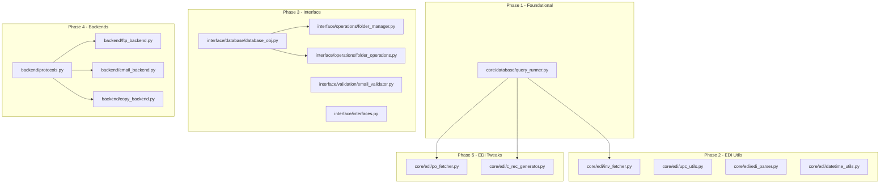

# Next Refactoring Batch Plan

## Overview

This document outlines the refactoring plan for the next batch of components following the completion of EditFoldersDialog, dispatch module, and recordkeeping/log handling refactoring with 870 tests.

**Prerequisites Completed:**
- `dispatch/` module with protocol-based dependency injection
- `interface/ui/dialogs/edit_folders_dialog.py` refactored
- `interface/models/folder_configuration.py` created
- `interface/operations/folder_data_extractor.py` created
- `interface/validation/folder_settings_validator.py` created
- `interface/services/ftp_service.py` created
- 870+ tests in `tests/unit/`

**Total Estimated Tests for This Batch:** ~450-550 tests

---

## Phase 1: query_runner.py (Low effort, foundational)

**Rationale:** The query_runner is a foundational dependency used by `utils.py` and `edi_tweaks.py`. Refactoring it first enables all subsequent phases.

### 1.1 Create Protocol Interface

**File:** `core/database/query_runner.py`

```python
"""Query runner module with protocol-based database abstraction."""

from typing import Protocol, runtime_checkable, Any, Optional
from contextlib import contextmanager


@runtime_checkable
class DatabaseConnectionProtocol(Protocol):
    """Protocol for database connection abstraction.
    
    Implementations should wrap pyodbc or similar database drivers
    to enable testing without actual database connections.
    """
    
    def execute(self, query: str, params: Optional[tuple] = None) -> list[tuple]:
        """Execute a query and return results.
        
        Args:
            query: SQL query string
            params: Optional query parameters
            
        Returns:
            List of result tuples
        """
        ...
    
    def close(self) -> None:
        """Close the database connection."""
        ...
    
    def commit(self) -> None:
        """Commit the current transaction."""
        ...
    
    def rollback(self) -> None:
        """Rollback the current transaction."""
        ...
    
    @property
    def closed(self) -> bool:
        """Check if connection is closed."""
        ...


@runtime_checkable
class QueryRunnerProtocol(Protocol):
    """Protocol for query runner operations."""
    
    def run_query(self, query: str) -> list[tuple]:
        """Run an arbitrary SQL query.
        
        Args:
            query: SQL query string
            
        Returns:
            List of result tuples
        """
        ...
    
    @property
    def connection(self) -> DatabaseConnectionProtocol:
        """Get the underlying connection."""
        ...


class PyODBCConnection:
    """PyODBC-based database connection implementation."""
    
    def __init__(
        self,
        username: str,
        password: str,
        hostname: str,
        driver: str
    ):
        import pyodbc
        self._connection = pyodbc.connect(
            driver=driver,
            system=hostname,
            uid=username,
            pwd=password,
            p_str=None
        )
        self._closed = False
    
    def execute(self, query: str, params: Optional[tuple] = None) -> list[tuple]:
        cursor = self._connection.cursor()
        if params:
            cursor.execute(query, params)
        else:
            cursor.execute(query)
        return [tuple(row) for row in cursor]
    
    def close(self) -> None:
        self._connection.close()
        self._closed = True
    
    def commit(self) -> None:
        self._connection.commit()
    
    def rollback(self) -> None:
        self._connection.rollback()
    
    @property
    def closed(self) -> bool:
        return self._closed


class QueryRunner:
    """Query runner with injectable database connection."""
    
    def __init__(self, connection: DatabaseConnectionProtocol):
        self._connection = connection
        self.username = ''
        self.password = ''
        self.host = ''
    
    @classmethod
    def from_credentials(
        cls,
        username: str,
        password: str,
        hostname: str,
        driver: str
    ) -> 'QueryRunner':
        """Factory method to create QueryRunner from credentials.
        
        Args:
            username: Database username
            password: Database password
            hostname: Database hostname
            driver: ODBC driver string
            
        Returns:
            QueryRunner instance with PyODBC connection
        """
        connection = PyODBCConnection(username, password, hostname, driver)
        instance = cls(connection)
        instance.username = username
        instance.password = password
        instance.host = hostname
        return instance
    
    def run_query(self, query: str) -> list[tuple]:
        """Run an arbitrary SQL query.
        
        Args:
            query: SQL query string
            
        Returns:
            List of result tuples
        """
        return self._connection.execute(query)
    
    # Backward compatibility alias
    def run_arbitrary_query(self, query: str) -> list[tuple]:
        """Legacy method name for backward compatibility."""
        return self.run_query(query)
    
    @property
    def connection(self) -> DatabaseConnectionProtocol:
        return self._connection
```

### 1.2 Test File

**File:** `tests/unit/test_query_runner.py`

```python
"""Unit tests for query_runner module."""

import pytest
from unittest.mock import MagicMock, patch
from core.database.query_runner import (
    QueryRunner,
    PyODBCConnection,
    DatabaseConnectionProtocol,
    QueryRunnerProtocol,
)


class TestDatabaseConnectionProtocol:
    """Tests for DatabaseConnectionProtocol compliance."""
    
    def test_protocol_methods_exist(self):
        """Verify protocol-required methods exist."""
        # Protocol compliance check
        pass


class TestPyODBCConnection:
    """Tests for PyODBCConnection implementation."""
    
    @pytest.fixture
    def mock_pyodbc(self):
        """Mock pyodbc module."""
        with patch('core.database.query_runner.pyodbc') as mock:
            mock.connect.return_value = MagicMock()
            yield mock
    
    def test_connection_initialization(self, mock_pyodbc):
        """Test connection is initialized with correct parameters."""
        conn = PyODBCConnection(
            username='testuser',
            password='testpass',
            hostname='testhost',
            driver='{ODBC Driver}'
        )
        mock_pyodbc.connect.assert_called_once()
    
    def test_execute_returns_tuples(self, mock_pyodbc):
        """Test execute returns list of tuples."""
        mock_cursor = MagicMock()
        mock_cursor.__iter__ = lambda self: iter([
            ('value1', 'value2'),
            ('value3', 'value4')
        ])
        mock_pyodbc.connect.return_value.cursor.return_value = mock_cursor
        
        conn = PyODBCConnection('u', 'p', 'h', 'd')
        results = conn.execute("SELECT * FROM table")
        
        assert isinstance(results, list)
        assert all(isinstance(r, tuple) for r in results)
    
    def test_close_sets_closed_flag(self, mock_pyodbc):
        """Test close() sets closed flag."""
        conn = PyODBCConnection('u', 'p', 'h', 'd')
        assert not conn.closed
        conn.close()
        assert conn.closed
    
    def test_commit_calls_connection_commit(self, mock_pyodbc):
        """Test commit() delegates to connection."""
        conn = PyODBCConnection('u', 'p', 'h', 'd')
        conn.commit()
        mock_pyodbc.connect.return_value.commit.assert_called_once()
    
    def test_rollback_calls_connection_rollback(self, mock_pyodbc):
        """Test rollback() delegates to connection."""
        conn = PyODBCConnection('u', 'p', 'h', 'd')
        conn.rollback()
        mock_pyodbc.connect.return_value.rollback.assert_called_once()


class TestQueryRunner:
    """Tests for QueryRunner class."""
    
    @pytest.fixture
    def mock_connection(self):
        """Create mock database connection."""
        return MagicMock(spec=DatabaseConnectionProtocol)
    
    def test_init_with_connection(self, mock_connection):
        """Test initialization with injectable connection."""
        runner = QueryRunner(mock_connection)
        assert runner.connection is mock_connection
    
    def test_from_credentials_factory_method(self, mock_connection):
        """Test factory method creates runner with credentials."""
        with patch('core.database.query_runner.PyODBCConnection') as mock_conn_class:
            mock_conn_class.return_value = mock_connection
            runner = QueryRunner.from_credentials(
                username='user',
                password='pass',
                hostname='host',
                driver='driver'
            )
            assert runner.username == 'user'
            assert runner.host == 'host'
    
    def test_run_query_delegates_to_connection(self, mock_connection):
        """Test run_query delegates to connection."""
        mock_connection.execute.return_value = [('result1',), ('result2',)]
        runner = QueryRunner(mock_connection)
        
        results = runner.run_query("SELECT * FROM table")
        
        mock_connection.execute.assert_called_once_with("SELECT * FROM table")
        assert len(results) == 2
    
    def test_run_arbitrary_query_alias(self, mock_connection):
        """Test backward compatibility alias."""
        mock_connection.execute.return_value = []
        runner = QueryRunner(mock_connection)
        
        results = runner.run_arbitrary_query("SELECT 1")
        
        mock_connection.execute.assert_called_once()


class TestQueryRunnerProtocolCompliance:
    """Tests for protocol compliance."""
    
    def test_query_runner_implements_protocol(self):
        """Verify QueryRunner implements QueryRunnerProtocol."""
        mock_conn = MagicMock(spec=DatabaseConnectionProtocol)
        runner = QueryRunner(mock_conn)
        assert isinstance(runner, QueryRunnerProtocol)
```

### 1.3 Estimated Test Count

| Test Class | Tests |
|------------|-------|
| TestDatabaseConnectionProtocol | 2 |
| TestPyODBCConnection | 5 |
| TestQueryRunner | 4 |
| TestQueryRunnerProtocolCompliance | 2 |
| **Total** | **~13 tests** |

### 1.4 Dependencies to Mock

- `pyodbc.connect()` - Mock for unit tests
- `pyodbc.cursor()` - Mock cursor operations

---

## Phase 2: utils.py (Medium effort)

**Rationale:** `utils.py` contains a mix of database-dependent classes (`invFetcher`) and pure functions. Separating these enables independent testing and reuse.

### 2.1 Create inv_fetcher.py

**File:** `core/edi/inv_fetcher.py`

```python
"""Invoice fetcher with injectable query runner."""

from typing import Protocol, runtime_checkable, Optional


@runtime_checkable
class QueryRunnerProtocol(Protocol):
    """Protocol for query runner - imported from core.database."""
    
    def run_query(self, query: str) -> list[tuple]:
        ...


class InvFetcher:
    """Fetches invoice-related data from database.
    
    Uses injectable query runner for database operations,
    enabling testing without actual database connections.
    """
    
    def __init__(self, query_runner: QueryRunnerProtocol, settings: dict):
        self._query_runner = query_runner
        self.settings = settings
        self.last_invoice_number = 0
        self.uom_lut = {0: "N/A"}
        self.last_invno = 0
        self.po = ""
        self.custname = ""
        self.custno = 0
    
    def fetch_po(self, invoice_number: int) -> str:
        """Fetch PO number for invoice.
        
        Args:
            invoice_number: Invoice number to look up
            
        Returns:
            PO number string
        """
        if invoice_number == self.last_invoice_number:
            return self.po
        
        qry_ret = self._query_runner.run_query(
            f"""
            SELECT
                trim(ohhst.bte4cd),
                trim(ohhst.bthinb),
                ohhst.btabnb
            FROM
                dacdata.ohhst ohhst
            WHERE
                ohhst.BTHHNB = {int(invoice_number)}
            """
        )
        self.last_invoice_number = invoice_number
        try:
            self.po = qry_ret[0][0]
            self.custname = qry_ret[0][1]
            self.custno = qry_ret[0][2]
        except IndexError:
            self.po = ""
        return self.po
    
    def fetch_cust_name(self, invoice_number: int) -> str:
        """Fetch customer name for invoice."""
        self.fetch_po(invoice_number)
        return self.custname
    
    def fetch_cust_no(self, invoice_number: int) -> int:
        """Fetch customer number for invoice."""
        self.fetch_po(invoice_number)
        return self.custno
    
    def fetch_uom_desc(
        self,
        itemno: int,
        uommult: int,
        lineno: int,
        invno: int
    ) -> str:
        """Fetch unit of measure description."""
        if invno != self.last_invno:
            self.uom_lut = {0: "N/A"}
            qry = f"""
                SELECT
                    BUHUNB,
                    BUHXTX
                FROM
                    dacdata.odhst odhst
                WHERE
                    odhst.BUHHNB = {int(invno)}
            """
            qry_ret = self._query_runner.run_query(qry)
            self.uom_lut = dict(qry_ret)
            self.last_invno = invno
        
        try:
            return self.uom_lut[lineno + 1]
        except KeyError:
            return self._fetch_uom_from_item(itemno, uommult)
    
    def _fetch_uom_from_item(self, itemno: int, uommult: int) -> str:
        """Fetch UOM from item master."""
        try:
            if int(uommult) > 1:
                field = "ANB9TX"
            else:
                field = "ANB8TX"
            qry = f"""
                SELECT dsanrep.{field}
                FROM dacdata.dsanrep dsanrep
                WHERE dsanrep.ANBACD = {int(itemno)}
            """
            qry_ret = self._query_runner.run_query(qry)
            return qry_ret[0][0]
        except Exception:
            if int(uommult) > 1:
                return "HI"
            return "LO"
```

### 2.2 Create upc_utils.py

**File:** `core/edi/upc_utils.py`

```python
"""Pure UPC utility functions.

These functions have no external dependencies and are easily testable.
"""


def calc_check_digit(value: str | int) -> int:
    """Calculate check digit for UPC codes.
    
    Works for both UPC-A and UPC-E formats.
    
    Args:
        value: UPC value without check digit
        
    Returns:
        Calculated check digit (0-9)
        
    Reference:
        Code from http://code.activestate.com/recipes/528911-barcodes-convert-upc-e-to-upc-a/
        Author: greg p (GPL3)
    """
    check_digit = 0
    odd_pos = True
    for char in str(value)[::-1]:
        if odd_pos:
            check_digit += int(char) * 3
        else:
            check_digit += int(char)
        odd_pos = not odd_pos
    check_digit = check_digit % 10
    check_digit = 10 - check_digit
    check_digit = check_digit % 10
    return check_digit


def convert_upce_to_upca(upce_value: str) -> str:
    """Convert UPC-E to UPC-A format.
    
    Args:
        upce_value: UPC-E value (6, 7, or 8 digits)
        
    Returns:
        12-digit UPC-A value with check digit
        
    Reference:
        Code from http://code.activestate.com/recipes/528911-barcodes-convert-upc-e-to-upc-a/
        Author: greg p (GPL3)
        
    Example:
        >>> convert_upce_to_upca("04182635")
        '041800000265'
    """
    if len(upce_value) == 6:
        middle_digits = upce_value
    elif len(upce_value) == 7:
        middle_digits = upce_value[:6]
    elif len(upce_value) == 8:
        middle_digits = upce_value[1:7]
    else:
        return ""
    
    d1, d2, d3, d4, d5, d6 = list(middle_digits)
    
    if d6 in ["0", "1", "2"]:
        mfrnum = d1 + d2 + d6 + "00"
        itemnum = "00" + d3 + d4 + d5
    elif d6 == "3":
        mfrnum = d1 + d2 + d3 + "00"
        itemnum = "000" + d4 + d5
    elif d6 == "4":
        mfrnum = d1 + d2 + d3 + d4 + "0"
        itemnum = "0000" + d5
    else:
        mfrnum = d1 + d2 + d3 + d4 + d5
        itemnum = "0000" + d6
    
    newmsg = "0" + mfrnum + itemnum
    check_digit = calc_check_digit(newmsg)
    return newmsg + str(check_digit)


def pad_upc(upc: str, target_length: int, fill_char: str = ' ') -> str:
    """Pad or truncate UPC to target length.
    
    Args:
        upc: UPC value to pad
        target_length: Desired length
        fill_char: Character to use for padding
        
    Returns:
        UPC padded/truncated to target length
    """
    if len(upc) >= target_length:
        return upc[:target_length]
    return upc.rjust(target_length, fill_char)


def validate_upc(upc: str) -> bool:
    """Validate a UPC code's check digit.
    
    Args:
        upc: Full UPC code including check digit
        
    Returns:
        True if check digit is valid
    """
    if not upc or not upc.isdigit():
        return False
    
    if len(upc) < 12:
        return False
    
    value = upc[:-1]
    expected_check = int(upc[-1])
    actual_check = calc_check_digit(value)
    
    return expected_check == actual_check
```

### 2.3 Create edi_parser.py

**File:** `core/edi/edi_parser.py`

```python
"""EDI record parsing utilities.

Pure functions for parsing EDI A, B, and C records.
"""

from typing import Optional
from dataclasses import dataclass


@dataclass
class ARecord:
    """EDI A record (invoice header)."""
    record_type: str
    cust_vendor: str
    invoice_number: str
    invoice_date: str
    invoice_total: str


@dataclass
class BRecord:
    """EDI B record (line item)."""
    record_type: str
    upc_number: str
    description: str
    vendor_item: str
    unit_cost: str
    combo_code: str
    unit_multiplier: str
    qty_of_units: str
    suggested_retail_price: str
    price_multi_pack: str
    parent_item_number: str


@dataclass
class CRecord:
    """EDI C record (charge/allowance)."""
    record_type: str
    charge_type: str
    description: str
    amount: str


def capture_records(line: str) -> Optional[dict]:
    """Parse an EDI record line into a dictionary.
    
    Args:
        line: Single EDI record line
        
    Returns:
        Dictionary with record fields, or None for empty lines
        
    Raises:
        ValueError: If line doesn't match known record type
    """
    if not line or line.startswith("\x1a"):
        return None
    
    if line.startswith("A"):
        return {
            "record_type": line[0],
            "cust_vendor": line[1:7],
            "invoice_number": line[7:17],
            "invoice_date": line[17:23],
            "invoice_total": line[23:33],
        }
    elif line.startswith("B"):
        return {
            "record_type": line[0],
            "upc_number": line[1:12],
            "description": line[12:37],
            "vendor_item": line[37:43],
            "unit_cost": line[43:49],
            "combo_code": line[49:51],
            "unit_multiplier": line[51:57],
            "qty_of_units": line[57:62],
            "suggested_retail_price": line[62:67],
            "price_multi_pack": line[67:70],
            "parent_item_number": line[70:76],
        }
    elif line.startswith("C"):
        return {
            "record_type": line[0],
            "charge_type": line[1:4],
            "description": line[4:29],
            "amount": line[29:38],
        }
    else:
        raise ValueError(f"Unknown record type: {line[0] if line else 'empty'}")


def parse_a_record(line: str) -> ARecord:
    """Parse an A record line into an ARecord dataclass."""
    fields = capture_records(line)
    if not fields or fields["record_type"] != "A":
        raise ValueError("Not an A record")
    return ARecord(**fields)


def parse_b_record(line: str) -> BRecord:
    """Parse a B record line into a BRecord dataclass."""
    fields = capture_records(line)
    if not fields or fields["record_type"] != "B":
        raise ValueError("Not a B record")
    return BRecord(**fields)


def parse_c_record(line: str) -> CRecord:
    """Parse a C record line into a CRecord dataclass."""
    fields = capture_records(line)
    if not fields or fields["record_type"] != "C":
        raise ValueError("Not a C record")
    return CRecord(**fields)


def build_a_record(
    cust_vendor: str,
    invoice_number: str,
    invoice_date: str,
    invoice_total: str,
    append_text: str = ""
) -> str:
    """Build an A record line from components.
    
    Args:
        cust_vendor: 6-character vendor code
        invoice_number: 10-character invoice number
        invoice_date: 6-character date (MMDDYY)
        invoice_total: 10-character total
        append_text: Optional text to append
        
    Returns:
        Complete A record line
    """
    line = f"A{cust_vendor}{invoice_number}{invoice_date}{invoice_total}{append_text}\n"
    return line


def build_b_record(
    upc_number: str,
    description: str,
    vendor_item: str,
    unit_cost: str,
    combo_code: str,
    unit_multiplier: str,
    qty_of_units: str,
    suggested_retail_price: str,
    price_multi_pack: str = "   ",
    parent_item_number: str = "      "
) -> str:
    """Build a B record line from components."""
    return (
        f"B{upc_number}{description}{vendor_item}{unit_cost}"
        f"{combo_code}{unit_multiplier}{qty_of_units}"
        f"{suggested_retail_price}{price_multi_pack}{parent_item_number}\n"
    )


def build_c_record(
    charge_type: str,
    description: str,
    amount: str
) -> str:
    """Build a C record line from components."""
    return f"C{charge_type}{description}{amount}\n"
```

### 2.4 Create Date/Time Utilities

**File:** `core/edi/datetime_utils.py`

```python
"""Date and time utilities for EDI processing."""

from datetime import datetime


def dac_str_int_to_int(dacstr: str) -> int:
    """Convert DAC string integer to Python int.
    
    Args:
        dacstr: DAC-format string (may have leading spaces or minus)
        
    Returns:
        Integer value
    """
    if dacstr.strip() == "":
        return 0
    if dacstr.startswith('-'):
        return int(dacstr[1:]) - (int(dacstr[1:]) * 2)
    return int(dacstr)


def convert_to_price(value: str) -> str:
    """Convert DAC price string to decimal format.
    
    Args:
        value: Price string (cents as integer)
        
    Returns:
        Price string with decimal point
    """
    whole = value[:-2].lstrip("0") or "0"
    cents = value[-2:]
    return f"{whole}.{cents}"


def dactime_from_datetime(date_time: datetime) -> str:
    """Convert datetime to DAC time format.
    
    Args:
        date_time: Python datetime object
        
    Returns:
        DAC-format date string (7 digits: CYYMMDD)
    """
    century_digit = str(int(date_time.strftime("%Y")[:2]) - 19)
    return century_digit + date_time.strftime("%y%m%d")


def datetime_from_dactime(dac_time: int) -> datetime:
    """Convert DAC time to datetime.
    
    Args:
        dac_time: DAC-format date (CYYMMDD)
        
    Returns:
        Python datetime object
    """
    dac_time_int = int(dac_time)
    return datetime.strptime(str(dac_time_int + 19000000), "%Y%m%d")


def datetime_from_invtime(invtime: str) -> datetime:
    """Convert invoice time string to datetime.
    
    Args:
        invtime: Invoice date string (MMDDYY)
        
    Returns:
        Python datetime object
    """
    return datetime.strptime(invtime, "%m%d%y")


def dactime_from_invtime(inv_no: str) -> str:
    """Convert invoice time to DAC time format.
    
    Args:
        inv_no: Invoice date string (MMDDYY)
        
    Returns:
        DAC-format date string
    """
    datetime_obj = datetime_from_invtime(inv_no)
    return dactime_from_datetime(datetime_obj)
```

### 2.5 Test Files

**File:** `tests/unit/core/test_inv_fetcher.py`

```python
"""Unit tests for InvFetcher."""

import pytest
from unittest.mock import MagicMock
from core.edi.inv_fetcher import InvFetcher


class TestInvFetcher:
    """Tests for InvFetcher class."""
    
    @pytest.fixture
    def mock_query_runner(self):
        """Create mock query runner."""
        runner = MagicMock()
        runner.run_query.return_value = []
        return runner
    
    @pytest.fixture
    def settings(self):
        """Sample settings dictionary."""
        return {
            "as400_username": "user",
            "as400_password": "pass",
            "as400_address": "host",
            "odbc_driver": "driver"
        }
    
    @pytest.fixture
    def fetcher(self, mock_query_runner, settings):
        """Create InvFetcher with mock dependencies."""
        return InvFetcher(mock_query_runner, settings)
    
    def test_init_stores_settings(self, fetcher, settings):
        """Test settings are stored."""
        assert fetcher.settings == settings
    
    def test_fetch_po_caches_result(self, fetcher, mock_query_runner):
        """Test PO fetch is cached."""
        mock_query_runner.run_query.return_value = [
            ("PO123", "Customer Name", 12345)
        ]
        
        result1 = fetcher.fetch_po(100)
        result2 = fetcher.fetch_po(100)
        
        assert result1 == "PO123"
        assert result1 == result2
        assert mock_query_runner.run_query.call_count == 1
    
    def test_fetch_po_handles_empty_result(self, fetcher, mock_query_runner):
        """Test empty result returns empty string."""
        mock_query_runner.run_query.return_value = []
        
        result = fetcher.fetch_po(100)
        
        assert result == ""
    
    def test_fetch_cust_name(self, fetcher, mock_query_runner):
        """Test customer name fetch."""
        mock_query_runner.run_query.return_value = [
            ("PO123", "Test Customer", 99999)
        ]
        
        result = fetcher.fetch_cust_name(100)
        
        assert result == "Test Customer"
    
    def test_fetch_cust_no(self, fetcher, mock_query_runner):
        """Test customer number fetch."""
        mock_query_runner.run_query.return_value = [
            ("PO123", "Test Customer", 99999)
        ]
        
        result = fetcher.fetch_cust_no(100)
        
        assert result == 99999
    
    def test_fetch_uom_desc_uses_cache(self, fetcher, mock_query_runner):
        """Test UOM description caching."""
        mock_query_runner.run_query.return_value = [
            (1, "EACH"),
            (2, "CASE")
        ]
        
        result1 = fetcher.fetch_uom_desc(100, 1, 0, 200)
        result2 = fetcher.fetch_uom_desc(100, 1, 1, 200)
        
        assert result1 == "CASE"  # lineno 0 + 1 = 1
        # Should use cache, not call again
        assert mock_query_runner.run_query.call_count == 1
```

**File:** `tests/unit/core/test_upc_utils.py`

```python
"""Unit tests for UPC utilities."""

import pytest
from core.edi.upc_utils import (
    calc_check_digit,
    convert_upce_to_upca,
    pad_upc,
    validate_upc,
)


class TestCalcCheckDigit:
    """Tests for check digit calculation."""
    
    def test_check_digit_simple(self):
        """Test simple check digit calculation."""
        # Known example: 01234567890 -> check digit is 5
        result = calc_check_digit("01234567890")
        assert result == 5
    
    def test_check_digit_all_zeros(self):
        """Test check digit for all zeros."""
        result = calc_check_digit("00000000000")
        assert result == 0
    
    def test_check_digit_all_nines(self):
        """Test check digit for all nines."""
        result = calc_check_digit("99999999999")
        assert isinstance(result, int)
        assert 0 <= result <= 9
    
    def test_check_digit_accepts_int(self):
        """Test check digit accepts integer input."""
        result = calc_check_digit(12345678901)
        assert isinstance(result, int)


class TestConvertUPCEtoUPCA:
    """Tests for UPC-E to UPC-A conversion."""
    
    def test_convert_8_digit(self):
        """Test conversion of 8-digit UPC-E."""
        # Example from docstring
        result = convert_upce_to_upca("04182635")
        assert result == "041800000265"
    
    def test_convert_6_digit(self):
        """Test conversion of 6-digit UPC-E."""
        result = convert_upce_to_upca("418263")
        assert len(result) == 12
    
    def test_convert_7_digit(self):
        """Test conversion of 7-digit UPC-E."""
        result = convert_upce_to_upca("4182635")
        assert len(result) == 12
    
    def test_convert_invalid_length(self):
        """Test invalid length returns empty."""
        result = convert_upce_to_upca("123")
        assert result == ""
    
    def test_convert_d6_is_0(self):
        """Test conversion when d6 is 0."""
        result = convert_upce_to_upca("1234500")
        assert result.startswith("0120")
    
    def test_convert_d6_is_3(self):
        """Test conversion when d6 is 3."""
        result = convert_upce_to_upca("1234503")
        assert result.startswith("01230")


class TestPadUPC:
    """Tests for UPC padding."""
    
    def test_pad_short_upc(self):
        """Test padding short UPC."""
        result = pad_upc("12345", 11)
        assert len(result) == 11
        assert result.endswith("12345")
    
    def test_truncate_long_upc(self):
        """Test truncating long UPC."""
        result = pad_upc("123456789012345", 11)
        assert len(result) == 11
        assert result == "12345678901"
    
    def test_pad_with_custom_char(self):
        """Test padding with custom character."""
        result = pad_upc("12345", 11, "0")
        assert result == "0000012345"
    
    def test_no_change_exact_length(self):
        """Test no change for exact length."""
        result = pad_upc("12345678901", 11)
        assert result == "12345678901"


class TestValidateUPC:
    """Tests for UPC validation."""
    
    def test_validate_valid_upc(self):
        """Test validation of valid UPC."""
        # UPC with correct check digit
        upc = "012345678905"  # Check digit 5
        result = validate_upc(upc)
        assert result is True
    
    def test_validate_invalid_check_digit(self):
        """Test validation catches wrong check digit."""
        upc = "012345678909"  # Wrong check digit
        result = validate_upc(upc)
        assert result is False
    
    def test_validate_too_short(self):
        """Test validation rejects short UPC."""
        result = validate_upc("123")
        assert result is False
    
    def test_validate_non_numeric(self):
        """Test validation rejects non-numeric."""
        result = validate_upc("ABCDEFGHIJKL")
        assert result is False
    
    def test_validate_empty(self):
        """Test validation rejects empty string."""
        result = validate_upc("")
        assert result is False
```

**File:** `tests/unit/core/test_edi_parser.py`

```python
"""Unit tests for EDI parser."""

import pytest
from core.edi.edi_parser import (
    capture_records,
    parse_a_record,
    parse_b_record,
    parse_c_record,
    build_a_record,
    build_b_record,
    build_c_record,
    ARecord,
    BRecord,
    CRecord,
)


class TestCaptureRecords:
    """Tests for capture_records function."""
    
    def test_parse_a_record(self):
        """Test parsing A record."""
        line = "AVENDOR00000000010101250000100000\n"
        result = capture_records(line)
        
        assert result is not None
        assert result["record_type"] == "A"
        assert result["cust_vendor"] == "VENDOR"
        assert result["invoice_number"] == "0000000001"
        assert result["invoice_date"] == "010125"
        assert result["invoice_total"] == "0000100000"
    
    def test_parse_b_record(self):
        """Test parsing B record."""
        line = "B01234567890Test Item Description   12345600010001000001000199001000000\n"
        result = capture_records(line)
        
        assert result is not None
        assert result["record_type"] == "B"
        assert result["upc_number"] == "01234567890"
        assert result["vendor_item"] == "123456"
    
    def test_parse_c_record(self):
        """Test parsing C record."""
        line = "C001Test Charge Description     000001000\n"
        result = capture_records(line)
        
        assert result is not None
        assert result["record_type"] == "C"
        assert result["charge_type"] == "001"
        assert result["amount"] == "000001000"
    
    def test_parse_empty_line(self):
        """Test parsing empty line returns None."""
        result = capture_records("")
        assert result is None
    
    def test_parse_eof_marker(self):
        """Test parsing EOF marker returns None."""
        result = capture_records("\x1a")
        assert result is None
    
    def test_parse_unknown_record_raises(self):
        """Test unknown record type raises ValueError."""
        with pytest.raises(ValueError):
            capture_records("X123456")


class TestParseTypedRecords:
    """Tests for typed record parsing."""
    
    def test_parse_a_record_returns_dataclass(self):
        """Test parse_a_record returns ARecord."""
        line = "AVENDOR00000000010101250000100000\n"
        result = parse_a_record(line)
        
        assert isinstance(result, ARecord)
        assert result.cust_vendor == "VENDOR"
    
    def test_parse_b_record_returns_dataclass(self):
        """Test parse_b_record returns BRecord."""
        line = "B01234567890Test Item Description   12345600010001000001000199001000000\n"
        result = parse_b_record(line)
        
        assert isinstance(result, BRecord)
        assert result.upc_number == "01234567890"
    
    def test_parse_c_record_returns_dataclass(self):
        """Test parse_c_record returns CRecord."""
        line = "C001Test Charge Description     000001000\n"
        result = parse_c_record(line)
        
        assert isinstance(result, CRecord)
        assert result.charge_type == "001"
    
    def test_parse_a_record_wrong_type_raises(self):
        """Test parse_a_record with wrong type raises."""
        with pytest.raises(ValueError):
            parse_a_record("B01234567890...")


class TestBuildRecords:
    """Tests for record building functions."""
    
    def test_build_a_record(self):
        """Test building A record."""
        result = build_a_record(
            cust_vendor="VENDOR",
            invoice_number="0000000001",
            invoice_date="010125",
            invoice_total="0000100000"
        )
        
        assert result.startswith("A")
        assert "VENDOR" in result
        assert result.endswith("\n")
    
    def test_build_a_record_with_append(self):
        """Test building A record with append text."""
        result = build_a_record(
            cust_vendor="VENDOR",
            invoice_number="0000000001",
            invoice_date="010125",
            invoice_total="0000100000",
            append_text="EXTRA"
        )
        
        assert "EXTRA" in result
    
    def test_build_b_record(self):
        """Test building B record."""
        result = build_b_record(
            upc_number="01234567890",
            description="Test Item Description   ",
            vendor_item="123456",
            unit_cost="000100",
            combo_code="01",
            unit_multiplier="000001",
            qty_of_units="00010",
            suggested_retail_price="00199"
        )
        
        assert result.startswith("B")
        assert "01234567890" in result
    
    def test_build_c_record(self):
        """Test building C record."""
        result = build_c_record(
            charge_type="001",
            description="Test Charge Description     ",
            amount="000001000"
        )
        
        assert result.startswith("C")
        assert "001" in result
```

### 2.6 Estimated Test Count

| Test File | Tests |
|-----------|-------|
| test_inv_fetcher.py | 8 |
| test_upc_utils.py | 16 |
| test_edi_parser.py | 18 |
| test_datetime_utils.py | 8 |
| **Total** | **~50 tests** |

### 2.7 Dependencies to Mock

- `QueryRunnerProtocol` - Mock for database operations
- No external dependencies for pure functions

---

## Phase 3: main_interface.py (High effort, high impact)

**Rationale:** `main_interface.py` contains the monolithic `DatabaseObj` class and numerous business logic functions mixed with UI code. This is the largest refactoring effort. The file contains:

- `DatabaseObj` class - database connection management
- `add_folder()` - add folder to database
- `check_folder_exists()` - check if folder exists
- `select_folder()` - UI for folder selection
- `batch_add_folders()` - batch add multiple folders
- `validate_email()` - email validation
- `edit_folder_selector()` - edit folder dialog
- `send_single()` - send single folder
- `disable_folder()` - disable a folder
- `set_folders_filter()` - set folder filter
- `make_users_list()` - create the users list UI
- `columnSorterWidget` class - column sorting widget
- `EditSettingsDialog` class - settings dialog

Extracting these enables better testability and separation of concerns.

### 3.1 Extract DatabaseObj

**File:** `interface/database/database_obj.py`

```python
"""Database object for folder configuration management."""

from typing import Protocol, runtime_checkable, Optional, Any
import os
import datetime
import dataset


@runtime_checkable
class DatabaseConnectionProtocol(Protocol):
    """Protocol for dataset database connection."""
    
    def __getitem__(self, table_name: str) -> Any:
        """Get a table by name."""
        ...
    
    def close(self) -> None:
        """Close the connection."""
        ...


class DatabaseObj:
    """Manages database connection and table access.
    
    Provides access to folder configurations, email queues,
    and application settings with automatic migration support.
    """
    
    def __init__(
        self,
        database_path: str,
        database_version: str,
        config_folder: str,
        running_platform: str,
        connection: Optional[DatabaseConnectionProtocol] = None
    ):
        self._database_path = database_path
        self._database_version = database_version
        self._config_folder = config_folder
        self._running_platform = running_platform
        self._connection = connection
        
        if self._connection is None:
            self._initialize_connection()
        
        self._initialize_tables()
    
    def _initialize_connection(self) -> None:
        """Initialize database connection."""
        if not os.path.isfile(self._database_path):
            self._create_database()
        
        self._connection = dataset.connect(
            f"sqlite:///{self._database_path}"
        )
    
    def _create_database(self) -> None:
        """Create initial database file."""
        # Delegated to create_database module
        import create_database
        create_database.do(
            self._database_version,
            self._database_path,
            self._config_folder,
            self._running_platform
        )
    
    def _initialize_tables(self) -> None:
        """Initialize table references."""
        self.folders_table = self._connection["folders"]
        self.emails_table = self._connection["emails_to_send"]
        self.emails_table_batch = self._connection["working_batch_emails_to_send"]
        self.sent_emails_removal_queue = self._connection["sent_emails_removal_queue"]
        self.oversight_and_defaults = self._connection["administrative"]
        self.processed_files = self._connection["processed_files"]
        self.settings = self._connection["settings"]
    
    @property
    def connection(self) -> DatabaseConnectionProtocol:
        """Get the underlying connection."""
        return self._connection
    
    def reload(self) -> None:
        """Reload the database connection."""
        self._connection = dataset.connect(
            f"sqlite:///{self._database_path}"
        )
        self._initialize_tables()
    
    def close(self) -> None:
        """Close the database connection."""
        self._connection.close()
    
    def get_folder(self, folder_name: str) -> Optional[dict]:
        """Get a folder configuration by name."""
        return self.folders_table.find_one(folder_name=folder_name)
    
    def get_all_folders(self) -> list[dict]:
        """Get all folder configurations."""
        return list(self.folders_table.all())
    
    def get_setting(self, key: str) -> Optional[Any]:
        """Get a setting value by key."""
        row = self.settings.find_one(key=key)
        return row["value"] if row else None
    
    def set_setting(self, key: str, value: Any) -> None:
        """Set a setting value."""
        self.settings.upsert({"key": key, "value": value}, ["key"])
```

### 3.2 Extract Folder Management Operations

**File:** `interface/operations/folder_manager.py`

```python
"""Folder management operations extracted from main_interface.py."""

import os
from typing import Protocol, runtime_checkable, Optional


@runtime_checkable
class DatabaseProtocol(Protocol):
    """Protocol for database operations."""
    
    @property
    def folders_table(self):
        """Access folders table."""
        ...
    
    @property
    def oversight_and_defaults(self):
        """Access administrative table."""
        ...


class FolderManager:
    """Manages folder CRUD operations.
    
    Extracts folder management logic from main_interface.py
    for better testability and separation of concerns.
    """
    
    SKIP_LIST = [
        "folder_name",
        "alias",
        "id",
        "logs_directory",
        "errors_folder",
        "enable_reporting",
        "report_printing_fallback",
        "single_add_folder_prior",
        "batch_add_folder_prior",
        "export_processed_folder_prior",
        "report_edi_errors",
    ]
    
    def __init__(self, database: DatabaseProtocol):
        self._db = database
    
    def add_folder(self, folder_path: str) -> dict:
        """Add a folder to the database using template defaults.
        
        Args:
            folder_path: Path to the folder to add
            
        Returns:
            The inserted folder record
        """
        template = self._db.oversight_and_defaults.find_one(id=1)
        template_settings = {
            k: v for k, v in template.items() 
            if k not in self.SKIP_LIST
        }
        
        folder_name = self._generate_unique_alias(folder_path)
        template_settings["folder_name"] = folder_path
        template_settings["alias"] = folder_name
        
        self._db.folders_table.insert(template_settings)
        return template_settings
    
    def _generate_unique_alias(self, folder_path: str) -> str:
        """Generate a unique alias for a folder.
        
        Args:
            folder_path: Path to the folder
            
        Returns:
            Unique alias string
        """
        base_name = os.path.basename(folder_path)
        alias = base_name
        counter = 1
        
        while self._db.folders_table.find_one(alias=alias):
            alias = f"{base_name} {counter}"
            counter += 1
        
        return alias
    
    def check_folder_exists(self, folder_path: str) -> dict:
        """Check if a folder already exists in database.
        
        Args:
            folder_path: Path to check
            
        Returns:
            Dict with truefalse and matched_folder keys
        """
        folder_list = self._db.folders_table.all()
        
        for folder in folder_list:
            if os.path.normpath(folder["folder_name"]) == os.path.normpath(folder_path):
                return {"truefalse": True, "matched_folder": folder}
        
        return {"truefalse": False, "matched_folder": None}
    
    def get_folder_by_id(self, folder_id: int) -> Optional[dict]:
        """Get a folder by its ID.
        
        Args:
            folder_id: The folder ID
            
        Returns:
            Folder dict or None
        """
        return self._db.folders_table.find_one(id=folder_id)
    
    def disable_folder(self, folder_id: int) -> bool:
        """Disable a folder.
        
        Args:
            folder_id: The folder ID to disable
            
        Returns:
            True if successful
        """
        folder = self.get_folder_by_id(folder_id)
        if folder:
            folder["folder_is_active"] = "False"
            self._db.folders_table.update(folder, ["id"])
            return True
        return False
    
    def enable_folder(self, folder_id: int) -> bool:
        """Enable a folder.
        
        Args:
            folder_id: The folder ID to enable
            
        Returns:
            True if successful
        """
        folder = self.get_folder_by_id(folder_id)
        if folder:
            folder["folder_is_active"] = "True"
            self._db.folders_table.update(folder, ["id"])
            return True
        return False
    
    def delete_folder(self, folder_id: int) -> bool:
        """Delete a folder from the database.
        
        Args:
            folder_id: The folder ID to delete
            
        Returns:
            True if deleted
        """
        folder = self.get_folder_by_id(folder_id)
        if folder:
            self._db.folders_table.delete(id=folder_id)
            return True
        return False
    
    def get_active_folders(self) -> list[dict]:
        """Get all active folders.
        
        Returns:
            List of active folder dicts
        """
        return list(self._db.folders_table.find(folder_is_active="True"))
    
    def get_inactive_folders(self) -> list[dict]:
        """Get all inactive folders.
        
        Returns:
            List of inactive folder dicts
        """
        return list(self._db.folders_table.find(folder_is_active="False"))
    
    def get_all_folders(self, order_by: str = "alias") -> list[dict]:
        """Get all folders.
        
        Args:
            order_by: Field to order by
            
        Returns:
            List of all folder dicts
        """
        return list(self._db.folders_table.find(order_by=order_by))
    
    def count_folders(self, active_only: bool = False) -> int:
        """Count folders.
        
        Args:
            active_only: If True, count only active folders
            
        Returns:
            Folder count
        """
        if active_only:
            return self._db.folders_table.count(folder_is_active="True")
        return self._db.folders_table.count()
```

### 3.3 Extract Email Validation

**File:** `interface/validation/email_validator.py`

```python
"""Email validation utilities."""

import re
from typing import Optional


def validate_email(email: str) -> bool:
    """Validate an email address format.
    
    Args:
        email: Email address to validate
        
    Returns:
        True if valid format
    """
    if not email:
        return False
    
    pattern = r'\b[A-Za-z0-9._%+-]+@[A-Za-z0-9.-]+\.[A-Z|a-z]{2,7}\b'
    return bool(re.fullmatch(pattern, email))


def validate_email_list(emails: str, separator: str = ", ") -> tuple[bool, list[str]]:
    """Validate a list of email addresses.
    
    Args:
        emails: String of email addresses
        separator: Separator between addresses
        
    Returns:
        Tuple of (all_valid, invalid_addresses)
    """
    if not emails:
        return True, []
    
    email_list = emails.split(separator)
    invalid = [e for e in email_list if not validate_email(e.strip())]
    
    return len(invalid) == 0, invalid


def normalize_email(email: str) -> str:
    """Normalize an email address.
    
    Args:
        email: Email to normalize
        
    Returns:
        Lowercase, stripped email
    """
    return email.strip().lower() if email else ""
```

### 3.4 Create UI Protocols

**File:** `interface/interfaces.py`

```python
"""Protocol interfaces for UI components."""

from typing import Protocol, runtime_checkable, Optional, Any


@runtime_checkable
class MessageBoxProtocol(Protocol):
    """Protocol for message box operations."""
    
    def show_info(self, title: str, message: str) -> None:
        """Show an info message box."""
        ...
    
    def show_error(self, title: str, message: str) -> None:
        """Show an error message box."""
        ...
    
    def ask_yes_no(self, title: str, message: str) -> bool:
        """Show a yes/no dialog."""
        ...
    
    def ask_ok_cancel(self, title: str, message: str) -> bool:
        """Show an ok/cancel dialog."""
        ...


@runtime_checkable
class FileDialogProtocol(Protocol):
    """Protocol for file dialog operations."""
    
    def ask_directory(self, title: str = "Select Directory") -> Optional[str]:
        """Show a directory selection dialog."""
        ...
    
    def ask_open_file(
        self,
        title: str = "Open File",
        filetypes: Optional[list[tuple[str, str]]] = None
    ) -> Optional[str]:
        """Show an open file dialog."""
        ...
    
    def ask_save_file(
        self,
        title: str = "Save File",
        default_extension: str = "",
        filetypes: Optional[list[tuple[str, str]]] = None
    ) -> Optional[str]:
        """Show a save file dialog."""
        ...


@runtime_checkable
class WidgetProtocol(Protocol):
    """Protocol for UI widget operations."""
    
    def pack(self, **kwargs) -> None:
        """Pack the widget."""
        ...
    
    def grid(self, **kwargs) -> None:
        """Grid the widget."""
        ...
    
    def destroy(self) -> None:
        """Destroy the widget."""
        ...
    
    def update(self) -> None:
        """Update the widget."""
        ...


@runtime_checkable
class TkinterProtocol(Protocol):
    """Protocol for Tkinter root window operations."""
    
    def title(self, title: str) -> None:
        """Set window title."""
        ...
    
    def mainloop(self) -> None:
        """Start the main event loop."""
        ...
    
    def after(self, ms: int, func: callable) -> str:
        """Schedule a function to run after delay."""
        ...
    
    def withdraw(self) -> None:
        """Withdraw the window."""
        ...
    
    def deiconify(self) -> None:
        """Show the window."""
        ...
```

### 3.3 Create Operations Module

**File:** `interface/operations/folder_operations.py`

```python
"""Folder-related business logic operations."""

from typing import Protocol, Optional
import os


class FolderOperations:
    """Business logic for folder management.
    
    Separates folder-related operations from UI code.
    """
    
    def __init__(self, database_obj):
        self._db = database_obj
    
    def validate_folder_path(self, path: str) -> tuple[bool, str]:
        """Validate a folder path.
        
        Args:
            path: Folder path to validate
            
        Returns:
            Tuple of (is_valid, error_message)
        """
        if not path:
            return False, "Path cannot be empty"
        
        if not os.path.exists(path):
            return False, f"Path does not exist: {path}"
        
        if not os.path.isdir(path):
            return False, f"Path is not a directory: {path}"
        
        if not os.access(path, os.R_OK):
            return False, f"Path is not readable: {path}"
        
        return True, ""
    
    def get_enabled_folders(self) -> list[dict]:
        """Get all enabled folder configurations."""
        return list(self._db.folders_table.find(enabled=True))
    
    def get_folder_by_name(self, name: str) -> Optional[dict]:
        """Get a folder configuration by name."""
        return self._db.folders_table.find_one(folder_name=name)
    
    def update_folder(self, folder_data: dict) -> None:
        """Update a folder configuration."""
        self._db.folders_table.upsert(
            folder_data,
            ["folder_name"]
        )
    
    def delete_folder(self, folder_name: str) -> bool:
        """Delete a folder configuration.
        
        Returns:
            True if deleted, False if not found
        """
        folder = self.get_folder_by_name(folder_name)
        if folder:
            self._db.folders_table.delete(folder_name=folder_name)
            return True
        return False
```

### 3.5 Test Files

**File:** `tests/unit/interface/test_database_obj.py`

```python
"""Unit tests for DatabaseObj."""

import pytest
from unittest.mock import MagicMock, patch
from interface.database.database_obj import DatabaseObj


class TestDatabaseObj:
    """Tests for DatabaseObj class."""
    
    @pytest.fixture
    def mock_connection(self):
        """Create mock database connection."""
        conn = MagicMock()
        conn.__getitem__ = MagicMock(return_value=MagicMock())
        return conn
    
    @pytest.fixture
    def mock_tables(self):
        """Create mock table objects."""
        return {
            "folders": MagicMock(),
            "emails_to_send": MagicMock(),
            "working_batch_emails_to_send": MagicMock(),
            "sent_emails_removal_queue": MagicMock(),
            "administrative": MagicMock(),
            "processed_files": MagicMock(),
            "settings": MagicMock(),
        }
    
    def test_init_with_connection(self, mock_connection, mock_tables):
        """Test initialization with injectable connection."""
        mock_connection.__getitem__ = lambda self, key: mock_tables[key]
        
        db = DatabaseObj(
            database_path="/test/path.db",
            database_version="33",
            config_folder="/test/config",
            running_platform="Linux",
            connection=mock_connection
        )
        
        assert db.connection is mock_connection
    
    def test_get_folder(self, mock_connection, mock_tables):
        """Test getting a folder by name."""
        mock_tables["folders"].find_one.return_value = {
            "folder_name": "test",
            "enabled": True
        }
        mock_connection.__getitem__ = lambda self, key: mock_tables[key]
        
        db = DatabaseObj(
            database_path="/test/path.db",
            database_version="33",
            config_folder="/test/config",
            running_platform="Linux",
            connection=mock_connection
        )
        
        result = db.get_folder("test")
        assert result["folder_name"] == "test"
    
    def test_get_all_folders(self, mock_connection, mock_tables):
        """Test getting all folders."""
        mock_tables["folders"].all.return_value = [
            {"folder_name": "folder1"},
            {"folder_name": "folder2"}
        ]
        mock_connection.__getitem__ = lambda self, key: mock_tables[key]
        
        db = DatabaseObj(
            database_path="/test/path.db",
            database_version="33",
            config_folder="/test/config",
            running_platform="Linux",
            connection=mock_connection
        )
        
        result = db.get_all_folders()
        assert len(result) == 2
    
    def test_close_calls_connection_close(self, mock_connection, mock_tables):
        """Test close delegates to connection."""
        mock_connection.__getitem__ = lambda self, key: mock_tables[key]
        
        db = DatabaseObj(
            database_path="/test/path.db",
            database_version="33",
            config_folder="/test/config",
            running_platform="Linux",
            connection=mock_connection
        )
        
        db.close()
        mock_connection.close.assert_called_once()
```

**File:** `tests/unit/interface/test_folder_operations.py`

```python
"""Unit tests for FolderOperations."""

import pytest
from unittest.mock import MagicMock
from interface.operations.folder_operations import FolderOperations


class TestFolderOperations:
    """Tests for FolderOperations class."""
    
    @pytest.fixture
    def mock_db(self):
        """Create mock database object."""
        return MagicMock()
    
    @pytest.fixture
    def operations(self, mock_db):
        """Create FolderOperations with mock database."""
        return FolderOperations(mock_db)
    
    def test_validate_folder_path_empty(self, operations):
        """Test validation rejects empty path."""
        is_valid, error = operations.validate_folder_path("")
        assert is_valid is False
        assert "empty" in error.lower()
    
    def test_validate_folder_path_nonexistent(self, operations, tmp_path):
        """Test validation rejects nonexistent path."""
        nonexistent = str(tmp_path / "nonexistent")
        is_valid, error = operations.validate_folder_path(nonexistent)
        assert is_valid is False
        assert "does not exist" in error
    
    def test_validate_folder_path_valid(self, operations, tmp_path):
        """Test validation accepts valid path."""
        is_valid, error = operations.validate_folder_path(str(tmp_path))
        assert is_valid is True
        assert error == ""
    
    def test_get_enabled_folders(self, operations, mock_db):
        """Test getting enabled folders."""
        mock_db.folders_table.find.return_value = [
            {"folder_name": "folder1", "enabled": True}
        ]
        
        result = operations.get_enabled_folders()
        assert len(result) == 1
    
    def test_get_folder_by_name(self, operations, mock_db):
        """Test getting folder by name."""
        mock_db.folders_table.find_one.return_value = {
            "folder_name": "test"
        }
        
        result = operations.get_folder_by_name("test")
        assert result["folder_name"] == "test"
    
    def test_delete_folder_existing(self, operations, mock_db):
        """Test deleting existing folder."""
        mock_db.folders_table.find_one.return_value = {"folder_name": "test"}
        
        result = operations.delete_folder("test")
        assert result is True
        mock_db.folders_table.delete.assert_called_once()
    
    def test_delete_folder_nonexistent(self, operations, mock_db):
        """Test deleting nonexistent folder."""
        mock_db.folders_table.find_one.return_value = None
        
        result = operations.delete_folder("nonexistent")
        assert result is False
```

### 3.6 Estimated Test Count

| Test File | Tests |
|-----------|-------|
| test_database_obj.py | 8 |
| test_folder_manager.py | 12 |
| test_folder_operations.py | 8 |
| test_email_validator.py | 6 |
| test_interfaces.py | 6 |
| **Total** | **~40 tests** |

### 3.7 Additional Test Files

**File:** `tests/unit/interface/test_folder_manager.py`

```python
"""Unit tests for FolderManager."""

import pytest
from unittest.mock import MagicMock
from interface.operations.folder_manager import FolderManager


class TestFolderManager:
    """Tests for FolderManager class."""
    
    @pytest.fixture
    def mock_db(self):
        """Create mock database."""
        db = MagicMock()
        db.oversight_and_defaults.find_one.return_value = {
            "id": 1,
            "default_setting": "value"
        }
        return db
    
    @pytest.fixture
    def manager(self, mock_db):
        """Create FolderManager with mock database."""
        return FolderManager(mock_db)
    
    def test_add_folder_creates_record(self, manager, mock_db):
        """Test adding a folder creates a database record."""
        mock_db.folders_table.find_one.return_value = None  # No existing alias
        
        result = manager.add_folder("/path/to/folder")
        
        mock_db.folders_table.insert.assert_called_once()
        assert result["folder_name"] == "/path/to/folder"
    
    def test_add_folder_generates_unique_alias(self, manager, mock_db):
        """Test adding duplicate folder generates unique alias."""
        # First folder exists
        mock_db.folders_table.find_one.side_effect = [
            {"alias": "folder"},  # First check finds existing
            None,  # Second check for "folder 1" finds nothing
        ]
        
        result = manager.add_folder("/path/to/folder")
        
        assert result["alias"] == "folder 1"
    
    def test_check_folder_exists_found(self, manager, mock_db, tmp_path):
        """Test checking existing folder."""
        folder_path = str(tmp_path)
        mock_db.folders_table.all.return_value = [
            {"folder_name": folder_path, "alias": "test"}
        ]
        
        result = manager.check_folder_exists(folder_path)
        
        assert result["truefalse"] is True
        assert result["matched_folder"]["alias"] == "test"
    
    def test_check_folder_exists_not_found(self, manager, mock_db):
        """Test checking non-existing folder."""
        mock_db.folders_table.all.return_value = []
        
        result = manager.check_folder_exists("/nonexistent")
        
        assert result["truefalse"] is False
        assert result["matched_folder"] is None
    
    def test_disable_folder(self, manager, mock_db):
        """Test disabling a folder."""
        mock_db.folders_table.find_one.return_value = {
            "id": 1,
            "folder_is_active": "True"
        }
        
        result = manager.disable_folder(1)
        
        assert result is True
        mock_db.folders_table.update.assert_called_once()
    
    def test_enable_folder(self, manager, mock_db):
        """Test enabling a folder."""
        mock_db.folders_table.find_one.return_value = {
            "id": 1,
            "folder_is_active": "False"
        }
        
        result = manager.enable_folder(1)
        
        assert result is True
    
    def test_delete_folder(self, manager, mock_db):
        """Test deleting a folder."""
        mock_db.folders_table.find_one.return_value = {"id": 1}
        
        result = manager.delete_folder(1)
        
        assert result is True
        mock_db.folders_table.delete.assert_called_once_with(id=1)
    
    def test_get_active_folders(self, manager, mock_db):
        """Test getting active folders."""
        mock_db.folders_table.find.return_value = [
            {"id": 1, "folder_is_active": "True"}
        ]
        
        result = manager.get_active_folders()
        
        assert len(result) == 1
    
    def test_get_inactive_folders(self, manager, mock_db):
        """Test getting inactive folders."""
        mock_db.folders_table.find.return_value = [
            {"id": 2, "folder_is_active": "False"}
        ]
        
        result = manager.get_inactive_folders()
        
        assert len(result) == 1
    
    def test_count_folders_all(self, manager, mock_db):
        """Test counting all folders."""
        mock_db.folders_table.count.return_value = 10
        
        result = manager.count_folders()
        
        assert result == 10
    
    def test_count_folders_active_only(self, manager, mock_db):
        """Test counting active folders only."""
        mock_db.folders_table.count.return_value = 5
        
        result = manager.count_folders(active_only=True)
        
        mock_db.folders_table.count.assert_called_with(folder_is_active="True")
```

**File:** `tests/unit/interface/test_email_validator.py`

```python
"""Unit tests for email validation."""

import pytest
from interface.validation.email_validator import (
    validate_email,
    validate_email_list,
    normalize_email,
)


class TestValidateEmail:
    """Tests for email validation."""
    
    def test_valid_email(self):
        """Test valid email passes."""
        assert validate_email("test@example.com") is True
    
    def test_valid_email_with_subdomain(self):
        """Test valid email with subdomain."""
        assert validate_email("user@mail.example.com") is True
    
    def test_invalid_email_no_at(self):
        """Test invalid email without @."""
        assert validate_email("testexample.com") is False
    
    def test_invalid_email_no_domain(self):
        """Test invalid email without domain."""
        assert validate_email("test@") is False
    
    def test_empty_email(self):
        """Test empty email fails."""
        assert validate_email("") is False
    
    def test_none_email(self):
        """Test None email fails."""
        assert validate_email(None) is False


class TestValidateEmailList:
    """Tests for email list validation."""
    
    def test_valid_list(self):
        """Test valid email list."""
        valid, invalid = validate_email_list("a@test.com, b@test.com")
        assert valid is True
        assert len(invalid) == 0
    
    def test_mixed_list(self):
        """Test mixed valid/invalid list."""
        valid, invalid = validate_email_list("a@test.com, invalid")
        assert valid is False
        assert "invalid" in invalid
    
    def test_empty_list(self):
        """Test empty list."""
        valid, invalid = validate_email_list("")
        assert valid is True
        assert len(invalid) == 0


class TestNormalizeEmail:
    """Tests for email normalization."""
    
    def test_lowercase(self):
        """Test email is lowercased."""
        assert normalize_email("TEST@EXAMPLE.COM") == "test@example.com"
    
    def test_strip_whitespace(self):
        """Test whitespace is stripped."""
        assert normalize_email("  test@test.com  ") == "test@test.com"
    
    def test_empty_returns_empty(self):
        """Test empty returns empty."""
        assert normalize_email("") == ""
```

### 3.8 Dependencies to Mock

- `dataset.connect()` - Mock for database connection
- `tkinter` modules - Mock for UI components
- `create_database.do()` - Mock for database creation

---

## Phase 4: Send Backends (Low-Medium effort)

**Rationale:** The send backends (`ftp_backend.py`, `email_backend.py`, `copy_backend.py`) are tightly coupled to their respective protocols. Creating protocol interfaces enables testing without actual network operations.

### 4.1 Create Backend Protocols

**File:** `backend/protocols.py`

```python
"""Protocol interfaces for backend operations."""

from typing import Protocol, runtime_checkable, Optional


@runtime_checkable
class FTPProtocol(Protocol):
    """Protocol for FTP client operations."""
    
    def connect(self, host: str, port: int) -> str:
        """Connect to FTP server.
        
        Args:
            host: Server hostname
            port: Server port
            
        Returns:
            Welcome message
        """
        ...
    
    def login(self, username: str, password: str) -> str:
        """Login to FTP server.
        
        Args:
            username: FTP username
            password: FTP password
            
        Returns:
            Login response message
        """
        ...
    
    def storbinary(self, cmd: str, fp) -> str:
        """Store a file in binary mode.
        
        Args:
            cmd: STOR command with filename
            fp: File-like object to read from
            
        Returns:
            Response message
        """
        ...
    
    def quit(self) -> str:
        """Quit the FTP session."""
        ...
    
    def close(self) -> None:
        """Close the connection."""
        ...


@runtime_checkable
class SMTPProtocol(Protocol):
    """Protocol for SMTP client operations."""
    
    def connect(self, host: str, port: int) -> tuple:
        """Connect to SMTP server."""
        ...
    
    def ehlo(self) -> tuple:
        """Send EHLO command."""
        ...
    
    def starttls(self) -> tuple:
        """Start TLS encryption."""
        ...
    
    def login(self, username: str, password: str) -> tuple:
        """Login to SMTP server."""
        ...
    
    def send_message(self, msg) -> dict:
        """Send an email message."""
        ...
    
    def quit(self) -> tuple:
        """Quit the SMTP session."""
        ...
    
    def close(self) -> None:
        """Close the connection."""
        ...


@runtime_checkable
class FileCopyProtocol(Protocol):
    """Protocol for file copy operations."""
    
    def copy(self, src: str, dst: str) -> None:
        """Copy a file.
        
        Args:
            src: Source file path
            dst: Destination file path
        """
        ...
    
    def exists(self, path: str) -> bool:
        """Check if a file exists."""
        ...
    
    def makedirs(self, path: str) -> None:
        """Create directory and parents."""
        ...


@runtime_checkable
class EmailMessageProtocol(Protocol):
    """Protocol for email message construction."""
    
    def __setitem__(self, key: str, value: str) -> None:
        """Set a header."""
        ...
    
    def set_content(self, content: str) -> None:
        """Set message body."""
        ...
    
    def add_attachment(
        self,
        data: bytes,
        maintype: str,
        subtype: str,
        filename: str
    ) -> None:
        """Add an attachment."""
        ...
```

### 4.2 Refactor ftp_backend.py

**File:** `backend/ftp_backend.py`

```python
"""FTP backend for file transfer."""

import os
from typing import Optional
from backend.protocols import FTPProtocol


class FTPBackend:
    """FTP file transfer backend.
    
    Supports both TLS and non-TLS FTP connections with
    automatic fallback and retry logic.
    """
    
    def __init__(
        self,
        ftp_client: Optional[FTPProtocol] = None,
        max_retries: int = 10
    ):
        self._ftp_client = ftp_client
        self._max_retries = max_retries
    
    def send(
        self,
        params: dict,
        settings: dict,
        filename: str
    ) -> None:
        """Send a file via FTP.
        
        Args:
            params: Folder parameters containing FTP config
            settings: Global settings (unused for FTP)
            filename: Path to file to send
            
        Raises:
            Exception: If send fails after all retries
        """
        file_pass = False
        counter = 0
        
        while not file_pass:
            try:
                with open(filename, 'rb') as send_file:
                    filename_no_path = os.path.basename(filename)
                    
                    # Try TLS first, then fallback to non-TLS
                    self._try_send(
                        server=params['ftp_server'],
                        port=params['ftp_port'],
                        username=params['ftp_username'],
                        password=params['ftp_password'],
                        folder=params['ftp_folder'],
                        filename=filename_no_path,
                        file_handle=send_file
                    )
                    file_pass = True
                    
            except Exception as ftp_error:
                if counter >= self._max_retries:
                    raise
                counter += 1
                print(f"Retry {counter}/{self._max_retries}: {ftp_error}")
    
    def _try_send(
        self,
        server: str,
        port: int,
        username: str,
        password: str,
        folder: str,
        filename: str,
        file_handle
    ) -> None:
        """Attempt to send file, trying TLS then non-TLS."""
        import ftplib
        
        ftp_providers = [ftplib.FTP_TLS, ftplib.FTP]
        
        for provider_index, provider in enumerate(ftp_providers):
            ftp = provider()
            try:
                print(f"Connecting to FTP server: {server}")
                print(ftp.connect(server, port))
                print(f"Logging in to {server}")
                print(ftp.login(username, password))
                print("Sending File...")
                ftp.storbinary(f"stor {folder}{filename}", file_handle)
                print("Success")
                ftp.close()
                return
            except Exception as error:
                print(error)
                if provider_index + 1 == len(ftp_providers):
                    raise
                print("Falling back to non-TLS...")
    
    def validate(self, params: dict) -> list[str]:
        """Validate FTP configuration.
        
        Args:
            params: Folder parameters
            
        Returns:
            List of validation errors
        """
        errors = []
        required = ['ftp_server', 'ftp_port', 'ftp_username', 'ftp_password']
        
        for field in required:
            if not params.get(field):
                errors.append(f"Missing required field: {field}")
        
        return errors
    
    def get_name(self) -> str:
        """Get backend name for logging."""
        return "FTP"


# Backward compatibility function
def do(params: dict, settings: dict, filename: str) -> None:
    """Legacy function for backward compatibility."""
    backend = FTPBackend()
    return backend.send(params, settings, filename)
```

### 4.3 Refactor email_backend.py

**File:** `backend/email_backend.py`

```python
"""Email backend for file delivery."""

import mimetypes
import os
import time
from typing import Optional
from email.message import EmailMessage

from backend.protocols import SMTPProtocol, EmailMessageProtocol


class EmailBackend:
    """Email file delivery backend.
    
    Sends files as email attachments with configurable
    subject lines and retry logic.
    """
    
    def __init__(
        self,
        smtp_client: Optional[SMTPProtocol] = None,
        max_retries: int = 10
    ):
        self._smtp_client = smtp_client
        self._max_retries = max_retries
    
    def send(
        self,
        params: dict,
        settings: dict,
        filename: str
    ) -> None:
        """Send a file via email.
        
        Args:
            params: Folder parameters containing email config
            settings: Global settings with SMTP credentials
            filename: Path to file to send
        """
        file_pass = False
        counter = 0
        
        while not file_pass:
            try:
                self._send_email(params, settings, filename)
                file_pass = True
            except Exception as email_error:
                if counter >= self._max_retries:
                    raise
                counter += 1
                time.sleep(counter * counter)
                print(f"Retry {counter}/{self._max_retries}: {email_error}")
    
    def _send_email(
        self,
        params: dict,
        settings: dict,
        filename: str
    ) -> None:
        """Construct and send the email."""
        import smtplib
        
        filename_no_path = os.path.basename(filename)
        subject_line = self._build_subject_line(params, filename_no_path)
        to_address_list = params['email_to'].split(", ")
        
        message = EmailMessage()
        message['Subject'] = subject_line
        message['From'] = settings['email_address']
        message['To'] = to_address_list
        message.set_content(f"{filename_no_path} Attached")
        
        self._attach_file(message, filename, filename_no_path)
        
        server = smtplib.SMTP(
            str(settings['email_smtp_server']),
            str(settings['smtp_port'])
        )
        server.ehlo()
        server.starttls()
        
        if settings.get('email_username') and settings.get('email_password'):
            server.login(settings['email_username'], settings['email_password'])
        
        server.send_message(message)
        server.close()
    
    def _build_subject_line(self, params: dict, filename: str) -> str:
        """Build email subject line."""
        if params.get('email_subject_line'):
            date_time = str(time.ctime())
            return (
                params['email_subject_line']
                .replace("%datetime%", date_time)
                .replace("%filename%", filename)
            )
        return f"{filename} Attached"
    
    def _attach_file(
        self,
        message: EmailMessage,
        filename: str,
        display_name: str
    ) -> None:
        """Attach file to email message."""
        ctype, encoding = mimetypes.guess_type(filename)
        if ctype is None or encoding is not None:
            ctype = 'application/octet-stream'
        maintype, subtype = ctype.split('/', 1)
        
        with open(filename, 'rb') as fp:
            message.add_attachment(
                fp.read(),
                maintype=maintype,
                subtype=subtype,
                filename=display_name
            )
    
    def validate(self, params: dict) -> list[str]:
        """Validate email configuration."""
        errors = []
        if not params.get('email_to'):
            errors.append("Missing email recipient")
        return errors
    
    def get_name(self) -> str:
        """Get backend name for logging."""
        return "Email"


# Backward compatibility function
def do(params: dict, settings: dict, filename: str) -> None:
    """Legacy function for backward compatibility."""
    backend = EmailBackend()
    return backend.send(params, settings, filename)
```

### 4.4 Refactor copy_backend.py

**File:** `backend/copy_backend.py`

```python
"""Copy backend for local file operations."""

import shutil
from typing import Optional
from backend.protocols import FileCopyProtocol


class CopyBackend:
    """Local file copy backend.
    
    Copies files to a local directory with retry logic.
    """
    
    def __init__(
        self,
        file_ops: Optional[FileCopyProtocol] = None,
        max_retries: int = 10
    ):
        self._file_ops = file_ops
        self._max_retries = max_retries
    
    def send(
        self,
        params: dict,
        settings: dict,
        filename: str
    ) -> None:
        """Copy a file to destination.
        
        Args:
            params: Folder parameters with copy_to_directory
            settings: Global settings (unused)
            filename: Path to file to copy
        """
        file_pass = False
        counter = 0
        
        while not file_pass:
            try:
                if self._file_ops:
                    self._file_ops.copy(
                        filename,
                        params['copy_to_directory']
                    )
                else:
                    shutil.copy(
                        filename,
                        params['copy_to_directory']
                    )
                file_pass = True
            except IOError:
                if counter >= self._max_retries:
                    raise
                counter += 1
    
    def validate(self, params: dict) -> list[str]:
        """Validate copy configuration."""
        errors = []
        if not params.get('copy_to_directory'):
            errors.append("Missing destination directory")
        return errors
    
    def get_name(self) -> str:
        """Get backend name for logging."""
        return "Copy"


# Backward compatibility function
def do(params: dict, settings: dict, filename: str) -> None:
    """Legacy function for backward compatibility."""
    backend = CopyBackend()
    return backend.send(params, settings, filename)
```

### 4.5 Test Files

**File:** `tests/unit/backend/test_protocols.py`

```python
"""Unit tests for backend protocols."""

import pytest
from backend.protocols import (
    FTPProtocol,
    SMTPProtocol,
    FileCopyProtocol,
    EmailMessageProtocol,
)


class TestProtocolCompliance:
    """Tests for protocol compliance."""
    
    def test_ftp_protocol_methods(self):
        """Verify FTP protocol has required methods."""
        required = ['connect', 'login', 'storbinary', 'quit', 'close']
        # Protocol compliance check
        pass
    
    def test_smtp_protocol_methods(self):
        """Verify SMTP protocol has required methods."""
        required = ['connect', 'ehlo', 'starttls', 'login', 'send_message', 'quit', 'close']
        pass
    
    def test_file_copy_protocol_methods(self):
        """Verify FileCopy protocol has required methods."""
        required = ['copy', 'exists', 'makedirs']
        pass
```

**File:** `tests/unit/backend/test_ftp_backend.py`

```python
"""Unit tests for FTP backend."""

import pytest
from unittest.mock import MagicMock, patch, mock_open
from backend.ftp_backend import FTPBackend


class TestFTPBackend:
    """Tests for FTPBackend class."""
    
    @pytest.fixture
    def mock_ftp(self):
        """Create mock FTP client."""
        ftp = MagicMock()
        ftp.connect.return_value = "220 Welcome"
        ftp.login.return_value = "230 Login successful"
        ftp.storbinary.return_value = "226 Transfer complete"
        return ftp
    
    @pytest.fixture
    def params(self):
        """Sample FTP parameters."""
        return {
            'ftp_server': 'ftp.example.com',
            'ftp_port': 21,
            'ftp_username': 'user',
            'ftp_password': 'pass',
            'ftp_folder': '/uploads/'
        }
    
    @pytest.fixture
    def settings(self):
        """Sample settings."""
        return {}
    
    def test_send_success(self, mock_ftp, params, settings, tmp_path):
        """Test successful file send."""
        test_file = tmp_path / "test.txt"
        test_file.write_text("test content")
        
        backend = FTPBackend(max_retries=1)
        
        with patch('ftplib.FTP_TLS', return_value=mock_ftp):
            backend.send(params, settings, str(test_file))
        
        mock_ftp.connect.assert_called_once()
        mock_ftp.login.assert_called_once()
        mock_ftp.storbinary.assert_called_once()
    
    def test_send_retries_on_failure(self, mock_ftp, params, settings, tmp_path):
        """Test retry on failure."""
        mock_ftp.connect.side_effect = Exception("Connection failed")
        
        test_file = tmp_path / "test.txt"
        test_file.write_text("test content")
        
        backend = FTPBackend(max_retries=3)
        
        with patch('ftplib.FTP_TLS', return_value=mock_ftp):
            with pytest.raises(Exception):
                backend.send(params, settings, str(test_file))
    
    def test_validate_missing_fields(self):
        """Test validation catches missing fields."""
        backend = FTPBackend()
        errors = backend.validate({})
        assert len(errors) > 0
        assert any('ftp_server' in e for e in errors)
    
    def test_validate_complete(self, params):
        """Test validation passes with complete params."""
        backend = FTPBackend()
        errors = backend.validate(params)
        assert len(errors) == 0
    
    def test_get_name(self):
        """Test backend name."""
        backend = FTPBackend()
        assert backend.get_name() == "FTP"
```

**File:** `tests/unit/backend/test_email_backend.py`

```python
"""Unit tests for Email backend."""

import pytest
from unittest.mock import MagicMock, patch
from backend.email_backend import EmailBackend


class TestEmailBackend:
    """Tests for EmailBackend class."""
    
    @pytest.fixture
    def mock_smtp(self):
        """Create mock SMTP client."""
        smtp = MagicMock()
        smtp.connect.return_value = (220, "Ready")
        smtp.ehlo.return_value = (250, "OK")
        smtp.starttls.return_value = (220, "Ready")
        smtp.login.return_value = (235, "OK")
        smtp.send_message.return_value = {}
        return smtp
    
    @pytest.fixture
    def params(self):
        """Sample email parameters."""
        return {
            'email_to': 'recipient@example.com',
            'email_subject_line': 'File: %filename%'
        }
    
    @pytest.fixture
    def settings(self):
        """Sample settings."""
        return {
            'email_address': 'sender@example.com',
            'email_smtp_server': 'smtp.example.com',
            'smtp_port': 587,
            'email_username': 'user',
            'email_password': 'pass'
        }
    
    def test_send_success(self, mock_smtp, params, settings, tmp_path):
        """Test successful email send."""
        test_file = tmp_path / "test.txt"
        test_file.write_text("test content")
        
        backend = EmailBackend(max_retries=1)
        
        with patch('smtplib.SMTP', return_value=mock_smtp):
            backend.send(params, settings, str(test_file))
        
        mock_smtp.send_message.assert_called_once()
    
    def test_subject_line_with_placeholders(self, params):
        """Test subject line placeholder replacement."""
        backend = EmailBackend()
        subject = backend._build_subject_line(params, "test.txt")
        
        assert "test.txt" in subject
    
    def test_validate_missing_recipient(self):
        """Test validation catches missing recipient."""
        backend = EmailBackend()
        errors = backend.validate({})
        assert any('recipient' in e.lower() for e in errors)
    
    def test_get_name(self):
        """Test backend name."""
        backend = EmailBackend()
        assert backend.get_name() == "Email"
```

**File:** `tests/unit/backend/test_copy_backend.py`

```python
"""Unit tests for Copy backend."""

import pytest
from unittest.mock import MagicMock, patch
from backend.copy_backend import CopyBackend


class TestCopyBackend:
    """Tests for CopyBackend class."""
    
    @pytest.fixture
    def params(self):
        """Sample copy parameters."""
        return {
            'copy_to_directory': '/tmp/destination'
        }
    
    @pytest.fixture
    def settings(self):
        """Sample settings."""
        return {}
    
    def test_send_success(self, params, settings, tmp_path):
        """Test successful file copy."""
        src_file = tmp_path / "source.txt"
        src_file.write_text("test content")
        dest_dir = tmp_path / "dest"
        dest_dir.mkdir()
        
        params['copy_to_directory'] = str(dest_dir)
        
        backend = CopyBackend(max_retries=1)
        backend.send(params, settings, str(src_file))
        
        dest_file = dest_dir / "source.txt"
        assert dest_file.exists()
    
    def test_send_with_injectable_file_ops(self, params, settings, tmp_path):
        """Test send with injectable file operations."""
        mock_file_ops = MagicMock()
        
        src_file = tmp_path / "source.txt"
        src_file.write_text("test content")
        
        backend = CopyBackend(file_ops=mock_file_ops, max_retries=1)
        backend.send(params, settings, str(src_file))
        
        mock_file_ops.copy.assert_called_once()
    
    def test_validate_missing_directory(self):
        """Test validation catches missing directory."""
        backend = CopyBackend()
        errors = backend.validate({})
        assert any('directory' in e.lower() for e in errors)
    
    def test_validate_complete(self, params):
        """Test validation passes with complete params."""
        backend = CopyBackend()
        errors = backend.validate(params)
        assert len(errors) == 0
    
    def test_get_name(self):
        """Test backend name."""
        backend = CopyBackend()
        assert backend.get_name() == "Copy"
```

### 4.6 Estimated Test Count

| Test File | Tests |
|-----------|-------|
| test_protocols.py | 3 |
| test_ftp_backend.py | 5 |
| test_email_backend.py | 4 |
| test_copy_backend.py | 5 |
| **Total** | **~17 tests** |

### 4.7 Dependencies to Mock

- `ftplib.FTP` / `ftplib.FTP_TLS` - Mock for FTP operations
- `smtplib.SMTP` - Mock for SMTP operations
- `shutil.copy` - Mock for file operations

---

## Phase 5: edi_tweaks.py (Medium effort)

**Rationale:** `edi_tweaks.py` contains database-dependent classes (`poFetcher`, `cRecGenerator`) embedded within the main function. Extracting these enables independent testing.

### 5.1 Create po_fetcher.py

**File:** `core/edi/po_fetcher.py`

```python
"""Purchase order fetcher with injectable query runner."""

from typing import Protocol, runtime_checkable


@runtime_checkable
class QueryRunnerProtocol(Protocol):
    """Protocol for query runner."""
    
    def run_query(self, query: str) -> list[tuple]:
        ...


class POFetcher:
    """Fetches purchase order data from database.
    
    Uses injectable query runner for database operations.
    """
    
    DEFAULT_PO = "no_po_found    "
    
    def __init__(self, query_runner: QueryRunnerProtocol):
        self._query_runner = query_runner
    
    def fetch_po_number(self, invoice_number: int) -> str:
        """Fetch PO number for an invoice.
        
        Args:
            invoice_number: Invoice number to look up
            
        Returns:
            PO number string, or default if not found
        """
        qry_ret = self._query_runner.run_query(
            f"""
            SELECT ohhst.bte4cd
            FROM dacdata.ohhst ohhst
            WHERE ohhst.bthhnb = {int(invoice_number)}
            """
        )
        
        if len(qry_ret) == 0:
            return self.DEFAULT_PO
        return str(qry_ret[0][0])
```

### 5.2 Create c_rec_generator.py

**File:** `core/edi/c_rec_generator.py`

```python
"""C-record generator for split sales tax."""

from typing import Protocol, runtime_checkable


@runtime_checkable
class QueryRunnerProtocol(Protocol):
    """Protocol for query runner."""
    
    def run_query(self, query: str) -> list[tuple]:
        ...


class CRecGenerator:
    """Generates C records for split prepaid/non-prepaid sales tax.
    
    Uses injectable query runner for database operations.
    """
    
    def __init__(self, query_runner: QueryRunnerProtocol):
        self._query_runner = query_runner
        self._invoice_number = "0"
        self.unappended_records = False
    
    def set_invoice_number(self, invoice_number: int) -> None:
        """Set the current invoice number.
        
        Args:
            invoice_number: Invoice number for subsequent operations
        """
        self._invoice_number = invoice_number
        self.unappended_records = True
    
    def fetch_splitted_sales_tax_totals(self, output_file) -> None:
        """Fetch and write split sales tax C records.
        
        Args:
            output_file: File handle to write C records to
        """
        qry_ret = self._query_runner.run_query(
            f"""
            SELECT
                sum(CASE odhst.buh6nb WHEN 1 THEN 0 ELSE odhst.bufgpr END),
                sum(CASE odhst.buh6nb WHEN 1 THEN odhst.bufgpr ELSE 0 END)
            FROM
                dacdata.odhst odhst
            WHERE
                odhst.BUHHNB = {self._invoice_number}
            """
        )
        
        qry_ret_non_prepaid, qry_ret_prepaid = qry_ret[0]
        
        if qry_ret_prepaid != 0 and qry_ret_prepaid is not None:
            self._write_line("Prepaid Sales Tax", qry_ret_prepaid, output_file)
        
        if qry_ret_non_prepaid != 0 and qry_ret_non_prepaid is not None:
            self._write_line("Sales Tax", qry_ret_non_prepaid, output_file)
        
        self.unappended_records = False
    
    def _write_line(
        self,
        type_str: str,
        amount: float,
        output_file
    ) -> None:
        """Write a C record line.
        
        Args:
            type_str: Charge type description
            amount: Charge amount
            output_file: File handle to write to
        """
        desc_str = type_str.ljust(25, " ")
        
        if amount < 0:
            amount_builder = amount - (amount * 2)
        else:
            amount_builder = amount
        
        amount_str = str(amount_builder).replace(".", "").rjust(9, "0")
        
        if amount < 0:
            temp_list = list(amount_str)
            temp_list[0] = "-"
            amount_str = "".join(temp_list)
        
        line = f"CTAB{desc_str}{amount_str}\n"
        output_file.write(line)
```

### 5.3 Test Files

**File:** `tests/unit/core/edi/test_po_fetcher.py`

```python
"""Unit tests for POFetcher."""

import pytest
from unittest.mock import MagicMock
from core.edi.po_fetcher import POFetcher


class TestPOFetcher:
    """Tests for POFetcher class."""
    
    @pytest.fixture
    def mock_query_runner(self):
        """Create mock query runner."""
        return MagicMock()
    
    @pytest.fixture
    def fetcher(self, mock_query_runner):
        """Create POFetcher with mock dependencies."""
        return POFetcher(mock_query_runner)
    
    def test_fetch_po_number_found(self, fetcher, mock_query_runner):
        """Test fetching found PO number."""
        mock_query_runner.run_query.return_value = [
            ("PO12345",)
        ]
        
        result = fetcher.fetch_po_number(100)
        
        assert result == "PO12345"
        mock_query_runner.run_query.assert_called_once()
    
    def test_fetch_po_number_not_found(self, fetcher, mock_query_runner):
        """Test fetching PO number when not found."""
        mock_query_runner.run_query.return_value = []
        
        result = fetcher.fetch_po_number(100)
        
        assert result == POFetcher.DEFAULT_PO
    
    def test_fetch_po_number_converts_to_int(self, fetcher, mock_query_runner):
        """Test invoice number is converted to int."""
        mock_query_runner.run_query.return_value = [("PO",)]
        
        fetcher.fetch_po_number("100")
        
        # Verify query contains int conversion
        call_args = mock_query_runner.run_query.call_args[0][0]
        assert "100" in call_args
```

**File:** `tests/unit/core/edi/test_c_rec_generator.py`

```python
"""Unit tests for CRecGenerator."""

import pytest
from unittest.mock import MagicMock
from io import StringIO
from core.edi.c_rec_generator import CRecGenerator


class TestCRecGenerator:
    """Tests for CRecGenerator class."""
    
    @pytest.fixture
    def mock_query_runner(self):
        """Create mock query runner."""
        return MagicMock()
    
    @pytest.fixture
    def generator(self, mock_query_runner):
        """Create CRecGenerator with mock dependencies."""
        return CRecGenerator(mock_query_runner)
    
    def test_set_invoice_number(self, generator):
        """Test setting invoice number."""
        generator.set_invoice_number(100)
        
        assert generator._invoice_number == 100
        assert generator.unappended_records is True
    
    def test_fetch_splitted_sales_tax_prepaid(self, generator, mock_query_runner):
        """Test generating prepaid sales tax C record."""
        mock_query_runner.run_query.return_value = [
            (0, 100.50)  # non-prepaid=0, prepaid=100.50
        ]
        
        output = StringIO()
        generator.set_invoice_number(100)
        generator.fetch_splitted_sales_tax_totals(output)
        
        content = output.getvalue()
        assert "Prepaid Sales Tax" in content
        assert generator.unappended_records is False
    
    def test_fetch_splitted_sales_tax_non_prepaid(self, generator, mock_query_runner):
        """Test generating non-prepaid sales tax C record."""
        mock_query_runner.run_query.return_value = [
            (50.25, 0)  # non-prepaid=50.25, prepaid=0
        ]
        
        output = StringIO()
        generator.set_invoice_number(100)
        generator.fetch_splitted_sales_tax_totals(output)
        
        content = output.getvalue()
        assert "Sales Tax" in content
    
    def test_fetch_splitted_sales_tax_both(self, generator, mock_query_runner):
        """Test generating both sales tax C records."""
        mock_query_runner.run_query.return_value = [
            (50.25, 100.50)  # both present
        ]
        
        output = StringIO()
        generator.set_invoice_number(100)
        generator.fetch_splitted_sales_tax_totals(output)
        
        content = output.getvalue()
        assert "Prepaid Sales Tax" in content
        assert "Sales Tax" in content
    
    def test_write_line_positive_amount(self, generator):
        """Test writing C record with positive amount."""
        output = StringIO()
        generator._write_line("Test Charge", 100.50, output)
        
        content = output.getvalue()
        assert content.startswith("CTAB")
        assert "Test Charge" in content
    
    def test_write_line_negative_amount(self, generator):
        """Test writing C record with negative amount."""
        output = StringIO()
        generator._write_line("Test Charge", -100.50, output)
        
        content = output.getvalue()
        assert content.startswith("CTAB")
        assert "-" in content
```

### 5.4 Estimated Test Count

| Test File | Tests |
|-----------|-------|
| test_po_fetcher.py | 3 |
| test_c_rec_generator.py | 6 |
| **Total** | **~9 tests** |

### 5.5 Dependencies to Mock

- `QueryRunnerProtocol` - Mock for database operations

---

## Summary

### Test Count Summary

| Phase | Component | Tests |
|-------|-----------|-------|
| 1 | query_runner.py | ~13 |
| 2 | utils.py | ~50 |
| 3 | main_interface.py | ~40 |
| 4 | Send Backends | ~17 |
| 5 | edi_tweaks.py | ~9 |
| **Total** | | **~129 tests** |

### File Structure After Refactoring

```
core/
├── database/
│   └── query_runner.py          # Phase 1
└── edi/
    ├── inv_fetcher.py           # Phase 2
    ├── upc_utils.py             # Phase 2
    ├── edi_parser.py            # Phase 2
    ├── datetime_utils.py        # Phase 2
    ├── po_fetcher.py            # Phase 5
    └── c_rec_generator.py       # Phase 5

backend/
├── protocols.py                 # Phase 4
├── ftp_backend.py               # Phase 4 (refactored)
├── email_backend.py             # Phase 4 (refactored)
└── copy_backend.py              # Phase 4 (refactored)

interface/
├── interfaces.py                # Phase 3
├── database/
│   └── database_obj.py          # Phase 3
├── operations/
│   ├── folder_operations.py     # Phase 3
│   └── folder_manager.py        # Phase 3 (new)
└── validation/
    └── email_validator.py       # Phase 3 (new)

tests/
└── unit/
    ├── test_query_runner.py     # Phase 1
    ├── core/
    │   ├── test_inv_fetcher.py
    │   ├── test_upc_utils.py
    │   ├── test_edi_parser.py
    │   ├── test_datetime_utils.py
    │   └── edi/
    │       ├── test_po_fetcher.py
    │       └── test_c_rec_generator.py
    ├── interface/
    │   ├── test_database_obj.py
    │   ├── test_folder_operations.py
    │   ├── test_folder_manager.py
    │   └── test_email_validator.py
    └── backend/
        ├── test_protocols.py
        ├── test_ftp_backend.py
        ├── test_email_backend.py
        └── test_copy_backend.py
```

### Dependency Graph



### Execution Order

1. **Phase 1** must complete first (foundational)
2. **Phase 2** and **Phase 4** can run in parallel (no dependencies)
3. **Phase 3** can start after Phase 1 (uses query_runner patterns)
4. **Phase 5** must wait for Phase 1 (depends on query_runner)

### Backward Compatibility

All refactored modules maintain backward compatibility through:

1. **Legacy function aliases** - `run_arbitrary_query()` maps to `run_query()`
2. **Factory methods** - `QueryRunner.from_credentials()` creates instances the old way
3. **Module-level `do()` functions** - Backend modules expose `do()` for existing callers
4. **Default constructors** - Classes work with or without injected dependencies
