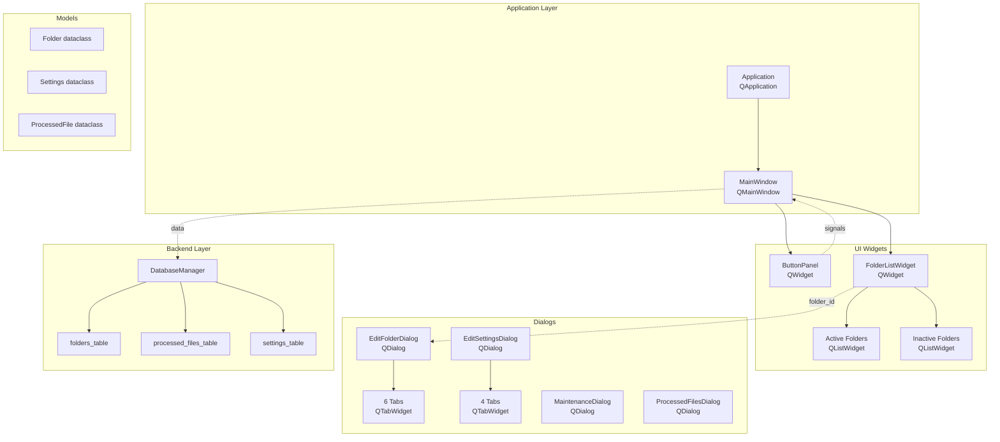
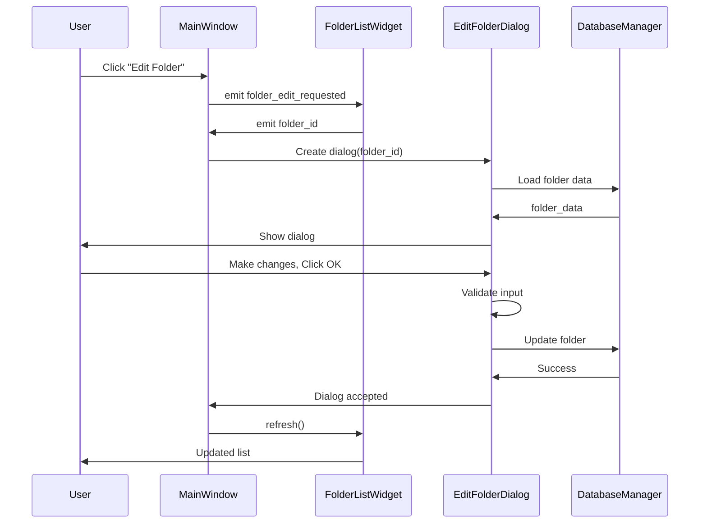
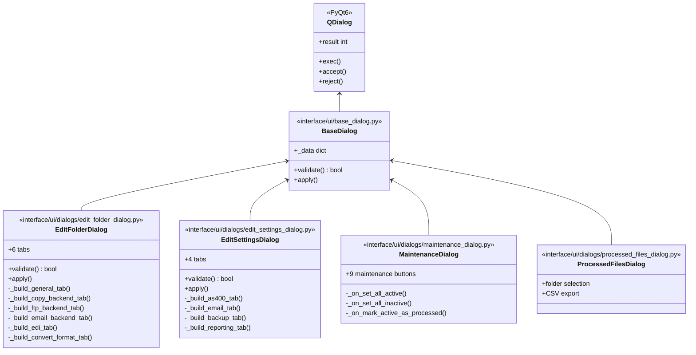

# PyQt6 UI Architecture Design for Batch File Processor

## Executive Summary

This document outlines a comprehensive PyQt6 UI architecture design for migrating the Batch File Processor application from its current tkinter implementation to PyQt6. The design preserves all existing functionality while leveraging PyQt6's modern features including signals/slots for event handling, model-view architecture for data display, and QSS styling for visual customization.

---

## 1. Current Architecture Analysis

### 1.1 Existing Structure Overview

The current application uses tkinter with a monolithic [`interface.py`](interface.py) file containing approximately 3,564 lines of tightly coupled code. Key components include:

- **Main Window**: Button panel at top, folder list with active/inactive split view
- **4 Complex Dialogs**:
  - [`EditFolderDialog`](interface/ui/dialogs/edit_folder_dialog.py) - 6 tabs, ~1,200 lines
  - [`EditSettingsDialog`](interface/ui/dialogs/edit_settings_dialog.py) - 4 tabs, ~600 lines
  - [`MaintenanceDialog`](interface/ui/dialogs/maintenance_dialog.py) - 9 operation buttons
  - [`ProcessedFilesDialog`](interface/ui/dialogs/processed_files_dialog.py) - Folder selection and CSV export

### 1.2 Backend Modules to Preserve

The following backend modules should remain unchanged and be imported by the PyQt6 UI:

- [`database/database_manager.py`](interface/database/database_manager.py) - Database operations
- [`models/`](interface/models/) - Data models (Folder, Settings, ProcessedFile)
- [`operations/`](interface/operations/) - Business logic (folder_operations, processing, maintenance)
- Root-level modules: `convert_base.py`, `convert_to_*.py`, `send_base.py`, `ftp_backend.py`, `copy_backend.py`, `email_backend.py`

---

## 2. New Directory Structure

```
interface/
├── __init__.py
├── main.py                          # Entry point, minimal bootstrapping
├── app.py                           # Main Application class (PyQt6 QApplication)
│
├── database/
│   ├── __init__.py
│   └── database_manager.py          # DatabaseObj class - unchanged
│
├── models/
│   ├── __init__.py
│   ├── folder.py                    # Folder dataclass - unchanged
│   ├── settings.py                  # Settings dataclass - unchanged
│   └── processed_file.py            # ProcessedFile dataclass - unchanged
│
├── operations/
│   ├── __init__.py
│   ├── folder_operations.py         # Folder CRUD operations - unchanged
│   ├── processing.py                # Processing logic - unchanged
│   └── maintenance.py               # Maintenance operations - unchanged
│
├── ui/                              # NEW PyQt6-based UI layer
│   ├── __init__.py
│   ├── app.py                       # PyQt6 QApplication subclass
│   ├── main_window.py               # Main application window (QMainWindow)
│   ├── base_dialog.py               # Base dialog class (QDialog)
│   │
│   ├── widgets/
│   │   ├── __init__.py
│   │   ├── folder_list.py           # FolderListWidget (QWidget with QListWidget)
│   │   ├── button_panel.py          # ButtonPanel (QWidget with QPushButtons)
│   │   ├── column_sorter.py         # ColumnSorterWidget (QListWidget with controls)
│   │   └── custom_widgets.py        # Custom reusable widgets
│   │
│   └── dialogs/
│       ├── __init__.py
│       ├── edit_folder_dialog.py    # EditFolderDialog (QDialog with QTabWidget)
│       ├── edit_settings_dialog.py  # EditSettingsDialog (QDialog with QTabWidget)
│       ├── maintenance_dialog.py    # MaintenanceDialog (QDialog)
│       └── processed_files_dialog.py # ProcessedFilesDialog (QDialog)
│
├── utils/
│   ├── __init__.py
│   └── validation.py                # Validation utilities - unchanged
│
└── styles/
    ├── __init__.py
    └── theme.qss                    # QSS stylesheet for application
```

---

## 3. Main Window Design

### 3.1 Class: [`MainWindow`](interface/ui/main_window.py)

```python
from PyQt6.QtWidgets import QMainWindow, QWidget, QVBoxLayout, QSplitter
from PyQt6.QtCore import pyqtSignal

class MainWindow(QMainWindow):
    """Main application window for Batch File Processor."""
    
    # Signals for communication with application
    process_directories_requested = pyqtSignal()
    add_folder_requested = pyqtSignal()
    batch_add_folders_requested = pyqtSignal()
    edit_settings_requested = pyqtSignal()
    maintenance_requested = pyqtSignal()
    processed_files_requested = pyqtSignal()
    exit_requested = pyqtSignal()
    edit_folder_requested = pyqtSignal(int)  # folder_id
    toggle_active_requested = pyqtSignal(int)  # folder_id
    delete_folder_requested = pyqtSignal(int)  # folder_id
    send_folder_requested = pyqtSignal(int)  # folder_id
    
    def __init__(self, db_manager, parent=None):
        super().__init__(parent)
        self._db_manager = db_manager
        self._setup_ui()
        self._connect_signals()
    
    def _setup_ui(self) -> None:
        """Setup the main window UI components."""
        self.setWindowTitle("Batch File Processor")
        self.setMinimumSize(800, 600)
        
        # Central widget with vertical layout
        central_widget = QWidget()
        self.setCentralWidget(central_widget)
        layout = QVBoxLayout(central_widget)
        layout.setContentsMargins(5, 5, 5, 5)
        layout.setSpacing(5)
        
        # Button panel at top
        self._button_panel = ButtonPanel()
        layout.addWidget(self._button_panel)
        
        # Splitter for folder lists (active/inactive split view)
        self._folder_splitter = QSplitter(Qt.Orientation.Horizontal)
        layout.addWidget(self._folder_splitter, stretch=1)
        
        # Folder list widget
        self._folder_list = FolderListWidget(
            db_manager=self._db_manager,
            parent=self
        )
        self._folder_splitter.addWidget(self._folder_list)
    
    def _connect_signals(self) -> None:
        """Connect signals to slots."""
        # Button panel signals
        self._folder_list.folder_edit_requested.connect(self.edit_folder_requested)
        self._folder_list.folder_toggle_active.connect(self.toggle_active_requested)
        self._folder_list.folder_delete_requested.connect(self.delete_folder_requested)
        self._folder_list.folder_send_requested.connect(self.send_folder_requested)
```

### 3.2 Widget Hierarchy

```
QMainWindow [MainWindow]
├── centralWidget [QWidget]
│   └── layout [QVBoxLayout]
│       ├── [ButtonPanel]
│       │   ├── QPushButton "Process Directories"
│       │   ├── QPushButton "Add Folder..."
│       │   ├── QPushButton "Batch Add Folders..."
│       │   ├── QPushButton "Edit Settings..."
│       │   ├── QPushButton "Maintenance..."
│       │   ├── QPushButton "Processed Files..."
│       │   └── QPushButton "Exit"
│       └── [QSplitter]
│           └── [FolderListWidget]
│               ├── [QWidget] - Search frame
│               │   ├── [QLineEdit] - Filter field
│               │   └── [QPushButton] - Update Filter
│               ├── [QLabel] "Active Folders"
│               ├── [QScrollArea] - Active folders list
│               │   └── [QWidget] - Container
│               │       ├── [QFrame] - Folder item 1
│               │       │   ├── [QPushButton] "Send"
│               │       │   ├── [QPushButton] "<-"
│               │       │   └── [QPushButton] "Edit: Folder1..."
│               │       └── [QFrame] - Folder item 2...
│               ├── [QFrame] - Vertical separator
│               ├── [QLabel] "Inactive Folders"
│               └── [QScrollArea] - Inactive folders list
│                   └── [QWidget] - Container
│                       ├── [QFrame] - Folder item 1
│                       │   ├── [QPushButton] "Delete"
│                       │   └── [QPushButton] "Edit: FolderX..."
│                       └── [QFrame] - Folder item 2...
```

---

## 4. Dialog Designs

### 4.1 Edit Folder Dialog

**Class**: [`EditFolderDialog`](interface/ui/dialogs/edit_folder_dialog.py)  
**Base**: `QDialog`  
**Tabs**: 6

```python
class EditFolderDialog(QDialog):
    """Tabbed dialog for editing folder configuration."""
    
    def __init__(self, parent, folder_data, db_manager, settings):
        super().__init__(parent)
        self.folder_data = folder_data
        self.db_manager = db_manager
        self.settings = settings
        self._setup_ui()
    
    def _setup_ui(self) -> None:
        """Setup the dialog UI."""
        self.setWindowTitle("Edit Folder")
        self.setModal(True)
        self.resize(700, 500)
        
        layout = QVBoxLayout(self)
        
        # Tab widget
        self._tabs = QTabWidget()
        layout.addWidget(self._tabs)
        
        # Create tabs
        self._general_tab = self._build_general_tab()
        self._copy_tab = self._build_copy_backend_tab()
        self._ftp_tab = self._build_ftp_backend_tab()
        self._email_tab = self._build_email_backend_tab()
        self._edi_tab = self._build_edi_tab()
        self._convert_tab = self._build_convert_format_tab()
        
        self._tabs.addTab(self._general_tab, "General")
        self._tabs.addTab(self._copy_tab, "Copy Backend")
        self._tabs.addTab(self._ftp_tab, "FTP Backend")
        self._tabs.addTab(self._email_tab, "Email Backend")
        self._tabs.addTab(self._edi_tab, "EDI Processing")
        self._tabs.addTab(self._convert_tab, "Conversion Format")
        
        # Button box
        self._button_box = QDialogButtonBox(
            QDialogButtonBox.StandardButton.Ok | 
            QDialogButtonBox.StandardButton.Cancel
        )
        self._button_box.accepted.connect(self._on_ok)
        self._button_box.rejected.connect(self.reject)
        layout.addWidget(self._button_box)
```

#### Tab 1: General Tab Contents

| Widget | Type | Purpose |
|--------|------|---------|
| active_checkbox | QCheckBox | Enable/disable folder |
| alias_field | QLineEdit | Folder alias |
| show_path_button | QPushButton | Show folder path |
| copy_backend_check | QCheckBox | Enable copy backend |
| ftp_backend_check | QCheckBox | Enable FTP backend |
| email_backend_check | QCheckBox | Enable email backend |

#### Tab 2: Copy Backend Tab Contents

| Widget | Type | Purpose |
|--------|------|---------|
| destination_label | QLabel | "Copy to directory" |
| destination_field | QLineEdit | Target directory path |
| browse_button | QPushButton | Browse for directory |

#### Tab 3: FTP Backend Tab Contents

| Widget | Type | Purpose |
|--------|------|---------|
| server_field | QLineEdit | FTP server hostname |
| port_spinbox | QSpinBox | FTP port (default: 21) |
| folder_field | QLineEdit | Remote folder path |
| username_field | QLineEdit | FTP username |
| password_field | QLineEdit | FTP password (masked) |
| passive_check | QCheckBox | Use passive mode |

#### Tab 4: Email Backend Tab Contents

| Widget | Type | Purpose |
|--------|------|---------|
| recipient_field | QLineEdit | Email recipient(s) |
| cc_field | QLineEdit | Email CC |
| subject_field | QLineEdit | Email subject prefix |

#### Tab 5: EDI Processing Tab Contents

| Widget | Type | Purpose |
|--------|------|---------|
| force_validation_check | QCheckBox | Force EDI validation |
| split_edi_check | QCheckBox | Split EDI documents |
| include_invoices_check | QCheckBox | Include invoices in split |
| include_credits_check | QCheckBox | Include credits in split |
| prepend_dates_check | QCheckBox | Prepend dates to files |
| rename_field | QLineEdit | Rename output file |
| edi_options_combo | QComboBox | "Do Nothing", "Convert EDI", "Tweak EDI" |

#### Tab 6: Conversion Format Tab Contents

| Widget | Type | Purpose |
|--------|------|---------|
| process_edi_check | QCheckBox | Process EDI files |
| format_combo | QComboBox | Format selector (11 options) |
| format_options_frame | QFrame | Dynamic format-specific options |

**Format Options**:
- CSV: UPC check digit, A records, C records, headers, ampersand filter, A record padding
- ScannerWare: A record padding, append A records
- Estore eInvoice: Store number, Vendor OID
- Fintech: Division ID
- Simplified CSV: Item numbers, descriptions

### 4.2 Edit Settings Dialog

**Class**: [`EditSettingsDialog`](interface/ui/dialogs/edit_settings_dialog.py)  
**Base**: `QDialog`  
**Tabs**: 4

```python
class EditSettingsDialog(QDialog):
    """Tabbed dialog for editing global settings."""
    
    def __init__(self, parent, settings, oversight, db_manager):
        super().__init__(parent)
        self.settings = settings
        self.oversight = oversight
        self.db_manager = db_manager
        self._setup_ui()
```

#### Tab 1: AS400 Connection Contents

| Widget | Type | Purpose |
|--------|------|---------|
| odbc_driver_combo | QComboBox | Select ODBC driver |
| address_field | QLineEdit | AS400 hostname |
| username_field | QLineEdit | AS400 username |
| password_field | QLineEdit | AS400 password (masked) |

#### Tab 2: Email Settings Contents

| Widget | Type | Purpose |
|--------|------|---------|
| enable_email_check | QCheckBox | Enable email functionality |
| address_field | QLineEdit | Email sender address |
| username_field | QLineEdit | SMTP username |
| password_field | QLineEdit | SMTP password (masked) |
| smtp_server_field | QLineEdit | SMTP server hostname |
| smtp_port_spinbox | QSpinBox | SMTP port |

#### Tab 3: Backup Settings Contents

| Widget | Type | Purpose |
|--------|------|---------|
| enable_backup_check | QCheckBox | Enable interval backups |
| interval_spinbox | QSpinBox | Backup interval (1-5000) |
| log_folder_field | QLineEdit | Logs directory |
| browse_log_button | QPushButton | Browse for log folder |

#### Tab 4: Reporting Options Contents

| Widget | Type | Purpose |
|--------|------|---------|
| enable_reporting_check | QCheckBox | Enable report sending |
| report_warnings_check | QCheckBox | Report EDI validator warnings |
| email_destination_field | QLineEdit | Report email recipient |
| printing_fallback_check | QCheckBox | Enable report printing fallback |

### 4.3 Maintenance Dialog

**Class**: [`MaintenanceDialog`](interface/ui/dialogs/maintenance_dialog.py)  
**Base**: `QDialog`  
**Buttons**: 9

```python
class MaintenanceDialog(QDialog):
    """Dialog for maintenance functions."""
    
    def __init__(self, parent, db_manager, running_platform="Linux"):
        super().__init__(parent)
        self.db_manager = db_manager
        self.running_platform = running_platform
        self._setup_ui()
    
    def _setup_ui(self) -> None:
        """Setup the dialog UI."""
        self.setWindowTitle("Maintenance Functions")
        self.setModal(True)
        self.resize(400, 500)
        
        layout = QVBoxLayout(self)
        
        # Warning label
        warning = QLabel("WARNING:\nFOR\nADVANCED\nUSERS\nONLY!")
        warning.setStyleSheet("color: red; font-weight: bold;")
        layout.addWidget(warning, alignment=Qt.AlignmentFlag.AlignCenter)
        
        # Button frame
        button_frame = QFrame()
        button_layout = QVBoxLayout(button_frame)
        layout.addWidget(button_frame)
        
        # Maintenance buttons
        self._set_all_active_btn = QPushButton(
            "Move all to active (Skips Settings Validation)"
        )
        self._set_all_inactive_btn = QPushButton("Move all to inactive")
        self._clear_resend_btn = QPushButton("Clear all resend flags")
        self._clear_emails_btn = QPushButton("Clear queued emails")
        self._mark_processed_btn = QPushButton(
            "Mark all in active as processed"
        )
        self._remove_inactive_btn = QPushButton(
            "Remove all inactive configurations"
        )
        self._clear_files_btn = QPushButton("Clear sent file records")
        self._import_btn = QPushButton("Import old configurations...")
        self._close_btn = QPushButton("Close")
```

### 4.4 Processed Files Dialog

**Class**: [`ProcessedFilesDialog`](interface/ui/dialogs/processed_files_dialog.py)  
**Base**: `QDialog`

```python
class ProcessedFilesDialog(QDialog):
    """Dialog for displaying processed files report."""
    
    def __init__(self, parent, db_manager):
        super().__init__(parent)
        self.db_manager = db_manager
        self.selected_folder_id = None
        self.selected_folder_alias = None
        self.output_folder = ""
        self._setup_ui()
```

---

## 5. Custom Widget Implementations

### 5.1 Folder List Widget

**Class**: [`FolderListWidget`](interface/ui/widgets/folder_list.py)

```python
from PyQt6.QtWidgets import QWidget, QVBoxLayout, QHBoxLayout, QLineEdit, 
    QPushButton, QLabel, QScrollArea, QFrame, QListWidget, QListWidgetItem
from PyQt6.QtCore import pyqtSignal, Qt

class FolderListWidget(QWidget):
    """Widget for displaying and managing folder list with active/inactive split."""
    
    # Signals
    folder_edit_requested = pyqtSignal(int)      # folder_id
    folder_toggle_active = pyqtSignal(int)       # folder_id
    folder_delete_requested = pyqtSignal(int)    # folder_id
    folder_send_requested = pyqtSignal(int)      # folder_id
    
    def __init__(self, db_manager, parent=None):
        super().__init__(parent)
        self._db_manager = db_manager
        self._active_folders = []
        self._inactive_folders = []
        self._filter_query = ""
        self._setup_ui()
    
    def _setup_ui(self) -> None:
        """Setup the widget UI."""
        layout = QVBoxLayout(self)
        
        # Search frame
        search_layout = QHBoxLayout()
        self._filter_field = QLineEdit()
        self._filter_field.setPlaceholderText("Filter folders...")
        self._filter_field.textChanged.connect(self._on_filter_changed)
        search_layout.addWidget(self._filter_field)
        
        update_filter_btn = QPushButton("Update Filter")
        update_filter_btn.clicked.connect(self._refresh_lists)
        search_layout.addWidget(update_filter_btn)
        layout.addLayout(search_layout)
        
        # Split view for active/inactive
        splitter = QSplitter(Qt.Orientation.Horizontal)
        
        # Active folders section
        active_frame = QFrame()
        active_layout = QVBoxLayout(active_frame)
        active_layout.addWidget(QLabel("Active Folders"))
        self._active_list = QListWidget()
        self._active_list.setSelectionMode(
            QListWidget.SelectionMode.NoSelection
        )
        active_layout.addWidget(self._active_list)
        splitter.addWidget(active_frame)
        
        # Inactive folders section
        inactive_frame = QFrame()
        inactive_layout = QVBoxLayout(inactive_frame)
        inactive_layout.addWidget(QLabel("Inactive Folders"))
        self._inactive_list = QListWidget()
        self._inactive_list.setSelectionMode(
            QListWidget.SelectionMode.NoSelection
        )
        inactive_layout.addWidget(self._inactive_list)
        splitter.addWidget(inactive_frame)
        
        layout.addWidget(splitter, stretch=1)
    
    def _create_folder_item(self, parent_list, folder_data, is_active):
        """Create a folder list item with action buttons."""
        item = QListWidgetItem(parent_list)
        
        # Create custom widget for item
        widget = QFrame()
        layout = QHBoxLayout(widget)
        
        if is_active:
            send_btn = QPushButton("Send")
            send_btn.clicked.connect(
                lambda: self.folder_send_requested.emit(folder_data["id"])
            )
            layout.addWidget(send_btn)
            
            toggle_btn = QPushButton("<-")
            toggle_btn.clicked.connect(
                lambda: self.folder_toggle_active.emit(folder_data["id"])
            )
            layout.addWidget(toggle_btn)
        else:
            delete_btn = QPushButton("Delete")
            delete_btn.clicked.connect(
                lambda: self.folder_delete_requested.emit(folder_data["id"])
            )
            layout.addWidget(delete_btn)
        
        edit_btn = QPushButton(f"Edit: {folder_data['alias']}...")
        edit_btn.clicked.connect(
            lambda: self.folder_edit_requested.emit(folder_data["id"])
        )
        layout.addWidget(edit_btn, stretch=1)
        
        item.setSizeHint(widget.sizeHint())
        parent_list.addItem(item)
        parent_list.setItemWidget(item, widget)
```

### 5.2 Button Panel Widget

**Class**: [`ButtonPanel`](interface/ui/widgets/button_panel.py)

```python
from PyQt6.QtWidgets import QWidget, QVBoxLayout, QPushButton, QFrame
from PyQt6.QtCore import pyqtSignal

class ButtonPanel(QWidget):
    """Panel containing main application buttons."""
    
    # Signals
    process_clicked = pyqtSignal()
    add_folder_clicked = pyqtSignal()
    batch_add_clicked = pyqtSignal()
    edit_settings_clicked = pyqtSignal()
    maintenance_clicked = pyqtSignal()
    processed_files_clicked = pyqtSignal()
    exit_clicked = pyqtSignal()
    
    def __init__(self, parent=None):
        super().__init__(parent)
        self._setup_ui()
    
    def _setup_ui(self) -> None:
        """Setup the button panel UI."""
        layout = QVBoxLayout(self)
        layout.setContentsMargins(0, 0, 0, 0)
        layout.setSpacing(2)
        
        # Create buttons
        self._create_buttons()
        
        # Add separators and buttons
        layout.addWidget(self._add_folder_btn)
        layout.addWidget(self._batch_add_btn)
        layout.addWidget(self._settings_btn)
        
        separator = QFrame()
        separator.setFrameShape(QFrame.Shape.HLine)
        layout.addWidget(separator)
        
        layout.addWidget(self._processed_files_btn)
        
        separator2 = QFrame()
        separator2.setFrameShape(QFrame.Shape.HLine)
        layout.addWidget(separator2)
        
        layout.addWidget(self._maintenance_btn)
        layout.addStretch(1)
        layout.addWidget(self._process_btn)
    
    def _create_buttons(self) -> None:
        """Create all buttons."""
        self._process_btn = QPushButton("Process All Folders")
        self._process_btn.clicked.connect(self.process_clicked.emit)
        
        self._add_folder_btn = QPushButton("Add Directory...")
        self._add_folder_btn.clicked.connect(self.add_folder_clicked.emit)
        
        self._batch_add_btn = QPushButton("Batch Add Directories...")
        self._batch_add_btn.clicked.connect(self.batch_add_clicked.emit)
        
        self._settings_btn = QPushButton("Edit Settings...")
        self._settings_btn.clicked.connect(self.edit_settings_clicked.emit)
        
        self._maintenance_btn = QPushButton("Maintenance...")
        self._maintenance_btn.clicked.connect(self.maintenance_clicked.emit)
        
        self._processed_files_btn = QPushButton("Processed Files Report...")
        self._processed_files_btn.clicked.connect(self.processed_files_clicked.emit)
```

### 5.3 Column Sorter Widget

**Class**: [`ColumnSorterWidget`](interface/ui/widgets/column_sorter.py)

```python
from PyQt6.QtWidgets import QWidget, QVBoxLayout, QHBoxLayout, QListWidget, 
    QPushButton, QFrame
from PyQt6.QtCore import pyqtSignal

class ColumnSorterWidget(QWidget):
    """Widget for sorting and reordering column entries."""
    
    def __init__(self, parent=None, column_layout_string=""):
        super().__init__(parent)
        self.entries = column_layout_string.split(",") if column_layout_string else []
        self._setup_ui()
    
    def _setup_ui(self) -> None:
        """Setup the widget UI."""
        layout = QHBoxLayout(self)
        
        # Listbox
        self._listbox = QListWidget()
        self._populate_listbox()
        layout.addWidget(self._listbox)
        
        # Button frame
        button_frame = QFrame()
        button_layout = QVBoxLayout(button_frame)
        
        up_btn = QPushButton("UP")
        up_btn.clicked.connect(lambda: self._move_entry(True))
        button_layout.addWidget(up_btn)
        
        down_btn = QPushButton("DOWN")
        down_btn.clicked.connect(lambda: self._move_entry(False))
        button_layout.addWidget(down_btn)
        
        layout.addWidget(button_frame)
```

---

## 6. Signal/Slot Patterns

### 6.1 Signal Definitions

```python
# In interface/ui/app.py
from PyQt6.QtCore import QObject, pyqtSignal

class ApplicationSignals(QObject):
    """Application-wide signals for communication."""
    
    # Database signals
    database_changed = pyqtSignal()
    
    # Folder signals
    folder_added = pyqtSignal(int)           # folder_id
    folder_updated = pyqtSignal(int)         # folder_id
    folder_deleted = pyqtSignal(int)         # folder_id
    folder_toggled = pyqtSignal(int, bool)   # folder_id, is_active
    
    # Processing signals
    processing_started = pyqtSignal()
    processing_finished = pyqtSignal()
    processing_error = pyqtSignal(str)       # error_message
    processing_progress = pyqtSignal(int, int)  # current, total
    
    # Dialog signals
    dialog_opened = pyqtSignal(str)          # dialog_name
    dialog_closed = pyqtSignal(str, bool)    # dialog_name, accepted
```

### 6.2 Connection Patterns

```python
# Main window signal connections
class MainWindow(QMainWindow):
    def _connect_signals(self) -> None:
        """Connect signals to slots using PyQt6 modern syntax."""
        
        # Direct connection to lambda for parameter passing
        self._folder_list.folder_edit_requested.connect(
            lambda fid: self._open_edit_dialog(fid)
        )
        
        # Using functools.partial for parameter binding
        from functools import partial
        self._button_panel.process_clicked.connect(
            partial(self._on_process_directories)
        )
        
        # Connecting to custom slot
        self._button_panel.exit_clicked.connect(self.close)
```

### 6.3 Custom Slot Implementations

```python
class MainWindow(QMainWindow):
    @pyqtSlot(int)
    def _open_edit_dialog(self, folder_id: int) -> None:
        """Open edit folder dialog for specified folder."""
        folder_data = self._db_manager.folders_table.find_one(id=folder_id)
        if folder_data:
            dialog = EditFolderDialog(
                parent=self,
                folder_data=dict(folder_data),
                db_manager=self._db_manager,
                settings={}  # Load from database
            )
            if dialog.exec():
                # Update database
                self._db_manager.folders_table.update(
                    dialog.get_result(), ["id"]
                )
                self._folder_list.refresh()
    
    @pyqtSlot()
    def _on_process_directories(self) -> None:
        """Handle process directories button click."""
        from interface.operations.processing import process_directories
        process_directories(
            db_manager=self._db_manager,
            version=self._version,
            running_platform=self._running_platform
        )
```

---

## 7. Styling Approach (QSS)

### 7.1 Main Stylesheet

```css
/* interface/styles/theme.qss */

/* Main window */
QMainWindow {
    background-color: #f0f0f0;
}

QWidget {
    font-family: 'Segoe UI', Arial, sans-serif;
    font-size: 9pt;
}

/* Button panel */
QPushButton {
    background-color: #e8e8e8;
    border: 1px solid #a0a0a0;
    border-radius: 3px;
    padding: 5px 10px;
    min-width: 120px;
}

QPushButton:hover {
    background-color: #d0d0d0;
}

QPushButton:pressed {
    background-color: #b0b0b0;
}

QPushButton:disabled {
    background-color: #f0f0f0;
    color: #a0a0a0;
}

/* Tab widget */
QTabWidget::pane {
    border: 1px solid #a0a0a0;
    background-color: #ffffff;
}

QTabBar::tab {
    background-color: #e8e8e8;
    border: 1px solid #a0a0a0;
    border-bottom: none;
    padding: 5px 10px;
    margin-right: 2px;
}

QTabBar::tab:selected {
    background-color: #ffffff;
    border-bottom: 1px solid #ffffff;
}

/* Dialogs */
QDialog {
    background-color: #f5f5f5;
}

QDialogButtonBox QPushButton {
    min-width: 80px;
}

/* Folder list */
QListWidget {
    background-color: #ffffff;
    border: 1px solid #a0a0a0;
}

QListWidget::item {
    padding: 2px;
}

QListWidget::item:selected {
    background-color: #0078d7;
    color: #ffffff;
}

/* Input fields */
QLineEdit, QTextEdit {
    background-color: #ffffff;
    border: 1px solid #a0a0a0;
    border-radius: 3px;
    padding: 3px;
}

QLineEdit:focus, QTextEdit:focus {
    border-color: #0078d7;
}

/* Labels */
QLabel {
    color: #333333;
}

/* Warning labels */
QLabel.warning {
    color: #cc0000;
    font-weight: bold;
}
```

### 7.2 Applying Stylesheet

```python
# In interface/ui/app.py
from PyQt6.QtWidgets import QApplication

class Application(QApplication):
    def __init__(self, argv):
        super().__init__(argv)
        self._load_stylesheet()
    
    def _load_stylesheet(self) -> None:
        """Load and apply the QSS stylesheet."""
        try:
            from importlib.resources import files
            qss_content = (files('interface.styles') / 'theme.qss').read_text()
            self.setStyleSheet(qss_content)
        except Exception:
            # Fallback to default styling if QSS file not found
            pass
```

---

## 8. Migration Strategy from Tkinter

### 8.1 Phase 1: Foundation Setup

1. **Create new PyQt6 directory structure**
   - Create `interface/ui/` with subdirectories
   - Create `interface/styles/` directory

2. **Add PyQt6 dependency**
   ```txt
   # requirements.txt
   PyQt6>=6.6.0
   ```

3. **Create base classes**
   - [`BaseDialog`](interface/ui/base_dialog.py) - QDialog subclass
   - [`MainWindow`](interface/ui/main_window.py) - QMainWindow subclass

### 8.2 Phase 2: Widget Migration

1. **Migrate [`FolderListWidget`](interface/ui/widgets/folder_list.py)**
   - Replace `tk.Frame` with `QWidget`
   - Replace `ttk.Button` with `QPushButton`
   - Replace `tk.Entry` with `QLineEdit`
   - Implement fuzzy search using `thefuzz`

2. **Migrate [`ButtonPanel`](interface/ui/widgets/button_panel.py)**
   - Replace `ttk.Frame` with `QWidget`
   - Replace `ttk.Button` with `QPushButton`

3. **Migrate [`ColumnSorterWidget`](interface/ui/widgets/column_sorter.py)**
   - Replace `tk.Listbox` with `QListWidget`
   - Keep UP/DOWN button logic

### 8.3 Phase 3: Dialog Migration

1. **Migrate [`EditFolderDialog`](interface/ui/dialogs/edit_folder_dialog.py)**
   - Convert 6 tkinter tabs to 6 `QTabWidget` tabs
   - Map tkinter widgets to PyQt6 equivalents
   - Preserve validation logic
   - Update format-specific option visibility

2. **Migrate [`EditSettingsDialog`](interface/ui/dialogs/edit_settings_dialog.py)**
   - Convert 4 tkinter tabs to 4 `QTabWidget` tabs
   - Map ODBC driver selection
   - Preserve SMTP testing logic

3. **Migrate [`MaintenanceDialog`](interface/ui/dialogs/maintenance_dialog.py)**
   - Keep button layout structure
   - Preserve confirmation dialogs

4. **Migrate [`ProcessedFilesDialog`](interface/ui/dialogs/processed_files_dialog.py)**
   - Replace radio buttons with `QRadioButton`
   - Keep CSV export logic

### 8.4 Phase 4: Application Integration

1. **Update [`main.py`](interface/main.py)**
   - Replace `tk.Tk` with `QApplication`
   - Remove tkinter imports
   - Update entry point

2. **Update [`app.py`](interface/ui/app.py)**
   - Create `Application` subclass of `QApplication`
   - Setup signal/slot connections
   - Handle application lifecycle

3. **Update [`interface.py`](interface.py)**
   - Keep as backward compatibility wrapper
   - Redirect imports to new PyQt6 modules

### 8.5 Widget Mapping Reference

| Tkinter Widget | PyQt6 Equivalent | Notes |
|----------------|------------------|-------|
| `tk.Tk` | `QApplication` | Application class |
| `tk.Toplevel` | `QDialog` | Dialog windows |
| `ttk.Frame` | `QWidget` | Container widgets |
| `ttk.Label` | `QLabel` | Text display |
| `ttk.Button` | `QPushButton` | Clickable buttons |
| `tk.Entry` | `QLineEdit` | Single-line text input |
| `tk.Text` | `QTextEdit` | Multi-line text input |
| `ttk.Checkbutton` | `QCheckBox` | Checkbox |
| `ttk.Radiobutton` | `QRadioButton` | Radio button |
| `ttk.Combobox` | `QComboBox` | Dropdown selection |
| `ttk.Notebook` | `QTabWidget` | Tabbed interface |
| `ttk.Separator` | `QFrame` with QFrame.Shape.HLine | Separator line |
| `tk.Listbox` | `QListWidget` | List display |
| `tk.Scrollbar` | `QScrollBar` | Scroll bars |
| `ttk.Progressbar` | `QProgressBar` | Progress indicator |
| `tk.messagebox` | `QMessageBox` | Message dialogs |
| `filedialog.askdirectory` | `QFileDialog.getExistingDirectory` | Folder selection |
| `filedialog.askopenfilename` | `QFileDialog.getOpenFileName` | File selection |

---

## 9. Class Diagrams

### 9.1 Main Application Architecture



### 9.2 Signal Flow Diagram



### 9.3 Dialog Inheritance Hierarchy



---

## 10. Implementation Checklist

### 10.1 New Files to Create

| File | Purpose |
|------|---------|
| `interface/ui/app.py` | PyQt6 Application class |
| `interface/ui/main_window.py` | Main window implementation |
| `interface/ui/base_dialog.py` | Base dialog class |
| `interface/ui/widgets/folder_list.py` | Folder list widget (PyQt6) |
| `interface/ui/widgets/button_panel.py` | Button panel (PyQt6) |
| `interface/ui/widgets/column_sorter.py` | Column sorter (PyQt6) |
| `interface/ui/dialogs/edit_folder_dialog.py` | Edit folder dialog (PyQt6) |
| `interface/ui/dialogs/edit_settings_dialog.py` | Edit settings dialog (PyQt6) |
| `interface/ui/dialogs/maintenance_dialog.py` | Maintenance dialog (PyQt6) |
| `interface/ui/dialogs/processed_files_dialog.py` | Processed files dialog (PyQt6) |
| `interface/styles/__init__.py` | Styles package init |
| `interface/styles/theme.qss` | QSS stylesheet |

### 10.2 Files to Modify

| File | Changes |
|------|---------|
| `interface/main.py` | Replace tkinter with PyQt6 |
| `interface/app.py` | Convert to PyQt6 Application |
| `requirements.txt` | Add PyQt6 dependency |

### 10.3 Files to Remove (After Migration)

| File | Reason |
|------|--------|
| `interface/ui/main_window.py` | Already exists (tkinter version) |
| `interface/ui/base_dialog.py` | Already exists (tkinter version) |
| `interface/ui/widgets/folder_list.py` | Already exists (tkinter version) |
| `interface/ui/widgets/button_panel.py` | Already exists (tkinter version) |
| `interface/ui/widgets/column_sorter.py` | Already exists (tkinter version) |
| `interface/ui/dialogs/edit_folder_dialog.py` | Already exists (tkinter version) |
| `interface/ui/dialogs/edit_settings_dialog.py` | Already exists (tkinter version) |
| `interface/ui/dialogs/maintenance_dialog.py` | Already exists (tkinter version) |
| `interface/ui/dialogs/processed_files_dialog.py` | Already exists (tkinter version) |

---

## 11. Testing Considerations

### 11.1 Unit Tests

- Test signal/slot connections
- Test widget creation and layout
- Test dialog validation logic
- Test model-to-view data binding

### 11.2 Integration Tests

- Test database operations through UI
- Test folder CRUD workflow
- Test settings persistence
- Test file processing trigger

### 11.3 GUI Tests

- Use `pytest-qt` for GUI testing
- Test dialog open/close behavior
- Test button click handlers
- Test input validation feedback

---

## 12. Conclusion

This PyQt6 architecture provides:

1. **Clean separation** between UI and business logic
2. **Modern event handling** via signals/slots
3. **Model-view patterns** for data display
4. **Professional styling** via QSS
5. **Preserved functionality** from existing tkinter implementation
6. **Maintainable code structure** with focused modules

The migration strategy ensures minimal disruption while leveraging PyQt6's robust features for a more maintainable and extensible codebase.
