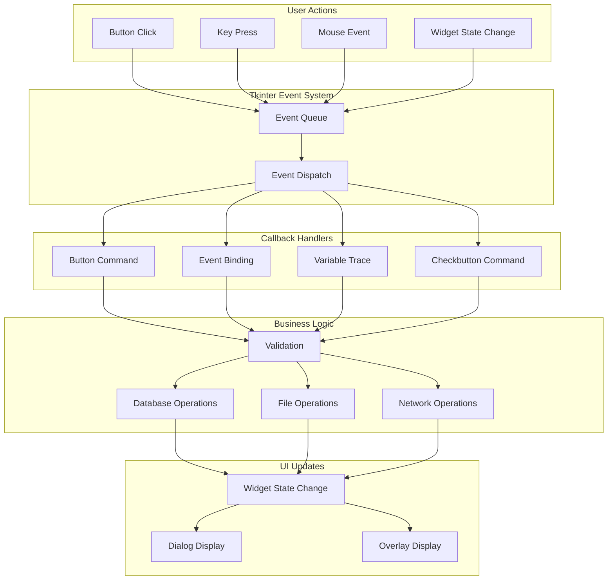

# Tkinter Callbacks Testing Strategy

## Overview

This document provides a comprehensive inventory of all tkinter callbacks in the batch file processor application and a detailed testing strategy for each callback type.

---

## 1. Callback Inventory by File

### 1.1 main_interface.py

This is the main UI file containing the majority of callbacks.

#### Button Click Handlers (command=)

| Callback Name | Line | Widget | Description |
|--------------|------|--------|-------------|
| `select_folder` | 318-350 | `open_folder_button` | Opens folder selection dialog |
| `batch_add_folders` | 352-389 | `open_multiple_folder_button` | Batch adds multiple directories |
| `set_defaults_popup` | 2802-2867 | `default_settings` | Opens default settings dialog |
| `EditSettingsDialog` | 3726-3731 | `edit_reporting` | Opens settings edit dialog |
| `graphical_process_directories` | 3733-3738 | `process_folder_button` | Processes all active folders |
| `resend_interface.do` | 3741-3746 | `allow_resend_button` | Opens resend configuration |
| `maintenance_functions_popup` | 3408-3493 | `maintenance_button` | Opens maintenance dialog |
| `processed_files_popup` | 3546-3692 | `processed_files_button` | Opens processed files report |
| `send_single` | 407-419 | Active folder Send button | Sends single folder |
| `disable_folder` | 421-425 | Active folder disable button | Disables a folder |
| `edit_folder_selector` | 398-405 | Edit button | Opens folder edit dialog |
| `delete_folder_entry_wrapper` | 2768-2775 | Inactive folder Delete button | Deletes folder entry |
| `search_field_callback` | 435-444 | `search_button` | Updates folder filter |
| `set_folders_filter` | 427-430 | Internal | Sets filter and refreshes list |

#### Lambda Callbacks (Inline)

| Location | Line | Widget | Captured Variables |
|----------|------|--------|-------------------|
| Send button | 612 | Active folder button | `name=folders_name["id"]` |
| Disable button | 617 | Active folder button | `name=folders_name["id"]` |
| Edit button | 622 | Active folder button | `name=folders_name["id"]` |
| Delete button | 633-635 | Inactive folder button | `name`, `alias` |
| Edit button | 640 | Inactive folder button | `name=folders_name["id"]` |
| Move UP | 708 | `move_up_button` | None |
| Move DOWN | 713 | `move_down_button` | None |
| Select log folder | 951 | `select_log_folder_button` | None |
| Select copy directory | 1728 | `copy_backend_folder_selection_button` | None |
| Mark active as processed | 3454 | `move_active_to_obe_button` | None |
| Database import | 3469 | `database_import_button` | `backup_path` |

#### Event Bindings

| Event | Widget | Callback | Line |
|-------|--------|----------|------|
| `<Return>` | `search_field` | `search_field_callback` | 474 |
| `<Escape>` | `root` | `clear_search_field` | 444 |
| `<3>` (Right-click) | `search_field` | `right_click_search_field` | 473 |
| `<Escape>` | `maintenance_popup` | `destroy_maintenance_popup` | 3493 |
| `<Escape>` | `processed_files_popup_dialog` | `close_processed_files_popup` | 3681 |

#### Checkbutton/Radiobutton Commands

| Widget | Callback | Line | Purpose |
|--------|----------|------|---------|
| `active_checkbutton_object` | `set_header_state` | 1678 | Toggle folder active state |
| `copy_backend_checkbutton` | `set_send_options_fields_state` | 1689 | Toggle copy backend |
| `ftp_backend_checkbutton` | `set_send_options_fields_state` | 1697 | Toggle FTP backend |
| `email_backend_checkbutton` | `set_send_options_fields_state` | 1705 | Toggle email backend |
| `enable_email_checkbutton` | `email_options_fields_state_set` | 845 | Toggle email in settings |
| `run_reporting_checkbutton` | `reporting_options_fields_state_set` | 853 | Toggle reporting |
| `enable_interval_backup_checkbutton` | `interval_backup_options_set` | 868 | Toggle interval backup |

#### OptionMenu Commands

| Widget | Callback | Line | Purpose |
|--------|----------|------|---------|
| `convert_to_selector_menu` | `make_convert_to_options` | 1545 | Change convert format |
| `edi_options_menu` | `reset_ediconvert_options` | 2312 | Change EDI processing mode |

#### Dialog Class Callbacks (EditSettingsDialog)

| Method | Line | Description |
|--------|------|-------------|
| `body()` | 755-1041 | Creates dialog body |
| `validate()` | 1043-1164 | Validates settings |
| `ok()` | 1166-1175 | OK button handler |
| `apply()` | 1177-1232 | Applies changes |

#### Dialog Class Callbacks (EditDialog)

| Method | Line | Description |
|--------|------|-------------|
| `body()` | 1235-2381 | Creates dialog body |
| `validate()` | 2505-2742 | Validates folder settings |
| `ok()` | 2383-2393 | OK button handler |
| `apply()` | 2395-2504 | Applies folder changes |

#### Nested Function Callbacks

| Function | Parent | Line | Purpose |
|----------|--------|------|---------|
| `search_field_callback` | `make_users_list` | 435-444 | Handle search field changes |
| `clear_search_field` | `make_users_list` | 446-448 | Clear search on Escape |
| `reporting_options_fields_state_set` | `EditSettingsDialog.body` | 811-817 | Toggle reporting fields |
| `email_options_fields_state_set` | `EditSettingsDialog.body` | 819-828 | Toggle email fields |
| `interval_backup_options_set` | `EditSettingsDialog.body` | 830-838 | Toggle backup interval |
| `select_log_directory` | `EditSettingsDialog.body` | 954-967 | Select log directory |
| `make_convert_to_options` | `EditDialog.body` | 1369-1529 | Build convert options UI |
| `show_folder_path` | `EditDialog.body` | 1548-1553 | Show folder path popup |
| `select_copy_to_directory` | `EditDialog.body` | 1555-1569 | Select copy destination |
| `set_send_options_fields_state` | `EditDialog.body` | 1571-1653 | Toggle backend fields |
| `set_header_state` | `EditDialog.body` | 1655-1670 | Toggle active state UI |
| `set_dialog_variables` | `EditDialog.body` | 2035-2167 | Load config into dialog |
| `reset_ediconvert_options` | `EditDialog.body` | 2170-2173 | Reset EDI options |
| `make_ediconvert_options` | `EditDialog.body` | 2208-2293 | Build EDI options UI |
| `config_from_others` | `EditDialog.body` | 2315-2330 | Copy config from another folder |

#### Maintenance Popup Callbacks

| Callback | Line | Button |
|----------|------|--------|
| `set_all_active` | 3334-3344 | `set_all_active_button` |
| `set_all_inactive` | 3322-3332 | `set_all_inactive_button` |
| `clear_resend_flags` | 3346-3355 | `clear_resend_flags_button` |
| `emails_table.delete` | 3449 | `clear_emails_queue` |
| `mark_active_as_processed` | 3222-3320 | `move_active_to_obe_button` |
| `remove_inactive_folders` | 3195-3220 | `remove_all_inactive` |
| `clear_processed_files_log` | 3357-3364 | `clear_processed_files_log_button` |
| `database_import_wrapper` | 3369-3406 | `database_import_button` |

#### Processed Files Popup Callbacks

| Callback | Line | Purpose |
|----------|------|---------|
| `close_processed_files_popup` | 3547-3549 | Close dialog |
| `folder_button_pressed` | 3551-3573 | Handle folder selection |
| `set_output_folder` | 3575-3603 | Select output folder |
| `export_processed_report` | 3495-3544 | Export report to CSV |

---

### 1.2 dialog.py

Base dialog class providing standard dialog behavior.

| Method | Line | Description |
|--------|------|-------------|
| `ok()` | 68-79 | OK button handler with validation |
| `cancel()` | 81-85 | Cancel button handler |
| `validate()` | 90-92 | Validation hook (override in subclass) |
| `apply()` | 94-96 | Apply hook (override in subclass) |

#### Event Bindings

| Event | Callback | Line |
|-------|----------|------|
| `<Return>` | `self.ok` | 60 |
| `<Escape>` | `self.cancel` | 61 |
| `WM_DELETE_WINDOW` | `self.cancel` | 31 |

---

### 1.3 tk_extra_widgets.py

Custom widget implementations with internal callbacks.

#### RightClickMenu Class

| Method | Line | Description |
|--------|------|-------------|
| `__call__` | 26-33 | Main entry point for right-click |
| `build_menu` | 34-73 | Builds and displays context menu |
| `select_all` | 74-81 | Selects all text in entry |

#### Lambda Callbacks in RightClickMenu

| Location | Line | Purpose |
|----------|------|---------|
| Cut command | 47-48 | Generate `<<Cut>>` event |
| Copy command | 49-51 | Generate `<<Copy>>` event |
| Paste command | 55-57 | Generate `<<Paste>>` event |
| Delete command | 64-66 | Generate `<<Clear>>` event |

#### Event Bindings

| Event | Callback | Line |
|-------|----------|------|
| `<Control-a>` | `select_all` | 24 |
| `<Control-A>` | `select_all` | 25 |

#### VerticalScrolledFrame Class

| Method | Line | Description |
|--------|------|-------------|
| `_configure_interior` | 127-135 | Handle interior resize |
| `_configure_canvas` | 139-142 | Handle canvas resize |
| `_configure_scrollwheel` | 148-239 | Configure scroll behavior |
| `onMouseWheel` | 190-213 | Handle mouse wheel scroll |

#### Event Bindings

| Event | Widget | Callback | Line |
|-------|--------|----------|------|
| `<Configure>` | interior | `_configure_interior` | 137 |
| `<Configure>` | canvas | `_configure_canvas` | 144 |
| `<Enter>` | interior | `mouseWheel_bind` | 233 |
| `<Leave>` | interior | `mouseWheel_unbind` | 234 |
| `<Enter>` | vscrollbar | `mouseWheel_bind` | 235 |
| `<Leave>` | vscrollbar | `mouseWheel_unbind` | 236 |
| `<4>` | all | `onMouseWheel` | 216-217 (Linux) |
| `<5>` | all | `onMouseWheel` | 216-217 (Linux) |
| `<MouseWheel>` | all | `onMouseWheel` | 220 (Windows/Mac) |

#### CreateToolTip Class

| Method | Line | Description |
|--------|------|-------------|
| `enter` | 257-258 | Handle mouse enter |
| `leave` | 260-262 | Handle mouse leave |
| `schedule` | 264-266 | Schedule tooltip display |
| `unschedule` | 268-272 | Cancel scheduled tooltip |
| `showtip` | 274-287 | Display tooltip |
| `hidetip` | 289-292 | Hide tooltip |

#### Event Bindings

| Event | Callback | Line |
|-------|----------|------|
| `<Enter>` | `self.enter` | 251 |
| `<Leave>` | `self.leave` | 252 |
| `<ButtonPress>` | `self.leave` | 253 |

---

### 1.4 rclick_menu.py

Simple test/demo file - no production callbacks.

---

### 1.5 interface/ui/dialogs/edit_folders_dialog.py

Refactored dialog with dependency injection.

| Method | Line | Description |
|--------|------|-------------|
| `body()` | 117-229 | Create dialog body |
| `validate()` | 331-361 | Validate with injected validator |
| `apply()` | 363-402 | Apply with injected extractor |
| `_create_validator()` | 98-111 | Create validator instance |
| `_create_extractor()` | 113-115 | Create extractor instance |
| `_build_ui()` | 237-272 | Build UI elements |
| `_build_prefs_frame()` | 274-311 | Build preferences frame |
| `_build_edi_frame()` | 313-323 | Build EDI frame |
| `_load_configuration()` | 325-329 | Load config into fields |
| `_apply_to_folder()` | 404-476 | Apply extracted values |
| `_show_validation_errors()` | 478-482 | Show error dialog |
| `create_for_testing()` | 485-525 | Factory for testing |

---

### 1.6 doingstuffoverlay.py

Overlay utility functions.

| Function | Line | Description |
|----------|------|-------------|
| `make_overlay()` | 10-33 | Create overlay frame |
| `update_overlay()` | 36-42 | Update overlay text |
| `destroy_overlay()` | 45-46 | Remove overlay |

---

### 1.7 resend_interface.py

Resend configuration dialog.

| Callback | Line | Description |
|----------|------|-------------|
| `set_resend_flag` | 36-38 | Update resend flag in DB |
| `make_file_checkbutton_list` | 40-56 | Build file checkbox list |
| `folder_button_pressed` | 58-81 | Handle folder selection |
| `CheckButtons.cb` | 101-102 | Handle checkbox toggle |
| `close_window` | 123-125 | Close dialog |

#### Event Bindings

| Event | Widget | Callback | Line |
|-------|--------|----------|------|
| `<Escape>` | `resend_interface` | `close_window` | 129 |

#### Spinbox Command

| Widget | Callback | Line |
|--------|----------|------|
| `resend_interface_files_list_count_spinbox` | `make_file_checkbutton_list` | 133 |

---

## 2. Callback Categories

### 2.1 Button Click Handlers

**Characteristics:**
- Triggered via `command=` parameter
- Can be function reference or lambda
- No event object passed (unless using bind)

**Testing Considerations:**
- Mock the underlying operations
- Test with valid/invalid state
- Test rapid clicking (debounce if applicable)
- Test when widgets are disabled

### 2.2 Event Handlers

**Characteristics:**
- Bound via `widget.bind(event, callback)`
- Receive event object with context
- Can have add='+' for multiple bindings

**Testing Considerations:**
- Create mock events with necessary attributes
- Test event propagation
- Test modifier keys (Shift, Ctrl, etc.)
- Test event cancellation (return 'break')

### 2.3 Variable Traces

**Characteristics:**
- Tkinter Variable classes (StringVar, IntVar, BooleanVar)
- Can have trace callbacks for changes
- Used extensively in this codebase

**Testing Considerations:**
- Test programmatic changes
- Test user-driven changes
- Test with None/empty values

### 2.4 Checkbutton/Radiobutton Commands

**Characteristics:**
- Triggered on state change
- Variable updated before callback
- Often used to enable/disable other widgets

**Testing Considerations:**
- Test all state transitions
- Test dependent widget states
- Test with disabled widgets

### 2.5 OptionMenu Commands

**Characteristics:**
- Triggered on selection change
- Passes selected value to callback
- Used for dynamic UI updates

**Testing Considerations:**
- Test all options
- Test UI updates for each option
- Test with invalid selections

### 2.6 Timer/after() Callbacks

**Characteristics:**
- Scheduled via `widget.after(ms, callback)`
- Used for tooltips, delayed operations
- Can be cancelled

**Testing Considerations:**
- Mock time progression
- Test cancellation
- Test callback execution order

---

## 3. Mocking Strategy

### 3.1 Tkinter Root and Widgets

```python
# Use unittest.mock for tkinter components
from unittest.mock import MagicMock, patch, PropertyMock

# Mock Tk root
mock_root = MagicMock(spec=tkinter.Tk)

# Mock widgets
mock_button = MagicMock(spec=tkinter.ttk.Button)
mock_entry = MagicMock(spec=tkinter.ttk.Entry)
mock_frame = MagicMock(spec=tkinter.ttk.Frame)

# Mock StringVar/IntVar
with patch('tkinter.StringVar') as mock_stringvar:
    mock_var = MagicMock()
    mock_var.get.return_value = "test value"
    mock_stringvar.return_value = mock_var
```

### 3.2 Dialog Testing Approach

```python
# Create dialog without showing
def test_dialog_validation():
    # Mock parent
    mock_parent = MagicMock()
    
    # Mock the grab_set, wait_window methods
    with patch.object(Dialog, 'grab_set'), \
         patch.object(Dialog, 'wait_window'):
        
        dialog = EditDialog(mock_parent, test_data)
        
        # Test validation logic
        result = dialog.validate()
        assert result == expected_result
```

### 3.3 Event Simulation

```python
# Create mock event
def create_mock_event(**kwargs):
    event = MagicMock()
    event.x_root = kwargs.get('x_root', 0)
    event.y_root = kwargs.get('y_root', 0)
    event.widget = kwargs.get('widget', MagicMock())
    event.num = kwargs.get('num', 1)  # For button events
    event.delta = kwargs.get('delta', 0)  # For scroll events
    return event

# Test event handler
def test_right_click_menu():
    menu = RightClickMenu(mock_entry)
    event = create_mock_event(x_root=100, y_root=200)
    menu(event)
    # Assert menu.post was called
```

### 3.4 Database Mocking

```python
# Mock database operations
mock_db = MagicMock()
mock_table = MagicMock()
mock_db.__getitem__.return_value = mock_table
mock_table.find_one.return_value = {'id': 1, 'alias': 'Test Folder'}
mock_table.find.return_value = []
```

### 3.5 File System Mocking

```python
# Mock file operations
with patch('os.path.exists') as mock_exists, \
     patch('os.listdir') as mock_listdir:
    mock_exists.return_value = True
    mock_listdir.return_value = ['file1.txt', 'file2.txt']
    # Test callback that uses file system
```

---

## 4. Test Structure and Naming Conventions

### 4.1 File Organization

```
tests/
├── ui/
│   ├── __init__.py
│   ├── test_main_interface.py
│   ├── test_dialog.py
│   ├── test_tk_extra_widgets.py
│   ├── test_edit_folders_dialog.py
│   ├── test_doingstuffoverlay.py
│   └── test_resend_interface.py
├── conftest.py  # Shared fixtures
└── ...
```

### 4.2 Test Class Naming

```python
class TestButtonCallbacks:
    """Tests for button click handlers."""
    
class TestEventHandlers:
    """Tests for event bindings."""
    
class TestDialogValidation:
    """Tests for dialog validation logic."""
    
class TestDialogApply:
    """Tests for dialog apply logic."""
```

### 4.3 Test Method Naming

```python
def test_<widget>_<action>_<expected_result>():
    """
    Example:
    - test_select_folder_opens_dialog()
    - test_send_single_processes_folder()
    - test_validate_returns_false_on_empty_field()
    """
```

---

## 5. Edge Cases and Error Conditions

### 5.1 Input Validation Edge Cases

| Scenario | Test Data | Expected Behavior |
|----------|-----------|-------------------|
| Empty required field | `""` | Validation fails |
| None value | `None` | Handle gracefully |
| Whitespace only | `"   "` | Trim or reject |
| Very long input | 1000+ chars | Truncate or reject |
| Special characters | `<>&"'` | Sanitize or handle |
| Unicode input | `"日本語"` | Accept/encode properly |

### 5.2 State Edge Cases

| Scenario | Expected Behavior |
|----------|-------------------|
| Widget disabled | Callback not triggered |
| Dialog already open | Prevent duplicate |
| Database locked | Show error, don't crash |
| Network timeout | Show error, allow retry |
| File not found | Show error, continue |

### 5.3 Concurrency Edge Cases

| Scenario | Expected Behavior |
|----------|-------------------|
| Rapid button clicks | Debounce or queue |
| Multiple dialogs | Modal behavior |
| Background operation | Show overlay |
| Cancel during operation | Handle gracefully |

---

## 6. Integration Points Requiring Testing

### 6.1 Database Integration

- Folder CRUD operations
- Settings retrieval/update
- Processed files tracking
- Email queue management

### 6.2 File System Integration

- Directory selection dialogs
- File existence checks
- Log file creation
- Backup operations

### 6.3 Network Integration

- FTP connection testing
- Email sending
- Connection timeout handling

### 6.4 External Module Integration

- dispatch.process()
- batch_log_sender.do()
- backup_increment.do_backup()
- print_run_log.do()

---

## 7. Recommended Test Implementation Order

1. **Phase 1: Widget Tests**
   - RightClickMenu callbacks
   - VerticalScrolledFrame scroll events
   - CreateToolTip show/hide

2. **Phase 2: Dialog Tests**
   - Dialog base class (ok, cancel, validate)
   - EditSettingsDialog validation
   - EditDialog validation

3. **Phase 3: Main Interface Tests**
   - Button click handlers
   - Search/filter callbacks
   - Maintenance popup callbacks

4. **Phase 4: Integration Tests**
   - End-to-end dialog workflows
   - Database operation callbacks
   - File system operation callbacks

---

## 8. Test Fixtures

### 8.1 Sample Folder Configuration

```python
@pytest.fixture
def sample_folder_config():
    return {
        'id': 1,
        'folder_name': '/test/path',
        'alias': 'Test Folder',
        'folder_is_active': 'True',
        'process_backend_copy': True,
        'process_backend_ftp': False,
        'process_backend_email': False,
        'ftp_server': 'ftp.example.com',
        'ftp_port': 21,
        'ftp_folder': '/uploads/',
        'ftp_username': 'user',
        'ftp_password': 'pass',
        'email_to': 'test@example.com',
        'email_subject_line': 'Test Subject',
        # ... other fields
    }
```

### 8.2 Mock Tkinter Root

```python
@pytest.fixture
def mock_tk_root():
    with patch('tkinter.Tk') as mock:
        root = MagicMock()
        root.winfo_rootx.return_value = 100
        root.winfo_rooty.return_value = 100
        root.update = MagicMock()
        mock.return_value = root
        yield root
```

### 8.3 Mock Database

```python
@pytest.fixture
def mock_database():
    db = MagicMock()
    folders_table = MagicMock()
    settings_table = MagicMock()
    
    db.__getitem__.side_effect = lambda key: {
        'folders': folders_table,
        'settings': settings_table,
    }.get(key)
    
    return db
```

---

## 9. Mermaid Diagram: Callback Flow



---

## 10. Summary

This document identifies **100+ callbacks** across the tkinter codebase:

| File | Button Handlers | Event Bindings | Variable Callbacks | Other |
|------|-----------------|----------------|-------------------|-------|
| main_interface.py | 25+ | 10+ | 30+ | 20+ |
| dialog.py | 2 | 3 | 0 | 4 |
| tk_extra_widgets.py | 4 | 10+ | 0 | 6 |
| edit_folders_dialog.py | 0 | 0 | 0 | 12 |
| doingstuffoverlay.py | 0 | 0 | 0 | 3 |
| resend_interface.py | 3 | 1 | 0 | 4 |

**Key Testing Priorities:**
1. Validation callbacks in dialogs (critical for data integrity)
2. Database operation callbacks (critical for persistence)
3. File system callbacks (critical for user workflow)
4. UI state management callbacks (important for UX)
5. Tooltip/overlay callbacks (lower priority, cosmetic)
