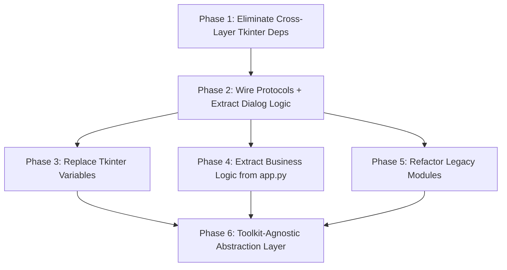

# UI Decoupling Implementation Plan

## Batch File Processor

**Version:** 1.0  
**Date:** February 2026  
**Status:** Ready for Implementation  
**Based on:** [UI_DECOUPLING_ANALYSIS.md](../docs/design/UI_DECOUPLING_ANALYSIS.md)  
**Principle:** Each phase is independently deployable without breaking existing functionality.

---

## Table of Contents

1. [Overview](#1-overview)
2. [Phase 1: Eliminate Cross-Layer Tkinter Dependencies](#2-phase-1-eliminate-cross-layer-tkinter-dependencies)
3. [Phase 2: Wire Up Existing Protocols & Extract Dialog Business Logic](#3-phase-2-wire-up-existing-protocols--extract-dialog-business-logic)
4. [Phase 3: Replace Tkinter Variables with Plain Python State](#4-phase-3-replace-tkinter-variables-with-plain-python-state)
5. [Phase 4: Extract Business Logic from app.py](#5-phase-4-extract-business-logic-from-apppy)
6. [Phase 5: Refactor Legacy Monolithic Modules](#6-phase-5-refactor-legacy-monolithic-modules)
7. [Phase 6: Create Toolkit-Agnostic Abstraction Layer](#7-phase-6-create-toolkit-agnostic-abstraction-layer)
8. [Cross-Phase Dependency Graph](#8-cross-phase-dependency-graph)

---

## 1. Overview

### 1.1 Current State

The codebase is in a **transitional state**. The `backend/`, `dispatch/`, and `core/` layers are clean of Tkinter imports. The `interface/` layer has been partially refactored with protocols defined in [`interface/interfaces.py`](../interface/interfaces.py) but **not yet wired into actual code**. A [`ProgressReporter`](../dispatch/services/progress_reporter.py:6) protocol already exists in the dispatch layer but is not used by [`_dispatch_legacy.py`](../_dispatch_legacy.py).

### 1.2 Key Coupling Points (from Analysis)

| ID | Coupling Point | Severity | Primary File |
|----|---------------|----------|-------------|
| C1 | 43+ Tkinter variables as business state | HIGH | `edit_folders_dialog.py`, `edit_settings_dialog.py` |
| C2 | `_process_directories` mixed concerns | HIGH | `interface/app.py:633-748` |
| C3 | `_dispatch_legacy.py` root parameter | HIGH | `_dispatch_legacy.py:81-83` |
| C4 | `doingstuffoverlay` global module | HIGH | `doingstuffoverlay.py` |
| C5 | `dialog.py` base class inherits Toplevel | HIGH | `dialog.py:5` |
| C6 | SMTP test in UI validation | HIGH | `edit_settings_dialog.py:391-406` |
| C7 | `mark_active_as_processed` mixed concerns | HIGH | `maintenance_dialog.py:176-288` |
| C8-C9 | Monolithic `resend_interface.py` and `database_import.py` | MEDIUM | Root-level modules |
| C10-C11 | Direct `messagebox`/`askdirectory` calls | MEDIUM | 6+ files |

### 1.3 Guiding Principles

1. **No Big Bang** — each phase produces a working system
2. **Protocol-first** — define interfaces before implementations
3. **Follow existing patterns** — use [`FTPService`](../interface/services/ftp_service.py) / [`FTPServiceProtocol`](../interface/services/ftp_service.py:16) as the template for new services
4. **Backward compatibility** — old call sites work via adapter/wrapper until fully migrated
5. **Test-driven** — each new service/protocol gets a mock and unit tests

---

## 2. Phase 1: Eliminate Cross-Layer Tkinter Dependencies

### 2.1 Goal

Remove all Tkinter imports and dependencies from non-UI layers: [`_dispatch_legacy.py`](../_dispatch_legacy.py), [`batch_log_sender.py`](../batch_log_sender.py), and [`interface/services/reporting_service.py`](../interface/services/reporting_service.py).

### 2.2 Dependencies

- None — this is the first phase and has no prerequisites.

### 2.3 Files to Create

#### 2.3.1 `interface/services/progress_callback.py`

A unified progress callback protocol that replaces all direct `doingstuffoverlay` calls from non-UI code.

> **Note:** [`dispatch/services/progress_reporter.py`](../dispatch/services/progress_reporter.py) already defines a [`ProgressReporter`](../dispatch/services/progress_reporter.py:6) protocol with `update(message, folder_num, folder_total, file_num, file_total, footer)`. The new `ProgressCallback` should be compatible with or extend this existing protocol.

```python
# interface/services/progress_callback.py
from typing import Protocol, Optional, runtime_checkable


@runtime_checkable
class ProgressCallback(Protocol):
    """Toolkit-agnostic progress reporting interface.
    
    Replaces direct doingstuffoverlay calls and Tkinter root.update calls.
    Compatible with dispatch/services/progress_reporter.ProgressReporter.
    """
    
    def show(self, text: str, header: str = "", footer: str = "") -> None:
        """Show/create the progress indicator."""
        ...
    
    def update(self, text: str, header: str = "", footer: str = "") -> None:
        """Update the progress indicator text."""
        ...
    
    def destroy(self) -> None:
        """Destroy/hide the progress indicator."""
        ...
```

#### 2.3.2 `interface/services/tkinter_progress_callback.py`

Tkinter implementation that wraps the existing [`doingstuffoverlay`](../doingstuffoverlay.py) module.

```python
# interface/services/tkinter_progress_callback.py
import doingstuffoverlay
from interface.services.progress_callback import ProgressCallback


class TkinterProgressCallback:
    """Tkinter implementation of ProgressCallback using doingstuffoverlay."""
    
    def __init__(self, parent):
        self._parent = parent
    
    def show(self, text: str, header: str = "", footer: str = "") -> None:
        doingstuffoverlay.make_overlay(self._parent, text, header=header, footer=footer)
    
    def update(self, text: str, header: str = "", footer: str = "") -> None:
        doingstuffoverlay.update_overlay(self._parent, text, header=header, footer=footer)
    
    def destroy(self) -> None:
        doingstuffoverlay.destroy_overlay()
```

#### 2.3.3 `interface/services/cli_progress_callback.py`

CLI implementation for automatic/headless mode — replaces `simple_output.configure(text=...)` pattern.

```python
# interface/services/cli_progress_callback.py
import sys
from interface.services.progress_callback import ProgressCallback


class CLIProgressCallback:
    """CLI implementation of ProgressCallback for automatic mode."""
    
    def __init__(self, output=None):
        self._output = output or sys.stdout
    
    def show(self, text: str, header: str = "", footer: str = "") -> None:
        self._output.write(f"\r{text}")
        self._output.flush()
    
    def update(self, text: str, header: str = "", footer: str = "") -> None:
        self._output.write(f"\r{text}")
        self._output.flush()
    
    def destroy(self) -> None:
        self._output.write("\n")
        self._output.flush()


class NullProgressCallback:
    """No-op implementation for testing."""
    
    def show(self, text: str, header: str = "", footer: str = "") -> None:
        pass
    
    def update(self, text: str, header: str = "", footer: str = "") -> None:
        pass
    
    def destroy(self) -> None:
        pass
```

#### 2.3.4 `tests/unit/test_progress_callback.py`

Unit tests for all `ProgressCallback` implementations.

### 2.4 Files to Modify

#### 2.4.1 [`_dispatch_legacy.py`](../_dispatch_legacy.py)

**Current signature** (line 81-83):
```python
def process(database_connection, folders_database, run_log, emails_table,
            run_log_directory, reporting, processed_files, root, args,
            version, errors_folder, settings, simple_output=None):
```

**New signature:**
```python
def process(database_connection, folders_database, run_log, emails_table,
            run_log_directory, reporting, processed_files, root, args,
            version, errors_folder, settings, simple_output=None,
            progress_callback=None):
```

**Changes:**

1. **Line 15**: Remove `import doingstuffoverlay` — replace with conditional import for backward compat
2. **Line 81-83**: Add `progress_callback=None` parameter
3. **Lines 120-134**: Replace the inner [`update_overlay()`](../_dispatch_legacy.py:120) function:

   **Before** (line 120-134):
   ```python
   def update_overlay(overlay_text, dispatch_folder_count, folder_total, ...):
       if not args.automatic:
           doingstuffoverlay.update_overlay(parent=root, overlay_text=..., ...)
       elif simple_output is not None:
           simple_output.configure(text=...)
       root.update()
   ```

   **After:**
   ```python
   def update_overlay(overlay_text, dispatch_folder_count, folder_total, ...):
       text = f"{overlay_text} folder {dispatch_folder_count} of {folder_total}, file {dispatch_file_count} of {file_total}"
       if progress_callback is not None:
           progress_callback.update(text=text, footer=footer)
       elif not args.automatic:
           doingstuffoverlay.update_overlay(parent=root, overlay_text=text, footer=footer, overlay_height=120)
       elif simple_output is not None:
           simple_output.configure(text=text)
       if root is not None:
           root.update()
   ```

   The `elif` branches preserve backward compatibility. Once all callers pass `progress_callback`, the `root`/`simple_output`/`doingstuffoverlay` branches can be removed.

4. **Line 134**: Guard `root.update()` with `if root is not None`

**Migration path:**
- Old callers continue to pass `root` and `simple_output` — works unchanged
- New callers pass `progress_callback` and can pass `root=None`
- Once all callers migrated, remove `root`, `simple_output`, and `doingstuffoverlay` import

#### 2.4.2 [`batch_log_sender.py`](../batch_log_sender.py)

**Current signature** (line 10-11):
```python
def do(settings, reporting, emails_table, sent_emails_removal_queue, time, args, root, 
       batch_number, emails_count, total_emails, simple_output, run_summary_string):
```

**New signature:**
```python
def do(settings, reporting, emails_table, sent_emails_removal_queue, time, args, root,
       batch_number, emails_count, total_emails, simple_output, run_summary_string,
       progress_callback=None):
```

**Changes:**

1. **Line 7**: Remove `import doingstuffoverlay` — replace with conditional
2. **Lines 24-30**: Replace overlay calls with `progress_callback`:

   **Before:**
   ```python
   if not args.automatic:
       doingstuffoverlay.destroy_overlay()
       doingstuffoverlay.make_overlay(root, "sending reports emails\r" + ...)
   else:
       simple_output.configure(text=...)
   ```

   **After:**
   ```python
   text = f"sending reports emails\remail {batch_number} attachment {emails_count} of {total_emails}"
   if progress_callback is not None:
       progress_callback.show(text=text)
   elif not args.automatic:
       doingstuffoverlay.destroy_overlay()
       doingstuffoverlay.make_overlay(root, text)
   elif simple_output is not None:
       simple_output.configure(text=text)
   ```

3. **Lines 40-46**: Same pattern for the loop body overlay update
4. **Line 46**: Guard `root.update()` with `if root is not None`
5. **Lines 79-80**: Same pattern for the final `destroy_overlay()` call

#### 2.4.3 [`interface/services/reporting_service.py`](../interface/services/reporting_service.py)

**Current signature** of [`send_report_emails()`](../interface/services/reporting_service.py:155-163):
```python
def send_report_emails(self, settings_dict, reporting_config, run_log_path,
                       start_time, run_summary, args=None, root=None, feedback_text=None):
```

**New signature:**
```python
def send_report_emails(self, settings_dict, reporting_config, run_log_path,
                       start_time, run_summary, args=None, root=None, feedback_text=None,
                       progress_callback=None):
```

**Changes:**
- Pass `progress_callback` through to [`batch_log_sender.do()`](../batch_log_sender.py:10) calls
- Once all callers pass `progress_callback`, remove `root` and `feedback_text` parameters

#### 2.4.4 [`interface/app.py`](../interface/app.py)

**Changes in [`_process_directories()`](../interface/app.py:633-748):**

1. **Lines 700-714**: Create a `ProgressCallback` instance and pass it to `dispatch.process()`:

   **Before:**
   ```python
   run_error_bool, run_summary_string = dispatch.process(
       ..., self._root, self._args, ...,
       simple_output=None if not self._args.automatic else self._feedback_text,
   )
   ```

   **After:**
   ```python
   from interface.services.tkinter_progress_callback import TkinterProgressCallback
   from interface.services.cli_progress_callback import CLIProgressCallback
   
   if self._args.automatic:
       progress = CLIProgressCallback()
   else:
       progress = TkinterProgressCallback(self._root)
   
   run_error_bool, run_summary_string = dispatch.process(
       ..., self._root, self._args, ...,
       simple_output=None if not self._args.automatic else self._feedback_text,
       progress_callback=progress,
   )
   ```

2. **Lines 738-748**: Pass `progress_callback` to `send_report_emails()`:
   ```python
   self._reporting_service.send_report_emails(
       ..., root=self._root, feedback_text=self._feedback_text,
       progress_callback=progress,
   )
   ```

### 2.5 Files to Delete

- None in this phase. [`doingstuffoverlay.py`](../doingstuffoverlay.py) is kept as the Tkinter implementation backing `TkinterProgressCallback`.

### 2.6 Testing Strategy

1. **Unit tests** for `TkinterProgressCallback`, `CLIProgressCallback`, `NullProgressCallback`
2. **Integration test**: Run `dispatch.process()` with `NullProgressCallback` and `root=None` to verify no Tkinter dependency
3. **Regression test**: Run existing `tests/integration/test_dispatch_backends_integration.py` to verify backward compat
4. **Manual test**: Run the application in both GUI and automatic mode

### 2.7 Rollback Plan

- Revert the `progress_callback=None` parameter additions — all old call sites still work because the parameter is optional with a default of `None`, and the `elif` branches preserve the old behavior.

### 2.8 Estimated Complexity

| Metric | Count |
|--------|-------|
| Files to create | 4 |
| Files to modify | 4 |
| Approximate lines changed | ~120 |

---

## 3. Phase 2: Wire Up Existing Protocols & Extract Dialog Business Logic

### 3.1 Goal

1. Wire the existing [`MessageBoxProtocol`](../interface/interfaces.py:15), [`FileDialogProtocol`](../interface/interfaces.py:87), and [`OverlayProtocol`](../interface/interfaces.py:261) into actual UI code
2. Extract SMTP connection testing from [`EditSettingsDialog.validate()`](../interface/ui/dialogs/edit_settings_dialog.py:376) into a service
3. Remove direct `database_import` fallback from [`EditFoldersDialog`](../interface/ui/dialogs/edit_folders_dialog.py:132-136)

### 3.2 Dependencies

- Phase 1 must be complete (for `ProgressCallback` to replace overlay calls in services)

### 3.3 Files to Create

#### 3.3.1 `interface/services/smtp_service.py`

Follow the [`FTPService`](../interface/services/ftp_service.py) pattern exactly.

```python
# interface/services/smtp_service.py
import smtplib
from typing import Optional
from dataclasses import dataclass


@dataclass
class SMTPConnectionResult:
    """Result of an SMTP connection test."""
    success: bool
    error_message: Optional[str] = None
    error_type: Optional[str] = None  # "connection", "auth", "unknown"


class SMTPServiceProtocol:
    """Protocol defining the SMTP service interface."""
    
    def test_connection(
        self,
        server: str,
        port: str,
        username: str = "",
        password: str = "",
    ) -> SMTPConnectionResult:
        """Test SMTP connection and optional authentication."""
        raise NotImplementedError


class SMTPService(SMTPServiceProtocol):
    """Real SMTP service implementation."""
    
    def test_connection(
        self,
        server: str,
        port: str,
        username: str = "",
        password: str = "",
    ) -> SMTPConnectionResult:
        try:
            smtp = smtplib.SMTP(str(server), str(port))
            smtp.ehlo()
            smtp.starttls()
            if username and password:
                smtp.login(str(username), str(password))
            smtp.quit()
            return SMTPConnectionResult(success=True)
        except Exception as e:
            return SMTPConnectionResult(
                success=False,
                error_message=f"Test Login Failed With Error\r{e}",
                error_type="connection"
            )


class MockSMTPService(SMTPServiceProtocol):
    """Mock SMTP service for testing."""
    
    def __init__(self, should_succeed: bool = True, error_message: str = "Mock SMTP Error"):
        self.should_succeed = should_succeed
        self.error_message = error_message
        self.connection_attempts = []
    
    def test_connection(self, server, port, username="", password=""):
        self.connection_attempts.append(dict(server=server, port=port, username=username))
        if self.should_succeed:
            return SMTPConnectionResult(success=True)
        return SMTPConnectionResult(success=False, error_message=self.error_message, error_type="connection")
```

#### 3.3.2 `interface/services/tkinter_messagebox.py`

Tkinter implementation of [`MessageBoxProtocol`](../interface/interfaces.py:15).

```python
# interface/services/tkinter_messagebox.py
from tkinter.messagebox import showinfo, showwarning, showerror, askyesno, askokcancel, askyesnocancel
from typing import Optional


class TkinterMessageBox:
    """Tkinter implementation of MessageBoxProtocol."""
    
    def __init__(self, parent=None):
        self._parent = parent
    
    def showinfo(self, title: str, message: str) -> None:
        showinfo(parent=self._parent, title=title, message=message)
    
    def showwarning(self, title: str, message: str) -> None:
        showwarning(parent=self._parent, title=title, message=message)
    
    def showerror(self, title: str, message: str) -> None:
        showerror(parent=self._parent, title=title, message=message)
    
    def askyesno(self, title: str, message: str) -> bool:
        return askyesno(parent=self._parent, title=title, message=message)
    
    def askokcancel(self, title: str, message: str) -> bool:
        return askokcancel(parent=self._parent, title=title, message=message)
    
    def askyesnocancel(self, title: str, message: str) -> Optional[bool]:
        return askyesnocancel(parent=self._parent, title=title, message=message)
```

#### 3.3.3 `interface/services/tkinter_filedialog.py`

Tkinter implementation of [`FileDialogProtocol`](../interface/interfaces.py:87).

```python
# interface/services/tkinter_filedialog.py
from tkinter.filedialog import askdirectory, askopenfilename, asksaveasfilename, askopenfilenames
from typing import Optional


class TkinterFileDialog:
    """Tkinter implementation of FileDialogProtocol."""
    
    def __init__(self, parent=None):
        self._parent = parent
    
    def askdirectory(self, title="Select Directory", initialdir=None) -> str:
        return askdirectory(parent=self._parent, title=title, initialdir=initialdir) or ""
    
    def askopenfilename(self, title="Open File", initialdir=None, filetypes=None) -> str:
        kwargs = dict(parent=self._parent, title=title, initialdir=initialdir)
        if filetypes:
            kwargs["filetypes"] = filetypes
        return askopenfilename(**kwargs) or ""
    
    def asksaveasfilename(self, title="Save File", initialdir=None, defaultextension="", filetypes=None) -> str:
        kwargs = dict(parent=self._parent, title=title, initialdir=initialdir, defaultextension=defaultextension)
        if filetypes:
            kwargs["filetypes"] = filetypes
        return asksaveasfilename(**kwargs) or ""
    
    def askopenfilenames(self, title="Open Files", initialdir=None, filetypes=None) -> tuple:
        kwargs = dict(parent=self._parent, title=title, initialdir=initialdir)
        if filetypes:
            kwargs["filetypes"] = filetypes
        return askopenfilenames(**kwargs) or ()
```

#### 3.3.4 `tests/unit/test_smtp_service.py`

Unit tests for `SMTPService` and `MockSMTPService`, following the pattern in [`tests/unit/test_edit_dialog/test_ftp_service.py`](../tests/unit/test_edit_dialog/test_ftp_service.py).

#### 3.3.5 `tests/unit/test_messagebox_protocol.py`

Tests verifying `TkinterMessageBox` satisfies `MessageBoxProtocol`.

### 3.4 Files to Modify

#### 3.4.1 [`interface/ui/dialogs/edit_settings_dialog.py`](../interface/ui/dialogs/edit_settings_dialog.py)

**Change 1: Add `smtp_service` DI parameter**

In the `__init__` method (around line 60-90), add:
```python
def __init__(self, parent, foldersnameinput, ..., smtp_service=None, messagebox=None, ...):
    self._smtp_service = smtp_service or SMTPService()
    self._messagebox = messagebox  # None means use direct tkinter calls (backward compat)
```

**Change 2: Replace SMTP test in [`validate()`](../interface/ui/dialogs/edit_settings_dialog.py:376-413)**

**Before** (lines 391-413):
```python
try:
    server = smtplib.SMTP(
        str(self.email_smtp_server_field.get()),
        str(self.smtp_port_field.get()),
    )
    server.ehlo()
    server.starttls()
    if self.email_username_field.get() != "" and self.email_password_field.get() != "":
        server.login(...)
    server.quit()
except Exception as email_test_login_result_string:
    ...
```

**After:**
```python
result = self._smtp_service.test_connection(
    server=str(self.email_smtp_server_field.get()),
    port=str(self.smtp_port_field.get()),
    username=str(self.email_username_field.get()),
    password=str(self.email_password_field.get()),
)
if not result.success:
    error_list.append(result.error_message)
    errors = True
```

**Change 3: Remove `import smtplib`** (line 8) — no longer needed directly.

**Change 4: Replace direct `showerror`/`askokcancel` calls** with `self._messagebox` when available:
- Line 470-472: `showerror(parent=self, message=error_report)` → `self._messagebox.showerror("Validation Error", error_report)` if `self._messagebox` else keep direct call
- Line 487-494: `askokcancel(message=...)` → `self._messagebox.askokcancel("Confirm", ...)` if `self._messagebox` else keep direct call

#### 3.4.2 [`interface/ui/dialogs/edit_folders_dialog.py`](../interface/ui/dialogs/edit_folders_dialog.py)

**Change 1: Remove `database_import` fallback**

**Before** (lines 132-136):
```python
if self._settings_provider:
    settings = self._settings_provider()
else:
    try:
        import database_import
        settings = database_import.database_obj_instance.settings.find_one(id=1)
    except (ImportError, AttributeError):
        settings = {}
```

**After:**
```python
if self._settings_provider:
    settings = self._settings_provider()
else:
    settings = {}
```

**Change 2: Remove `database_import` fallback at lines 1380-1387** (copy config from others):

**After:**
```python
if self._alias_provider:
    config = self._alias_provider(self.otherslistbox.get(tk.ACTIVE))
    if config:
        set_dialog_variables(config, True)
```

Requires the `_alias_provider` to accept an alias name parameter and return the folder config dict. Update the provider signature.

**Change 3: Remove `database_import` fallback at lines 1428-1434** (populate others listbox):

**After:**
```python
if self._alias_provider:
    aliases = self._alias_provider()
    if aliases:
        self.aliaslist = sorted(aliases)
else:
    self.aliaslist = []
```

**Change 4: Add `messagebox` DI parameter** for the single `showerror` call at line 1686.

#### 3.4.3 [`interface/ui/dialogs/maintenance_dialog.py`](../interface/ui/dialogs/maintenance_dialog.py)

**Change 1: Add `messagebox` and `progress_callback` DI parameters** to [`MaintenanceFunctions.__init__()`](../interface/ui/dialogs/maintenance_dialog.py:40):

```python
def __init__(self, ..., messagebox=None, progress_callback=None):
    self._messagebox = messagebox
    self._progress = progress_callback
```

**Change 2: Replace `doingstuffoverlay` calls** in [`set_all_inactive()`](../interface/ui/dialogs/maintenance_dialog.py:74), [`set_all_active()`](../interface/ui/dialogs/maintenance_dialog.py:94), [`clear_resend_flags()`](../interface/ui/dialogs/maintenance_dialog.py:114), [`remove_inactive_folders()`](../interface/ui/dialogs/maintenance_dialog.py:145), and [`mark_active_as_processed()`](../interface/ui/dialogs/maintenance_dialog.py:176):

**Pattern:**
```python
# Before:
doingstuffoverlay.make_overlay(self._maintenance_popup, "Working...")

# After:
if self._progress:
    self._progress.show("Working...")
else:
    doingstuffoverlay.make_overlay(self._maintenance_popup, "Working...")
```

**Change 3: Replace `askokcancel` in [`clear_processed_files_log()`](../interface/ui/dialogs/maintenance_dialog.py:132):**
```python
# Before:
if askokcancel(message="This will clear all records..."):

# After:
confirm = (self._messagebox.askokcancel("Confirm", "This will clear all records...")
           if self._messagebox
           else askokcancel(message="This will clear all records..."))
if confirm:
```

#### 3.4.4 [`interface/app.py`](../interface/app.py)

**Change: Pass `messagebox` and `filedialog` to dialogs and maintenance functions.**

In [`_show_edit_settings_dialog()`](../interface/app.py:776-797), add:
```python
EditSettingsDialog(
    ...,
    smtp_service=SMTPService(),
    messagebox=TkinterMessageBox(self._root),
)
```

In [`_show_maintenance_dialog_wrapper()`](../interface/app.py:894), pass:
```python
show_maintenance_dialog(
    ...,
    messagebox=TkinterMessageBox(self._root),
    progress_callback=TkinterProgressCallback(self._root),
)
```

### 3.5 Files to Delete

- None in this phase.

### 3.6 Testing Strategy

1. **Unit tests** for `SMTPService` with mocked `smtplib.SMTP`
2. **Unit tests** for `MockSMTPService` — verify it records attempts and returns configured results
3. **Unit tests** for `EditSettingsDialog.validate()` using `MockSMTPService` — verify no real network calls
4. **Unit tests** for `MaintenanceFunctions` using `NullProgressCallback` — verify no Tkinter dependency
5. **Regression**: Run existing `tests/ui/test_edit_settings_dialog.py` and `tests/ui/test_maintenance_dialog.py`

### 3.7 Rollback Plan

- All new parameters default to `None` with `elif` fallback branches
- Reverting means removing the new parameters — old direct calls still work

### 3.8 Estimated Complexity

| Metric | Count |
|--------|-------|
| Files to create | 5 |
| Files to modify | 4 |
| Approximate lines changed | ~200 |

---

## 4. Phase 3: Replace Tkinter Variables with Plain Python State

### 4.1 Goal

Replace all 37+ `StringVar`/`BooleanVar`/`IntVar` instances in [`EditFoldersDialog`](../interface/ui/dialogs/edit_folders_dialog.py:160-197) and 6 in [`EditSettingsDialog`](../interface/ui/dialogs/edit_settings_dialog.py:120-127) with plain Python dataclasses, using a binding layer to sync state with UI widgets.

### 4.2 Dependencies

- Phase 2 should be complete (so `database_import` fallbacks are removed and DI is in place)

### 4.3 Files to Create

#### 4.3.1 `interface/models/folder_dialog_state.py`

A dataclass mirroring the 37 Tkinter variables in [`EditFoldersDialog`](../interface/ui/dialogs/edit_folders_dialog.py:160-197). This should align with the existing [`FolderConfiguration`](../interface/models/folder_configuration.py:36) model and [`ExtractedDialogFields`](../interface/operations/folder_data_extractor.py:16).

```python
# interface/models/folder_dialog_state.py
from dataclasses import dataclass, field


@dataclass
class FolderDialogState:
    """Plain Python state for EditFoldersDialog — replaces 37 Tkinter variables."""
    
    # Backend selection
    backend_variable: str = ""
    active: str = "True"
    
    # EDI options
    split_edi: bool = False
    split_edi_send_credits: bool = False
    split_edi_send_invoices: bool = False
    split_edi_filter_categories: str = "ALL"
    split_edi_filter_mode: str = "include"
    prepend_file_dates: bool = False
    ediconvert_options: str = ""
    process_edi: str = "False"
    
    # Convert options
    convert_formats: str = "csv"
    upc_var_check: str = "False"
    a_rec_var_check: str = "False"
    c_rec_var_check: str = "False"
    headers_check: str = "False"
    ampersand_check: str = "False"
    
    # Tweak options
    tweak_edi: bool = False
    pad_arec_check: str = "False"
    a_record_padding_length: int = 6
    append_arec_check: str = "False"
    force_txt_file_ext_check: str = "False"
    
    # Backend toggles
    process_backend_copy: bool = False
    process_backend_ftp: bool = False
    process_backend_email: bool = False
    
    # Validation
    force_edi_check: bool = False
    
    # Invoice date
    invoice_date_offset: int = 0
    invoice_date_custom_format_string: str = "%Y%m%d"
    invoice_date_custom_format: bool = False
    
    # Advanced EDI
    edi_each_uom_tweak: bool = False
    include_item_numbers: bool = False
    include_item_description: bool = False
    split_sales_tax_prepaid: bool = False
    
    # UPC override
    override_upc_bool: bool = False
    override_upc_level: int = 1
    override_upc_category_filter: str = ""
    upc_target_length: int = 11
    upc_padding_pattern: str = "           "
    
    @classmethod
    def from_db_dict(cls, db_dict: dict) -> "FolderDialogState":
        """Create state from database dictionary."""
        # Map DB field names to dataclass field names
        ...
    
    def to_db_dict(self) -> dict:
        """Convert state to database dictionary for saving."""
        ...
```

#### 4.3.2 `interface/models/settings_dialog_state.py`

A dataclass for the 6 Tkinter variables in [`EditSettingsDialog`](../interface/ui/dialogs/edit_settings_dialog.py:120-127).

```python
# interface/models/settings_dialog_state.py
from dataclasses import dataclass


@dataclass
class SettingsDialogState:
    """Plain Python state for EditSettingsDialog — replaces 6 Tkinter variables."""
    enable_email: bool = False
    enable_interval_backup: bool = False
    enable_reporting: str = "False"
    enable_report_printing: str = "False"
    report_edi_validator_warnings: bool = False
    odbc_driver: str = ""
```

#### 4.3.3 `interface/ui/binding.py`

A bidirectional binding layer that syncs between dataclass state and Tkinter widgets.

```python
# interface/ui/binding.py
from typing import Any, Callable, Optional
import tkinter as tk


class StateBinding:
    """Bidirectional binding between a dataclass field and a Tkinter variable."""
    
    def __init__(self, state_obj: Any, field_name: str, tk_var: tk.Variable):
        self._state = state_obj
        self._field = field_name
        self._var = tk_var
        self._syncing = False
        
        # Initialize Tk var from state
        self._var.set(getattr(self._state, self._field))
        
        # Watch for Tk var changes
        self._var.trace_add("write", self._on_tk_change)
    
    def _on_tk_change(self, *args):
        if not self._syncing:
            self._syncing = True
            setattr(self._state, self._field, self._var.get())
            self._syncing = False
    
    def sync_to_tk(self):
        """Push state value to Tk variable."""
        if not self._syncing:
            self._syncing = True
            self._var.set(getattr(self._state, self._field))
            self._syncing = False


class DialogBindingManager:
    """Manages all bindings for a dialog."""
    
    def __init__(self):
        self._bindings: list[StateBinding] = []
    
    def bind(self, state_obj: Any, field_name: str, tk_var: tk.Variable) -> StateBinding:
        binding = StateBinding(state_obj, field_name, tk_var)
        self._bindings.append(binding)
        return binding
    
    def sync_all_to_tk(self):
        """Push all state values to Tk variables."""
        for binding in self._bindings:
            binding.sync_to_tk()
    
    def unbind_all(self):
        """Remove all bindings."""
        self._bindings.clear()
```

#### 4.3.4 `tests/unit/test_folder_dialog_state.py`

Tests for `FolderDialogState.from_db_dict()` and `to_db_dict()` round-trip.

#### 4.3.5 `tests/unit/test_settings_dialog_state.py`

Tests for `SettingsDialogState`.

#### 4.3.6 `tests/unit/test_binding.py`

Tests for `StateBinding` and `DialogBindingManager` — can use mock objects instead of real Tk variables.

### 4.4 Files to Modify

#### 4.4.1 [`interface/ui/dialogs/edit_folders_dialog.py`](../interface/ui/dialogs/edit_folders_dialog.py)

**Change 1: Create state object in [`body()`](../interface/ui/dialogs/edit_folders_dialog.py:114)**

Add at the top of `body()`:
```python
self._state = FolderDialogState.from_db_dict(self.foldersnameinput)
self._binding_manager = DialogBindingManager()
```

**Change 2: Bind Tkinter variables to state** (lines 160-197)

Keep the `tk.StringVar`/`tk.BooleanVar`/`tk.IntVar` instances for now — they are still needed for Tkinter widget binding. But bind them to the state object:

```python
self.backendvariable = tk.StringVar(master)
self._binding_manager.bind(self._state, "backend_variable", self.backendvariable)

self.active_checkbutton = tk.StringVar(master)
self._binding_manager.bind(self._state, "active", self.active_checkbutton)

# ... repeat for all 37 variables
```

**Change 3: Replace `.get()` calls in business logic** with `self._state.field_name`

For example, in validation and data extraction code, replace:
```python
self.split_edi.get()  # Tkinter call
```
with:
```python
self._state.split_edi  # Plain Python
```

**Change 4: Update [`FolderDataExtractor`](../interface/operations/folder_data_extractor.py)** to accept `FolderDialogState` directly instead of widget references.

#### 4.4.2 [`interface/ui/dialogs/edit_settings_dialog.py`](../interface/ui/dialogs/edit_settings_dialog.py)

Same pattern as above for the 6 variables at lines 120-127:

```python
self._state = SettingsDialogState()
self._binding_manager = DialogBindingManager()

self.enable_email_checkbutton_variable = tkinter.BooleanVar(master)
self._binding_manager.bind(self._state, "enable_email", self.enable_email_checkbutton_variable)
# ... etc
```

#### 4.4.3 [`interface/operations/folder_data_extractor.py`](../interface/operations/folder_data_extractor.py)

**Change: Add a `from_state()` class method** to [`ExtractedDialogFields`](../interface/operations/folder_data_extractor.py:16) that creates an instance from `FolderDialogState` + entry widget values:

```python
@classmethod
def from_state(cls, state: FolderDialogState, entry_fields: dict) -> "ExtractedDialogFields":
    """Create from FolderDialogState and entry widget values."""
    return cls(
        folder_name=entry_fields.get("folder_name", ""),
        alias=entry_fields.get("alias", ""),
        folder_is_active=state.active,
        process_backend_copy=state.process_backend_copy,
        # ... map all fields
    )
```

### 4.5 Files to Delete

- None.

### 4.6 Testing Strategy

1. **Unit tests** for `FolderDialogState.from_db_dict()` / `to_db_dict()` round-trip with real DB data samples
2. **Unit tests** for `DialogBindingManager` with mock Tk variables
3. **Integration test**: Create `EditFoldersDialog` with test data, verify state object matches expected values
4. **Regression**: Run `tests/ui/test_edit_folders_dialog.py` — all existing tests must pass

### 4.7 Rollback Plan

- The Tkinter variables still exist — the binding layer is additive. Remove the binding manager and state objects to revert.

### 4.8 Estimated Complexity

| Metric | Count |
|--------|-------|
| Files to create | 6 |
| Files to modify | 3 |
| Approximate lines changed | ~350 |

---

## 5. Phase 4: Extract Business Logic from app.py

### 5.1 Goal

Break up the large mixed-concern methods in [`BatchFileSenderApp`](../interface/app.py) into focused service classes with clear interfaces.

### 5.2 Dependencies

- Phase 1 (ProgressCallback) and Phase 2 (MessageBoxProtocol, FileDialogProtocol) should be complete

### 5.3 Files to Create

#### 5.3.1 `interface/services/processing_service.py`

Extracts the business logic from [`_process_directories()`](../interface/app.py:633-748).

```python
# interface/services/processing_service.py
from dataclasses import dataclass
from typing import Any, Optional, Protocol
import datetime
import os
import time
import traceback


@dataclass
class ProcessingResult:
    """Result of a processing run."""
    success: bool
    had_errors: bool = False
    run_summary: str = ""
    error_message: Optional[str] = None


class ProcessingServiceProtocol(Protocol):
    def process_folders(
        self,
        folders_table,
        settings_dict: dict,
        reporting_config: dict,
        args: Any,
        progress_callback: Any = None,
    ) -> ProcessingResult:
        ...


class ProcessingService:
    """Orchestrates folder processing — extracted from app.py._process_directories."""
    
    def __init__(
        self,
        database,
        version: str,
        logs_directory: str,
        errors_directory: str,
        reporting_service: Any,
    ):
        self._db = database
        self._version = version
        self._logs_directory = logs_directory
        self._errors_directory = errors_directory
        self._reporting_service = reporting_service
    
    def process_folders(self, folders_table, settings_dict, reporting_config, args, progress_callback=None):
        """Process all active folders.
        
        Contains the business logic currently in app.py lines 633-748:
        - Backup counter management
        - Log file creation
        - dispatch.process() invocation
        - Report email sending
        """
        ...
```

**Key extraction from [`_process_directories()`](../interface/app.py:633-748):**

| Lines | Logic | Destination |
|-------|-------|-------------|
| 639-649 | Backup counter check/increment | `ProcessingService._handle_backup()` |
| 651-686 | Log directory validation + creation | `ProcessingService._ensure_log_directory()` |
| 688-736 | Run log creation + dispatch call | `ProcessingService._execute_dispatch()` |
| 738-748 | Report email sending | `ProcessingService._send_reports()` |

The UI-specific parts (showing `askokcancel`, `showerror`) are replaced with raising exceptions or returning error results that the caller handles.

#### 5.3.2 `interface/services/folder_operations_service.py`

Extracts business logic from [`_select_folder()`](../interface/app.py:447-479) and [`_batch_add_folders()`](../interface/app.py:481-519).

```python
# interface/services/folder_operations_service.py
from dataclasses import dataclass
from typing import Optional


@dataclass
class FolderAddResult:
    success: bool
    already_exists: bool = False
    matched_folder: Optional[dict] = None


@dataclass
class BatchAddResult:
    added: int = 0
    skipped: int = 0


class FolderOperationsService:
    """Business logic for folder add/batch-add operations."""
    
    def __init__(self, database, folder_manager):
        self._db = database
        self._folder_manager = folder_manager
    
    def get_initial_directory(self, key: str) -> str:
        """Get the initial directory for a folder selection dialog."""
        prior = self._db.oversight_and_defaults.find_one(id=1)
        path = prior.get(key, "")
        if os.path.exists(path):
            return path
        return os.path.expanduser("~")
    
    def save_last_directory(self, key: str, path: str) -> None:
        """Save the last used directory."""
        self._db.oversight_and_defaults.update({"id": 1, key: path}, ["id"])
    
    def add_single_folder(self, folder_path: str) -> FolderAddResult:
        """Add a single folder — returns result without showing UI."""
        proposed = self._folder_manager.check_folder_exists(folder_path)
        if proposed["truefalse"]:
            return FolderAddResult(success=False, already_exists=True, matched_folder=proposed["matched_folder"])
        self._folder_manager.add_folder(folder_path)
        return FolderAddResult(success=True)
    
    def batch_add_folders(self, parent_dir: str, progress_callback=None) -> BatchAddResult:
        """Add all subdirectories of parent_dir."""
        folders = [
            os.path.join(parent_dir, f)
            for f in os.listdir(parent_dir)
            if os.path.isdir(os.path.join(parent_dir, f))
        ]
        added, skipped = 0, 0
        for i, folder in enumerate(folders):
            if progress_callback:
                progress_callback.update(f"Adding folders... ({i+1}/{len(folders)})")
            if self._folder_manager.check_folder_exists(folder)["truefalse"]:
                skipped += 1
            else:
                self._folder_manager.add_folder(folder)
                added += 1
        return BatchAddResult(added=added, skipped=skipped)
```

#### 5.3.3 `interface/services/processed_files_service.py`

Extracts the business logic from [`MaintenanceFunctions.mark_active_as_processed()`](../interface/ui/dialogs/maintenance_dialog.py:176-288).

```python
# interface/services/processed_files_service.py
import datetime
import hashlib
import os
from typing import Any, List, Optional


class ProcessedFilesService:
    """Business logic for marking files as processed — extracted from maintenance_dialog.py."""
    
    def __init__(self, database):
        self._db = database
    
    def mark_folder_files_as_processed(
        self,
        folder_id: int,
        progress_callback: Any = None,
    ) -> int:
        """Mark all files in a specific folder as processed.
        
        Returns the number of files marked.
        """
        ...
    
    def mark_all_active_as_processed(
        self,
        progress_callback: Any = None,
    ) -> int:
        """Mark all files in all active folders as processed.
        
        Contains the file traversal, MD5 checksum, and DB insert logic
        currently in maintenance_dialog.py lines 190-282.
        """
        ...
```

#### 5.3.4 `tests/unit/test_processing_service.py`

#### 5.3.5 `tests/unit/test_folder_operations_service.py`

#### 5.3.6 `tests/unit/test_processed_files_service.py`

### 5.4 Files to Modify

#### 5.4.1 [`interface/app.py`](../interface/app.py)

**Change 1: Inject services in `__init__`:**
```python
self._processing_service = ProcessingService(
    database=self._database,
    version=self._version,
    logs_directory=self._logs_directory,
    errors_directory=self._errors_directory,
    reporting_service=self._reporting_service,
)
self._folder_ops = FolderOperationsService(self._database, self._folder_manager)
```

**Change 2: Simplify [`_select_folder()`](../interface/app.py:447-479):**

```python
def _select_folder(self) -> None:
    initial_dir = self._folder_ops.get_initial_directory("single_add_folder_prior")
    selected = self._filedialog.askdirectory(initialdir=initial_dir)
    if not os.path.exists(selected):
        return
    self._folder_ops.save_last_directory("single_add_folder_prior", selected)
    result = self._folder_ops.add_single_folder(selected)
    if result.success:
        self._progress.show("Adding Folder...")
        if self._messagebox.askyesno("Confirm", "Mark files as processed?"):
            folder_dict = self._database.folders_table.find_one(folder_name=selected)
            self._processed_files_service.mark_folder_files_as_processed(folder_dict["id"])
        self._progress.destroy()
        self._refresh_users_list()
    elif result.already_exists:
        if self._messagebox.askokcancel("Query:", "Folder already known, edit?"):
            EditFoldersDialog(self._root, result.matched_folder)
```

**Change 3: Simplify [`_batch_add_folders()`](../interface/app.py:481-519):**

```python
def _batch_add_folders(self) -> None:
    initial_dir = self._folder_ops.get_initial_directory("batch_add_folder_prior")
    selection = self._filedialog.askdirectory(initialdir=initial_dir)
    if not selection:
        return
    folders_count = len([f for f in os.listdir(selection) if os.path.isdir(os.path.join(selection, f))])
    if not self._messagebox.askokcancel("Confirm", f"Add {folders_count} directories?"):
        return
    self._progress.show("Adding folders...")
    result = self._folder_ops.batch_add_folders(selection, progress_callback=self._progress)
    self._progress.destroy()
    self._messagebox.showinfo("Done", f"{result.added} added, {result.skipped} skipped.")
    self._refresh_users_list()
```

**Change 4: Simplify [`_process_directories()`](../interface/app.py:633-748):**

```python
def _process_directories(self, folders_table_process) -> None:
    result = self._processing_service.process_folders(
        folders_table=folders_table_process,
        settings_dict=self._database.settings.find_one(id=1),
        reporting_config=self._database.oversight_and_defaults.find_one(id=1),
        args=self._args,
        progress_callback=self._progress,
    )
    if result.had_errors and not self._args.automatic:
        self._messagebox.showinfo("Run Status", "Run completed with errors.")
    if result.error_message:
        self._messagebox.showerror("Error", result.error_message)
```

#### 5.4.2 [`interface/ui/dialogs/maintenance_dialog.py`](../interface/ui/dialogs/maintenance_dialog.py)

**Change: Delegate [`mark_active_as_processed()`](../interface/ui/dialogs/maintenance_dialog.py:176-288) to `ProcessedFilesService`:**

```python
def mark_active_as_processed(self, master=None, selected_folder=None):
    if self._progress:
        self._progress.show("adding files to processed list...")
    if selected_folder:
        self._processed_files_service.mark_folder_files_as_processed(
            selected_folder, progress_callback=self._progress
        )
    else:
        self._processed_files_service.mark_all_active_as_processed(
            progress_callback=self._progress
        )
    if self._progress:
        self._progress.destroy()
    # ... button state callbacks
```

### 5.5 Files to Delete

- None.

### 5.6 Testing Strategy

1. **Unit tests** for `ProcessingService` with mocked database and dispatch
2. **Unit tests** for `FolderOperationsService` with mocked database and folder_manager
3. **Unit tests** for `ProcessedFilesService` with in-memory database
4. **Integration test**: Full processing flow with `NullProgressCallback`
5. **Regression**: Run `tests/ui/test_main_interface.py` and `tests/integration/test_all_processing_flows.py`

### 5.7 Rollback Plan

- Services are additive — the old methods in `app.py` can be restored by removing the delegation calls
- Keep old method bodies commented out during transition

### 5.8 Estimated Complexity

| Metric | Count |
|--------|-------|
| Files to create | 6 |
| Files to modify | 2 |
| Approximate lines changed | ~500 |

---

## 6. Phase 5: Refactor Legacy Monolithic Modules

### 6.1 Goal

Separate UI construction from business logic in [`resend_interface.py`](../resend_interface.py), [`database_import.py`](../database_import.py), and [`processed_files_dialog.py`](../interface/ui/dialogs/processed_files_dialog.py).

### 6.2 Dependencies

- Phase 2 (MessageBoxProtocol, FileDialogProtocol) should be complete
- Phase 4 (ProcessedFilesService) is helpful but not required

### 6.3 Files to Create

#### 6.3.1 `interface/services/resend_service.py`

Extracts DB operations from [`resend_interface.py`](../resend_interface.py).

```python
# interface/services/resend_service.py
from typing import Any, List, Tuple
from dataclasses import dataclass


@dataclass
class ProcessedFileEntry:
    file_name: str
    resend_flag: bool
    id: int
    sent_date_time: str


class ResendService:
    """Business logic for resend operations — extracted from resend_interface.py."""
    
    def __init__(self, database_connection):
        self._processed_files = database_connection["processed_files"]
        self._folders = database_connection["folders"]
    
    def get_folder_list(self) -> List[Tuple[int, str]]:
        """Get list of folders with processed files.
        
        Returns list of tuples: folder_id, alias
        Extracted from resend_interface.py lines 125-129.
        """
        ...
    
    def get_files_for_folder(self, folder_id: int, limit: int = 10) -> List[ProcessedFileEntry]:
        """Get processed files for a folder.
        
        Extracted from resend_interface.py lines 61-66.
        """
        ...
    
    def set_resend_flag(self, file_id: int, flag: bool) -> None:
        """Set the resend flag for a processed file.
        
        Extracted from resend_interface.py lines 41-46.
        """
        ...
    
    def has_processed_files(self) -> bool:
        """Check if there are any processed files."""
        return self._processed_files.count() > 0
```

#### 6.3.2 `interface/services/database_import_service.py`

Extracts migration/validation logic from [`database_import.py`](../database_import.py).

```python
# interface/services/database_import_service.py
from dataclasses import dataclass
from typing import Optional
import dataset


@dataclass
class DatabaseValidationResult:
    can_proceed: bool
    warning_message: Optional[str] = None
    requires_confirmation: bool = False


class DatabaseImportService:
    """Business logic for database import — extracted from database_import.py."""
    
    def __init__(self, original_database_path: str, running_platform: str, current_db_version: int):
        self._original_path = original_database_path
        self._platform = running_platform
        self._current_version = current_db_version
    
    def validate_import_database(self, new_database_path: str) -> DatabaseValidationResult:
        """Validate a database file for import.
        
        Extracted from database_import.py lines 36-59.
        Returns validation result with any warnings.
        """
        new_db = dataset.connect("sqlite:///" + new_database_path)
        version_dict = new_db["version"].find_one(id=1)
        version = int(version_dict["version"])
        
        if version < 14:
            return DatabaseValidationResult(
                can_proceed=False,
                warning_message="Database versions below 14 do not contain OS info...",
                requires_confirmation=True,
            )
        if version > self._current_version:
            return DatabaseValidationResult(
                can_proceed=False,
                warning_message="Proposed database version is newer than supported...",
                requires_confirmation=True,
            )
        if version_dict.get("os") != self._platform:
            return DatabaseValidationResult(
                can_proceed=False,
                warning_message="OS mismatch...",
                requires_confirmation=True,
            )
        return DatabaseValidationResult(can_proceed=True)
    
    def execute_import(self, new_database_path: str, progress_callback=None) -> bool:
        """Execute the database import/merge.
        
        Wraps mover.DbMigrationThing.do_migrate().
        """
        ...
```

#### 6.3.3 `interface/services/processed_files_report_service.py`

Extracts DB query and export logic from [`processed_files_dialog.py`](../interface/ui/dialogs/processed_files_dialog.py).

```python
# interface/services/processed_files_report_service.py
from typing import List, Tuple


class ProcessedFilesReportService:
    """Business logic for processed files reports."""
    
    def __init__(self, database_obj):
        self._db = database_obj
    
    def get_folders_with_processed_files(self) -> List[Tuple[int, str]]:
        """Get folders that have processed files.
        
        Extracted from processed_files_dialog.py lines 212-223.
        """
        ...
    
    def export_report(self, folder_id: int, output_folder: str) -> str:
        """Export processed files report for a folder.
        
        Extracted from processed_files_dialog.py export_processed_report function.
        Returns the path to the exported file.
        """
        ...
    
    def get_initial_export_directory(self) -> str:
        """Get the initial directory for export dialog."""
        ...
    
    def save_export_directory(self, path: str) -> None:
        """Save the last used export directory."""
        ...
```

#### 6.3.4 `tests/unit/test_resend_service.py`

#### 6.3.5 `tests/unit/test_database_import_service.py`

#### 6.3.6 `tests/unit/test_processed_files_report_service.py`

### 6.4 Files to Modify

#### 6.4.1 [`resend_interface.py`](../resend_interface.py)

**Refactor [`do()`](../resend_interface.py:11) to use `ResendService`:**

```python
def do(database_connection, master_window, resend_service=None):
    service = resend_service or ResendService(database_connection)
    if not service.has_processed_files():
        showerror(message="Nothing To Configure")
        return
    # ... UI construction remains, but all DB calls go through service
```

**Specific changes:**
- Line 13-14: Replace `processed_files_table = database_connection['processed_files']` with `service` usage
- Line 17: Replace `configured_folders_table = database_connection['folders']` with `service` usage
- Line 44: Replace `processed_files_table.update(...)` with `service.set_resend_flag()`
- Line 61-66: Replace `processed_files_table.find(...)` with `service.get_files_for_folder()`
- Lines 125-129: Replace folder list construction with `service.get_folder_list()`

#### 6.4.2 [`database_import.py`](../database_import.py)

**Refactor [`import_interface()`](../database_import.py:15) to use `DatabaseImportService`:**

- Extract `database_migrate_job_wrapper()` (lines 32-68) validation logic into `DatabaseImportService.validate_import_database()`
- Keep UI construction (Toplevel, buttons, progress bar) in the module
- Replace direct `dataset.connect()` and version checks with service calls

#### 6.4.3 [`interface/ui/dialogs/processed_files_dialog.py`](../interface/ui/dialogs/processed_files_dialog.py)

**Refactor [`show_processed_files_dialog()`](../interface/ui/dialogs/processed_files_dialog.py:85) to use `ProcessedFilesReportService`:**

- Lines 212-223: Replace DB queries with `service.get_folders_with_processed_files()`
- Lines 129-157: Replace `set_output_folder()` DB access with `service.get_initial_export_directory()` / `service.save_export_directory()`
- Lines 56-79: Replace `export_processed_report()` DB queries with `service.export_report()`

#### 6.4.4 [`rclick_menu.py`](../rclick_menu.py)

This file is just a demo script — no business logic coupling. **No changes needed.** It only imports [`tk_extra_widgets.RightClickMenu`](../tk_extra_widgets.py:6) and runs a demo `if __name__ == '__main__'`.

### 6.5 Files to Delete

- None. The original modules are kept but refactored to delegate to services.

### 6.6 Testing Strategy

1. **Unit tests** for `ResendService` with in-memory database
2. **Unit tests** for `DatabaseImportService.validate_import_database()` with test DB files
3. **Unit tests** for `ProcessedFilesReportService` with in-memory database
4. **Regression**: Run `tests/ui/test_resend_interface.py`, `tests/ui/test_processed_files_dialog.py`

### 6.7 Rollback Plan

- Services are injected with `service=None` defaults — remove the parameter to revert to direct DB access

### 6.8 Estimated Complexity

| Metric | Count |
|--------|-------|
| Files to create | 6 |
| Files to modify | 3 |
| Approximate lines changed | ~400 |

---

## 7. Phase 6: Create Toolkit-Agnostic Abstraction Layer

### 7.1 Goal

Define abstract widget interfaces and create Tkinter adapters, enabling future toolkit swaps without changing business logic or dialog structure.

### 7.2 Dependencies

- Phases 1-5 should be complete — all business logic is extracted, protocols are wired, state is in dataclasses

### 7.3 Files to Create

#### 7.3.1 `interface/ui/abstractions/__init__.py`

Package for abstract widget interfaces.

#### 7.3.2 `interface/ui/abstractions/widgets.py`

Abstract widget interfaces — extends the existing [`WidgetProtocol`](../interface/interfaces.py:168), [`EntryWidgetProtocol`](../interface/interfaces.py:315), and [`ListboxProtocol`](../interface/interfaces.py:357) from `interface/interfaces.py`.

```python
# interface/ui/abstractions/widgets.py
from typing import Protocol, Any, Optional, Callable, runtime_checkable


@runtime_checkable
class AbstractWindow(Protocol):
    """Abstract window — replaces tkinter.Toplevel."""
    def title(self, text: str) -> None: ...
    def transient(self, parent: Any) -> None: ...
    def grab_set(self) -> None: ...
    def focus_set(self) -> None: ...
    def geometry(self, spec: str) -> None: ...
    def resizable(self, width: bool, height: bool) -> None: ...
    def destroy(self) -> None: ...
    def update(self) -> None: ...
    def protocol(self, name: str, func: Callable) -> None: ...
    def bind(self, event: str, func: Callable) -> None: ...
    def wait_window(self, window: Any = None) -> None: ...


@runtime_checkable
class AbstractFrame(Protocol):
    """Abstract frame container."""
    def pack(self, **kwargs) -> None: ...
    def grid(self, **kwargs) -> None: ...
    def place(self, **kwargs) -> None: ...
    def destroy(self) -> None: ...


@runtime_checkable
class AbstractLabel(Protocol):
    """Abstract label widget."""
    def configure(self, **kwargs) -> None: ...
    def pack(self, **kwargs) -> None: ...
    def grid(self, **kwargs) -> None: ...


@runtime_checkable
class AbstractButton(Protocol):
    """Abstract button widget."""
    def configure(self, **kwargs) -> None: ...
    def pack(self, **kwargs) -> None: ...
    def grid(self, **kwargs) -> None: ...


@runtime_checkable
class AbstractEntry(Protocol):
    """Abstract text entry widget."""
    def get(self) -> str: ...
    def insert(self, index: Any, text: str) -> None: ...
    def delete(self, start: Any, end: Any = None) -> None: ...
    def configure(self, **kwargs) -> None: ...
    def pack(self, **kwargs) -> None: ...
    def grid(self, **kwargs) -> None: ...


@runtime_checkable
class AbstractCheckbutton(Protocol):
    """Abstract checkbutton widget."""
    def configure(self, **kwargs) -> None: ...
    def pack(self, **kwargs) -> None: ...
    def grid(self, **kwargs) -> None: ...


@runtime_checkable
class AbstractRadiobutton(Protocol):
    """Abstract radiobutton widget."""
    def configure(self, **kwargs) -> None: ...
    def pack(self, **kwargs) -> None: ...
    def grid(self, **kwargs) -> None: ...


@runtime_checkable
class AbstractOptionMenu(Protocol):
    """Abstract option menu / dropdown."""
    def configure(self, **kwargs) -> None: ...
    def pack(self, **kwargs) -> None: ...
    def grid(self, **kwargs) -> None: ...


@runtime_checkable
class AbstractListbox(Protocol):
    """Abstract listbox widget."""
    def get(self, start: Any, end: Any = None) -> Any: ...
    def insert(self, index: Any, *items: str) -> None: ...
    def delete(self, start: Any, end: Any = None) -> None: ...
    def curselection(self) -> tuple: ...
    def size(self) -> int: ...
    def config(self, **kwargs) -> None: ...
    def pack(self, **kwargs) -> None: ...
    def grid(self, **kwargs) -> None: ...


@runtime_checkable
class AbstractSpinbox(Protocol):
    """Abstract spinbox widget."""
    def get(self) -> str: ...
    def delete(self, start: Any, end: Any = None) -> None: ...
    def insert(self, index: Any, text: str) -> None: ...
    def configure(self, **kwargs) -> None: ...
    def pack(self, **kwargs) -> None: ...
    def grid(self, **kwargs) -> None: ...
```

#### 7.3.3 `interface/ui/abstractions/widget_factory.py`

Factory protocol for creating widgets — this is the key abstraction that enables toolkit swaps.

```python
# interface/ui/abstractions/widget_factory.py
from typing import Protocol, Any, Optional, Callable


class WidgetFactory(Protocol):
    """Factory for creating toolkit-agnostic widgets."""
    
    def create_window(self, parent: Any = None, title: str = "") -> Any: ...
    def create_frame(self, parent: Any, **kwargs) -> Any: ...
    def create_label(self, parent: Any, text: str = "", **kwargs) -> Any: ...
    def create_button(self, parent: Any, text: str = "", command: Callable = None, **kwargs) -> Any: ...
    def create_entry(self, parent: Any, **kwargs) -> Any: ...
    def create_checkbutton(self, parent: Any, text: str = "", variable: Any = None, **kwargs) -> Any: ...
    def create_radiobutton(self, parent: Any, text: str = "", variable: Any = None, value: Any = None, **kwargs) -> Any: ...
    def create_option_menu(self, parent: Any, variable: Any, *values, **kwargs) -> Any: ...
    def create_listbox(self, parent: Any, **kwargs) -> Any: ...
    def create_spinbox(self, parent: Any, **kwargs) -> Any: ...
    def create_separator(self, parent: Any, orient: str = "horizontal", **kwargs) -> Any: ...
    def create_scrollbar(self, parent: Any, **kwargs) -> Any: ...
    def create_progressbar(self, parent: Any, **kwargs) -> Any: ...
```

#### 7.3.4 `interface/ui/tkinter_adapter/__init__.py`

Package for Tkinter implementations.

#### 7.3.5 `interface/ui/tkinter_adapter/widget_factory.py`

Tkinter implementation of `WidgetFactory`.

```python
# interface/ui/tkinter_adapter/widget_factory.py
import tkinter as tk
from tkinter import ttk


class TkinterWidgetFactory:
    """Tkinter implementation of WidgetFactory."""
    
    def create_window(self, parent=None, title=""):
        window = tk.Toplevel(parent)
        if title:
            window.title(title)
        return window
    
    def create_frame(self, parent, **kwargs):
        return ttk.Frame(parent, **kwargs)
    
    def create_label(self, parent, text="", **kwargs):
        return ttk.Label(parent, text=text, **kwargs)
    
    def create_button(self, parent, text="", command=None, **kwargs):
        return ttk.Button(parent, text=text, command=command, **kwargs)
    
    def create_entry(self, parent, **kwargs):
        return ttk.Entry(parent, **kwargs)
    
    # ... etc for all widget types
```

#### 7.3.6 `interface/ui/abstractions/scrolled_frame.py`

Abstract equivalent of [`tk_extra_widgets.VerticalScrolledFrame`](../tk_extra_widgets.py:97).

#### 7.3.7 `interface/ui/abstractions/context_menu.py`

Abstract equivalent of [`tk_extra_widgets.RightClickMenu`](../tk_extra_widgets.py:6).

#### 7.3.8 `interface/ui/abstractions/tooltip.py`

Abstract equivalent of [`tk_extra_widgets.CreateToolTip`](../tk_extra_widgets.py:252).

#### 7.3.9 `interface/ui/abstractions/column_sorter.py`

Abstract equivalent of [`tk_extra_widgets.columnSorterWidget`](../tk_extra_widgets.py:313).

#### 7.3.10 Refactored `dialog.py` → `interface/ui/abstractions/dialog_base.py`

Replace the current [`Dialog`](../dialog.py:5) base class that inherits from `tkinter.Toplevel`:

```python
# interface/ui/abstractions/dialog_base.py
from typing import Any, Optional


class DialogBase:
    """Abstract dialog base class — replaces dialog.py Dialog(Toplevel)."""
    
    def __init__(self, parent: Any, foldersnameinput: Any, title: str = "", widget_factory=None):
        self.parent = parent
        self.foldersnameinput = foldersnameinput
        self.result = None
        self._factory = widget_factory
        
        # Subclasses implement body(), buttonbox(), validate(), apply()
    
    def body(self, master: Any) -> Optional[Any]:
        """Create dialog body. Override in subclasses."""
        pass
    
    def buttonbox(self) -> None:
        """Create button box. Override for custom buttons."""
        pass
    
    def validate(self) -> bool:
        """Validate dialog input. Override in subclasses."""
        return True
    
    def apply(self) -> None:
        """Apply dialog result. Override in subclasses."""
        pass
    
    def ok(self, event=None) -> None:
        if not self.validate():
            return
        self.apply()
        self.cancel()
    
    def cancel(self, event=None) -> None:
        """Close the dialog."""
        pass  # Implementation depends on toolkit
```

And a Tkinter adapter:

```python
# interface/ui/tkinter_adapter/dialog.py
import tkinter as tk
from tkinter import ttk
from interface.ui.abstractions.dialog_base import DialogBase


class TkinterDialog(tk.Toplevel, DialogBase):
    """Tkinter implementation of DialogBase — drop-in replacement for dialog.Dialog."""
    
    def __init__(self, parent, foldersnameinput, title=None, widget_factory=None):
        tk.Toplevel.__init__(self, parent)
        DialogBase.__init__(self, parent, foldersnameinput, title or "", widget_factory)
        # ... same initialization as current dialog.py
```

### 7.4 Files to Modify

#### 7.4.1 [`interface/ui/dialogs/edit_folders_dialog.py`](../interface/ui/dialogs/edit_folders_dialog.py)

**Change: Accept `widget_factory` parameter and use it for widget creation.**

This is a large change — the `body()` method creates hundreds of widgets. The migration should be incremental:

1. First, add `widget_factory` parameter with default `TkinterWidgetFactory()`
2. Replace widget creation calls one section at a time
3. Change base class from `Dialog` to `TkinterDialog` (or `DialogBase` with adapter)

#### 7.4.2 [`interface/ui/dialogs/edit_settings_dialog.py`](../interface/ui/dialogs/edit_settings_dialog.py)

Same pattern as edit_folders_dialog.

#### 7.4.3 [`interface/ui/widgets/folder_list_widget.py`](../interface/ui/widgets/folder_list_widget.py)

Accept `widget_factory` for internal widget creation.

#### 7.4.4 [`interface/ui/widgets/search_widget.py`](../interface/ui/widgets/search_widget.py)

Accept `widget_factory` for internal widget creation.

### 7.5 Files to Delete

- [`dialog.py`](../dialog.py) — replaced by `interface/ui/abstractions/dialog_base.py` + `interface/ui/tkinter_adapter/dialog.py`
- Potentially [`rclick_menu.py`](../rclick_menu.py) — it is just a demo script, not used by the application

### 7.6 Testing Strategy

1. **Unit tests** for `TkinterWidgetFactory` — verify it creates correct widget types
2. **Protocol conformance tests** — verify `TkinterDialog` satisfies `DialogBase` interface
3. **Visual regression test** — screenshot comparison before/after for each dialog
4. **Integration test**: Create `EditFoldersDialog` with `TkinterWidgetFactory`, verify all widgets render correctly

### 7.7 Rollback Plan

- The `widget_factory` parameter defaults to `TkinterWidgetFactory()` — removing it reverts to direct Tkinter calls
- The `TkinterDialog` adapter preserves the exact same behavior as the original `Dialog(Toplevel)`

### 7.8 Estimated Complexity

| Metric | Count |
|--------|-------|
| Files to create | ~12 |
| Files to modify | 4 |
| Files to delete | 1-2 |
| Approximate lines changed | ~800 |

---

## 8. Cross-Phase Dependency Graph



### 8.1 Parallel Work Opportunities

After Phase 1 is complete:
- **Phase 2** and **Phase 4** can be worked on in parallel (different files)
- **Phase 3** depends on Phase 2 (needs DI in place)
- **Phase 5** can start after Phase 2 (needs MessageBoxProtocol)
- **Phase 6** requires all other phases to be complete

### 8.2 Summary of All Changes

| Phase | Files Created | Files Modified | Files Deleted | Lines Changed |
|-------|--------------|----------------|---------------|---------------|
| 1: Cross-Layer Deps | 4 | 4 | 0 | ~120 |
| 2: Wire Protocols | 5 | 4 | 0 | ~200 |
| 3: Tkinter Variables | 6 | 3 | 0 | ~350 |
| 4: Extract from app.py | 6 | 2 | 0 | ~500 |
| 5: Legacy Modules | 6 | 3 | 0 | ~400 |
| 6: Abstraction Layer | ~12 | 4 | 1-2 | ~800 |
| **Total** | **~39** | **~20** | **1-2** | **~2,370** |

### 8.3 Key Risk Mitigations

1. **Every new parameter has a default value** — backward compatibility is preserved at each step
2. **Every service has a mock** — enables testing without real network/DB/UI
3. **Existing test suites** in `tests/ui/` and `tests/integration/` serve as regression guards
4. **The `elif` pattern** in Phase 1 ensures old callers work while new callers use the protocol
5. **Phase 6 is optional** — Phases 1-5 deliver significant decoupling value even without the full abstraction layer
