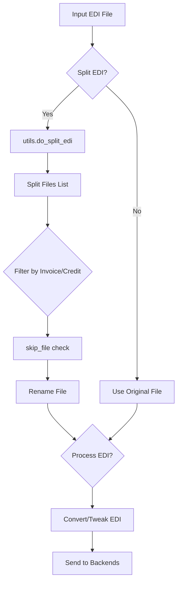

# Item Category Filtering Design Document

## Overview

This document describes the design for adding item category filtering capability to the EDI splitting and renaming phase of the batch file processor.

## Current Architecture Analysis

### Data Flow Overview



### Key Files and Their Roles

| File | Role |
|------|------|
| [`utils.py`](utils.py:244) | Contains `do_split_edi()` function that splits EDI files by A records |
| [`dispatch.py`](dispatch.py:321) | Orchestrates the processing flow, calls splitting and filtering logic |
| [`edi_tweaks.py`](edi_tweaks.py:198) | Contains existing category filtering for UPC override |
| [`convert_to_csv.py`](convert_to_csv.py:87) | Contains existing category filtering during CSV conversion |
| [`interface.py`](interface.py:1882) | UI controls for category filter configuration |
| [`create_database.py`](create_database.py:72) | Database schema with default values |

### Item Category Data Model

The `upc_dict` structure contains item category information:

```python
# From dispatch.py lines 105-118
upc_dict = {
    item_number: [category, upc1, upc2, upc3, upc4],
    # Example:
    12345: [1, '01234567890', '98765432109', '', ''],
    67890: [5, '11111111111', '', '', ''],
}
```

- **category** is at index 0
- Categories are numeric values from the AS400 database field `dsanrep.anbbcd`
- Valid category range: 1-99 based on validation in [`interface.py`](interface.py:2543)

### Existing Category Filtering Pattern

The system already has category filtering for UPC override operations:

```python
# From edi_tweaks.py lines 198-203
if override_upc:
    if override_upc_category_filter == "ALL":
        b_rec_edi_dict['upc_number'] = upc_dict[int(vendor_item)][override_upc_level]
    else:
        if upc_dict[int(vendor_item)][0] in override_upc_category_filter.split(","):
            b_rec_edi_dict['upc_number'] = upc_dict[int(vendor_item)][override_upc_level]
```

Configuration storage:
- Parameter name: `override_upc_category_filter`
- Default value: `"ALL"`
- Format: `"ALL"` or comma-separated numbers like `"1,5,12"`

### Current Splitting Logic

The [`do_split_edi()`](utils.py:244) function in `utils.py`:

1. Reads the EDI file and counts lines
2. Rejects files with more than 700 A records
3. Iterates through lines, creating new files at each A record
4. Determines file suffix based on invoice total:
   - Negative total → `.cr` suffix (credit)
   - Positive total → `.inv` suffix (invoice)
5. Optionally prepends date to filename
6. Returns list of tuples: `(output_file_path, file_name_prefix, file_name_suffix)`

**Current limitation**: The function does not have access to `upc_dict` and cannot filter B records by category.

### Current Invoice/Credit Filtering

After splitting, [`dispatch.py`](dispatch.py:346) filters based on invoice/credit type:

```python
if parameters_dict['split_edi'] and valid_edi_file:
    file_is_credit = utils.detect_invoice_is_credit(output_send_filename)
    if file_is_credit:
        if parameters_dict["split_edi_include_credits"] == 0:
            skip_file = True
    if file_is_credit is False:
        if parameters_dict["split_edi_include_invoices"] == 0:
            skip_file = True
```

---

## Proposed Design

### Feature Requirements

1. Filter B records (line items) within split EDI files based on item category
2. Allow configuration per folder with include/exclude lists
3. Support both inclusive and exclusive filtering modes
4. Maintain backward compatibility with existing behavior

### Configuration Design

#### New Database Fields

Add two new fields to the folders/administrative tables:

| Field Name | Type | Default | Description |
|------------|------|---------|-------------|
| `split_edi_filter_categories` | String | `"ALL"` | Categories to include when splitting |
| `split_edi_filter_mode` | String | `"include"` | Filter mode: include or exclude |

#### Configuration Format

Following the existing pattern from `override_upc_category_filter`:

- `"ALL"` - Include all categories (default, backward compatible)
- `"1,5,12"` - Comma-separated list of category numbers
- Mode `"include"` - Only include items in the specified categories
- Mode `"exclude"` - Include all items EXCEPT those in the specified categories

### Implementation Design

#### Modified Function Signature

Update [`do_split_edi()`](utils.py:244) to accept `upc_dict`:

```python
def do_split_edi(edi_process, work_directory, parameters_dict, upc_dict=None):
```

#### Filtering Logic

Add B record filtering within the splitting loop:

```python
# Pseudocode for filtering logic
if writeable_line.startswith("B"):
    b_rec_dict = capture_records(writeable_line)
    vendor_item = int(b_rec_dict['vendor_item'].strip())
    
    if upc_dict and vendor_item in upc_dict:
        item_category = str(upc_dict[vendor_item][0])
        filter_categories = parameters_dict.get('split_edi_filter_categories', 'ALL')
        filter_mode = parameters_dict.get('split_edi_filter_mode', 'include')
        
        if filter_categories != 'ALL':
            category_list = filter_categories.split(',')
            
            if filter_mode == 'include':
                if item_category not in category_list:
                    continue  # Skip this B record
            elif filter_mode == 'exclude':
                if item_category in category_list:
                    continue  # Skip this B record
    
    # Write the B record if not filtered
    f.write(writeable_line.replace('\n', "\r\n").encode())
```

#### A Record Handling

When all B records are filtered from an invoice, the A record should still be written. Options:

1. **Write empty invoices** - A records with no B records (current proposal)
2. **Skip empty invoices** - Don't write files with no line items
3. **Configurable behavior** - Add another parameter

**Recommendation**: Start with option 1 (write empty invoices) for simplicity. The existing invoice/credit filtering can then skip these if needed.

### UI Design

#### New Controls in EditDialog

Add to the `split_edi_frame` in [`interface.py`](interface.py:1723):

```python
# New variables
self.split_edi_filter_categories = tkinter.StringVar(master)
self.split_edi_filter_mode = tkinter.StringVar(master)

# New controls
self.split_edi_filter_categories_entry = tkinter.ttk.Entry(
    self.split_edi_frame, width=15
)
self.split_edi_filter_mode_optionmenu = tkinter.ttk.OptionMenu(
    self.split_edi_frame,
    self.split_edi_filter_mode,
    "include",
    "include",
    "exclude",
)

# Tooltip
self.split_edi_filter_tooltip = tk_extra_widgets.CreateToolTip(
    self.split_edi_filter_categories_entry,
    "Enter 'ALL' or comma-separated category numbers to filter items"
)
```

#### Layout

Add below the existing split EDI controls:

```
[✓] Split EDI
[✓] Split EDI Send Invoices
[✓] Split EDI Send Credits
[✓] Prepend dates
Rename File: [________]
Filter Categories: [________] Mode: [include ▼]
```

### Database Migration

Add migration in [`folders_database_migrator.py`](folders_database_migrator.py):

```python
# New version upgrade
if db_version_dict['version'] == '32':
    database_connection.query("alter table 'folders' add column 'split_edi_filter_categories'")
    database_connection.query('UPDATE "folders" set "split_edi_filter_categories"="ALL"')
    database_connection.query("alter table 'administrative' add column 'split_edi_filter_categories'")
    database_connection.query('UPDATE "administrative" set "split_edi_filter_categories"="ALL"')
    
    database_connection.query("alter table 'folders' add column 'split_edi_filter_mode'")
    database_connection.query('UPDATE "folders" set "split_edi_filter_mode"="include"')
    database_connection.query("alter table 'administrative' add column 'split_edi_filter_mode'")
    database_connection.query('UPDATE "administrative" set "split_edi_filter_mode"="include"')
    
    update_version = dict(id=1, version="33", os=running_platform)
```

Update `DATABASE_VERSION` in [`interface.py`](interface.py:44) to `"33"`.

---

## Affected Files

### Code Changes Required

| File | Changes |
|------|---------|
| [`utils.py`](utils.py:244) | Modify `do_split_edi()` to accept `upc_dict` and filter B records |
| [`dispatch.py`](dispatch.py:325) | Pass `upc_dict` to `do_split_edi()` |
| [`interface.py`](interface.py:1723) | Add UI controls for category filter configuration |
| [`interface.py`](interface.py:44) | Update `DATABASE_VERSION` to `"33"` |
| [`create_database.py`](create_database.py:72) | Add new fields to default template |
| [`folders_database_migrator.py`](folders_database_migrator.py) | Add migration for new fields |

### Test Files to Add/Update

| File | Purpose |
|------|---------|
| `tests/test_split_category_filter.py` | Unit tests for category filtering logic |
| `tests/conftest.py` | Add fixtures for category filter testing |

---

## Implementation Steps

### Phase 1: Core Logic

1. [ ] Modify [`do_split_edi()`](utils.py:244) signature to accept `upc_dict`
2. [ ] Add B record filtering logic based on category
3. [ ] Update [`dispatch.py`](dispatch.py:325) to pass `upc_dict` to splitting function
4. [ ] Add unit tests for filtering logic

### Phase 2: Database Schema

1. [ ] Add new fields to [`create_database.py`](create_database.py:72) template
2. [ ] Add migration in [`folders_database_migrator.py`](folders_database_migrator.py)
3. [ ] Update `DATABASE_VERSION` constant

### Phase 3: UI Controls

1. [ ] Add new tkinter variables in [`EditDialog`](interface.py:1214)
2. [ ] Create entry field and option menu controls
3. [ ] Add tooltip for category filter field
4. [ ] Wire up save/load logic in `set_dialog_variables()` and `apply()`
5. [ ] Add validation in `validate()` method

### Phase 4: Testing & Documentation

1. [ ] Write unit tests for new functionality
2. [ ] Write integration tests with sample EDI files
3. [ ] Update user documentation if applicable

---

## Edge Cases and Considerations

### Unknown Items

If an item number is not found in `upc_dict`, the B record should be included (fail-open behavior) to avoid data loss.

### Empty Results

If all B records are filtered from an invoice:
- The A and C records are still written
- The resulting file may be an empty invoice
- Consider logging a warning for this situation

### Performance

The filtering adds a dictionary lookup per B record. This should have minimal performance impact since:
- Dictionary lookups are O(1)
- The `upc_dict` is already loaded for other purposes
- No additional database queries are needed

### Backward Compatibility

- Default value of `"ALL"` maintains existing behavior
- Existing configurations will continue to work without modification
- New fields have sensible defaults in database migration

---

## Alternative Approaches Considered

### 1. Post-Split Filtering

Filter items during the conversion/tweaking phase instead of splitting.

**Pros**: No changes to splitting logic
**Cons**: Split files still contain unwanted items; just hidden in output

**Decision**: Rejected - doesn't meet requirement of filtering during splitting

### 2. Single Filter Field with Prefix

Use prefix like `!1,5,12` to indicate exclude mode.

**Pros**: Fewer database fields
**Cons**: More complex parsing, less intuitive UI

**Decision**: Rejected - separate mode field is clearer

### 3. Category Range Support

Support ranges like `1-5,12,15-20`.

**Pros**: More compact for large ranges
**Cons**: More complex parsing, rarely needed

**Decision**: Deferred - can be added later if needed

---

## Summary

This design adds item category filtering to the EDI splitting phase by:

1. Extending `do_split_edi()` to accept and use `upc_dict` for filtering
2. Adding two new configuration fields: `split_edi_filter_categories` and `split_edi_filter_mode`
3. Following existing patterns for category filtering from UPC override functionality
4. Maintaining backward compatibility with default value of `"ALL"`
