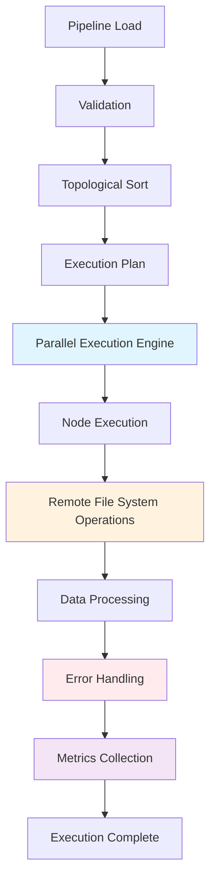
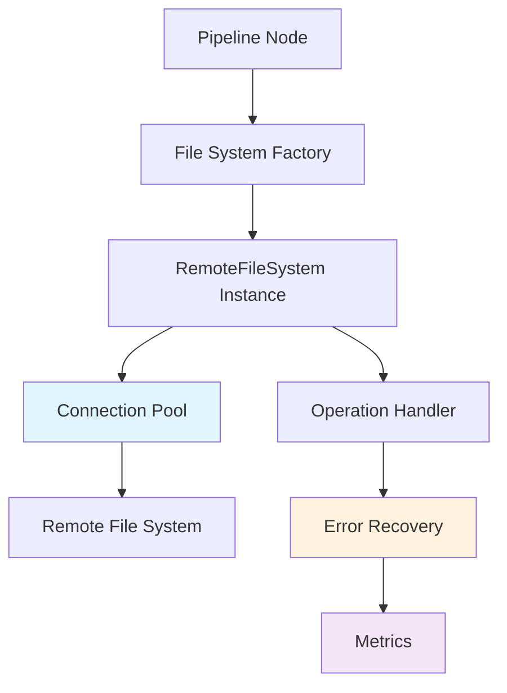

# Pipeline Executor Enhancements Plan

## Overview

This plan outlines comprehensive improvements to the pipeline executor in `backend/pipeline_executor.py` and its integration with remote file systems in `backend/remote_fs/`. The goal is to address limitations, improve reliability, performance, and extensibility.

## Current Architecture Analysis

### Pipeline Executor (`backend/pipeline_executor.py`)
- **Strengths**: Supports a wide variety of node types (25+), handles complex data transformations
- **Limitations**: 
  - Basic topological sort implementation
  - Limited error handling and logging
  - No connection pooling for remote file systems
  - Sequential execution only
  - Limited support for large datasets
  - No built-in retry mechanism

### Remote File System Implementation (`backend/remote_fs/`)
- **Strengths**: Factory pattern for easy extensibility
- **Limitations**:
  - Base class missing critical operations (upload, delete, directory operations)
  - No connection management/pooling
  - Limited error handling
  - Incomplete implementations (SMB)
  - No support for cloud storage (S3, Azure Blob)
  - No connection timeout or retry logic

## Enhancement Roadmap

### Phase 1: Foundation Improvements

#### 1.1 Remote File System Interface Enhancement
- Add missing operations to `RemoteFileSystem` base class
- Improve error handling and connection management
- Add support for connection pooling

**Tasks:**
- [ ] Add `upload_file()` method to `RemoteFileSystem`
- [ ] Add `delete_file()` method to `RemoteFileSystem`
- [ ] Add `create_directory()` and `delete_directory()` methods
- [ ] Add `upload_to_temp()` method (complement to `download_to_temp()`)
- [ ] Implement connection pooling mechanism
- [ ] Add connection timeout and retry logic
- [ ] Enhance error handling with detailed exception types

#### 1.2 Remote File System Implementations
- Complete and improve existing implementations
- Add support for cloud storage

**Tasks:**
- [ ] Complete SMB file system implementation
- [ ] Add AWS S3 file system implementation
- [ ] Add Azure Blob Storage implementation
- [ ] Add Google Cloud Storage implementation
- [ ] Improve FTP implementation with better error handling
- [ ] Add support for SSH key authentication for SFTP
- [ ] Implement proper cleanup of connections in `close()` method

### Phase 2: Pipeline Executor Improvements

#### 2.1 Execution Engine Enhancement
- Improve pipeline execution logic
- Add parallel execution support
- Enhance error handling and logging

**Tasks:**
- [ ] Implement proper topological sort using Kahn's algorithm
- [ ] Add support for parallel execution of independent nodes
- [ ] Implement node-level error handling and recovery
- [ ] Add retry mechanism for failed nodes
- [ ] Enhance logging with detailed execution metrics
- [ ] Add support for pipeline execution cancellation

#### 2.2 Node Handler Improvements
- Enhance existing node handlers
- Improve integration with remote file systems

**Tasks:**
- [ ] Enhance `_handle_input_source()` to support all remote file system types
- [ ] Improve `_handle_output()` to support remote destinations
- [ ] Add support for reading/writing files directly from remote systems in file operations nodes (readJson, writeJson, readExcel, writeExcel)
- [ ] Optimize data transfer between nodes
- [ ] Add support for streaming large datasets

### Phase 3: Performance Optimizations

#### 3.1 Execution Optimizations
- Improve pipeline execution performance
- Optimize resource usage

**Tasks:**
- [ ] Implement data streaming between nodes
- [ ] Add support for batch processing
- [ ] Optimize memory usage for large datasets
- [ ] Add caching mechanism for frequently accessed data
- [ ] Implement query optimization for database operations

#### 3.2 Remote File System Performance
- Optimize remote file system operations

**Tasks:**
- [ ] Add file transfer progress tracking
- [ ] Implement parallel file transfer
- [ ] Add support for compressed file operations (zip, gzip)
- [ ] Optimize connection reuse
- [ ] Add support for checksum validation

### Phase 4: Error Handling and Monitoring

#### 4.1 Enhanced Error Handling
- Improve error reporting and recovery

**Tasks:**
- [ ] Add detailed error information to pipeline context
- [ ] Implement error categorization (critical, warning, info)
- [ ] Add support for error thresholds
- [ ] Implement pipeline recovery from failures
- [ ] Add error notification mechanism

#### 4.2 Monitoring and Metrics
- Add detailed execution metrics

**Tasks:**
- [ ] Add execution time tracking per node
- [ ] Add data volume metrics
- [ ] Implement pipeline performance profiling
- [ ] Add support for distributed tracing
- [ ] Enhance logging with structured data (JSON format)

### Phase 5: Extensibility and Maintainability

#### 5.1 Architecture Improvements
- Improve code structure and maintainability

**Tasks:**
- [ ] Refactor pipeline executor into modular components
- [ ] Create separate modules for node handlers
- [ ] Add support for plugin-based node handlers
- [ ] Improve configuration management
- [ ] Add support for environment-specific configurations

#### 5.2 Testing and Documentation
- Enhance test coverage and documentation

**Tasks:**
- [ ] Add comprehensive unit tests for all node handlers
- [ ] Add integration tests for remote file systems
- [ ] Create pipeline execution simulation tests
- [ ] Improve API documentation
- [ ] Create pipeline development guide

## Architecture Diagrams

### Enhanced Pipeline Execution Flow

### Remote File System Architecture

## Integration Points

### Pipeline to Remote File System
- Enhanced interface with connection pooling
- Improved error handling and recovery
- Support for all remote file system operations
- Direct file operations without local temp files

### Node Handlers to File System
- Standardized file access methods
- Support for streaming operations
- Progress tracking and cancellation
- Error propagation to pipeline context

## Security Considerations

### Authentication Improvements
- Support for SSH key authentication (SFTP)
- IAM role-based authentication (AWS S3)
- Managed identity support (Azure)
- Secret management integration

### Data Protection
- Encryption in transit for all remote connections
- Support for encrypted file storage
- Masking of sensitive data in logs

## Compatibility

### Backward Compatibility
- Existing pipeline definitions will continue to work
- Existing node types remain supported
- Migration path for existing configurations

### Dependency Management
- Keep existing dependencies
- Add new dependencies only when necessary
- Use optional dependencies for cloud storage

## Implementation Timeline

The enhancements will be implemented in phases, with each phase building on the previous one. Each phase will include:
1. Development of core functionality
2. Comprehensive testing
3. Documentation
4. Integration with existing system

## Success Metrics

- Improved pipeline execution performance
- Enhanced reliability and error recovery
- Reduced memory usage for large datasets
- Faster file transfer operations
- Better monitoring and debugging capabilities

## Risk Management

### Technical Risks
- **Complexity**: Mitigate by breaking into small, testable units
- **Dependencies**: Use optional dependencies for non-core features
- **Performance**: Test with large datasets early

### Business Risks
- **Downtime**: Implement backward compatibility
- **Training**: Provide comprehensive documentation
- **Support**: Maintain existing functionality

## Conclusion

These enhancements will significantly improve the pipeline executor's performance, reliability, and extensibility. The improved remote file system integration will enable support for cloud storage and better handling of large datasets, making the system more robust for enterprise use cases.
