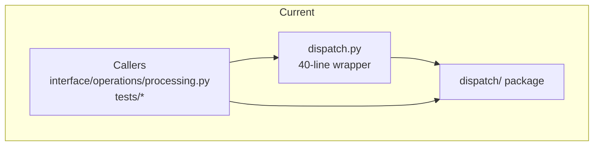
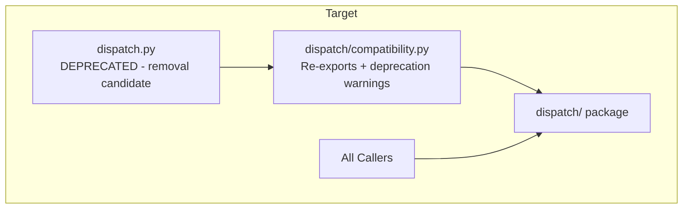

# Spec: Dispatch Module Migration Completion

**Status:** DRAFT  
**Author:** Architecture Team  
**Created:** 2026-02-10  
**Updated:** 2026-02-10

---

## 1. Summary

Complete the migration from legacy `dispatch.py` to the modern `dispatch/` package by formalizing the compatibility layer, adding feature flag support for safe rollback, updating remaining callers, and eventually deprecating the root-level compatibility wrapper. This spec also addresses the next phase of refactoring for `coordinator.py` (893 lines) to reduce complexity.

---

## 2. Background

### 2.1 Problem Statement

The legacy `dispatch.py` module was a 570-line monolithic file with 25-level nesting, global variables, and mixed concerns. A migration to the `dispatch/` package structure has been substantially completed, but several tasks remain:

1. The root `dispatch.py` still exists as a 40-line compatibility wrapper
2. No formal `dispatch/compatibility.py` module exists for organized re-exports
3. No feature flag mechanism exists for safe rollback during migration
4. Some callers still import from root `dispatch.py` instead of the package
5. The `coordinator.py` (893 lines) remains a complexity hotspot

### 2.2 Motivation

Completing this migration will:
- Eliminate the legacy module entirely
- Reduce cognitive load for developers (single source of truth)
- Enable safe rollback via feature flags during transition
- Prepare for Phase 2 refactoring of `coordinator.py`
- Achieve the success criteria from the phased refactoring design

### 2.3 Prior Art

The `dispatch/` package already contains the refactored components:
- `coordinator.py` - Main orchestration (DispatchCoordinator, ProcessingContext)
- `file_processor.py` - File discovery, hashing, filtering
- `edi_validator.py` - EDI validation
- `edi_processor.py` - EDI splitting, conversion, tweaking
- `send_manager.py` - Backend send orchestration
- `error_handler.py` - Error handling and reporting
- `db_manager.py` - Database operations

The current root `dispatch.py` is already a thin wrapper that re-exports from the package.

---

## 3. Design

### 3.1 Architecture Alignment

- [x] Reviewed `docs/ARCHITECTURE.md` - Module structure follows conventions
- [x] Reviewed `docs/PROCESSING_DESIGN.md` - Processing flow preserved
- [x] Reviewed `docs/TESTING_DESIGN.md` - Test patterns followed
- [x] Reviewed `.ralph/agent/phased_refactoring_design.md` - Phase 1.1 alignment

### 3.2 Technical Approach

#### 3.2.1 Current State



#### 3.2.2 Target State



#### 3.2.3 Components Affected

- [x] `dispatch.py` - Convert to deprecation wrapper only
- [x] `dispatch/__init__.py` - Update exports
- [x] `dispatch/compatibility.py` - NEW: Formal compatibility layer
- [x] `interface/operations/processing.py` - Update imports
- [x] `tests/unit/test_dispatch_legacy.py` - Update imports
- [x] `benchmark_full_pipeline.py` - Update imports

#### 3.2.4 API Changes

**New file: `dispatch/compatibility.py`**
```python
"""
Compatibility layer for legacy dispatch imports.

This module provides backward-compatible imports with deprecation warnings.
All new code should import directly from dispatch/ package modules.
"""

import warnings

# Re-export all public APIs with deprecation warnings
def __getattr__(name):
    warnings.warn(
        f"Importing {name} from dispatch compatibility layer is deprecated. "
        f"Import directly from dispatch module instead.",
        DeprecationWarning,
        stacklevel=2
    )
    # Delegate to actual module
    from . import coordinator, file_processor, edi_validator, edi_processor, send_manager, error_handler, db_manager
    # ... mapping logic
```

**Updated: `dispatch/__init__.py`**
```python
# Add process function wrapper for backward compatibility
def process(*args, **kwargs):
    """Legacy process function - delegates to DispatchCoordinator."""
    from .coordinator import DispatchCoordinator
    coordinator = DispatchCoordinator(*args, **kwargs)
    return coordinator.process()
```

**Feature flag support: `settings.py` or environment variable**
```python
# Option 1: Environment variable
USE_LEGACY_DISPATCH = os.environ.get('USE_LEGACY_DISPATCH', 'false').lower() == 'true'

# Option 2: Settings table
USE_LEGACY_DISPATCH = settings.get('use_legacy_dispatch', False)
```

#### 3.2.5 Import Migration Map

| Current Import | Target Import | Status |
|----------------|---------------|--------|
| `import dispatch` | `from dispatch import ...` | Needs update |
| `from dispatch import process` | `from dispatch import process` | OK (re-exported) |
| `from dispatch import generate_match_lists` | `from dispatch import generate_match_lists` | OK (re-exported) |
| `from dispatch.coordinator import ...` | No change | Already correct |

### 3.3 Alternatives Considered

| Alternative | Pros | Cons | Why Not Chosen |
|-------------|------|------|----------------|
| Keep root dispatch.py forever | Zero breaking changes | Perpetual confusion, two import paths | Defeats migration purpose |
| Delete dispatch.py immediately | Clean break | May break external scripts | Too risky without deprecation period |
| Symlink dispatch.py to package | Simple | OS-specific, confusing | Not portable |

---

## 4. Implementation Plan

### Phase 1: Compatibility Layer (Priority: Critical)

- [ ] Task 1.1: Create `dispatch/compatibility.py` with deprecation warnings
- [ ] Task 1.2: Update `dispatch/__init__.py` to include process() wrapper
- [ ] Task 1.3: Add feature flag `USE_LEGACY_DISPATCH` to settings
- [ ] Task 1.4: Update root `dispatch.py` to use compatibility module
- [ ] Deliverable: Compatibility layer with deprecation warnings, all tests pass

### Phase 2: Caller Migration (Priority: High)

- [ ] Task 2.1: Update `interface/operations/processing.py` to use `from dispatch import ...`
- [ ] Task 2.2: Update `benchmark_full_pipeline.py` imports
- [ ] Task 2.3: Audit and update test files that import from root `dispatch.py`
- [ ] Task 2.4: Add lint rule to discourage `import dispatch` pattern
- [ ] Deliverable: All callers use package imports, deprecation warnings visible

### Phase 3: Coordinator Refactoring Prep (Priority: Medium)

- [ ] Task 3.1: Document coordinator.py class responsibilities
- [ ] Task 3.2: Identify extraction candidates (FileProcessor, EDIProcessor, SendOrchestrator)
- [ ] Task 3.3: Create interfaces/protocols for extracted classes
- [ ] Task 3.4: Add comprehensive unit tests for extraction targets
- [ ] Deliverable: Design for coordinator split, tests in place

### Phase 4: Deprecation and Cleanup (Priority: Low)

- [ ] Task 4.1: Add deprecation warnings to root `dispatch.py` (6-month warning period)
- [ ] Task 4.2: Update all documentation to reference package imports
- [ ] Task 4.3: Create migration guide for external users
- [ ] Task 4.4: Schedule removal of root `dispatch.py` for future version
- [ ] Deliverable: Deprecation complete, removal scheduled

---

## 5. Database Changes

No database changes required for this migration.

---

## 6. Testing Strategy

### 6.1 Test Cases

| Test Case | Type | Description | Expected Result |
|-----------|------|-------------|-----------------|
| test_compatibility_imports | unit | Import from compatibility layer | DeprecationWarning raised |
| test_package_imports | unit | Import from dispatch package | No warnings, correct exports |
| test_process_wrapper | unit | Call process() from root | Delegates to coordinator |
| test_feature_flag_legacy | unit | USE_LEGACY_DISPATCH=true | Uses legacy path |
| test_feature_flag_modern | unit | USE_LEGACY_DISPATCH=false | Uses modern path |
| test_all_exports_available | unit | Check __all__ exports | All expected exports present |
| test_integration_processing | integration | Full processing workflow | Same behavior as before |

### 6.2 Test File Locations

- Unit tests: `tests/unit/test_dispatch.py` (existing)
- Unit tests: `tests/unit/test_dispatch_legacy.py` (existing)
- Unit tests: `tests/unit/test_dispatch_compatibility.py` (NEW)
- Integration tests: `tests/integration/test_dispatch_integration.py` (existing)

### 6.3 Coverage Requirements

- [ ] New compatibility module covered by tests
- [ ] All existing tests pass with new structure
- [ ] Smoke tests pass: `pytest -m smoke`
- [ ] Full test suite passes: `./run_tests.sh`

### 6.4 Parity Verification

The existing parity tests in `tests/convert_backends/` should continue to pass with no changes to converter outputs.

---

## 7. Risk Assessment

| Risk | Likelihood | Impact | Mitigation |
|------|------------|--------|------------|
| External scripts break | Medium | Medium | 6-month deprecation period, clear migration guide |
| Import cycles | Low | High | Careful module organization, lazy imports in compatibility layer |
| Performance regression | Low | Medium | Benchmark before/after, feature flag for rollback |
| Test coverage gaps | Low | Medium | Require tests for new compatibility module |
| Coordinator refactoring scope creep | Medium | Medium | Separate spec for Phase 2 coordinator work |

### 7.1 Rollback Plan

1. **Immediate rollback**: Set `USE_LEGACY_DISPATCH=true` environment variable
2. **Git rollback**: `git revert <commit>` to revert specific phase
3. **Phase tags**: Each phase tagged (`dispatch-migration-phase-1`, etc.)
4. **Backup strategy**: No data changes, code-only rollback via git

```bash
# Rollback to pre-migration state
git revert dispatch-migration-phase-1

# Or use feature flag
export USE_LEGACY_DISPATCH=true
./run.sh
```

---

## 8. Success Criteria

### Phase 1 Completion
- [ ] `dispatch/compatibility.py` created and tested
- [ ] Feature flag `USE_LEGACY_DISPATCH` functional
- [ ] All 1600+ tests pass
- [ ] Deprecation warnings visible for legacy imports

### Phase 2 Completion
- [ ] All internal callers use package imports
- [ ] No `import dispatch` patterns in codebase (except compatibility)
- [ ] Lint rule active

### Phase 3 Completion
- [ ] Coordinator extraction design documented
- [ ] Tests for extraction targets >90% coverage
- [ ] No coordinator.py changes yet (separate spec)

### Phase 4 Completion
- [ ] Root `dispatch.py` shows deprecation warning
- [ ] Documentation updated
- [ ] Migration guide published
- [ ] Removal scheduled for version X.Y

### Overall Success Metrics
- [ ] Max nesting depth in dispatch modules <8 (from 25)
- [ ] No file in dispatch/ exceeds 400 lines (coordinator.py is 893 - separate spec)
- [ ] All tests pass (100% success rate)
- [ ] Performance within 5% of baseline
- [ ] Zero production incidents related to migration

---

## 9. Open Questions

1. **Deprecation timeline**: Should the root `dispatch.py` be removed in 6 months, 12 months, or a specific version number?
   
2. **External API stability**: Are there external tools or scripts that import from `dispatch.py` that we need to coordinate with?
   
3. **Coordinator refactoring scope**: Should Phase 3 (coordinator split) be included in this spec or spun off to a separate spec?

4. **Feature flag implementation**: Should `USE_LEGACY_DISPATCH` be environment variable only, or also configurable via settings table?

---

## 10. Appendix

### 10.1 References

- `.ralph/agent/phased_refactoring_design.md` - Phase 1.1 Dispatch Legacy Elimination
- `dispatch/AGENTS.md` - Module documentation
- `docs/ARCHITECTURE.md` - System architecture
- `docs/PROCESSING_DESIGN.md` - Processing workflow

### 10.2 Current Import Analysis

Files currently importing from root `dispatch.py`:
- `interface/operations/processing.py` - `import dispatch`
- `tests/unit/test_dispatch.py` - `import dispatch`
- `tests/unit/test_dispatch_legacy.py` - `import dispatch`

Files already using package imports:
- `tests/unit/test_file_processor_comprehensive.py`
- `tests/unit/test_error_handler_comprehensive.py`
- `tests/unit/test_dispatch_simple.py`
- `tests/unit/test_dispatch_send_manager.py`
- `tests/unit/test_dispatch_file_processor.py`
- `tests/unit/test_dispatch_error_handler.py`
- `tests/unit/test_dispatch_edi_validator.py`
- `tests/unit/test_dispatch_edi_processor.py`
- `tests/unit/test_dispatch_db_manager.py`
- `tests/unit/test_dispatch_coordinator_comprehensive.py`
- `tests/unit/test_dispatch_coordinator.py`
- `benchmark_full_pipeline.py`

### 10.3 Changelog

| Date | Author | Change |
|------|--------|--------|
| 2026-02-10 | Architecture Team | Initial draft |
