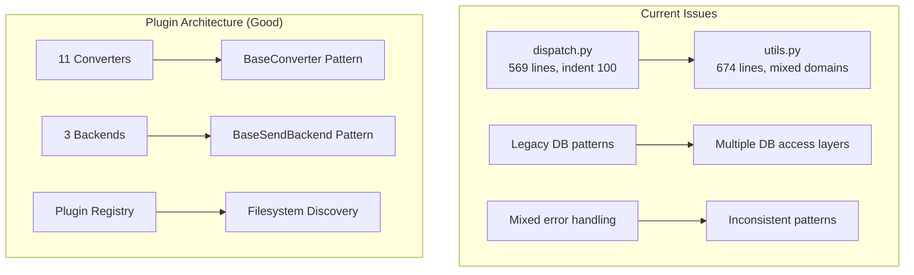
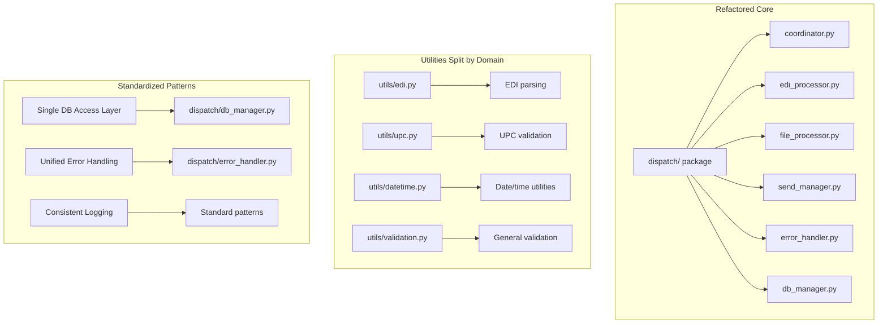

# Refactoring Design Document

## Overview

This document outlines a comprehensive refactoring strategy for the batch-file-processor codebase. The primary goal is to improve code maintainability and reduce complexity while strictly preserving all existing output formats and functionality.

**Scope**: Systematic cleanup of complexity hotspots and architectural inconsistencies  
**Constraint**: Zero changes to external behavior, especially converter and backend outputs  
**Approach**: Incremental refactoring with comprehensive test coverage at each step

## Detailed Requirements

### Functional Requirements
1. **Output Preservation**: All converter plugins must produce identical output files (verified by parity tests)
2. **API Compatibility**: All existing public interfaces must remain functional
3. **Database Compatibility**: Database schema and migrations must remain unchanged
4. **UI Behavior**: User interface behavior and workflows must be preserved

### Non-Functional Requirements
1. **Code Maintainability**: Reduce complexity hotspots (>500 LOC files)
2. **Architectural Consistency**: Eliminate dual patterns (legacy vs refactored)
3. **Test Coverage**: Maintain or improve existing 1600+ test coverage
4. **Performance**: No degradation in processing speed

### Technical Requirements
1. **Incremental Implementation**: Each refactoring step must pass all tests
2. **Backward Compatibility**: Support existing API contracts during transition
3. **Documentation**: Update relevant design documents and AGENTS.md
4. **Smoke Test Validation**: Quick validation after each major change

## Architecture Overview

### Current Architecture Issues


### Target Architecture


## Components and Interfaces

### 1. Utility Refactoring (utils.py → utils/)

**Current State**: Single 674-line file mixing multiple domains

**Target Structure**:
```
utils/
├── __init__.py          # Re-export commonly used functions
├── edi.py              # EDI parsing and format utilities
├── upc.py              # UPC validation and helpers
├── datetime.py         # Date/time conversion utilities
├── validation.py       # General validation functions
└── database.py         # Database utility functions
```

**Interface Preservation**:
```python
# Backward compatibility through utils/__init__.py
from .edi import *
from .upc import *
from .datetime import *
from .validation import *
from .database import *
```

### 2. Legacy Migration (dispatch.py → dispatch/)

**Current State**: Monolithic 569-line file with deep nesting

**Migration Strategy**:
1. **Phase 1**: Audit all imports of dispatch.py
2. **Phase 2**: Create adapter functions in dispatch/coordinator.py
3. **Phase 3**: Incrementally migrate callers
4. **Phase 4**: Deprecate dispatch.py (keep as thin wrapper)

**Interface Preservation**:
```python
# dispatch.py (temporary compatibility layer)
from dispatch.coordinator import *
from dispatch.edi_processor import *
# ... other imports as needed

# Legacy function wrappers that delegate to new implementations
def legacy_function():
    return coordinator.new_function()
```

### 3. Database Access Standardization

**Current State**: Multiple access patterns
- interface/database/database_manager.py (QtSql wrapper)
- dispatch/db_manager.py (refactored operations)
- query_runner.py (direct SQL helper)

**Target Pattern**: Standardize on `dispatch/db_manager.py`
```python
# Preferred access pattern
from dispatch.db_manager import DatabaseManager

# Consolidated interface
class DatabaseManager:
    def query_upc(self, upc_code): ...
    def execute_query(self, sql, params): ...
    def get_processed_files(self, folder_id): ...
```

### 4. Error Handling Unification

**Target Pattern**: Standardize on `dispatch/error_handler.py`
```python
# Unified error handling
from dispatch.error_handler import ErrorHandler, ErrorSeverity

class ErrorHandler:
    def log_error(self, error, context, severity=ErrorSeverity.ERROR): ...
    def handle_processing_error(self, file_path, error): ...
    def record_validation_error(self, record, field, error): ...
```

## Data Models

### No Schema Changes
- Database schema remains unchanged
- All existing tables and columns preserved
- Migration system continues to work unchanged

### Internal Data Structures
- All existing data structures preserved
- Plugin interfaces remain identical
- Configuration data formats unchanged

## Error Handling

### Strategy
1. **Preserve Existing Error Behavior**: All error conditions must produce same outcomes
2. **Unify Implementation**: Use consistent error handling patterns internally
3. **Maintain Error Logging**: All existing error logging and recording preserved
4. **Exception Compatibility**: Same exception types and messages for external callers

### Implementation
- Migrate error recording to use `dispatch/error_handler.py`
- Preserve all `record_error.py` functionality through wrapper
- Maintain existing error codes and messages

## Acceptance Criteria (Given-When-Then)

### Output Format Preservation
**GIVEN** any EDI input file  
**WHEN** processed through any converter plugin  
**THEN** the output file is byte-for-byte identical to baseline

**GIVEN** any processed file ready for sending  
**WHEN** sent through any backend plugin  
**THEN** the delivery behavior is identical to baseline

### API Compatibility
**GIVEN** any existing code using current interfaces  
**WHEN** calling functions after refactoring  
**THEN** all function calls work without modification

**GIVEN** any existing test suite  
**WHEN** run against refactored code  
**THEN** all 1600+ tests pass without modification

### Performance Preservation
**GIVEN** a standard batch of EDI files  
**WHEN** processed through refactored system  
**THEN** processing time is within 5% of baseline

**GIVEN** the GUI application  
**WHEN** performing typical user workflows  
**THEN** response time is unchanged

### Code Quality Improvements
**GIVEN** the refactored codebase  
**WHEN** analyzed for complexity  
**THEN** no file exceeds 400 lines (target)

**GIVEN** the refactored codebase  
**WHEN** analyzed for nesting  
**THEN** no function has nesting depth > 5 (target)

## Testing Strategy

### Parity Testing (Critical)
```bash
# Run before and after each refactoring step
pytest tests/convert_backends/test_parity_verification.py -v
```

### Incremental Validation
1. **After each utility split**: Run affected converter tests
2. **After each dispatch migration**: Run workflow integration tests
3. **After database access changes**: Run all database tests
4. **After error handling changes**: Run error scenario tests

### Regression Testing
```bash
# Full test suite validation
./run_tests.sh

# Quick smoke tests
pytest tests/test_smoke.py tests/test_app_smoke.py -v -m smoke
```

### Coverage Requirements
- Maintain existing test coverage
- Add tests for new utility modules
- Ensure all new paths are covered

## Implementation Phases

### Phase 1: Utility Refactoring (Low Risk)
1. **Split utils.py by domain**
2. **Create utils/ package with backward compatibility**
3. **Update imports incrementally**
4. **Run converter parity tests after each split**

### Phase 2: Database Access Standardization (Medium Risk)
1. **Audit all database access patterns**
2. **Standardize on dispatch/db_manager.py**
3. **Migrate legacy database calls**
4. **Run database and integration tests**

### Phase 3: Legacy Migration (High Risk)
1. **Audit dispatch.py usage**
2. **Create compatibility layer**
3. **Migrate callers incrementally**
4. **Run full integration tests**

### Phase 4: Error Handling Unification (Low Risk)
1. **Standardize on dispatch/error_handler.py**
2. **Migrate error recording calls**
3. **Update exception handling patterns**
4. **Run error scenario tests**

## Risk Assessment

### High Risk Areas
1. **dispatch.py migration**: Deep nesting and complex logic
2. **Database access changes**: Could affect data consistency
3. **Plugin interface changes**: Risk of breaking converter/backends

### Mitigation Strategies
1. **Comprehensive Testing**: Leverage 1600+ existing tests
2. **Parity Verification**: Byte-for-byte output comparison
3. **Incremental Approach**: Small, testable changes
4. **Rollback Planning**: Keep original code until migration complete

### Contingency Plans
1. **Revert Strategy**: Git branches for each major change
2. **Fallback Options**: Maintain compatibility layers during transition
3. **Testing Escalation**: Additional test coverage for high-risk areas

## Success Criteria

### Code Quality
- [ ] No file exceeds 400 lines
- [ ] No function nesting depth > 5
- [ ] All complexity hotspots resolved
- [ ] Consistent architectural patterns

### Functional Preservation
- [ ] All 1600+ tests pass
- [ ] All converter outputs identical (parity tests)
- [ ] All backend behaviors identical
- [ ] GUI workflows unchanged

### Maintainability
- [ ] Clear separation of concerns
- [ ] Consistent error handling patterns
- [ ] Standardized database access
- [ ] Updated documentation

---

**Next Steps**: Proceed to detailed implementation plan with specific tasks, validation criteria, and demo checkpoints for each refactoring phase.